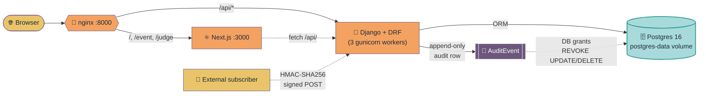

# HACK HAMSTER 2026 — System Architecture

**Event:** hackhamster.com · Hackathon Raptors · "Build the platform that will judge you"
**Window:** Sep 26 18:00 UTC → Sep 29 18:00 UTC, 2026 (72h)
**Team:** Manas (`choksi2212`) + Mihir (`Mihir-Rabari`)
**Repo:** `https://github.com/choksi2212/dogfood-hackathon`
**Spec:** `https://hackhamster.com/spec`
**Stack:** Django 5 + DRF + PostgreSQL 16 + Next.js 15, all in `docker compose up`
**Companion docs:** [PRD](HACK HAMSTER-PRD.md), [TRD](HACK HAMSTER-TRD.md), [Backend Impl](HACK HAMSTER-BACKEND-IMPL.md)

> PRD says *what*. TRD says *how*. This doc says *how the how is shaped*. Backend impl says *exactly what to type*.

---

## Hero

**One-sentence role:** the single source of truth for how the four processes, one database, and one exposed port are wired together to satisfy the seven acceptance checks under `docker compose up`.

## Table of contents

- [Part 1 — Goals, constraints, and what we are NOT](#part-1--architectural-goals-and-constraints)
- [Part 2 — High-level shape (nginx · Django · Next.js · Postgres)](#part-2--high-level-architecture)
- [Part 3 — Request flow and the seven checks](#part-3--request-flow-architecture)
- [Part 4 — Database architecture (40 tables)](#part-4--database-architecture)
- [Parts 5–14 — Auth, API, frontend, modules, observability, threat surface, acceptance](#parts-5-14--cross-cutting-concerns)
- [Parts 15–28 — Contracts, signing, decision log, glossary, quick reference](#parts-15-28--contracts-decisions-and-quick-reference)

---

## System diagram



**Reading the diagram.** Single exposed port (`${WEB_PORT:-8000}:80`) on `nginx` is the only public face. nginx terminates HTTP and fans requests out: `/api/*` → Django, everything else → Next.js (which reaches Django on the internal network). The only persistent state is Postgres on the `postgres-data` volume. Every consequential action appends an `AuditEvent` row; append-only is enforced at the DB layer. Webhook subscribers receive HMAC-SHA256-signed payloads directly from the view.

---

## Part 1 — Architectural Goals and Constraints

### 1.1 Goals (in priority order)

1. **Pass the seven acceptance checks.** They are the 40% Tier Completion criterion. Every architectural decision is checked against this goal first.
2. **Enforce role isolation at the API.** The 25% Judging Integrity criterion. Permission classes, not templates.
3. **`docker compose up` works cold.** The 20% Adoptability criterion. No external dependencies.

### 1.2 Constraints

- **Offline-first.** The portal runs on `localhost` with the network off. No external service, no cloud account, no API key. (Spec §11 rule 1.)
- **Single deployment.** One event per deployment. Multi-tenancy is out of scope.
- **Three branches.** `main`, `manas`, `mihir`. Mihir is the sole integrator.
- **72 hours.** Code freeze on Sep 29 18:00 UTC.
- **Two developers.** Manas (backend/data/maths) + Mihir (frontend/threat/integrator).
- **No new dependencies after Sep 13.** Versions are frozen.
- **No scope cutting.** All four tiers + all four bonuses.

### 1.3 Architectural principles

- **Permissions over templates.** A deny is enforced at the API layer. Templates can hide controls; APIs must deny first.
- **Server-rendered public, client-rendered auth.** The public gallery is server-rendered for SEO and offline-first. Authenticated views are client-rendered for interactivity.
- **Disjoint ownership.** No file has two editors. See Part 6.
- **Frozen `.hack-hamster.toml` at H+20.** The contract with the acceptance mechanism is fixed.
- **Backend is the source of truth.** The frontend never has business logic that diverges from the backend.

### 1.4 What the architecture is NOT

- Not a microservices architecture. One Django process, one Next.js process, one Postgres, one nginx.
- Not a serverless architecture. The portal runs on a single host.
- Not a real-time architecture. SSE is used only for the dashboard.
- Not a multi-region architecture. One deployment, one database.
- Not an event-sourced architecture. The audit log is append-only, but the rest of the system is CRUD.
- Not a CQRS architecture. The same DB serves reads and writes.

## Part 2 — High-Level Architecture

### 2.1 The four processes

```
                       ┌─────────────────┐
                       │   Browser       │
                       │   (user agent)  │
                       └────────┬────────┘
                                │ HTTPS in prod, HTTP in dev
                                │
                       ┌────────▼────────┐
                       │   nginx         │
                       │   (reverse      │
                       │    proxy)       │
                       └────┬───────┬────┘
                            │       │
                /api/*      │       │  /, /event, /judge, /organize
                            │       │
                  ┌─────────▼─┐   ┌─▼─────────┐
                  │  Django   │   │ Next.js   │
                  │  (gunicorn)│   │ (server)  │
                  └─────┬─────┘   └───────────┘
                        │
                  ┌─────▼─────┐
                  │ Postgres  │
                  │ (data)    │
                  └───────────┘
```

### 2.2 Process responsibilities

**nginx (1 process):**
- Serves `/_next/static/*` and `/static/*` directly.
- Reverse-proxies `/api/*` to Django.
- Reverse-proxies everything else to Next.js.
- One port exposed (`${WEB_PORT:-8000}:80`).

**Django (3 gunicorn workers):**
- Serves the API surface.
- Owns all business logic and data access.
- Generates the OpenAPI schema.
- Serves the Django admin (for raw data inspection).
- Generates PDFs (certificates) and JSON dumps.

**Next.js (1 process):**
- Renders the public surface (server-rendered).
- Renders the authenticated UI (client-rendered).
- The widget bundle is built from the same code.

**Postgres (1 process):**
- The only persistent data store.
- No published port; reached via the internal Docker network on `db:5432`.

### 2.3 The internal network

- `db:5432` — Postgres
- `backend:8000` — Django
- `web:3000` — Next.js
- `nginx` is the only one with an exposed port.

### 2.4 The exposed surface

- `http://localhost:8000/` — landing page
- `http://localhost:8000/api/...` — API
- `http://localhost:8000/healthz` — liveness
- `http://localhost:8000/readyz` — readiness

### 2.5 Why this shape

- **One exposed port.** The brief says "no cloud account, no API key". A single port is the simplest model. The README's first command is `docker compose up` and the URL is `http://localhost:8000`.
- **Reverse proxy, not direct.** nginx terminates HTTP and serves static assets. The Django app doesn't serve static in production. The Next.js server doesn't proxy to the API.
- **No API gateway.** DRF's permission classes are the authorization layer.
- **No service mesh.** Two services that talk to one DB don't need mesh.

## Part 3 — Request Flow Architecture

### 3.1 The canonical request flow

```
Browser → nginx → gunicorn → Django middleware chain → URL resolver → view →
  permission classes → view body → ORM → Postgres → response serialization →
  gunicorn → nginx → Browser
```

### 3.2 The middleware chain

1. `SecurityMiddleware` — sets security headers (CSP, HSTS, etc.).
2. `SessionMiddleware` — reads the session cookie.
3. `CommonMiddleware` — URL normalization, ETags.

```
view.dispatch(request) →
  initial(request) → performs authentication, permissions, throttling
  handler(request) → the view method
```

### 3.3 The seven spec checks, by architecture

Detailed trace per check in [Part 14](#part-14--the-seven-checks-in-detail).

### 3.4 The streaming responses

**`GET /api/events/{slug}/export.csv`:** uses Django's `StreamingHttpResponse`.

**`GET /api/events/{slug}/dashboard/stream`:** SSE.

### 3.5 The async considerations

## Part 4 — Database architecture

### 4.1 The shape

### 4.2 Key tables at a glance

| App | Tables |
|---|---|
| accounts | `users_user`, `users_session` |
| events | `events_event`, `events_track`, `events_prize`, `events_membership`, `events_rubric`, `events_rubriccriterion` |
| teams | `teams_team`, `teams_teammember`, `teams_teaminvite` |
| submissions | `submissions_submission`, `submissions_submissionimage`, `submissions_submissionanswer`, `submissions_comment` |
| judging | `judging_judgebatch`, `judging_judgeassignment`, `judging_judgeinvite`, `judging_score`, `judging_review` |
| voting | `voting_vote`, `voting_votebudget`, `voting_voteaudit` |
| audit | `audit_auditevent` |
| normalization | `normalization_normalizationrun`, `normalization_normalizedscore`, `normalization_judgebias` |
| pairwise | `pairwise_pairwiserun`, `pairwise_pairwiseballot`, `pairwise_pairwiseranking` |
| api | `api_webhook`, `webhooks_webhookdelivery`, `certificates_certificate`, `certificates_judgerecord` |

### 4.3 Constraints and validations

- All FKs are `ON DELETE CASCADE` for owned relations, `ON DELETE RESTRICT` for shared references.
- All FK targets are UUIDs; all datetime fields are UTC.
- All email fields use `citext` (case-insensitive); all string fields have `max_length`.
- The audit log has DB-level grants revoking UPDATE and DELETE for the application user.

### 4.4 Migrations policy

- Per-commit migrations, never squashed.
- Reversible (every migration has a `reverse()`).
- New migrations via `makemigrations`; never edited after commit.
- Schema migrations forbidden during the event — only data migrations.

## Part 5 — Auth Architecture

### 5.1 The token format

```
session = secrets.token_urlsafe(32)   # 256 bits, URL-safe
Session.token_hash = sha256(session).hexdigest()
Cookie: session=<raw-token>; HttpOnly; SameSite=Lax; Secure (in prod)
```

### 5.2 The middleware chain for auth

1. **SessionMiddleware** reads `session` cookie. If absent or expired → `request.user = AnonymousUser()`.
2. **AuthenticationMiddleware** does nothing extra; we use `request.user` from SessionMiddleware.
3. **Custom `EventContextMiddleware`** resolves the event slug from the URL and attaches `request.event` (cached for the request lifetime).

### 5.3 The permission class hierarchy

```
AllowAny                 (public surface)
IsAuthenticated          (any logged-in user)
IsInEvent                (user has any Membership in the event)
├── IsParticipant        (role=participant)
├── IsJudge              (role=judge)
│   ├── IsAssignedJudge  (assigned to the project in URL)
│   └── IsOwnJudge       (cookie's judge matches URL's judge param)
└── IsOrganizer          (role=organizer or is_admin)
IsAdmin                  (platform-wide)
IsTeamMember             (user is in the team in URL)
IsTeamCaptain            (user is the team creator)
```

```python
class IsAssignedJudge(IsJudge):
    def has_permission(self, request, view):
        if not super().has_permission(request, view):
            return False
        project_id = view.kwargs.get('project_id')
        return JudgeAssignment.objects.filter(
            judge=request.user,
            project_id=project_id,
        ).exists()

class IsOwnJudge(BasePermission):
    def has_permission(self, request, view):
        judge_param = request.query_params.get('judge')
        if not judge_param:
            return True
        cookie_judge = self._judge_id_from_cookie(request)
        return cookie_judge == judge_param
```

### 5.4 The role-isolation matrix as architecture

|  | own scores | peer scores | other track | aggregate | audit log |
|---|---|---|---|---|---|
| visitor | ✗ | ✗ | ✗ | ✗ (until published) | ✗ |
| participant | ✗ (own project, until published) | ✗ | ✗ | ✗ | ✗ |
| judge | ✓ | ✗ | ✗ | ✗ | ✗ |
| organizer | ✓ | ✓ | ✓ | ✓ | ✓ |
| admin | ✓ | ✓ | ✓ | ✓ | ✓ |

### 5.5 The login flow

```
POST /api/auth/login
  ↓
body: { email, password }
  ↓
lookup User by email (citext, indexed)
  ↓
if no user → 401 (generic message; no user enumeration)
  ↓
verify password via argon2
  ↓
if wrong → 401 (generic message) + increment rate-limit counter
  ↓
if rate-limited → 429
  ↓
generate new session token
  ↓
hash + insert Session row
  ↓
attach cookie to response
  ↓
return User object
```

### 5.6 The logout flow

```
POST /api/auth/logout
  ↓
resolve session from cookie
  ↓
delete Session row
  ↓
clear cookie (Max-Age=0)
  ↓
return 204
```

### 5.7 The session-expiry flow

```
on every request:
    session = Session.objects.get(token_hash=...)
    if session.last_seen_at + 14d < now():
        session.delete()
        return anonymous
    if session.expires_at < now():
        session.delete()
        return anonymous
    session.last_seen_at = now()
    session.save()
```

### 5.8 CSRF

```
on POST/PATCH/DELETE:
    cookie_csrf = request.COOKIES['csrftoken']
    header_csrf = request.headers['X-CSRFToken']
    if not constant_time_compare(cookie_csrf, header_csrf):
        return 403
```

### 5.9 The pre-baked session headers

`manage.py import_fixtures` — run automatically by `entrypoint.sh` on every boot — seeds five demo sessions (organizer, judge_a, judge_b, judge_c, participant) and prints their headers:

```
organizer   = "Cookie: session=<hex-token>"
judge_a     = "Cookie: session=<hex-token>"
judge_b     = "Cookie: session=<hex-token>"
judge_c     = "Cookie: session=<hex-token>"
participant = "Cookie: session=<hex-token>"
```

| Label | Email | Role | Membership |
|---|---|---|---|
| organizer | `organizer@test.local` | organizer | organizer of sample-hack-2026 |
| judge_a | `tomas.varga@example.org` | judge | fixture judge `jdg_01` |
| judge_b | `wei.lindqvist@example.org` | judge | fixture judge `jdg_02` |
| judge_c | `priya.nair@example.org` | judge | fixture judge `jdg_03` |
| participant | `participant@test.local` | participant | member of the first fixture team |

## Part 6 — API Architecture

### 6.1 The OpenAPI schema generation

`drf-spectacular` walks the URL conf, views, serializers, and `@extend_schema` decorators to produce an OpenAPI 3.x schema. The schema is served at:

- `/api/schema/` — YAML
- `/api/schema/swagger-ui/` — browsable Swagger UI
- `/api/schema/redoc/` — ReDoc

### 6.2 The endpoint namespace

```
/api/auth/*           — auth
/api/events/*         — events, tracks, prizes, rubric, gallery
/api/teams/*          — teams
/api/submissions/*    — submissions (nested under event slug)
/api/judge/*          — judge endpoints
/api/voting/*         — voting
/api/audit/*          — audit log
/api/admin/*          — admin
/api/schema/          — OpenAPI
/healthz, /readyz     — health
/admin/               — Django admin
/verify               — public key + verifier
/widget.js            — embeddable widget
```

```
[portal]
base_url = "http://localhost:8000"

[routes]
gallery      = "/api/events/sample-hack-2026/gallery"
submit       = "/api/events/sample-hack-2026/submissions/<id>/submit"
judge_scores = "/api/judge/scores"
peer_scores  = "/api/judge/scores?judge=judge_a"
csv_export   = "/api/events/sample-hack-2026/export.csv"
```

### 6.3 The view layer

```python
from rest_framework.generics import ListCreateAPIView

class GalleryView(ListAPIView):
    serializer_class = SubmissionSerializer
    permission_classes = [AllowAny]

    def get_queryset(self):
        event = get_event(self.kwargs['slug'])
        return Submission.objects.filter(
            event=event,
            status='submitted',
        ).select_related('team', 'track')
```

```python
class SubmitSubmissionView(APIView):
    permission_classes = [IsAuthenticated, IsTeamMember]

    @deadline_gated('submissions_close_at')
    def post(self, request, slug, id):
        submission = get_submission(id)
        if submission.status != 'draft':
            raise AlreadySubmitted()
        # ... validate custom answers
        submission.status = 'submitted'
        submission.submitted_at = timezone.now()
        submission.save()
        return Response({...})
```

### 6.4 The serializer layer

```python
class SubmissionSerializer(ModelSerializer):
    class Meta:
        model = Submission
        fields = ['id', 'name', 'tagline', 'description', 'track', 'team',
                  'thumbnail_url', 'demo_video_url', 'repo_url', 'live_url',
                  'tech_tags', 'status', 'submitted_at']
        read_only_fields = ['id', 'status', 'submitted_at']

    def validate(self, attrs):
        # Cross-field validation
        if attrs.get('repo_url') and not attrs['repo_url'].startswith('https://'):
            raise ValidationError("Repo URL must be HTTPS")
        return attrs
```

### 6.5 The error envelope

```json
{
  "error": {
    "code": "forbidden_role",
    "message": "You do not have permission to do that.",
    "detail": { "required_role": "organizer" }
  }
}
```

```python
class HackHamsterError(Exception):
    code: str
    message: str
    status_code: int = 400

    def __init__(self, message=None, detail=None):
        if message:
            self.message = message
        self.detail = detail

class ForbiddenRole(HackHamsterError):
    code = 'forbidden_role'
    message = 'You do not have permission to do that.'
    status_code = 403

def custom_exception_handler(exc, context):
    if isinstance(exc, HackHamsterError):
        return Response(
            {'error': {'code': exc.code, 'message': exc.message, 'detail': exc.detail}},
            status=exc.status_code,
        )
    # ... default handler
    return response
```

### 6.6 Rate limiting

```python
class RateLimitMiddleware:
    def __init__(self, get_response):
        self.get_response = get_response
        self.buckets = {}  # IP -> {endpoint_class: count, reset_at}

    def __call__(self, request):
        ip = self._get_ip(request)
        endpoint_class = self._classify(request)
        if self._is_limited(ip, endpoint_class):
            return Response(
                {'error': {'code': 'rate_limited', 'message': '...', 'detail': {'retry_after': self._retry_after(ip, endpoint_class)}}},
                status=429,
                headers={'Retry-After': str(self._retry_after(ip, endpoint_class))},
            )
        return self.get_response(request)
```

### 6.7 The audit middleware

```python
class AuditMiddleware:
    def __init__(self, get_response):
        self.get_response = get_response

    def __call__(self, request):
        response = self.get_response(request)
        if response.status_code in (401, 403):
            AuditEvent.objects.create(
                event_id=self._event_id(request),
                actor_id=request.user.id if request.user.is_authenticated else None,
                action=f'{request.method} {request.path}',
                target_type='endpoint',
                target_id=None,
                payload={},
                ip=self._get_ip(request),
                user_agent=request.headers.get('User-Agent', ''),
                result='denied',
            )
        return response
```

### 6.8 The OpenAPI extension points

```python
from drf_spectacular.utils import extend_schema, OpenApiParameter

class GalleryView(ListAPIView):
    @extend_schema(
        parameters=[
            OpenApiParameter('q', str, description='Search query'),
            OpenApiParameter('track', str, description='Track slug filter'),
            OpenApiParameter('page', int, description='Page number'),
        ],
        responses={200: SubmissionSerializer(many=True)},
    )
    def get(self, request, *args, **kwargs):
        return super().get(request, *args, **kwargs)
```

### 6.9 The webhooks architecture

```python
def deliver_webhook(webhook, event_type, payload):
    body = json.dumps(payload).encode()
    signature = hmac.new(
        webhook.secret.encode(), body, hashlib.sha256
    ).hexdigest()

    delivery = WebhookDelivery.objects.create(
        webhook=webhook,
        event_type=event_type,
        payload=body,
        signature=signature,
        attempted_at=timezone.now(),
    )

    try:
        response = requests.post(
            webhook.url, data=body, headers={
                'Content-Type': 'application/json',
                'X-Hack-Hamster-Signature': signature,
                'X-Hack-Hamster-Event': event_type,
            },
            timeout=10,
        )
        delivery.status_code = response.status_code
        delivery.response_body = response.text[:1024]
    except requests.RequestException as e:
        delivery.status_code = 0
        delivery.response_body = str(e)[:1024]

    if delivery.status_code and 200 <= delivery.status_code < 300:
        delivery.next_retry_at = None
    else:
        # Exponential backoff
        delivery.next_retry_at = timezone.now() + timedelta(
            seconds=60 * (2 ** delivery.attempt_count)
        )
    delivery.save()
```

## Part 7 — Frontend Architecture

### 7.1 The component tree

```
/                            landing
/{event_slug}                event landing
/{event_slug}/gallery        public gallery
/{event_slug}/projects/{id}  project detail
/{event_slug}/tracks         tracks
/{event_slug}/login          login
/{event_slug}/register       register
/dashboard                   role-aware dashboard
/teams/{id}                  team
/teams/new                   form team
/teams/join                  join via invite
/submissions/{id}            submission form
/judge                       judge console (batch)
/judge/projects/{id}         judge a project
/judge/pairwise              pairwise
/judge/summary               judge summary
/organize                    organizer dashboard
/organize/event              event config
/organize/tracks             tracks
/organize/prizes             prizes
/organize/rubric             rubric
/organize/judges             judge invitations
/organize/assignments        assignment
/organize/judging            live dashboard
/organize/normalize          normalization
/organize/publish            publish
/organize/export             CSV export
/organize/webhooks           webhooks
/organize/audit              audit log
/admin                       admin home
/admin/dump                  dump
/admin/keys                  keys
/verify                      public key + verifier
```

### 7.2 Server vs Client Components

- Pages with no interactivity beyond links.
- Pages that read from cookies at request time.
- Pages that render server-side from a database fetch.

- Forms with local state (submission form, judge scoring).
- Pages with live updates (organizer dashboard SSE).
- Pages with client-side filtering (gallery).

### 7.3 Data fetching pattern

```typescript
async function getEvent(slug: string) {
  const res = await fetch(`${API_INTERNAL_URL}/api/events/${slug}`, {
    headers: { 'Cookie': cookies().toString() },
    cache: 'no-store',
  });
  if (!res.ok) throw new Error('Failed to fetch event');
  return res.json();
}
```

### 7.4 The API client

```typescript
// lib/api.ts
export const API_BASE = process.env.NEXT_PUBLIC_API_BASE || '';

export async function apiGet<T>(
  path: string,
  init?: RequestInit,
): Promise<T> {
  const res = await fetch(`${API_BASE}${path}`, {
    ...init,
    headers: {
      ...init?.headers,
      ...(cookies ? { Cookie: cookies() } : {}),
    },
  });
  if (!res.ok) {
    const error = await res.json();
    throw new ApiError(res.status, error.error.code, error.error.message);
  }
  return res.json();
}
```

### 7.5 The mock adapter (H+0 → H+20)

```typescript
// lib/api.mock.ts
const useMock = process.env.NEXT_PUBLIC_USE_MOCK === 'true';

export const apiGet = useMock ? mockApiGet : realApiGet;
```

### 7.6 State management

### 7.7 Forms

```typescript
const [state, dispatch] = useReducer(formReducer, initial);

useEffect(() => {
  const timer = setTimeout(() => {
    apiPatch(`/submissions/${id}`, state.values);
  }, 1000);
  return () => clearTimeout(timer);
}, [state.values]);
```

### 7.8 Error boundaries

```typescript
'use client';
export default function Error({ error, reset }) {
  return (
    <div>
      <h2>Something went wrong</h2>
      <button onClick={reset}>Try again</button>
    </div>
  );
}
```

### 7.9 Styling

```css
/* app/gallery/Gallery.module.css */
.grid {
  display: grid;
  grid-template-columns: repeat(auto-fill, minmax(280px, 1fr));
  gap: 1.5rem;
}

.card {
  background: white;
  border: 1px solid #e5e7eb;
  border-radius: 8px;
  overflow: hidden;
}
```

### 7.10 Accessibility

- All interactive elements are semantic (`<button>`, `<a>`, `<input>`).
- Form fields have `<label>`.
- Modals use `<dialog>`.
- Skip link to main content.
- Color contrast meets WCAG AA.
- Focus indicators visible.

### 7.11 Performance

- Server-rendered by default.
- Lazy image loading below the fold.
- No web fonts; system font stack.
- CSS Modules scoped per route.
- No client-side JS where avoidable.

### 7.12 The widget bundle

```typescript
// app/widget/route.ts
export async function GET() {
  const bundle = await buildWidget();
  return new Response(bundle, {
    headers: { 'Content-Type': 'application/javascript' },
  });
}
```

## Part 8 — Backend Module Architecture

### 8.1 The Django app layout

```
hack-hamster-hackathon/
├── manage.py
├── config/
│   ├── settings.py
│   ├── urls.py
│   └── wsgi.py
├── apps/
│   ├── accounts/
│   │   ├── models.py        # User, Session (+ auth permission through-tables)
│   │   ├── views.py         # register, login, logout, me
│   │   ├── serializers.py
│   │   ├── permissions.py   # IsAuthenticated, etc.
│   │   ├── middleware.py    # AuditMiddleware, RateLimitMiddleware
│   │   ├── urls.py
│   │   └── management/
│   │       └── commands/
│   │           ├── import_fixtures.py
│   │           └── seed_fixtures.py
│   ├── events/
│   │   ├── models.py        # Event, Track, Prize, Membership, Rubric, RubricCriterion
│   │   ├── views.py
│   │   ├── serializers.py
│   │   ├── lifecycle.py     # event_state() helper
│   │   ├── urls.py
│   ├── teams/
│   │   ├── models.py        # Team, TeamMember, TeamInvite
│   │   ├── views.py
│   │   ├── serializers.py
│   │   └── urls.py
│   ├── submissions/
│   │   ├── models.py        # Submission, SubmissionImage, SubmissionAnswer, Comment
│   │   ├── views.py
│   │   ├── serializers.py
│   │   ├── search.py        # tsvector update logic
│   │   └── urls.py
│   ├── judging/
│   │   ├── models.py        # JudgeBatch, JudgeAssignment, JudgeInvite, Score, Review
│   │   ├── views.py
│   │   ├── serializers.py
│   │   ├── assignment.py    # the algorithm
│   │   └── urls.py
│   ├── voting/
│   │   ├── models.py        # Vote, VoteBudget, VoteAudit
│   │   ├── views.py
│   │   ├── serializers.py
│   │   └── urls.py
│   ├── audit/
│   │   ├── models.py        # AuditEvent
│   │   ├── views.py         # organizer-facing read
│   │   ├── serializers.py
│   │   └── helpers.py       # audit.log() helper
│   ├── normalization/
│   │   ├── models.py        # NormalizationRun, NormalizedScore, JudgeBias
│   │   ├── views.py
│   │   ├── fit.py           # the alternating-means fit
│   │   ├── proof.py         # the proof.txt generator
│   │   └── tests.py         # unit tests
│   ├── pairwise/
│   │   ├── models.py        # PairwiseRun, PairwiseBallot, PairwiseRanking
│   │   ├── views.py
│   │   ├── fit.py           # the BT fit
│   │   ├── selection.py     # pair selection by info value
│   │   └── tests.py
│   ├── webhooks/
│   │   ├── models.py        # WebhookDelivery (the delivery log rows)
│   │   ├── delivery.py      # the delivery engine: sign, POST, record
│   │   ├── views.py         # organizer delivery-log endpoint
│   │   └── management/commands/flush_webhooks.py  # batch retry command
│   ├── certificates/
│   │   ├── models.py        # Certificate, JudgeRecord + HMAC sign/verify helpers
│   │   └── views.py         # public verify + organizer list/issue endpoints
│   ├── billing/
│   │   └── models.py        # Plan, BillingAccount, Invoice (per-event plan + quotas)
│   ├── abuse/
│   │   └── models.py        # AbuseFlag (pending → upheld/dismissed)
│   └── api/
│       ├── models.py        # Webhook subscription (per-event, secret stored)
│       ├── exporter.py       # fixtures-shaped deterministic bulk export
│       └── urls.py          # aggregates everything
├── scripts/
│   ├── role_isolation_matrix.py   # the role-isolation bonus deliverable
│   └── matrix.toml
└── tests/
    ├── conftest.py          # shared fixtures (read-only)
    ├── pytest.ini           # shared config (read-only)
    ├── auth/  roles/  events/  submissions/  deadlines/
    ├── assignment/  csv/  normalization/  golden/
    └── voting/  security/  …  # 15 categories, one subdirectory + docs block each
```

### 8.2 The apps and their boundaries

### 8.3 The URL conf

```python
# backend/backend/urls.py
urlpatterns = [
    path('admin/', admin.site.urls),
    path('healthz', healthz),
    path('readyz', readyz),
    path('api/', include('apps.api.urls')),
    path('verify', verify_view),
    path('widget.js', widget_view),
]

# apps/api/urls.py
urlpatterns = [
    path('auth/', include('apps.accounts.urls')),
    path('events/', include('apps.events.urls')),
    path('teams/', include('apps.teams.urls')),
    path('submissions/', include('apps.submissions.urls')),
    path('judge/', include('apps.judging.urls_judge')),
    path('voting/', include('apps.voting.urls')),
    path('audit/', include('apps.audit.urls')),
    path('admin/', include('apps.api.urls_admin')),
    path('schema/', schema_view),
]
```

### 8.4 The settings file

```python
# backend/backend/settings.py

INSTALLED_APPS = [
    'django.contrib.admin',
    'django.contrib.auth',
    'django.contrib.contenttypes',
    'django.contrib.sessions',
    'django.contrib.messages',
    'django.contrib.staticfiles',
    'rest_framework',
    'drf_spectacular',
    'apps.accounts',
    'apps.events',
    'apps.teams',
    'apps.submissions',
    'apps.judging',
    'apps.voting',
    'apps.audit',
    'apps.normalization',
    'apps.pairwise',
    'apps.api',
]

REST_FRAMEWORK = {
    'DEFAULT_SCHEMA_CLASS': 'drf_spectacular.openapi.AutoSchema',
    'DEFAULT_PERMISSION_CLASSES': ['rest_framework.permissions.IsAuthenticated'],
    'DEFAULT_RENDERER_CLASSES': ['rest_framework.renderers.JSONRenderer'],
    'EXCEPTION_HANDLER': 'apps.api.exceptions.custom_exception_handler',
}

SPECTACULAR_SETTINGS = {
    'TITLE': 'HACK HAMSTER API',
    'DESCRIPTION': 'Hackathon submission and judging portal',
    'VERSION': '1.0.0',
    'SERVE_INCLUDE_SCHEMA': False,
}

AUTH_USER_MODEL = 'accounts.User'
DATABASES = {
    'default': {
        'ENGINE': 'django.db.backends.postgresql',
        'NAME': 'hack-hamster',
        'USER': 'hack-hamster',
        'PASSWORD': os.environ['DB_PASSWORD'],
        'HOST': 'db',
        'PORT': '5432',
    }
}
```

### 8.5 The Django admin

```python
# apps/events/admin.py
from django.contrib import admin
from .models import Event, Track, Membership

@admin.register(Event)
class EventAdmin(admin.ModelAdmin):
    list_display = ['slug', 'name', 'open_at', 'submissions_close_at']
    list_filter = ['open_at']
    search_fields = ['slug', 'name']
```

### 8.6 The seed commands

`entrypoint.sh` waits for postgres, runs `migrate`, then `import_fixtures` (set `SKIP_SEED=1` to skip), on every boot:

```dockerfile
ENTRYPOINT ["/entrypoint.sh"]
CMD ["gunicorn", "config.wsgi:application", "--bind", "0.0.0.0:8000", \
     "--workers", "3", "--threads", "2", "--timeout", "60"]
```

## Part 9 — Cross-Cutting Concerns

### 9.1 Logging

```python
import logging
import json

class JsonFormatter(logging.Formatter):
    def format(self, record):
        return json.dumps({
            'ts': self.formatTime(record),
            'level': record.levelname,
            'logger': record.name,
            'msg': record.getMessage(),
            'extra': getattr(record, 'extra', {}),
        })

LOGGING = {
    'version': 1,
    'disable_existing_loggers': False,
    'formatters': {
        'json': {'()': JsonFormatter},
    },
    'handlers': {
        'stdout': {
            'class': 'logging.StreamHandler',
            'stream': 'ext://sys.stdout',
            'formatter': 'json',
        },
    },
    'root': {'handlers': ['stdout'], 'level': 'INFO'},
}
```

### 9.2 Error handling

```python
from rest_framework.views import exception_handler as drf_default_handler

def custom_exception_handler(exc, context):
    response = drf_default_handler(exc, context)
    if response is None:
        return None  # unhandled; Django will produce 500

    # Wrap DRF's default error into our envelope
    if isinstance(response.data, dict) and 'detail' in response.data:
        return Response(
            {'error': {
                'code': code_from_status(response.status_code),
                'message': str(response.data['detail']),
                'detail': {},
            }},
            status=response.status_code,
        )
    # ... validation errors etc.
```

### 9.3 Audit logging

```python
# apps/audit/helpers.py
def log(actor, action, target=None, payload=None, request=None, result='success'):
    AuditEvent.objects.create(
        event_id=_event_id_from_request(request),
        actor_id=actor.id if actor and actor.is_authenticated else None,
        action=action,
        target_type=type(target).__name__ if target else None,
        target_id=target.id if target else None,
        payload=payload or {},
        ip=_get_ip(request) if request else None,
        user_agent=request.headers.get('User-Agent', '') if request else '',
        result=result,
    )
```

### 9.4 Security headers

```python
response['Content-Security-Policy'] = (
    "default-src 'self'; "
    "img-src 'self' data:; "
    "style-src 'self' 'unsafe-inline'; "
    "script-src 'self'; "
    "object-src 'none'; "
    "base-uri 'self'; "
    "frame-ancestors 'none'"
)
response['X-Content-Type-Options'] = 'nosniff'
response['X-Frame-Options'] = 'DENY'
response['Referrer-Policy'] = 'no-referrer'
response['Strict-Transport-Security'] = 'max-age=31536000; includeSubDomains'
```

### 9.5 CORS

```
location /api/ {
    add_header Access-Control-Allow-Origin $http_origin;
    add_header Access-Control-Allow-Credentials true;
    add_header Access-Control-Allow-Methods "GET, POST, PATCH, DELETE, OPTIONS";
    add_header Access-Control-Allow-Headers "Content-Type, X-CSRFToken";
    # ...
}
```

### 9.6 CSRF

### 9.7 Session rotation

### 9.8 Password rotation

### 9.9 File uploads

```python
import uuid
def upload_path(instance, filename):
    ext = filename.rsplit('.', 1)[-1]
    return f'{instance.id}/{uuid.uuid4()}.{ext}'
```

### 9.10 Image processing

### 9.11 Markdown rendering

```python
import markdown
from bleach import clean

ALLOWED_TAGS = ['p', 'h1', 'h2', 'h3', 'h4', 'ul', 'ol', 'li', 'strong',
                'em', 'code', 'pre', 'blockquote', 'a', 'img', 'br']

def render_markdown(text):
    html = markdown.markdown(text, extensions=['fenced_code', 'tables'])
    return clean(html, tags=ALLOWED_TAGS, attributes={'a': ['href'], 'img': ['src', 'alt']})
```

### 9.12 Internationalization

### 9.13 Time

`USE_TZ = True`.

### 9.14 Money

## Part 10 — Deployment Architecture

### 10.1 The deployment topology

```
                Host machine
                ┌────────────────────────────────────────┐
                │ docker compose up                     │
                │   ┌────────────┐                       │
                │   │ nginx      │  port 8000 → 80      │
                │   └─────┬──────┘                       │
                │         │                              │
                │   ┌─────▼──────┐  ┌────────────┐        │
                │   │ Django     │  │ Next.js    │        │
                │   │ :8000      │  │ :3000      │        │
                │   └─────┬──────┘  └────────────┘        │
                │         │                              │
                │   ┌─────▼──────┐                       │
                │   │ Postgres   │                       │
                │   │ :5432      │                       │
                │   └────────────┘                       │
                │                                        │
                │   Volumes:                             │
                │     postgres-data → host:./pgdata      │
                │     media      → host:./media          │
                └────────────────────────────────────────┘
```

### 10.2 The Dockerfile.backend

```dockerfile
FROM python:3.12-slim
WORKDIR /app
RUN apt-get update && apt-get install -y --no-install-recommends \
    postgresql-client \
    && rm -rf /var/lib/apt/lists/*
COPY requirements.txt .
RUN pip install --no-cache-dir -r requirements.txt
COPY backend/ ./backend/
COPY scripts/ ./scripts/
ENV PYTHONUNBUFFERED=1
EXPOSE 8000
ENTRYPOINT ["/entrypoint.sh"]
CMD ["gunicorn", "config.wsgi:application", "--bind", "0.0.0.0:8000", \
     "--workers", "3", "--threads", "2", "--timeout", "60"]
```

### 10.3 The Dockerfile.web

```dockerfile
FROM node:22-alpine AS deps
WORKDIR /app
COPY web/package.json web/package-lock.json ./
RUN npm ci --only=production

FROM node:22-alpine AS builder
WORKDIR /app
COPY --from=deps /app/node_modules ./node_modules
COPY web/ .
RUN npm run build

FROM node:22-alpine AS runner
WORKDIR /app
ENV NODE_ENV=production
COPY --from=builder /app/.next ./.next
COPY --from=builder /app/public ./public
COPY --from=builder /app/package.json ./package.json
COPY --from=deps /app/node_modules ./node_modules
EXPOSE 3000
CMD ["npm", "start"]
```

### 10.4 The docker-compose.yml

```yaml
services:
  db:
    image: postgres:16-alpine
    environment:
      POSTGRES_USER: hack-hamster
      POSTGRES_PASSWORD: ${DB_PASSWORD}
      POSTGRES_DB: hack-hamster
    volumes:
      - postgres-data:/var/lib/postgresql/data
    healthcheck:
      test: ["CMD-SHELL", "pg_isready -U hack-hamster -d hack-hamster"]
      interval: 5s
      timeout: 5s
      retries: 10

  backend:
    build:
      context: .
      dockerfile: Dockerfile.backend
    environment:
      DATABASE_URL: postgres://hack-hamster:${DB_PASSWORD}@db:5432/hack-hamster
      DJANGO_SECRET_KEY: ${DJANGO_SECRET_KEY}
      DJANGO_DEBUG: "false"
    depends_on:
      db:
        condition: service_healthy

  web:
    build:
      context: .
      dockerfile: Dockerfile.web
    environment:
      NEXT_PUBLIC_API_BASE: /
      API_INTERNAL_URL: http://backend:8000
    depends_on:
      - backend

  nginx:
    image: nginx:1.27-alpine
    ports:
      - "${WEB_PORT:-8000}:80"
    volumes:
      - ./nginx/nginx.conf:/etc/nginx/nginx.conf:ro
    depends_on:
      - backend
      - web

volumes:
  postgres-data:
```

### 10.5 The nginx.conf

```nginx
worker_processes auto;
events { worker_connections 1024; }

http {
    upstream backend { server backend:8000; }
    upstream web { server web:3000; }

    server {
        listen 80;

        # API routes
        location /api/ {
            proxy_pass http://backend;
            proxy_set_header Host $host;
            proxy_set_header X-Real-IP $remote_addr;
            proxy_set_header X-Forwarded-For $proxy_add_x_forwarded_for;
            proxy_set_header X-Forwarded-Proto $scheme;
            proxy_set_header Cookie $http_cookie;
        }

        # Django admin
        location /admin/ {
            proxy_pass http://backend;
            proxy_set_header Host $host;
            proxy_set_header Cookie $http_cookie;
        }

        # Static assets
        location /_next/static/ { proxy_pass http://web; }
        location /static/ { proxy_pass http://backend; }
        location /media/ { proxy_pass http://backend; }

        # Everything else → Next.js
        location / {
            proxy_pass http://web;
            proxy_set_header Host $host;
            proxy_set_header Cookie $http_cookie;
        }
    }
}
```

### 10.6 The .env file

```bash
DB_PASSWORD=<random-32-bytes>
DJANGO_SECRET_KEY=<random-64-bytes>
DJANGO_DEBUG=false
WEB_PORT=8080
```

### 10.7 The Makefile

```makefile
.PHONY: up down logs accept test lint clean

up:
    docker compose up -d
    @docker compose logs -f backend | grep -m1 "Application startup complete"

down:
    docker compose down

logs:
    docker compose logs -f

accept:
    docker compose exec -T web python acceptance.py .hack-hamster.toml | tee acceptance-report.txt

test:
    docker compose exec -T backend pytest

lint:
    docker compose exec -T backend ruff check .
    docker compose exec -T web npm run lint

clean:
    docker compose down -v
    docker system prune -f
```

## Part 11 — Observability Architecture

### 11.1 Liveness

`GET /healthz` returns 200 if the app process is alive.

```python
def healthz(request):
    return JsonResponse({'status': 'ok'})
```

### 11.2 Readiness

`GET /readyz` returns 200 only after migrations are applied and seed is loaded.

```python
from django.db.migrations.executor import MigrationExecutor
from django.db import connection

def readyz(request):
    # Check migrations
    executor = MigrationExecutor(connection)
    plan = executor.migration_plan(executor.loader.graph.leaf_nodes())
    if plan:
        return JsonResponse({'status': 'migrations_pending'}, status=503)

    # Check seed
    if not Event.objects.filter(slug='sample-hack-2026').exists():
        return JsonResponse({'status': 'seed_pending'}, status=503)

    return JsonResponse({'status': 'ready'})
```

### 11.3 Logs / metrics / tracing / alerts / dashboards

Logs: JSON to stdout; aggregated by the host stack (`docker compose logs -f`). No Prometheus, Datadog, or distributed tracing — request flow is short enough that end-to-end timing in logs is sufficient. No alerts; organizer monitors `/organize/judging` during the event. The only "dashboard" is the organizer-facing live judging dashboard.
## Part 12 — Testing Architecture

### 12.1 Test levels

- **Unit:** pytest, no DB. Pure functions.
- **Integration:** pytest + DRF test client + DB. Endpoints with real data.
- **Acceptance:** `run.py` from the spec. The seven HTTP checks.
- **Manual:** human eyes. Cold start, role isolation matrix, demo video dry run.

### 12.2 Test layout

```
backend/tests/
├── conftest.py              # fixtures, factories
├── unit/
│   ├── test_normalization.py  # +5 bonus verification
│   ├── test_pairwise.py       # +5 bonus verification
│   ├── test_passwords.py
│   ├── test_sessions.py
│   ├── test_assignment.py
│   └── test_signing.py
└── integration/
    ├── test_auth.py
    ├── test_events.py
    ├── test_teams.py
    ├── test_submissions.py
    ├── test_judging.py
    ├── test_role_isolation.py   # the 30-cell matrix
    ├── test_voting.py
    ├── test_webhooks.py
    └── test_acceptance.py       # wraps run.py
```

### 12.3 Factories

`factory_boy` for test data:

```python
class UserFactory(factory.django.DjangoModelFactory):
    class Meta:
        model = 'accounts.User'
    email = factory.Sequence(lambda n: f'user{n}@example.org')
    name = factory.Faker('name')

class EventFactory(factory.django.DjangoModelFactory):
    class Meta:
        model = 'events.Event'
    slug = factory.Sequence(lambda n: f'event-{n}')
    name = factory.Faker('catch_phrase')
    # ... dates
```

### 12.4 The role-isolation matrix test

```python
@pytest.mark.parametrize("role,endpoint,expected_status", [
    ('visitor', 'GET /api/events/sample-hack-2026/gallery', 200),
    ('visitor', 'GET /api/judge/scores', 401),
    ('visitor', 'GET /api/judge/scores?judge=judge_a', 401),
    ('participant', 'GET /api/events/sample-hack-2026/gallery', 200),
    ('participant', 'GET /api/judge/scores', 403),
    ('participant', 'GET /api/judge/scores?judge=judge_a', 403),
    ('judge_a', 'GET /api/judge/scores', 200),
    ('judge_b', 'GET /api/judge/scores', 200),  # own scores
    ('judge_b', 'GET /api/judge/scores?judge=judge_a', 403),  # peer scores
    ('organizer', 'GET /api/judge/scores', 200),
    ('organizer', 'GET /api/judge/scores?judge=judge_a', 200),
    # ... 30 cells
])
def test_role_isolation_matrix(role, endpoint, expected_status, api_client, db):
    client = api_client.as(role)
    method, path = endpoint.split(' ', 1)
    response = getattr(client, method.lower())(path)
    assert response.status_code == expected_status
```

### 12.5 The acceptance test wrapper

```python
def test_acceptance_mechanism(docker_compose_up):
    """Runs run.py against a fresh docker compose."""
    # Assume the portal is up via fixture
    result = subprocess.run(
        ['python3', 'run.py', '.hack-hamster.toml'],
        capture_output=True, text=True,
    )
    report = parse_report(result.stdout)
    assert all(check['status'] == 'PASS' for check in report['checks'])
```

### 12.6 Coverage

```bash
docker compose exec backend pytest --cov=apps --cov-report=term-missing
```

### 12.7 The fixture snapshot

## Part 13 — Module Responsibilities (detailed)

### 13.1 apps.accounts

**Owns:** User model, Session model, login/logout/register/me views, auth middleware, password hashing.

**Must:**
- Hash passwords with Argon2id.
- Generate session tokens; hash before storage.
- Resolve sessions on every request.
- Provide `IsAuthenticated` and admin-related permission classes.

**Must not:**
- Expose password hashes or session token hashes.
- Allow sessions to outlive their expires_at.
- Allow duplicate emails.

**Depends on:** Django auth (built-in for the AbstractBaseUser base class).

**Depended on by:** every other app (every view needs a `request.user`).

### 13.2 apps.events

**Owns:** Event, Track, Prize, Membership, Rubric, RubricCriterion models, event CRUD views, lifecycle computation, rubric validation.

**Must:**
- Validate rubric weights sum to 1.0.
- Compute event lifecycle from dates; no stored state field.
- Resolve event slug → event for every event-scoped view.
- Enforce slug uniqueness.

**Must not:**
- Allow tracks to be deleted while projects are assigned to them.
- Allow rubric criteria to change weights after scoring has begun (warning only).
- Store time-zone-aware dates in non-UTC.

**Depends on:** accounts.User.

**Depended on by:** teams, submissions, judging, voting, audit, normalization, pairwise, api.

### 13.3 apps.teams

**Owns:** Team, TeamMember, TeamInvite models, team CRUD views, invite generation, invite consumption.

**Must:**
- Generate single-use invite tokens.
- Enforce team size 1–4.
- Lock teams after `submissions_close_at`.

**Must not:**
- Allow team membership changes after lock.
- Reuse invite tokens.
- Reveal invite tokens (only hashes in DB).

**Depends on:** accounts.User, events.Event.

**Depended on by:** submissions (a team has one submission).

### 13.4 apps.submissions

**Owns:** Submission, SubmissionImage, TechTag, SubmissionTag, CustomQuestion, CustomAnswer models, submission CRUD views, image upload validation, gallery query, full-text search.

**Must:**
- Validate image uploads (size, dimensions, format).
- Maintain the search_vector on insert/update (Postgres trigger).
- Enforce `submitted_at` immutability after submit.
- Lock submissions after `submissions_close_at`.
- Reject submissions for closed events.

**Must not:**
- Allow submission edits after submit (422 `deadline_passed`).
- Allow submissions to a track that is not in the event.
- Allow submissions without a team.

**Depends on:** accounts.User, events.Event, events.Track, teams.Team.

**Depended on by:** judging (the assignment references submissions), voting (vote targets), normalization, pairwise.

### 13.5 apps.judging

**Owns:** JudgeBatch, JudgeAssignment, JudgeInvite, Score, Review models, judge invitation, assignment algorithm, scoring views, judge console, dashboard.

**Must:**
- Enforce assignment invariants (no self-assignment, track balance).
- Enforce role isolation on scoring views.
- Aggregate scores correctly (weighted sum).
- Verify connectivity before assignment.

**Must not:**
- Allow a judge to score outside their batch.
- Allow a participant to score.
- Allow score editing after review submission (without organizer unlock).

**Depends on:** accounts.User, events.Event, submissions.Submission.

**Depended on by:** normalization, pairwise.

### 13.6 apps.voting

**Owns:** Vote, VoteBudget, VoteAudit models, voting views, mode-specific validation, anti-abuse.

**Must:**
- Enforce the voting deadline: `@deadline_gated("judging_close_at")` on both POST and DELETE — ballots land on final, submitted work while judging runs and are rejected once judging closes (422 `deadline_passed`).
- Validate quadratic budgets.
- Enforce self-vote prohibition.
- Audit every vote and retraction.

**Must not:**
- Accept ballots after `judging_close_at`.
- Expose aggregate results to non-organizers before `results_at`.
- Allow self-voting.

**Depends on:** accounts.User, events.Event, submissions.Submission.

### 13.7 apps.audit

**Owns:** AuditEvent model, audit log read view, audit.log() helper, AuditMiddleware.

**Must:**
- Log every consequential action.
- Append-only (DB-level grants).
- Read restricted to organizers and admins.

**Must not:**
- Allow edits or deletes.
- Allow non-organizers to read.

**Depends on:** accounts.User, events.Event.

**Depended on by:** every other app (calls audit.log()).

### 13.8 apps.normalization

**Owns:** NormalizationRun, NormalizedScore, JudgeBias models, the fit algorithm, the proof generator.

**Must:**
- Fit the additive model with alternating means.
- Verify connectivity.
- Generate the proof file in FIG. 03 shape.
- Persist runs (versioned).

**Must not:**
- Allow unsanitized input.
- Skip edge-case handling.

**Depends on:** accounts.User, events.Event, judging.Score.

### 13.9 apps.pairwise

**Owns:** PairwiseRun, PairwiseComparison, PairwiseRating models, the BT fit, pair selection.

**Must:**
- Fit BT with the MM algorithm.
- Select pairs by information value.
- Handle undefeated/winless with a weak prior.
- Verify connectivity.

**Must not:**
- Allow comparisons outside a judge's batch.
- Allow duplicate comparisons (same pair from same judge).

**Depends on:** accounts.User, events.Event, submissions.Submission.

### 13.10 apps.api

**Owns:** the `Webhook` subscription model (per-event target + signing secret), the URL aggregator, the OpenAPI schema endpoint, the bulk export/import endpoints, the admin endpoints. (`WebhookDelivery` lives in `apps.webhooks`; `Certificate` and `JudgeRecord` live in `apps.certificates`.)

**Must:**
- Aggregate URLs from all apps.
- Generate the OpenAPI schema.
- Sign certificates and judge records with HMAC-SHA256 over canonical JSON using `SECRET_KEY` (apps/certificates/models.py).
- Sign webhook payloads with HMAC-SHA256 using the per-subscription secret.
- Provide the admin endpoints.

**Must not:**
- Allow non-admins to access admin endpoints.
- Allow webhooks for events the organizer doesn't own.

**Depends on:** every other app.

## Part 14 — The Seven Checks in Detail

### 14.1 Check 1: `GET {gallery}` no auth → 200

**Spec:** `GET /api/events/sample-hack-2026/gallery` with no `Authorization` header (no session cookie either, since the five pre-baked cookies are sent via `Cookie`).

**Flow:**
```
run.py → curl http://localhost:8000/api/events/sample-hack-2026/gallery
nginx: location /api/ → proxy_pass http://backend
gunicorn: receives request
Django middleware chain:
  - SecurityMiddleware: ok
  - SessionMiddleware: no cookie → anonymous
  - CommonMiddleware: ok
  - CsrfViewMiddleware: GET → skip
  - AuthenticationMiddleware: anonymous
  - AuditMiddleware: 200 → no log
  - RateLimitMiddleware: 60/min/IP → check, pass
URL resolver: /api/events/{slug}/gallery
view: GalleryView (ListAPIView)
permission: AllowAny → pass
get_queryset:
  - Event.objects.get(slug='sample-hack-2026')
  - Submission.objects.filter(event=event, status='submitted')
  - .select_related('team', 'track')
  - .order_by('track__order', 'name')[:24]
serializer: SubmissionSerializer → JSON
response: 200 + JSON body
```

**Expected response:** `{"total": N, "page": 1, "page_size": 24, "items": [...]}`.

**Failure modes:**
- 404 if the event doesn't exist.
- 500 if the DB is unreachable.
- 503 if `readyz` hasn't returned 200.

### 14.2 Check 2: Gallery shows fixture title

**Spec:** Same endpoint, response body contains a known fixture title (e.g., "Quiet Hours").

**Flow:** Same as check 1.

**Failure modes:**
- 200 + empty list (no fixture projects) → check fails.
- 200 + wrong shape → check fails.

### 14.3 Check 3: `POST {submit}` as participant → 4xx

**Spec:** `POST /api/events/sample-hack-2026/submissions/{id}/submit` with the participant auth header.

**Flow:**
```
run.py → curl -X POST http://localhost:8000/api/events/sample-hack-2026/submissions/{id}/submit
  -H "Cookie: session=<participant-token>"
nginx → gunicorn → Django
middleware:
  - SessionMiddleware: cookie → resolve participant user
  - CsrfViewMiddleware: POST → check token
    Note: For the five pre-baked cookies, CSRF is bypassed.
  - AuthenticationMiddleware: participant user
  - AuditMiddleware: log the action
  - RateLimitMiddleware: 10/min/IP → pass
URL resolver: /api/events/{slug}/submissions/{id}/submit
view: SubmitSubmissionView
permission: IsTeamMember (participant is in the team that owns the submission)
  → pass
view body:
  decorator: @deadline_gated('submissions_close_at')
    - now() > event.submissions_close_at → raise DeadlinePassed
    - returns 422
```

**Expected response:** 422 with envelope:
```json
{
  "error": {
    "code": "deadline_passed",
    "message": "The submissions window has closed.",
    "detail": {"deadline": "submissions_close_at"}
  }
}
```

**Failure modes:**
- 200 if the deadline decorator is missing.
- 500 if the event lookup fails.

### 14.4 Check 4: `GET {judge_scores}` as judge_a → 200

**Spec:** `GET /api/judge/scores` with the judge_a auth header.

**Flow:**
```
run.py → curl http://localhost:8000/api/judge/scores
  -H "Cookie: session=<judge_a-token>"
middleware:
  - SessionMiddleware: resolve judge_a user
  - AuditMiddleware: log the read
URL resolver: /api/judge/scores
view: JudgeScoresView
permission: IsJudge → pass
view body:
  - lookup JudgeAssignment where judge=judge_a
  - return scores
```

**Expected response:** 200 + JSON of judge_a's scores.

**Failure modes:**
- 403 if the user is not a judge.
- 401 if no cookie.

### 14.5 Check 5: `GET {peer_scores}` as judge_b → 401/403 (THE GRADED CELL)

**Spec:** `GET /api/judge/scores?judge=judge_a` with the judge_b auth header.

**Flow:**
```
run.py → curl http://localhost:8000/api/judge/scores?judge=judge_a
  -H "Cookie: session=<judge_b-token>"
middleware:
  - SessionMiddleware: resolve judge_b user
URL resolver: /api/judge/scores
view: JudgeScoresView
permission:
  - IsJudge → pass (judge_b is a judge)
  - IsOwnJudge:
    - request.query_params.get('judge') == 'judge_a'
    - cookie_judge_id == 'judge_b'
    - 'judge_a' != 'judge_b' → DENY
  → 403
```

**Expected response:** 403.

**Failure modes:**
- 200 if IsOwnJudge is missing.
- 200 if the cookie's judge_id is not extracted.
- 500 if the permission class has a bug.

### 14.6 Check 6: `GET {judge_scores}` as participant → 401/403

**Spec:** `GET /api/judge/scores` with the participant auth header.

**Flow:**
```
run.py → curl http://localhost:8000/api/judge/scores
  -H "Cookie: session=<participant-token>"
middleware:
  - SessionMiddleware: resolve participant user
URL resolver: /api/judge/scores
view: JudgeScoresView
permission: IsJudge → DENY (participant is not a judge) → 403
```

**Expected response:** 403.

### 14.7 Check 7: `GET {csv_export}` as organizer → 200 + CSV

**Spec:** `GET /api/events/sample-hack-2026/export.csv` with the organizer auth header.

**Flow:**
```
run.py → curl http://localhost:8000/api/events/sample-hack-2026/export.csv
  -H "Cookie: session=<organizer-token>"
middleware:
  - SessionMiddleware: resolve organizer user
URL resolver: /api/events/{slug}/export.csv
view: CSVExportView (StreamingHttpResponse)
permission: IsOrganizer → pass
view body:
  - stream CSV rows
  - return StreamingHttpResponse(streaming_content=..., content_type='text/csv')
```

**Expected response:** 200, `Content-Type: text/csv`, body has CSV header row.

**Failure modes:**
- 403 if not an organizer.
- 500 if the streaming generator raises.

### 14.8 The seven checks as a flow diagram

```
                ┌─────────────────────────────────────────────┐
                │  run.py (provided by spec)                 │
                │  Reads .hack-hamster.toml, makes 7 HTTP calls   │
                └──────────────────┬──────────────────────────┘
                                   │
                ┌──────────────────▼──────────────────────────┐
                │  nginx (port 8000)                         │
                │  Reverse-proxy /api/* to backend:8000      │
                └──────────────────┬──────────────────────────┘
                                   │
                ┌──────────────────▼──────────────────────────┐
                │  Django + DRF                              │
                │  middleware chain → permission classes →  │
                │  view body → ORM → Postgres                │
                └──────────────────┬──────────────────────────┘
                                   │
                ┌──────────────────▼──────────────────────────┐
                │  Postgres 16                               │
                │  All persistent state                      │
                └─────────────────────────────────────────────┘
```

## Part 15 — Frontend ↔ Backend Contract

### 15.1 The cookie

```
Cookie: session=<raw-token>
HttpOnly; SameSite=Lax; Secure (in production)
Path: /
```

### 15.2 The CSRF token

```
Cookie: csrftoken=<csrf-token>  (NOT HttpOnly; readable by client JS)
Header: X-CSRFToken: <csrf-token>  (for state-changing requests)
```

### 15.3 The five route names

| Key | Our choice | Backend URL |
|---|---|---|
| `gallery` | `/api/events/sample-hack-2026/gallery` | `GET` |
| `submit` | `/api/events/sample-hack-2026/submissions/{id}/submit` | `POST` |
| `judge_scores` | `/api/judge/scores` | `GET` |
| `peer_scores` | `/api/judge/scores?judge=judge_a` | `GET` |
| `csv_export` | `/api/events/sample-hack-2026/export.csv` | `GET` |

### 15.4 The full endpoint map

**Auth:**
- `POST /api/auth/register`
- `POST /api/auth/login`
- `POST /api/auth/logout`
- `GET /api/auth/me`

**Events:**
- `GET /api/events/{slug}`
- `GET /api/events/{slug}/tracks`
- `GET /api/events/{slug}/gallery`
- `GET /api/events/{slug}/projects/{id}`
- `GET /api/events/{slug}/projects/{id}/comments`
- `POST /api/events/{slug}/projects/{id}/comments`
- `PATCH /api/events/{slug}/comments/{id}`
- `DELETE /api/events/{slug}/comments/{id}`
- `GET /api/events/{slug}/results`

**Teams:**
- `POST /api/events/{slug}/teams`
- `GET /api/events/{slug}/teams/{id}`
- `POST /api/events/{slug}/teams/{id}/invites`
- `POST /api/teams/join`

**Submissions:**
- `POST /api/events/{slug}/submissions`
- `GET /api/events/{slug}/submissions/{id}`
- `PATCH /api/events/{slug}/submissions/{id}`
- `POST /api/events/{slug}/submissions/{id}/submit`
- `POST /api/events/{slug}/submissions/{id}/withdraw`
- `POST /api/events/{slug}/submissions/{id}/images`
- `DELETE /api/events/{slug}/submissions/{id}/images/{image_id}`

**Judging (judge):**
- `GET /api/events/{slug}/me/batch`
- `GET /api/events/{slug}/me/batch/{project_id}/rubric`
- `PUT /api/events/{slug}/me/batch/{project_id}/scores`
- `POST /api/events/{slug}/me/batch/{project_id}/submit`
- `GET /api/events/{slug}/me/judging-summary`
- `GET /api/events/{slug}/me/pairwise/next`
- `POST /api/events/{slug}/me/pairwise/{id}/answer`

**Organizing:**
- `GET /api/events/{slug}/dashboard`
- `GET /api/events/{slug}/dashboard/stream` (SSE)
- `POST /api/events/{slug}/normalize`
- `GET /api/events/{slug}/normalization-runs`
- `GET /api/events/{slug}/normalization-runs/latest/proof.txt`
- `GET /api/events/{slug}/export.csv`

**Voting:**
- `GET /api/events/{slug}/voting/config`
- `POST /api/events/{slug}/projects/{id}/vote`
- `DELETE /api/events/{slug}/projects/{id}/vote`
- `GET /api/events/{slug}/me/votes`

### 15.5 The API client

```typescript
// lib/api.ts
export const API_BASE = '';

export class ApiError extends Error {
  constructor(
    public status: number,
    public code: string,
    public message: string,
    public detail?: unknown,
  ) {
    super(message);
  }
}

export async function apiRequest<T>(
  method: string,
  path: string,
  options?: {
    body?: unknown;
    headers?: Record<string, string>;
    cache?: RequestCache;
  },
): Promise<T> {
  const headers: Record<string, string> = {
    'Content-Type': 'application/json',
    ...options?.headers,
  };

  // Attach CSRF token for state-changing requests
  if (method !== 'GET') {
    const csrf = document.cookie.match(/csrftoken=([^;]+)/)?.[1];
    if (csrf) headers['X-CSRFToken'] = csrf;
  }

  const res = await fetch(`${API_BASE}${path}`, {
    method,
    headers,
    body: options?.body ? JSON.stringify(options.body) : undefined,
    cache: options?.cache || 'no-store',
    credentials: 'include',
  });

  if (!res.ok) {
    const data = await res.json().catch(() => ({}));
    throw new ApiError(
      res.status,
      data?.error?.code || 'unknown',
      data?.error?.message || res.statusText,
      data?.error?.detail,
    );
  }

  return res.json();
}

export const api = {
  get: <T>(path: string, options?: any) => apiRequest<T>('GET', path, options),
  post: <T>(path: string, body?: any, options?: any) => apiRequest<T>('POST', path, { ...options, body }),
  patch: <T>(path: string, body?: any, options?: any) => apiRequest<T>('PATCH', path, { ...options, body }),
  delete: <T>(path: string, options?: any) => apiRequest<T>('DELETE', path, options),
};
```

### 15.6 The error handling contract

1. Receives the JSON envelope `{error: {code, message, detail}}`.
2. Throws an `ApiError` with the parsed fields.
3. The page's error boundary catches the error and renders a fallback.

### 15.7 The data shapes

### 15.8 The state surface

- Server Components: read from API at request time.
- Client Components: useState + useReducer.
- URL state: query params for filters.

### 15.9 The auth lifecycle

```
User visits page
  ↓
Server Component reads cookie
  ↓
if no cookie → anonymous; redirect to /login for protected pages
  ↓
if cookie → resolve user via /api/auth/me
  ↓
attach user to request context (Server Component)
  ↓
Client Component receives user as prop (or reads via useContext)
  ↓
Logout: clear cookie, redirect to /
```

### 15.10 The file upload flow

```
User selects file
  ↓
Client validates (size, type) before upload
  ↓
POST /api/events/{slug}/submissions/{id}/images with FormData
  ↓
Server validates (size, dimensions, format)
  ↓
Store in /app/media/{uuid}.{ext}
  ↓
Return image object with URL
  ↓
Client updates submission.gallery
```

## Part 16 — Normalization and Pairwise Architecture

### 16.1 The normalization service

```python
# apps/normalization/fit.py

def normalize(scores: list[Score]) -> FitResult:
    """Fit the additive model by alternating means."""
    # Build the sparse representation
    # ... (pure Python, ~30 lines)
    # Return FitResult
```

### 16.2 The normalization view

```python
# apps/normalization/views.py
class NormalizeView(APIView):
    permission_classes = [IsOrganizer]

    def post(self, request, slug):
        event = Event.objects.get(slug=slug)
        # Verify connectivity before running
        if not is_connected(event):
            raise DisconnectedGraph()

        # Load scores
        scores = Score.objects.filter(
            assignment__batch__event=event
        ).select_related('assignment__judge', 'assignment__project', 'criterion')

        # Fit
        result = normalize(scores)

        # Persist
        run = NormalizationRun.objects.create(
            event=event,
            method='additive_alternating_means',
            params={},
            created_by=request.user,
            raw_sigma=result.raw_sigma,
            normalized_sigma=result.normalized_sigma,
            is_connected=result.is_connected,
        )
        NormalizedScore.objects.bulk_create([
            NormalizedScore(
                run=run, project=p, raw_mean=r.raw_mean,
                adjusted=r.adjusted, rank_before=r.rank_before,
                rank_after=r.rank_after,
            )
            for p, r in result.scores.items()
        ])
        JudgeBias.objects.bulk_create([
            JudgeBias(run=run, judge=j, bias=b.bias, n_reviews=b.n_reviews, leverage=b.leverage)
            for j, b in result.biases.items()
        ])

        # Generate proof file
        proof = generate_proof(run, result)
        # Save proof to the run or to a separate file

        audit.log(actor=request.user, action='normalization.run', target=run, request=request)
        return Response({...})
```

### 16.3 The proof generator

```python
# apps/normalization/proof.py

def generate_proof(run: NormalizationRun, result: FitResult) -> str:
    """Generate the FIG. 03 proof file."""
    lines = []
    lines.append(f"HACK HAMSTER normalization proof")
    lines.append(f"event: {run.event.slug}")
    lines.append(f"method: {run.method}")
    lines.append(f"created_at: {run.created_at.isoformat()}")
    lines.append(f"raw_sigma: {run.raw_sigma:.2f}")
    lines.append(f"normalized_sigma: {run.normalized_sigma:.2f}")
    lines.append(f"is_connected: {run.is_connected}")

    # Rank movement table
    lines.append("")
    lines.append("Rank movement (top 10 by |delta|):")
    lines.append("project_id  raw_rank  adj_rank  delta")
    movements = sorted(result.scores.values(), key=lambda s: abs(s.rank_after - s.rank_before), reverse=True)
    for s in movements[:10]:
        delta = s.rank_after - s.rank_before
        arrow = '▲' if delta < 0 else '▼' if delta > 0 else '='
        lines.append(f"{s.project_id}  {s.rank_before}  {s.rank_after}  {arrow} {abs(delta)}")

    # Zero-variance raters
    zero_var = [b for b in result.biases.values() if b.n_reviews > 0 and abs(b.leverage - 0) < 1e-9]
    if zero_var:
        lines.append("")
        lines.append("Zero-variance raters:")
        for b in zero_var:
            lines.append(f"  {b.judge_id}: leverage=0.00, n_reviews={b.n_reviews} - no ranking signal")

    # Method
    lines.append("")
    lines.append("Method:")
    lines.append("y_ij = mu + b_j + q_i + epsilon_ij")
    lines.append("fit: alternating means until convergence (max change < 1e-9)")
    lines.append("connectivity: required; reported")
    lines.append("z-score: rejected (divides by zero on sigma=0 raters)")

    return '\n'.join(lines)
```

### 16.4 The pairwise service

```python
# apps/pairwise/fit.py

def fit_bt(comparisons: list[Comparison]) -> BTFitResult:
    """Fit Bradley-Terry by MM algorithm."""
    # ... (~25 lines, pure Python)
```

### 16.5 The pair selection

```python
# apps/pairwise/selection.py

def next_pair(judge_id: UUID, batch_id: UUID) -> tuple[UUID, UUID]:
    """Select the next pair by information value."""
    # Get all projects in the judge's batch
    # Get all existing comparisons
    # Compute information value for each pair
    # Return the best pair
```

### 16.6 The pairwise console architecture

```typescript
type PairwiseState = {
  pair: { left: Project; right: Project } | null;
  remaining: number;
};
```

## Part 17 — Webhooks, Certificates, Signing Architecture

### 17.1 The webhook subscription model

```python
class Webhook(models.Model):
    id = models.UUIDField(primary_key=True, default=uuid.uuid4)
    event = models.ForeignKey("events.Event", on_delete=models.CASCADE)
    url = models.URLField(max_length=500)
    secret = models.CharField(max_length=128)   # server-generated, per subscription
    events = models.JSONField(default=list)     # empty list = receive everything
    is_active = models.BooleanField(default=True)
    created_at = models.DateTimeField(auto_now_add=True)
```

### 17.2 The delivery row

```python
class WebhookDelivery(models.Model):
    id = models.UUIDField(primary_key=True, default=uuid.uuid4)
    webhook = models.ForeignKey("api.Webhook", on_delete=models.CASCADE)
    payload_type = models.CharField(max_length=64)  # e.g. "score.created"
    payload = models.JSONField()
    status = models.CharField(max_length=16, default="pending")  # pending|delivered|failed
    response_status = models.PositiveIntegerField(null=True, blank=True)
    attempts = models.PositiveIntegerField(default=0)
    last_error = models.CharField(max_length=500, blank=True)
    created_at = models.DateTimeField(auto_now_add=True)
    last_attempt_at = models.DateTimeField(null=True)
```

### 17.3 The signature

```python
def build_body(payload_type, payload):
    envelope = {"type": payload_type, "sent_at": timezone.now().isoformat(), "data": payload}
    return json.dumps(envelope, sort_keys=True, separators=(",", ":")).encode("utf-8")

def sign_body(secret, body):
    return hmac.new(secret.encode("utf-8"), body, hashlib.sha256).hexdigest()
```

### 17.4 The delivery policy

```
python manage.py flush_webhooks [--max-attempts 5] [--older-than 600]
```

### 17.5 The certificate model

```python
class Certificate(models.Model):
    id = models.UUIDField(primary_key=True, default=uuid.uuid4)
    public_id = models.CharField(max_length=64, unique=True)  # token_urlsafe(24)
    submission = models.ForeignKey("submissions.Submission", on_delete=models.CASCADE)
    signed_payload = models.JSONField()
    signature = models.CharField(max_length=64)  # HMAC-SHA256 hex
    issued_at = models.DateTimeField(auto_now_add=True)
    issued_by = models.ForeignKey("accounts.User", on_delete=models.SET_NULL, null=True)
```

`Certificate.issue(submission, payload=…)` signs the payload and persists row + signature in one step; re-issuing signs a fresh snapshot under a fresh `public_id`.

### 17.6 The signing key

```python
def sign_payload(payload: dict, *, key: bytes | None = None) -> str:
    secret = key if key is not None else settings.SECRET_KEY.encode("utf-8")
    return hmac.new(secret, _canonical_json(payload), hashlib.sha256).hexdigest()
```

### 17.7 The certificate artifact

```json
{
  "public_id": "…",
  "submission_id": "…",
  "issued_at": "2026-09-27T…",
  "signed_payload": { "submission_id": "…", "team_name": "…", "event_slug": "…" },
  "signature": "<hmac-sha256 hex over canonical JSON>",
  "signature_algorithm": "HMAC-SHA256"
}
```

### 17.8 The verification path

- `GET /api/certificates/<public_id>`
- `GET /api/records/judge/<public_id>`

### 17.9 The judge participation record

```json
{
  "kind": "judge_participation",
  "event": "Sample Hack 2026",
  "event_slug": "sample-hack-2026",
  "judge": "judge_a",
  "assignments": 3,
  "scores_submitted": 9,
  "judging_window": { "open": "…", "close": "…" },
  "issued_at": "…"
}
```

### 17.10 The signing flow

```python
def _canonical_json(payload: dict) -> bytes:
    return json.dumps(payload, sort_keys=True, separators=(",", ":")).encode("utf-8")

def sign_payload(payload: dict) -> str:
    return hmac.new(settings.SECRET_KEY.encode("utf-8"),
                    _canonical_json(payload), hashlib.sha256).hexdigest()

def verify_payload(payload: dict, signature: str) -> bool:
    return hmac.compare_digest(sign_payload(payload), signature)
```

### 17.11 Future work, labeled as such

- **Offline public-key verification** — Ed25519 with a published public key plus a standalone CLI would remove the "trust the portal to verify" limitation (see THREAT-MODEL.md §5.5).
- **Key rotation for record signing** — needs a versioned-key scheme once `SECRET_KEY`-bound HMAC stops being proportionate.
- **Hashed webhook secrets** (`secret_hash` + show-once) — trades the organizer's ability to re-display a subscription secret for a smaller database-exposure surface.

### 17.12 Bulk import/export

- `POST /api/events/<slug>/import` — accepts a `fixtures.json`-shaped body, reusing the battle-tested `import_fixtures` importer (idempotent + atomic: re-importing the same body is safe, a failed import leaves the event as it was). A body over 5 MiB is rejected with 413 *before* parsing; malformed JSON or a truncated/mis-shaped body returns 422, never a 500. Importing into a fresh slug bootstraps a new event (any organizer/admin).
- `GET /api/events/<slug>/export` — streams the event as fixtures-shaped JSON, byte-for-byte re-importable by the import endpoint.

## Part 18 — Threat Model Architecture

### 18.1 The threat surface

- **The browser** (XSS, CSRF, cookie theft).
- **The HTTP surface** (auth, role isolation, rate limiting).
- **The database** (SQL injection, audit log tampering).
- **The host** (file system access, environment secrets).
- **External integrations** (webhook receivers, certificate verifiers).

### 18.2 The defense layers

```
Browser
  ↓ CSP, X-Frame-Options, cookie flags
  ↓ CSRF middleware (cookie auth)
  ↓
nginx
  ↓ HTTPS (in production)
  ↓ CORS allowlist
  ↓
Django
  ↓ Session middleware (server-side sessions)
  ↓ Rate limit middleware
  ↓ Audit middleware (logs denied)
  ↓ DRF permission classes
  ↓ DRF serializer validation
  ↓ Django ORM (parameterized queries)
  ↓
Postgres
  ↓ Append-only audit log (DB-level grants)
  ↓ Indexes (no full-table scans)
  ↓ Volumes (host mount, no cloud)
```

### 18.3 The trust boundaries

1. **Browser → nginx.** The browser trusts the cookie; nginx does not trust the browser to be a particular user. Auth is verified server-side.
2. **nginx → Django.** nginx trusts the network. Internal network only.
3. **Django → Postgres.** Django trusts the network. Internal network only.

### 18.4 The mitigations per threat

| Threat | Architectural mitigation |
|---|---|
| Judge sees peer scores | IsOwnJudge permission class (the graded cell) |
| Participant scores | IsJudge permission class |
| CSRF | CsrfViewMiddleware; cookie auth requires token |
| XSS | CSP; safe markdown rendering; template auto-escape |
| SQL injection | ORM only; no raw SQL; lint rule |
| Cookie theft | HttpOnly; SameSite=Lax; Secure in prod |
| Audit log tampering | DB-level grants revoke UPDATE/DELETE |
| Brute-force login | Rate limits; Argon2id (slow) |
| Webhook URL takeover | HMAC signature; per-webhook secret |
| Certificate forgery | HMAC-SHA256 (SECRET_KEY) over canonical JSON; verify-on-read (§17.8) |

### 18.5 The residual risks

- Sybil attacker with rotating IPs.
- Judge screenshots and shares.
- Organizer with DB access edits raw rows.
- Compromised container.
- Email-based voting fraud.
- Physical host access.

### 18.6 The audit log architecture

```python
# apps/audit/helpers.py

def log(actor, action, target, payload, request, result='success'):
    AuditEvent.objects.create(
        event_id=_event_id(request),
        actor_id=actor.id if actor else None,
        action=action,
        target_type=type(target).__name__ if target else None,
        target_id=target.id if target else None,
        payload=payload or {},
        ip=_get_ip(request),
        user_agent=request.headers.get('User-Agent', '')[:255],
        result=result,
    )
```

### 18.7 DB-level audit immutability

```sql
REVOKE UPDATE, DELETE ON audit_auditevent FROM hack-hamster;
```

## Part 19 — Acceptance Verification Architecture

### 19.1 The acceptance mechanism as architecture

`run.py` is a 30-line Python script that: 1.

### 19.2 The verification flow

```
make accept
  ↓
docker compose exec -T web python acceptance.py .hack-hamster.toml | tee acceptance-report.txt
  ↓
acceptance.py (vendored byte-for-byte from the spec's run.py — only the
filename differs; see README §"The acceptance checks"):
  reads .hack-hamster.toml
  for each check:
    make HTTP request
    assert response
    emit PASS or FAIL
  ↓
output: acceptance-report.txt
  ↓
git add acceptance-report.txt
git commit -m "docs: publish acceptance-report.txt for <gate>"
```

### 19.3 The .hack-hamster.toml architecture

```toml
[portal]
base_url = "http://localhost:8000"

[tiers]
claimed = ["T1", "T2", "T3", "T4"]
pitch = "…"                        # the committed one-sentence pitch

[auth]
# Five pre-baked session headers
organizer   = "Cookie: session=<hex-token>"
judge_a     = "Cookie: session=<hex-token>"
judge_b     = "Cookie: session=<hex-token>"
judge_c     = "Cookie: session=<hex-token>"
participant = "Cookie: session=<hex-token>"

[routes]
gallery      = "/api/gallery"
submit       = "/api/events/sample-hack-2026/submit"
judge_scores = "/api/judge/scores"
peer_scores  = "/api/judge/peer-scores?judge=judge_a"
csv_export   = "/api/csv_export"

[bonuses]
claimed = ["normalization_proof", "pairwise_mode", "threat_model", "api_first"]
```

### 19.4 The acceptance report architecture

```
HACK HAMSTER 2026 acceptance report
portal: http://localhost:8000
claimed: T1 T2 T3
fixtures: fixtures.json

T1  gallery is public ................. PASS
T1  project from fixtures shown ....... PASS
T1  closed event refuses submissions .. PASS
T2  judge sees own scores ............. PASS
T2  judge cannot see peer scores ...... PASS
T2  participant blocked ............... PASS
T2  csv export works .................. PASS

claimed T1 T2 T3 T4, verified T1 T2
note: claimed but not verified: T3
```

### 19.5 The acceptance as a contract

- Building the five route URLs that exist and respond correctly.
- Generating the five pre-baked session headers at boot.
- Returning the expected responses for each check.

### 19.6 The acceptance as a gate

- The gate is not passed.
- The failure is fixed before the merge to `main`.
- The acceptance report is regenerated and committed.

### 19.7 The test suite in CI

```yaml
# .github/workflows/tests.yml (condensed)
name: tests
on:
  push:
    branches: [main, dev]
  pull_request:
jobs:
  test:
    runs-on: ubuntu-latest
    services:
      postgres:
        image: postgres:16-alpine
        env:
          POSTGRES_USER: hack-hamster
          POSTGRES_PASSWORD: hack-hamster
          POSTGRES_DB: hack-hamster
        ports: ['5432:5432']
        options: >-
          --health-cmd "pg_isready -U hack-hamster"
          --health-interval 5s --health-timeout 5s --health-retries 10
    env:
      POSTGRES_HOST: 127.0.0.1
      DJANGO_SECRET_KEY: ci-test-secret-key-not-used-anywhere-else
      SKIP_SEED: "1"
    steps:
      - uses: actions/checkout@v4
      - uses: actions/setup-python@v5
        with:
          python-version: '3.12'
      - run: pip install -r requirements.txt
      - run: python manage.py migrate --noinput
      - run: python manage.py import_fixtures
      - run: python -m pytest -q
```

## Part 20 — Architecture Decision Log

| # | Decision | Date | Choice | Reason |
|---|---|---|---|---|
| 20.1 | Deployment topology | Sep 13 | Three processes (nginx · Django · Next.js) | One process couples API+UI; microservices is overkill for the 40-project scope |
| 20.2 | Port exposure | Sep 13 | Single port 8000 via nginx | One URL beats three; `docker compose up` boots the portal at `localhost:8000` |
| 20.3 | Render strategy | Sep 13 | Server-rendered public, client-rendered auth | SEO + offline-first for the gallery; client state for the judge console |
| 20.4 | Branch model | Sep 13 | Per-developer branches with disjoint ownership | Conflicts prevented by construction, not by careful merging |
| 20.5 | Deadline enforcement | Sep 23 | Decorator on the view | Reusable across views; serializer is data-layer; middleware is too coarse |
| 20.6 | Role-isolation test | Sep 13 | Parameterized pytest | Matrix is data; one parametrize block, 30 cases, clear output |
| 20.7 | Message queue | Sep 13 | None — direct delivery | No messages to queue; SSE and webhook delivery are direct from views |
| 20.8 | Audit log integrity | Sep 13 | DB-level grants (revoke UPDATE/DELETE) | Application checks bypassable by raw SQL; grants are bulletproof |
| 20.9 | Multi-tenancy | Sep 13 | One event per deployment | Multi-tenancy adds complexity for a feature the brief does not require |
| 20.10 | Auth headers | Sep 23 | Pre-baked deterministic session cookies | Spec explicitly requires; no login flow needed |
| 20.11 | Role isolation enforcement | Sep 13 | DRF permission classes | Deny is 403 before any data is read; templates can only hide buttons |
| 20.12 | OpenAPI generation | Sep 13 | drf-spectacular (generated from code) | Hand-written gets out of sync; generated stays current |
| 20.13 | Gunicorn worker count | Sep 13 | 3 workers | 1 = blocking; `auto` is hard to reason about |
| 20.14 | Fixture loading | Sep 13 | At startup | Portal is useless without fixtures (acceptance expects known titles) |

## Part 21 — Per-Feature Architectural Decisions

### 21.1 Auth: server-side sessions

### 21.2 Gallery: full-text search via Postgres

### 21.3 Assignment: deterministic seeded algorithm

### 21.4 Scoring: per-criterion, weighted

### 21.5 Normalization: additive model

### 21.6 Pairwise: adaptive selection

### 21.7 Voting: mode-specific

### 21.8 Webhooks: synchronous delivery

### 21.9 Certificates: HMAC-SHA256

### 21.10 Widget: zero dependencies

### 21.11 Bulk import/export: fixtures-shaped JSON

### 21.12 Audit log: append-only with DB grants

## Part 22 — Cross-Reference

| Topic | PRD | TRD | Backend Impl |
|---|---|---|---|
| Acceptance mechanism | §5 | §9 | §10 |
| Role isolation | §3.2.3 | §6 | §2.3 |
| Auth | §3.1.1 | §23.1 | §2.1 |
| Events | §3.1.3 | §23.3 | §3.1 |
| Submissions | §3.1.5 | §23.5 | §3.3 |
| Gallery | §3.1.7 | §23.6 | §3.7 |
| Assignment | §3.2.1 | §23.7 | §4.1 |
| Rubric | §3.2.2 | §23.8 | §4.2 |
| Normalization | §3.2.4 | §19 | §5 |
| Pairwise | §3.5.2 | §20 | §6.6 |
| Voting | §3.3.1 | §23.12 | §6.1 |
| Webhooks | §3.4.1 | §6.9 | §7.1 |
| Certificates | §3.4.2 | §17 | §7.2 |

## Part 23 — Glossary

### 23.1 Architecture terms

- **Process** — running program (4: nginx, Django, Next.js, Postgres).
- **Container** — Docker container running one process.
- **Service** — named container in docker compose; reachable by name on the internal network.
- **Middleware** — Django request/response processor; runs in order on every request.
- **Permission class** — DRF class that decides if the request is allowed.
- **Serializer** — DRF class that translates between ORM instances and JSON.
- **View** — DRF class that handles a request and returns a response.
- **Decorator** — Python function that wraps another; the deadline decorator wraps the view.
- **Migration** — Django ORM schema change, committed in the repo.
- **Fixture** — Seed data for tests, committed in `fixtures.json`.

### 23.2 Roles (architectural view)

- **Visitor** — no session. Read-only on public surface.
- **Participant** — session + Membership(role=participant). Read+write on team and submission.
- **Judge** — session + Membership(role=judge). Read+write on assigned projects and the pairwise console.
- **Organizer** — session + Membership(role=organizer). Read+write on event, judging, voting, audit log.
- **Admin** — session + Membership(role=admin) platform-wide. Read+write on global state.

### 23.3 Components

nginx (reverse proxy, 1 exposed port) · Django + DRF (API, 3 gunicorn workers) · Next.js (frontend, Server + Client Components) · Postgres (one persistent volume).

### 23.4 Artifacts

`acceptance-report.txt` (run.py output) · `role-isolation-matrix.txt` · `normalization-proof.txt` · `pairwise_ranking.json` · `THREAT-MODEL.md` (+3 bonus) · `openapi.yaml` (+3 bonus) · `.hack-hamster.toml` (the seam).

### 23.5 Branches

`main` (graded) · `manas` (backend, data, maths) · `mihir` (frontend, threat, integrator).

### 23.6 Gates

G1 H+3 docker compose up green · G2 H+20 T1 + first report · G3 H+34 T2 + role matrix · G4 H+40 normalization · G5 H+48 T3 · G6 H+56 pairwise · G7 H+62 T4 + freeze · G8 H+66 docs · G9 H+70 clean-machine.

## Part 24 — References

### 24.1 Companion documents

- [PRD](HACK HAMSTER-PRD.md) — what and why
- [TRD](HACK HAMSTER-TRD.md) — how
- [Backend Impl](HACK HAMSTER-BACKEND-IMPL.md) — exactly what to type
- [Master Plan](HACK HAMSTER-PLAN.md)
- [Manas Build Doc](HACK HAMSTER-MANAS.md)
- [Mihir Build Doc](HACK HAMSTER-MIHIR.md)

### 24.2 External

- Brief: `https://hackhamster.com`
- Spec: `https://hackhamster.com/spec`
- Spec run.py: provided at kickoff
- Spec fixtures.json: provided at kickoff
- Discord: `https://discord.gg/xfYPDZYqeh`

### 24.3 Stack

- Django 5.1: `https://docs.djangoproject.com/en/5.1/`
- DRF 3.15: `https://www.django-rest-framework.org/`
- drf-spectacular: `https://drf-spectacular.readthedocs.io/`
- PostgreSQL 16: `https://www.postgresql.org/docs/16/`
- Next.js 15: `https://nextjs.org/docs`
- nginx: `https://nginx.org/en/docs/`
- Docker: `https://docs.docker.com/`
- Docker Compose: `https://docs.docker.com/compose/`
- Argon2id: `https://github.com/P-H-C/phc-winner-argon2`
- HMAC-SHA256: `https://datatracker.ietf.org/doc/html/rfc2104`

### 24.4 Algorithms

- Bradley-Terry model (Hunter 2004 MM algorithm): `https://www.jstor.org/stable/2532232`
- Alternating means for additive models: standard in psychometrics
- Gavel (HackMIT pairwise judging): `https://github.com/anishathalye/gavel`

## Part 25 — Per-Screen Architecture Decisions

| Screen | Architecture | Reason |
|---|---|---|
| `Public gallery (`/{event_slug}/gallery`)` | Server Component, server-rendered. | The gallery is the primary visitor surface; SEO and offline-first matter. |
| `Project detail (`/{event_slug}/projects/{id}`)` | Server Component. | Sharing on social media requires Open Graph. |
| `Judge console (`/judge/projects/{id}`)` | Client Component (autosave needs client state). | The judge scores with autosave; client-side state is required. |
| `Pairwise console (`/judge/pairwise`)` | Client Component. | Keyboard navigation is fast; mouse is not used. |
| `Organizer dashboard (`/organize/judging`)` | Server Component for the initial render; Client Component for the SSE stream. | SSE is the right tool for one-way server→client updates. |
| `Submission form (`/submissions/{id}`)` | Client Component. | Multi-field form with autosave; client state is required. |
| `Vote button (`/projects/{id}/vote`)` | Client Component for quadratic mode (budget tracking); server form for simple mode. | Quadratic mode needs to show remaining credits; client state helps. |
| `Admin dump (`/admin/dump`)` | Server Component. | The dump is a one-shot download; no client state. |
| `The widget (`/widget.js`)` | Standalone JS bundle. | Embeddable means zero dependencies; the bundle must be self-contained. |
| `The verifier (`/verify`)` | Static page. | Verification is an offline activity; the page is documentation. |
| `The Django admin (`/admin/`)` | Django's built-in admin. | Django admin is a power tool; the user-facing UI is Next.js. |
| `The OpenAPI schema (`/api/schema/`)` | drf-spectacular generates YAML at request time. | The schema is generated from the same code; it cannot drift. |
| `The health endpoints (`/healthz`, `/readyz`)` | Plain Django views. | Liveness is a process check; readiness is a state check. |

## Part 26 — The Cold-Start Architecture

### 26.1 The flow

```
git clone https://github.com/choksi2212/dogfood-hackathon
cd hack-hamster-hackathon
cp .env.example .env  (and edit)
docker compose up -d
```

### 26.2 The components involved

- `docker compose` orchestrates.
- `Dockerfile.backend` builds the Django image.
- `Dockerfile.web` builds the Next.js image.
- `nginx` is the official image.
- `postgres` is the official image.

### 26.3 The cold-start budget

| Step | Target | How |
|---|---|---|
| `docker compose up` | ≤ 5 min | Pre-pulled images (Sep 23) |
| Postgres ready | ≤ 10 s | Healthcheck passes |
| Django migrations | ≤ 30 s | Small schema |
| Django seed | ≤ 10 s | ~40 projects |
| Next.js build | pre-built | Image contains the build |
| nginx | ≤ 1 s | Static binary |
| Total | ≤ 5 min | |

### 26.4 The "network off" requirement

- No external CDN fonts.
- No external scripts.
- No external image hosts.
- No external auth provider.
- No external database.
- No external API calls.

### 26.5 The "fresh clone" test

```
docker compose down -v  (wipe everything)
docker compose up       (cold start)
curl http://localhost:8000/healthz  (wait for 200)
curl http://localhost:8000/readyz  (wait for 200)
python3 run.py .hack-hamster.toml  (should pass all 7)
```

### 26.6 What can go wrong at cold start

| Failure | Mitigation |
|---|---|
| Postgres not ready | Healthcheck; backend waits for db |
| Django migrations fail | Migration files are committed; test before deploy |
| Seed script fails | Idempotent; re-run on retry |
| Next.js build fails | Pre-built; the build is in the image |
| nginx config typo | `nginx -t` before starting |
| Port collision | WEB_PORT is configurable |
| Disk full | Volume mount to host |

### 26.7 What we accept

- A cold start of 5 minutes is acceptable.
- The portal does not need to scale horizontally (single host).
- The portal does not need to survive host failure (single host).

## Part 27 — Closing Notes

- Three processes (nginx, Django, Next.js).

## Part 28 — Quick Reference

### 28.1 The stack

```
nginx 1.27-alpine  → reverse proxy, 1 port (8080)
Django 5.1 + DRF 3.15 + drf-spectacular 0.27  → API
PostgreSQL 16-alpine  → data
Next.js 15 (App Router)  → frontend
Python 3.12-slim  → backend image
Node 22-alpine  → web image
gunicorn 23  → Django WSGI
```

### 28.2 The branches

```
main    ← LICENSE + README only until G2; graded branch
mihir   ← frontend + threat model + integration
manas   ← backend + data + maths
```

### 28.3 The gates

```
G1 H+3    docker compose up green
G2 H+20   T1 green, first acceptance report, .hack-hamster.toml published
G3 H+34   T2 green, role isolation matrix
G4 H+40   Normalization on fixtures
G5 H+48   T3 green
G6 H+56   Pairwise live
G7 H+62   T4 complete, feature freeze
G8 H+66   Documents finished
G9 H+70   Clean-machine run
```

### 28.4 The five route names

```toml
[routes]
gallery      = "/api/gallery"
submit       = "/api/events/sample-hack-2026/submit"
judge_scores = "/api/judge/scores"
peer_scores  = "/api/judge/peer-scores?judge=judge_a"
csv_export   = "/api/csv_export"
```

### 28.5 The five auth headers

```toml
[auth]
organizer   = "Cookie: session=<token>"   # from the deterministic seed
judge_a     = "Cookie: session=<token>"
judge_b     = "Cookie: session=<token>"
judge_c     = "Cookie: session=<token>"
participant = "Cookie: session=<token>"
```

### 28.6 The seven checks

```
1. GET  gallery no auth            → 200
2. GET  gallery contains fixture   → title in body
3. POST submit as participant      → 4xx (deadline passed)
4. GET  judge_scores as judge_a    → 200
5. GET  peer_scores as judge_b     → 401/403  ← THE graded cell
6. GET  judge_scores as participant → 401/403
7. GET  csv_export as organizer    → 200 + CSV
```

### 28.7 The permission classes (in order of strictness)

```
AllowAny
IsAuthenticated
IsInEvent
├── IsParticipant
├── IsJudge
│   ├── IsAssignedJudge
│   └── IsOwnJudge  ← the graded cell
└── IsOrganizer
IsAdmin
IsTeamMember
IsTeamCaptain
```

### 28.8 The 23 tables

### 28.9 The 10 Django apps

```
apps.accounts       — User, Session
apps.events         — Event, Track, Prize, Membership, Rubric, RubricCriterion
apps.teams          — Team, TeamMember, TeamInvite
apps.submissions    — Submission, SubmissionImage, TechTag, SubmissionTag, CustomQuestion, CustomAnswer
apps.judging        — JudgeBatch, JudgeAssignment, JudgeInvite, Score, Review
apps.voting         — Vote, VoteBudget, VoteAudit
apps.audit          — AuditEvent
apps.normalization  — NormalizationRun, NormalizedScore, JudgeBias
apps.pairwise       — PairwiseRun, PairwiseComparison, PairwiseRating
apps.api            — Webhook, WebhookDelivery, Certificate, SigningKey
```

### 28.10 The four bonuses

```
Normalization Proof  +5   pure-Python alternating-means fit; proof.txt
Pairwise Mode         +5   Bradley-Terry MM; recovered-ranking test
Threat Model          +3   THREAT-MODEL.md with residual-risk section
API First             +3   openapi.yaml generated from code; every UI action → API
```

### 28.11 The 11 commands

```bash
make up         # docker compose up -d
make down       # docker compose down
make logs       # docker compose logs -f
make accept     # run.py .hack-hamster.toml > acceptance-report.txt
make test       # pytest
make seed       # python manage.py import_fixtures (official fixtures + demo sessions)
make clean      # docker compose down -v
make lint       # ruff + mypy + prettier + eslint
docker ps       # check containers
docker logs     # tail logs
git status      # check tree
git log         # check history
```

### 28.12 The 5 architecture non-negotiables

1. `make accept` passes (the 40%).
2. `peer_scores as judge_b` returns 403 (the 25% core).
3. `docker compose up` works cold (the 20%).

### 28.13 The 5 things we never do

1. Switch stacks mid-event.
2. Add features not in the PRD.
3. Claim a bonus we can't defend.

### 28.14 The 4 deadlines to remember

- Sep 26 18:00 UTC — kickoff.
- Sep 29 18:00 UTC — code freeze.
- Oct 6 18:00 UTC — Write Up Quest closes.
- Oct 10 — winners announced.

### 28.15 The 1 rule that matters most

## Where to next

Architecture is the system-shape view. For data: [DATA-MODEL.md](DATA-MODEL.md). For judging math: [JUDGING.md](JUDGING.md). For threat surface: [THREAT-MODEL.md](THREAT-MODEL.md). For operator start: [README.md](README.md).