# HACK HAMSTER 2026 — Data Model

**Event:** hackhamster.com · Hackathon Raptors · "Build the platform that will judge you"
**Window:** Sep 26 18:00 UTC → Sep 29 18:00 UTC, 2026 (72h)
**Stack:** Django 5 + DRF + PostgreSQL 16

> Source of truth for every field, type, default, FK: [`docs/BACKEND-IMPL.md`](docs/BACKEND-IMPL.md). This document is the human-readable map — every table, every column, every relationship, plus import/export paths.

---

## Hero

**One-sentence role:** the per-table column map that makes the 40-table schema explainable in five minutes — every field, every FK, every index, plus how `fixtures.json` becomes a working portal.

## Table of contents

- [Part 1 — The ERD (visual + ASCII)](#part-1--the-erd)
- [Part 2 — The 40 tables, one line each](#part-2--the-40-tables-one-line-each)
- [Part 3 — Import paths (fixtures → DB)](#part-3--import-paths)
- [Part 4 — Export paths (DB → CSV / dump)](#part-4--export-paths)
- [Parts 5–7 — Indexes, migrations, PII handling](#parts-5-7--indexes-migrations-and-pii)
- [Part 8 — Per-table column reference](#part-8--per-table-detail)

---

## Entity-relationship diagram

```mermaid
erDiagram
    USERS_USER ||--o{ USERS_SESSION : "has"
    USERS_USER ||--o{ EVENTS_MEMBERSHIP : "joins"
    USERS_USER ||--o{ TEAMS_TEAMMEMBER : "member_of"
    USERS_USER ||--o{ TEAMS_TEAMINVITE : "created_by"
    USERS_USER ||--o{ SUBMISSIONS_COMMENT : "authored"
    USERS_USER ||--o{ AUDIT_AUDITEVENT : "actor"

    EVENTS_EVENT ||--o{ EVENTS_MEMBERSHIP : "scopes"
    EVENTS_EVENT ||--|| EVENTS_RUBRIC : "1:1 rubric"
    EVENTS_EVENT ||--o{ EVENTS_TRACK : "has"
    EVENTS_TRACK  ||--o{ EVENTS_PRIZE : "optional"
    EVENTS_RUBRIC ||--o{ EVENTS_RUBRICCRITERION : "criteria"

    EVENTS_EVENT ||--o{ TEAMS_TEAM : "hosts"
    TEAMS_TEAM   ||--o{ TEAMS_TEAMMEMBER : "members"
    TEAMS_TEAM   ||--o{ TEAMS_TEAMINVITE : "invites"
    TEAMS_TEAM   ||--|| SUBMISSIONS_SUBMISSION : "1:1 project"

    SUBMISSIONS_SUBMISSION ||--o{ SUBMISSIONS_SUBMISSIONIMAGE : "gallery"
    SUBMISSIONS_SUBMISSION ||--o{ SUBMISSIONS_SUBMISSIONANSWER : "answers"
    SUBMISSIONS_SUBMISSION ||--o{ SUBMISSIONS_COMMENT : "comments"

    EVENTS_EVENT ||--o{ JUDGING_JUDGEBATCH : "runs"
    JUDGING_JUDGEBATCH ||--o{ JUDGING_JUDGEASSIGNMENT : "contains"
    JUDGING_JUDGEASSIGNMENT ||--o{ JUDGING_SCORE : "scores"
    JUDGING_JUDGEASSIGNMENT ||--|| JUDGING_REVIEW : "1:1 review"
    JUDGING_JUDGEASSIGNMENT }o--|| USERS_USER : "judge"
    JUDGING_JUDGEASSIGNMENT }o--|| SUBMISSIONS_SUBMISSION : "project"

    EVENTS_EVENT ||--o{ VOTING_VOTE : "cast"
    VOTING_VOTE   ||--o{ VOTING_VOTEAUDIT : "audit"
    EVENTS_EVENT ||--o{ VOTING_VOTEBUDGET : "quadratic"

    EVENTS_EVENT ||--o{ NORMALIZATION_NORMALIZATIONRUN : "runs"
    NORMALIZATION_NORMALIZATIONRUN ||--o{ NORMALIZATION_NORMALIZEDSCORE : "outputs"
    NORMALIZATION_NORMALIZATIONRUN ||--o{ NORMALIZATION_JUDGEBIAS : "biases"

    EVENTS_EVENT ||--o{ PAIRWISE_PAIRWISERUN : "BT fits"
    PAIRWISE_PAIRWISERUN ||--o{ PAIRWISE_PAIRWISERANKING : "rankings"
    EVENTS_EVENT ||--o{ PAIRWISE_PAIRWISEBALLOT : "ballots"

    EVENTS_EVENT ||--o{ AUDIT_AUDITEVENT : "scoped"
    EVENTS_EVENT ||--o{ API_WEBHOOK : "subscribed"
    API_WEBHOOK ||--o{ WEBHOOKS_WEBHOOKDELIVERY : "deliveries"
    SUBMISSIONS_SUBMISSION ||--o{ CERTIFICATES_CERTIFICATE : "signs"
    EVENTS_EVENT ||--o{ CERTIFICATES_JUDGERECORD : "judge record"

    EVENTS_EVENT ||--|| BILLING_BILLINGACCOUNT : "1:1"
    BILLING_BILLINGACCOUNT }o--|| BILLING_PLAN : "tier"
    BILLING_BILLINGACCOUNT ||--o{ BILLING_INVOICE : "ledger"
    ABUSE_ABUSEFLAG }o--o{ USERS_USER : "target/actor"
```



**Reading the diagram.** `users_user` is the gravitational centre; `events_event` is the second. Every per-event table fans out from the event. `submissions_submission` is a 1:1 child of `teams_team`. `judging_judgeassignment` is the bridge; `judging_score` is the leaf. Append-only tables: `audit_auditevent` (DB-level grants revoke UPDATE/DELETE) and `voting_voteaudit`. Colour key: 🟣 violet domain types · 🔵 blue state · 🟢 teal-bordered data stores.

---

## Part 1 — The ERD (ASCII)

40 tables, 14 Django apps. Every table has a UUID PK unless noted. Shared references (`created_by_id`) point at `users_user`; read the arrow, not the text.

```
users_user ──┬── users_session
             ├──< events_membership >── events_event ──┬──< events_track
             │                                          ├──< events_prize ── events_track (nullable)
             │                                          ├──< events_rubric ──< events_rubriccriterion
             │                                          ├──< teams_team ──┬──< teams_teammember >── users_user
             │                                          │                 └──< teams_teaminvite
             │                                          ├──< submissions_submission ──┬──< submissions_submissionimage
             │                                          │                            ├──< submissions_submissionanswer
             │                                          │                            └──< submissions_comment
             │                                          ├──< judging_judgebatch ──< judging_judgeassignment >── users_user
             │                                          │                                          └── submissions_submission
             │                                          │                                          ├── judging_review
             │                                          │                                          └── judging_score >── events_rubriccriterion
             │                                          ├──< judging_judgeinvite
             │                                          ├──< voting_vote ──< voting_voteaudit
             │                                          ├──< voting_votebudget
             │                                          ├──< audit_auditevent
             │                                          ├──< normalization_normalizationrun ──┬──< normalization_normalizedscore
             │                                          │                                     └──< normalization_judgebias
             │                                          ├──< pairwise_pairwiserun ──┬──< pairwise_pairwiseranking
             │                                          │                            └──< pairwise_pairwiseballot
             ├──< api_webhook ──< webhooks_webhookdelivery
             ├──< certificates_certificate
             ├──< certificates_judgerecord (judge, event)
             ├──< billing_billingaccount >── billing_plan
             ├──< billing_invoice
             ├──< abuse_abuseflag
             └──< users_usergroups / users_useruserpermissions (Django auth M2M)
```

`users_user` is the gravitational centre; `events_event` is the second. `submissions_submission` is a 1:1 child of `teams_team`. `judging_judgeassignment` is the bridge; `judging_score` is the leaf. Append-only: `audit_auditevent` (DB-level grants revoke UPDATE/DELETE), `voting_voteaudit` (cast/retract log).

---

## Part 2 — The 40 tables

| Table | App | Purpose |
|---|---|---|
| `users_user` | accounts | Only auth identity. UUID PK, unique email, Argon2id hash. |
| `users_usergroups` | accounts | Group through-table (Django auth). |
| `users_useruserpermissions` | accounts | Per-user permission through-table. |
| `users_session` | accounts | Server-side sessions; cookie is SHA-256-hashed. |
| `events_event` | events | One hackathon instance — deadlines + slug. |
| `events_track` | events | Category inside an event; unique by (event, slug). |
| `events_prize` | events | Prize definition; optionally tied to a track. |
| `events_membership` | events | Per-event role assignment (participant, judge, organizer, admin, visitor). |
| `events_rubric` | events | One rubric per event (1:1). |
| `events_rubriccriterion` | events | One criterion of the rubric — weight, min, max. |
| `teams_team` | teams | 1–4 participants forming one submission unit. |
| `teams_teammember` | teams | Team membership with role (member or captain). |
| `teams_teaminvite` | teams | Single-use invite link; token stored as SHA-256 hash. |
| `submissions_submission` | submissions | Team's project — status, track, search vector. |
| `submissions_submissionimage` | submissions | Gallery image for a submission. |
| `submissions_submissionanswer` | submissions | A team's answer to one custom question. |
| `submissions_comment` | submissions | T3 comment; PII-safe handle, organizer can hide. |
| `judging_judgebatch` | judging | One run of the assignment algorithm. |
| `judging_judgeassignment` | judging | One (judge, project) pair inside a batch. |
| `judging_judgeinvite` | judging | Judge invitation record (email + token). |
| `judging_score` | judging | Per-criterion score (1–5). |
| `judging_review` | judging | A judge's submitted review (1:1 with assignment). |
| `voting_vote` | voting | A single vote (open, email, auth, or quadratic mode). |
| `voting_votebudget` | voting | Quadratic-mode budget tracker per voter. |
| `voting_voteaudit` | voting | Per-action vote log (cast, retract). |
| `audit_auditevent` | audit | Every consequential action; append-only at the DB layer. |
| `normalization_normalizationrun` | normalization | One normalization run (alternating means). |
| `normalization_normalizedscore` | normalization | Per-project output of a run. |
| `normalization_judgebias` | normalization | Per-judge bias from a run. |
| `pairwise_pairwiserun` | pairwise | One Bradley-Terry fit run. |
| `pairwise_pairwiseballot` | pairwise | One pairwise outcome (left, right, tie). |
| `pairwise_pairwiseranking` | pairwise | Per-project theta, wins/losses/ties, rank. |
| `api_webhook` | api | Webhook endpoint per event; secret stored plaintext (hashing is future work). |
| `webhooks_webhookdelivery` | webhooks | One delivery attempt (pending/delivered/failed). |
| `certificates_certificate` | certificates | Issued certificate — HMAC-signed JSON, verifiable by public_id. |
| `certificates_judgerecord` | certificates | Issued judge participation record — HMAC-signed JSON snapshot. |
| `billing_plan` | billing | A priced tier (free/pro/enterprise) with quotas. |
| `billing_billingaccount` | billing | One row per event — current plan, status, billing-cycle dates. |
| `billing_invoice` | billing | Append-only log of charges, refunds, plan changes. |
| `abuse_abuseflag` | abuse | Organizer-reviewable flag on a target. |

---

## Part 3 — Import paths

### 3.1 The import command

One Django management command populates the database on every boot:
`apps/accounts/management/commands/import_fixtures.py` ([BACKEND-IMPL Part 15](docs/BACKEND-IMPL.md)). `entrypoint.sh` runs it automatically after `migrate`, so a bare `docker compose up` boots a seeded portal; `make seed` re-runs it by hand.

`import_fixtures` loads `fixtures.json` into the real schema and seeds five demo sessions (organizer, judge_a, judge_b, judge_c, participant). Their `Cookie: session=<token>` headers are **deterministic** — each token is `HMAC-SHA256(DJANGO_SECRET_KEY, "hack-hamster-2026-demo-session:{label}:{email}")`, derived from the role label and the seeded user's email, never from a DB PK. All five are committed in `.dogfood.toml` under `[auth]`; they match every fresh boot and fresh volume. They change only if `DJANGO_SECRET_KEY` changes — re-run `make seed` to print the new values.

### 3.2 The fixtures.json shape

| Key | Table(s) populated |
|---|---|
| `event` | `events_event` (one event, slug = `sample-hack-2026`) |
| `tracks` | `events_track` (one row per track, by `(event, slug)`) |
| `rubric` | `events_rubric`, `events_rubriccriterion` |
| `judges` | `users_user`, `events_membership` (role = judge) |
| `teams` + `projects` | `users_user`, `events_membership` (participant), `teams_team`, `teams_teammember`, `submissions_submission` |
| `scores` | `judging_judgebatch`, `judging_judgeassignment`, `judging_score` |

### 3.3 Order of operations

Migrations first (FK targets exist); then the seed inserts in dependency order:

```
1. Event           (update_or_create by slug)         ← events_event
2. Tracks          (update_or_create by event+slug)   ← events_track
3. Rubric          (update_or_create by event)        ← events_rubric
   Criteria        (delete-then-insert)               ← events_rubriccriterion
4. Judges          (get_or_create by email)           ← users_user
                    + Membership (role=judge)        ← events_membership
5. Per project:
     a. Captain    (get_or_create by email)           ← users_user + Membership (role=participant)
     b. Team       (update_or_create by event+name)  ← teams_team
     c. Members    (get_or_create by team+user)      ← teams_teammember
     d. Submission (update_or_create by team)        ← submissions_submission
6. Scores:
     a. Batch      (get_or_create by event)          ← judging_judgebatch
     b. Assignment (get_or_create by batch+judge+project) ← judging_judgeassignment
     c. Score      (update_or_create by assignment+criterion) ← judging_score
```

Order: rubric before scores; tracks before submissions; team before its submission.

### 3.4 Conflict behaviour (idempotency)

Re-running on a populated DB does not duplicate rows:

| Row | On conflict |
|---|---|
| `events_event` | `update_or_create` by `slug` |
| `events_track` | `update_or_create` by `(event, slug)` |
| `events_rubriccriterion` | Delete-all + re-insert. **Not idempotent on rows** — every run replaces the criteria set |
| `users_user` (judge) | `get_or_create` by `email`; `Membership` added if missing |
| `teams_team` | `update_or_create` by `(event, name)` |
| `teams_teammember` | `get_or_create` by `(team, user)` |
| `submissions_submission` | `update_or_create` by `team` |
| `judging_judgeassignment` | `get_or_create` by `(batch, judge, project)` |
| `judging_score` | `update_or_create` by `(assignment, criterion)` |

The fixture's `(project, judge)` pairs are deduplicated with a `seen` set; a duplicate pair is skipped before any DB write.

### 3.5 Why `submissions_close_at` comes from the fixture

Check 3 (`POST submit` as participant → 4xx) depends on `submissions_close_at` being in the past. The seed reads the event's deadline directly from `fixtures.json` and sets the submission's `status = 'submitted'`. The `@deadline_gated` decorator on the submit view reads `event.submissions_close_at` and returns `422 deadline_passed` when `now() > deadline`.

Do not edit the fixture's `submissions_close_at` to a future date without also updating `.dogfood.toml`'s `[routes.submit]` to point at a submission whose status is `draft` — and even then, the check is designed around the deadline being in the past.

### 3.6 docker compose up ordering

`entrypoint.sh` runs:

```
wait-for-db → migrate → import_fixtures → exec gunicorn config.wsgi:application \
  --workers 3 --threads 2 --timeout 60
```

`db` has a `pg_isready` healthcheck; `web` waits for it via `depends_on.condition: service_healthy`. A second boot against the same volume is safe: migrations are no-op, `import_fixtures` is idempotent, demo session tokens are deterministic (§3.1) — they survive `make clean`.

### 3.7 Bulk import/export (B4, T4)

Reuses the fixtures shape — no CSV import:

```
POST /api/events/{slug}/import    Permission: organizer/admin
  Body:   fixtures-shaped JSON (same keys as fixtures.json)
  200:    rows re-created (idempotent + atomic)
  413:    body over 5 MiB (rejected before parsing)
  422:    malformed JSON / validation failure (all-or-nothing)
  bootstrap: import into a fresh slug only

GET /api/events/{slug}/export     Permission: organizer/admin
  Response: fixtures-shaped JSON (event, tracks, rubric, judges, teams,
  projects, scores) — deterministic, name-derived trk_/jdg_/tm_/prj_ ids,
  so export → import → export is byte-identical.
```

CSV is export-only (the organizer score export, §4.1).

---

## Part 4 — Export paths

Three ways data leaves the database. The first is the day-to-day organizer endpoint; the others are the recovery story.

### 4.1 The CSV export endpoint

```
GET /api/csv_export
Permission: IsOrganizer
Response: 200 + Content-Type: text/csv, StreamingHttpResponse
```

`apps/judging/csv_view.py` (BACKEND-IMPL §13.1) streams one row per score, joined with project, team, track, judge, criterion, review, and the latest normalization output. Columns (in order):

```
project_id, project_title, track, team,
judge_id, judge_email,
criterion_name, value,
comment, submitted_at,
raw_mean, normalized_score, rank
```

Footer row last (event slug + project count). `StreamingHttpResponse` so the organizer can pipe straight to `> results.csv` without buffering. `Content-Disposition: attachment; filename="export-{slug}.csv"`.

### 4.2 The `pg_dump` backup story

DB lives on the `postgres-data` Docker volume (BACKEND-IMPL §1.7, ARCHITECTURE §10.1). Extract a full logical backup from inside the `db` container:

```bash
docker compose exec db pg_dump -U hack-hamster -d hack-hamster -Fc -f /tmp/backup.dump
docker compose cp db:/tmp/backup.dump ./backups/$(date +%F).dump
```

Restore onto a fresh database:

```bash
docker compose exec -T db pg_restore -U hack-hamster -d hack-hamster --clean --if-exists \
  < backups/2026-09-29.dump
```

Plain-text SQL form (`pg_dump ... --no-owner`), pipe stdout directly:

```bash
docker compose exec -T db pg_dump -U hack-hamster -d hack-hamster --no-owner \
  > backups/$(date +%F).sql
```

Needs shell on the host running `docker compose`. The `hack-hamster` Postgres user inside the container is the dump source. No separate read-only role; app user can read every table but cannot UPDATE/DELETE `audit_auditevent` (DB-level grants — see Part 7).

### 4.3 The organizer playbook

Post-event handoff sequence:

1. **CSV** — call the export endpoint (§4.1) for normalized scores and reviews. Human-readable artifact.
2. **Full backup** — run the `pg_dump` from §4.2. Recoverable copy. Store on a different host.
3. **Certificates** — re-derive from `certificates_certificate` (already in the backup), or re-issue via `POST /api/events/<slug>/certificates/issue`. Records are JSON, not PDFs.
4. **Audit log** — also in the backup. Grants make it immutable; the backup is the only tamper-evident off-host copy.

Django admin (`/admin/`) is the in-portal inspection surface. Organizers can browse every table; user-facing UI is Next.js.

---

## Part 5 — Index strategy

Every index has a justification: the query it serves. The five queries `run.py` exercises come first.

### 5.1 Spec routes

| Index | Table | Query |
|---|---|---|
| `(event, status, track)` | `submissions_submission` | gallery filter + order by `track__order` |
| GIN on `search_vector` | `submissions_submission` | `gallery ?q=` (`plainto_tsquery`) |
| `(event, name)` | `teams_team` | Team lookup |
| `(judge, batch)` | `judging_judgeassignment` | `me/batch` |
| `(batch, judge, project)` UNIQUE | `judging_judgeassignment` | `judge_scores`, CSV join, uniqueness |
| `(assignment, criterion)` UNIQUE | `judging_score` | Score save `update_or_create`, CSV join |
| `(event, project, voter_key)` UNIQUE | `voting_vote` | Vote cast (idempotent on re-vote) |

### 5.2 Daily API

| Index | Table | Use |
|---|---|---|
| `email` UNIQUE | `users_user` | Login |
| `slug` UNIQUE | `events_event` | URL resolver |
| `(event, slug)` UNIQUE | `events_track` | Gallery + form filter |
| `(user, event)` UNIQUE | `events_membership` | All permission classes |
| `(team, user)` UNIQUE | `teams_teammember` | Membership checks |
| `token_hash` UNIQUE | `teams_teaminvite` | Invite redemption |
| `(submission, question_id)` UNIQUE | `submissions_submissionanswer` | Submit-time upsert |
| `(event, voter_key)` | `voting_vote` | Quadratic budget |
| `(event, created_at)` / `(actor, created_at)` / `(action, created_at)` | `audit_auditevent` | Three audit-log views |
| `(event, created_at)` | `normalization_normalizationrun` | Latest-run lookup |
| `(run, project)` UNIQUE | `normalization_normalizedscore` | Fit insert |
| `(run, judge)` UNIQUE | `normalization_judgebias` | Fit insert |
| `(event, left, right)` | `pairwise_pairwiseballot` | Skip seen pairs |
| `(event, voter_key)` | `pairwise_pairwiseballot` | Voter history |
| `(run, project)` UNIQUE | `pairwise_pairwiseranking` | BT fit insert |

### 5.3 Sessions

The session-cleanup query and "active sessions" admin view both read recent sessions for one user. `(user_id, last_seen_at)` keeps that to a B-tree seek. The auth flow itself is served by the `token_hash` UNIQUE index.

### 5.4 Not indexed

- `submissions_submission.demo_video_url`, `repo_url`, `live_url` — never filtered.
- `events_event.description` — never searched.
- `voting_voteaudit.vote_id` — FK covers it.
- `certificates_certificate.issued_by_id` — never filtered; `public_id` is the secondary index.

### 5.5 Summary

| Table | Indexes |
|---|---|
| `users_user` | email UNIQUE |
| `users_usergroups` | (user, group) UNIQUE (Django auth) |
| `users_useruserpermissions` | (user, permission) UNIQUE (Django auth) |
| `users_session` | token_hash UNIQUE; (user, last_seen_at) |
| `events_event` | slug UNIQUE |
| `events_track` | (event, slug) UNIQUE |
| `events_prize` | none beyond PK |
| `events_membership` | (user, event) UNIQUE |
| `events_rubric` | implicit OneToOne (event) |
| `events_rubriccriterion` | none beyond PK |
| `teams_team` | (event, name) |
| `teams_teammember` | (team, user) UNIQUE |
| `teams_teaminvite` | token_hash UNIQUE |
| `submissions_submission` | (event, status, track); GIN on search_vector |
| `submissions_submissionimage` | none beyond PK |
| `submissions_submissionanswer` | (submission, question_id) UNIQUE |
| `submissions_comment` | (submission, is_hidden, created_at) |
| `judging_judgebatch` | none beyond PK |
| `judging_judgeassignment` | (batch, judge, project) UNIQUE; (judge, batch); (project) |
| `judging_judgeinvite` | token_hash UNIQUE |
| `judging_score` | (assignment, criterion) UNIQUE |
| `judging_review` | implicit OneToOne (assignment) |
| `voting_vote` | (event, project, voter_key) UNIQUE; (event, voter_key) |
| `voting_votebudget` | (event, voter_key) UNIQUE |
| `voting_voteaudit` | none beyond PK |
| `audit_auditevent` | (event, created_at); (actor, created_at); (action, created_at) |
| `normalization_normalizationrun` | (event, created_at) |
| `normalization_normalizedscore` | (run, project) UNIQUE |
| `normalization_judgebias` | (run, judge) UNIQUE |
| `pairwise_pairwiserun` | (event, created_at) |
| `pairwise_pairwiseballot` | (event, left, right); (event, voter_key) |
| `pairwise_pairwiseranking` | (run, project) UNIQUE |
| `api_webhook` | (event, is_active) |
| `webhooks_webhookdelivery` | (webhook, -created_at); (status) |
| `certificates_certificate` | public_id UNIQUE |
| `certificates_judgerecord` | public_id UNIQUE; (event, judge) |
| `billing_plan` | none beyond PK |
| `billing_billingaccount` | (plan, status) |
| `billing_invoice` | (account, created_at) |
| `abuse_abuseflag` | (target_type, target_id); (status); (created_at) |

---

## Part 6 — Migration story

### 6.1 How schema changes roll out

Migrations live next to the models (Django convention) under `apps/<name>/migrations/`. Created by `makemigrations`:

```bash
docker compose exec web python manage.py makemigrations
```

Once committed, a migration file is **never edited**. Reverting is a new migration, not an edit. `import_fixtures` is designed to be re-run after a migration that adds nullable columns.

### 6.2 Cold-start vs. upgrade

**Cold start** (empty volume). `entrypoint.sh` runs:
```
wait-for-db → migrate → import_fixtures → exec gunicorn config.wsgi:application
```
Migrations create every table from scratch; `import_fixtures` populates rows and seeds the five pre-baked sessions.

**Upgrade** (existing volume). Same entrypoint. `migrate` is no-op when schema is current; `import_fixtures` updates in place; demo session tokens are deterministic (§3.1) so the pre-baked sessions keep working. No destructive operation unless the new migration explicitly drops a column.

### 6.3 Backwards-compat

Schema changes during the 72-hour window are forbidden for any column the API or fixtures reference; only additive changes (new tables, new nullable columns, new indexes) are allowed once the event is live. Adding a column with a default is safe; changing a column type or dropping requires a data migration plus a coordinated fixtures update.

### 6.4 Audit immutability

`apps/audit/migrations/0002_immutable.py` runs `REVOKE UPDATE, DELETE ON audit_auditevent FROM hack-hamster;` — a schema-effecting data migration that tightens grants on every fresh database. The app user cannot UPDATE or DELETE audit rows even via raw SQL — enforced at the DB, not the application.

### 6.5 Search-vector trigger

`apps/submissions/migrations/0002_search_vector.py` installs the Postgres `tsvector_update_trigger` on `submissions_submission.search_vector`. Fires on INSERT OR UPDATE; recomputes the search vector from `name` and `tagline` (English config). ORM never writes `search_vector` directly.

---

## Part 7 — PII handling

Three PII surfaces: passwords, session/invite tokens, logs.

### 7.1 Passwords

Argon2id before storage. Hash parameters pinned in `config/settings.py`:
```
PASSWORD_HASHERS = ['django.contrib.auth.hashers.Argon2PasswordHasher', ...]
ARGON2_PASSWORD_HASHER_MEMORY_COST = 65536   # 64 MB
ARGON2_PASSWORD_HASHER_TIME_COST    = 3
ARGON2_PASSWORD_HASHER_PARALLELISM  = 4
```
Raw password never logged, never returned, never on disk. `users_user` does not even have a `password` column — Django's `AbstractUser` stores the hash in a separate auth-managed column. Login calls `user.check_password(password)` and returns a generic 401 regardless of whether the email exists (no user enumeration).

### 7.2 Session and invite tokens

256-bit secrets from `secrets.token_urlsafe(32)`. Raw token in the `session` cookie; only SHA-256 hash stored:
```
token       = secrets.token_urlsafe(32)
token_hash  = sha256(token).hexdigest()
Session.objects.create(user=u, token_hash=token_hash, ...)
cookie 'session' = token     # raw
```
DB compromise leaks hashes, not session tokens. Middleware matches via `hashlib.sha256(cookie.encode()).hexdigest()` then B-tree lookup. Same pattern for `teams_teaminvite.token_hash` and `judging_judgeinvite.token_hash` — raw shown to creator **once**, never again. Webhook subscription secret (`api_webhook.secret`) is the one exception: stored plaintext so the organizer UI can re-display it. Hashing is future work (ARCHITECTURE §17.11).

### 7.3 Logs

JSON to stdout, no file logs. `JsonFormatter` records timestamp, level, logger name, message, `extra` — never the request body. Audit log records `ip` and `user_agent` (truncated to 255 chars), operational metadata, not PII. No password, email, or token value ever passed to `logger.info(...)` from a view or middleware.

Middleware chain is the only place that reads the cookie: it hashes, looks up, attaches `request.user`. Hashed cookie never enters a log line.

User-visible PII surfaces (email, name, password hash, session token hash) are on `users_user` and `users_session`. Both read-restricted to authenticated requests; the password hash never appears in any serializer output.

---

## Part 8 — Per-table detail

Every column of every table. Source of truth: [`docs/BACKEND-IMPL.md` Parts 3–12](docs/BACKEND-IMPL.md).

Every column of every table. Source of truth:
[`docs/BACKEND-IMPL.md` Parts 3–12](docs/BACKEND-IMPL.md).

### 8.1 accounts

#### `users_user`

**Purpose.** The only auth identity.

| Column | Type | Nullable | Default | FK / Index |
|---|---|---|---|---|
| `id` | UUID PK | no | `uuid.uuid4` | PK |
| `password` | varchar (Django) | no | — | inherits from AbstractUser; stores Argon2id hash |
| `last_login` | datetime | yes | null | inherits from AbstractUser |
| `is_superuser` | bool | no | false | inherits from AbstractUser |
| `username` | varchar(150) | no | `''` | inherits; unused (auth is email-based) |
| `first_name` | varchar(150) | no | `''` | inherits; unused |
| `last_name` | varchar(150) | no | `''` | inherits; unused |
| `email` | varchar(254) | no | — | UNIQUE index |
| `is_staff` | bool | no | false | inherits |
| `is_active` | bool | no | true | — |
| `date_joined` | datetime | no | `timezone.now` | inherits |
| `name` | varchar(255) | yes | `''` | — |

`USERNAME_FIELD = 'email'`; `REQUIRED_FIELDS = []`.

#### `users_session`

**Purpose.** Server-side session.

| Column | Type | Nullable | Default | FK / Index |
|---|---|---|---|---|
| `id` | UUID PK | no | `uuid.uuid4` | PK |
| `user_id` | UUID FK | no | — | → `users_user.id` (CASCADE) |
| `token_hash` | char(64) | no | — | UNIQUE (SHA-256 hex of raw cookie) |
| `created_at` | datetime | no | `auto_now_add` | — |
| `last_seen_at` | datetime | no | `auto_now` | — |
| `expires_at` | datetime | no | — | rolling 14-day window |
| `ip` | inet (GenericIPAddress) | yes | null | — |
| `user_agent` | varchar(255) | yes | `''` | — |

Index: `(user_id, last_seen_at)`.

---

### 8.2 events

#### `events_event`

**Purpose.** One hackathon instance.

| Column | Type | Nullable | Default | FK / Index |
|---|---|---|---|---|
| `id` | UUID PK | no | `uuid.uuid4` | PK |
| `slug` | varchar(60) | no | — | UNIQUE index (SlugField) |
| `name` | varchar(80) | no | — | — |
| `description` | text(4000) | yes | `''` | — |
| `open_at` | datetime | no | — | drives `state()` |
| `submissions_close_at` | datetime | no | — | drives `state()`; gates submit view |
| `judging_open_at` | datetime | no | — | gates judge console |
| `judging_close_at` | datetime | no | — | gates score save/submit |
| `results_at` | datetime | yes | null | results-publication boundary |
| `created_at` | datetime | no | `auto_now_add` | — |
| `created_by_id` | UUID FK | no | — | → `users_user.id` (PROTECT) |

Validation in `clean()`: `submissions_close_at > open_at`, `judging_open_at >= submissions_close_at`, `judging_close_at > judging_open_at`. `state()` is a property that classifies the event into `draft | registration | submissions_closed | judging | results_pending | results_published | archived` from the clock and the four deadlines — no stored state column.

#### `events_track`

**Purpose.** Category inside an event.

| Column | Type | Nullable | Default | FK / Index |
|---|---|---|---|---|
| `id` | UUID PK | no | `uuid.uuid4` | PK |
| `event_id` | UUID FK | no | — | → `events_event.id` (CASCADE) |
| `name` | varchar(40) | no | — | — |
| `slug` | varchar(40) | no | — | UNIQUE together with `event_id` |
| `description` | varchar(200) | yes | `''` | — |
| `order` | PositiveInteger | no | 0 | drives gallery ordering |

#### `events_prize`

**Purpose.** Prize definition.

| Column | Type | Nullable | Default | FK / Index |
|---|---|---|---|---|
| `id` | UUID PK | no | `uuid.uuid4` | PK |
| `event_id` | UUID FK | no | — | → `events_event.id` (CASCADE) |
| `track_id` | UUID FK | yes | null | → `events_track.id` (CASCADE); null = event-wide prize |
| `name` | varchar(80) | no | — | — |
| `value` | decimal(10,2) | no | — | display only; no payment flow |
| `order` | PositiveInteger | no | 0 | — |

#### `events_membership`

**Purpose.** Per-event role assignment.

| Column | Type | Nullable | Default | FK / Index |
|---|---|---|---|---|
| `id` | UUID PK | no | `uuid.uuid4` | PK |
| `user_id` | UUID FK | no | — | → `users_user.id` (CASCADE) |
| `event_id` | UUID FK | no | — | → `events_event.id` (CASCADE) |
| `role` | varchar(20) | no | — | choices: visitor, participant, judge, organizer, admin |
| `created_at` | datetime | no | `auto_now_add` | — |
| `created_by_id` | UUID FK | no | — | → `users_user.id` (PROTECT) |

Index: `(user_id, event_id)` UNIQUE.

#### `events_rubric`

**Purpose.** One rubric per event.

| Column | Type | Nullable | Default | FK / Index |
|---|---|---|---|---|
| `id` | UUID PK | no | `uuid.uuid4` | PK |
| `event_id` | UUID FK | no | — | → `events_event.id` (CASCADE), UNIQUE (OneToOne) |
| `name` | varchar(80) | no | `'Default'` | — |

#### `events_rubriccriterion`

**Purpose.** One criterion of the rubric.

| Column | Type | Nullable | Default | FK / Index |
|---|---|---|---|---|
| `id` | UUID PK | no | `uuid.uuid4` | PK |
| `rubric_id` | UUID FK | no | — | → `events_rubric.id` (CASCADE) |
| `name` | varchar(40) | no | — | — |
| `description` | varchar(200) | yes | `''` | — |
| `weight` | decimal(4,3) | no | — | rubric-level validation: sum = 1.000 ± 0.001 |
| `min` | int | no | 1 | lower bound on score |
| `max` | int | no | 5 | upper bound on score |
| `order` | PositiveInteger | no | 0 | drives the scoring form layout |

Validation in `clean()`: sum of weights across siblings = 1.0.

---

### 8.3 teams

#### `teams_team`

**Purpose.** 1–4 participants forming one submission unit.

| Column | Type | Nullable | Default | FK / Index |
|---|---|---|---|---|
| `id` | UUID PK | no | `uuid.uuid4` | PK |
| `event_id` | UUID FK | no | — | → `events_event.id` (CASCADE) |
| `name` | varchar(60) | no | — | index (event, name) |
| `created_by_id` | UUID FK | no | — | → `users_user.id` (PROTECT) |
| `created_at` | datetime | no | `auto_now_add` | — |
| `locked_at` | datetime | yes | null | set when `submissions_close_at` passes |

Index: `(event_id, name)`.

#### `teams_teammember`

**Purpose.** Membership in a team.

| Column | Type | Nullable | Default | FK / Index |
|---|---|---|---|---|
| `id` | UUID PK | no | `uuid.uuid4` | PK |
| `team_id` | UUID FK | no | — | → `teams_team.id` (CASCADE) |
| `user_id` | UUID FK | no | — | → `users_user.id` (CASCADE) |
| `joined_at` | datetime | no | `auto_now_add` | — |
| `role_in_team` | varchar(20) | no | `'captain'` | choices: member, captain |

Index: `(team_id, user_id)` UNIQUE.

#### `teams_teaminvite`

**Purpose.** Single-use invite link.

| Column | Type | Nullable | Default | FK / Index |
|---|---|---|---|---|
| `id` | UUID PK | no | `uuid.uuid4` | PK |
| `team_id` | UUID FK | no | — | → `teams_team.id` (CASCADE) |
| `token_hash` | char(64) | no | — | UNIQUE (SHA-256 hex of raw token) |
| `created_by_id` | UUID FK | no | — | → `users_user.id` (PROTECT) |
| `created_at` | datetime | no | `auto_now_add` | — |
| `expires_at` | datetime | no | — | min(now+7d, event.submissions_close_at) |
| `consumed_at` | datetime | yes | null | set on join |
| `consumed_by_id` | UUID FK | yes | null | → `users_user.id` (SET_NULL) |

---

### 8.4 submissions

#### `submissions_submission`

**Purpose.** The team's project.

| Column | Type | Nullable | Default | FK / Index |
|---|---|---|---|---|
| `id` | UUID PK | no | `uuid.uuid4` | PK |
| `team_id` | UUID FK | no | — | → `teams_team.id` (CASCADE), UNIQUE (OneToOne) |
| `event_id` | UUID FK | no | — | → `events_event.id` (CASCADE) |
| `track_id` | UUID FK | no | — | → `events_track.id` (PROTECT) |
| `name` | varchar(80) | no | — | indexed via search_vector |
| `tagline` | varchar(140) | no | — | indexed via search_vector |
| `description` | text(8000) | no | — | — |
| `thumbnail_path` | varchar(255) | yes | `''` | relative path under `/media/` |
| `demo_video_url` | URLField | yes | `''` | — |
| `repo_url` | URLField | yes | `''` | — |
| `live_url` | URLField | yes | `''` | — |
| `status` | varchar(20) | no | `'draft'` | choices: draft, submitted, locked, withdrawn |
| `submitted_at` | datetime | yes | null | set on `POST submit` |
| `locked_at` | datetime | yes | null | set when judging opens |
| `withdrawn_at` | datetime | yes | null | — |
| `created_at` | datetime | no | `auto_now_add` | — |
| `updated_at` | datetime | no | `auto_now` | — |
| `search_vector` | tsvector | yes | null | maintained by DB trigger |

Indexes:
- `(event_id, status, track_id)` — gallery query.
- GIN on `search_vector` — full-text search.

#### `submissions_submissionimage`

**Purpose.** Gallery image for a submission.

| Column | Type | Nullable | Default | FK / Index |
|---|---|---|---|---|
| `id` | UUID PK | no | `uuid.uuid4` | PK |
| `submission_id` | UUID FK | no | — | → `submissions_submission.id` (CASCADE) |
| `path` | varchar(255) | no | — | relative path under `/media/` |
| `width` | int | no | — | from upload-time validation |
| `height` | int | no | — | from upload-time validation |
| `order` | PositiveInteger | no | 0 | drives display order |
| `mime_type` | varchar(50) | no | — | — |

#### `submissions_submissionanswer`

**Purpose.** A team's answer to one of the event's custom questions (the
question definitions live on the event, not in a second table).

| Column | Type | Nullable | Default | FK / Index |
|---|---|---|---|---|
| `id` | UUID PK | no | `uuid.uuid4` | PK |
| `submission_id` | UUID FK | no | — | → `submissions_submission.id` (CASCADE) |
| `question_id` | char(64) | no | — | key into the event's custom question list |
| `value` | JSONField | no | — | the typed answer |

Index: `(submission_id, question_id)` UNIQUE.

#### `submissions_comment`

**Purpose.** T3 public comment on a gallery submission.

| Column | Type | Nullable | Default | FK / Index |
|---|---|---|---|---|
| `id` | UUID PK | no | `uuid.uuid4` | PK |
| `submission_id` | UUID FK | no | — | → `submissions_submission.id` (CASCADE) |
| `author_id` | UUID FK | yes | null | → `users_user.id` (SET_NULL) |
| `body` | text(2000) | no | — | — |
| `created_at` | datetime | no | `auto_now_add` | — |
| `updated_at` | datetime | no | `auto_now` | — |
| `is_hidden` | bool | no | false | organizer-moderated soft delete |
| `hidden_by_id` | UUID FK | yes | null | → `users_user.id` (SET_NULL) |

---

### 8.5 judging

#### `judging_judgebatch`

**Purpose.** One run of the assignment algorithm.

| Column | Type | Nullable | Default | FK / Index |
|---|---|---|---|---|
| `id` | UUID PK | no | `uuid.uuid4` | PK |
| `event_id` | UUID FK | no | — | → `events_event.id` (CASCADE) |
| `seed` | int | no | — | deterministic given this seed |
| `created_at` | datetime | no | `auto_now_add` | — |
| `created_by_id` | UUID FK | no | — | → `users_user.id` (PROTECT) |
| `reviews_per_project` | int | no | 3 | target coverage |
| `projects_per_judge` | int | no | 4 | target load |

#### `judging_judgeassignment`

**Purpose.** One (judge, project) pair inside a batch.

| Column | Type | Nullable | Default | FK / Index |
|---|---|---|---|---|
| `id` | UUID PK | no | `uuid.uuid4` | PK |
| `batch_id` | UUID FK | no | — | → `judging_judgebatch.id` (CASCADE) |
| `judge_id` | UUID FK | no | — | → `users_user.id` (CASCADE) |
| `project_id` | UUID FK | no | — | → `submissions_submission.id` (CASCADE) |
| `assigned_at` | datetime | no | `auto_now_add` | — |

Indexes:
- `(batch_id, judge_id, project_id)` UNIQUE — a judge sees a project at
  most once per batch.
- `(judge_id, batch_id)` — the judge's batch lookup.
- `(project_id)` — reverse lookup (who is assigned this project).

#### `judging_judgeinvite`

**Purpose.** Judge invitation record.

| Column | Type | Nullable | Default | FK / Index |
|---|---|---|---|---|
| `id` | UUID PK | no | `uuid.uuid4` | PK |
| `event_id` | UUID FK | no | — | → `events_event.id` (CASCADE) |
| `email` | EmailField | no | — | — |
| `token_hash` | char(64) | no | — | UNIQUE (SHA-256 hex of raw token) |
| `created_at` | datetime | no | `auto_now_add` | — |
| `expires_at` | datetime | no | — | — |
| `consumed_at` | datetime | yes | null | — |
| `consumed_by_id` | UUID FK | yes | null | → `users_user.id` (SET_NULL) |

#### `judging_score`

**Purpose.** Per-criterion score.

| Column | Type | Nullable | Default | FK / Index |
|---|---|---|---|---|
| `id` | UUID PK | no | `uuid.uuid4` | PK |
| `assignment_id` | UUID FK | no | — | → `judging_judgeassignment.id` (CASCADE) |
| `criterion_id` | UUID FK | no | — | → `events_rubriccriterion.id` (CASCADE) |
| `value` | int | no | — | 1–5, validated against criterion's min/max |
| `updated_at` | datetime | no | `auto_now` | — |

Index: `(assignment_id, criterion_id)` UNIQUE.

#### `judging_review`

**Purpose.** A judge's submitted review.

| Column | Type | Nullable | Default | FK / Index |
|---|---|---|---|---|
| `id` | UUID PK | no | `uuid.uuid4` | PK |
| `assignment_id` | UUID FK | no | — | → `judging_judgeassignment.id` (CASCADE), UNIQUE (OneToOne) |
| `comment` | text | yes | `''` | markdown, sanitized on render |
| `submitted_at` | datetime | yes | null | set on `POST submit` |
| `created_at` | datetime | no | `auto_now_add` | — |
| `updated_at` | datetime | no | `auto_now` | — |

---

### 8.6 voting

#### `voting_vote`

**Purpose.** A single vote.

| Column | Type | Nullable | Default | FK / Index |
|---|---|---|---|---|
| `id` | UUID PK | no | `uuid.uuid4` | PK |
| `event_id` | UUID FK | no | — | → `events_event.id` (CASCADE) |
| `project_id` | UUID FK | no | — | → `submissions_submission.id` (CASCADE) |
| `voter_key` | varchar(64) | no | — | open mode: SHA-256(ip+ua) prefix; auth: `user:<uuid>`; email: hash |
| `voter_user_id` | UUID FK | yes | null | → `users_user.id` (SET_NULL) |
| `voter_email_hash` | varchar(64) | yes | `''` | SHA-256 hex, for email-mode votes |
| `votes` | int | no | 1 | quadratic: `n`; simple: 1 |
| `created_at` | datetime | no | `auto_now_add` | — |
| `retracted_at` | datetime | yes | null | set on DELETE vote |

Indexes:
- `(event_id, project_id, voter_key)` UNIQUE — one vote per
  (event, project, voter). Re-voting is `update_or_create`, not a new row.
- `(event_id, voter_key)` — quadratic budget lookup.

#### `voting_votebudget`

**Purpose.** Quadratic-mode credit budget tracker.

| Column | Type | Nullable | Default | FK / Index |
|---|---|---|---|---|
| `event_id` | UUID FK | no | — | → `events_event.id` (CASCADE) |
| `voter_key` | varchar(64) | no | — | matches `voting_vote.voter_key` |
| `spent_credits` | int | no | 0 | sum of `votes**2` |

Index: `(event_id, voter_key)` UNIQUE.

#### `voting_voteaudit`

**Purpose.** Per-action vote log (cast, retract).

| Column | Type | Nullable | Default | FK / Index |
|---|---|---|---|---|
| `id` | UUID PK | no | `uuid.uuid4` | PK |
| `vote_id` | UUID FK | no | — | → `voting_vote.id` (CASCADE) |
| `action` | varchar(10) | no | — | choices: cast, retract |
| `at` | datetime | no | `auto_now_add` | — |
| `ip` | GenericIPAddress | yes | null | — |
| `user_agent` | varchar(255) | yes | `''` | — |

---

### 8.7 audit

#### `audit_auditevent`

**Purpose.** Every consequential action.

| Column | Type | Nullable | Default | FK / Index |
|---|---|---|---|---|
| `id` | UUID PK | no | `uuid.uuid4` | PK |
| `event_id` | UUID FK | yes | null | → `events_event.id` (SET_NULL) |
| `actor_id` | UUID FK | yes | null | → `users_user.id` (SET_NULL) |
| `action` | varchar(100) | no | — | e.g., `event.created`, `submission.submitted` |
| `target_type` | varchar(50) | yes | `''` | model class name of the target |
| `target_id` | UUID | yes | null | PK of the target |
| `payload` | JSONField | yes | `{}` | free-form action-specific data |
| `ip` | GenericIPAddress | yes | null | — |
| `user_agent` | varchar(255) | yes | `''` | — |
| `created_at` | datetime | no | `auto_now_add` | — |
| `result` | varchar(10) | no | `'success'` | choices: success, denied, error |

Indexes:
- `(event_id, created_at)` — log-by-event, newest first.
- `(actor_id, created_at)` — per-user drill-down.
- `(action, created_at)` — filter by action type.

---

### 8.8 normalization

#### `normalization_normalizationrun`

**Purpose.** One normalization run.

| Column | Type | Nullable | Default | FK / Index |
|---|---|---|---|---|
| `id` | UUID PK | no | `uuid.uuid4` | PK |
| `event_id` | UUID FK | no | — | → `events_event.id` (CASCADE) |
| `method` | varchar(50) | no | — | e.g., `'additive_alternating_means'` |
| `params` | JSONField | yes | `{}` | fit hyperparameters |
| `created_at` | datetime | no | `auto_now_add` | — |
| `created_by_id` | UUID FK | no | — | → `users_user.id` (PROTECT) |
| `raw_sigma` | float | yes | null | stddev of raw project means |
| `normalized_sigma` | float | yes | null | stddev of adjusted scores |
| `is_connected` | bool | yes | null | bipartite-graph check |
| `proof_file` | FileField | yes | null | `normalization-proof.txt` artifact |

Index: `(event_id, created_at)`.

#### `normalization_normalizedscore`

**Purpose.** Per-project output of one normalization run.

| Column | Type | Nullable | Default | FK / Index |
|---|---|---|---|---|
| `run_id` | UUID FK | no | — | → `normalization_normalizationrun.id` (CASCADE) |
| `project_id` | UUID FK | no | — | → `submissions_submission.id` (CASCADE) |
| `raw_mean` | float | no | — | mean of raw scores for this project |
| `adjusted` | float | no | — | after bias removal |
| `rank_before` | int | no | — | raw rank |
| `rank_after` | int | no | — | adjusted rank |

Index: `(run_id, project_id)` UNIQUE.

#### `normalization_judgebias`

**Purpose.** Per-judge bias from one normalization run.

| Column | Type | Nullable | Default | FK / Index |
|---|---|---|---|---|
| `run_id` | UUID FK | no | — | → `normalization_normalizationrun.id` (CASCADE) |
| `judge_id` | UUID FK | no | — | → `users_user.id` (CASCADE) |
| `bias` | float | no | — | centred around 0 by construction |
| `n_reviews` | int | no | — | number of scores this judge contributed |
| `leverage` | float | no | — | n_reviews / total_reviews |

Index: `(run_id, judge_id)` UNIQUE.

**Rationale (shared).** The two child tables are bulk-inserted in one statement after the fit, so the UNIQUE constraints are advisory collision guards.

---

### 8.9 pairwise

#### `pairwise_pairwiserun`

**Purpose.** One Bradley-Terry fit run.

| Column | Type | Nullable | Default | FK / Index |
|---|---|---|---|---|
| `id` | UUID PK | no | `uuid.uuid4` | PK |
| `event_id` | UUID FK | no | — | → `events_event.id` (CASCADE); index (event, created_at) |
| `n_ballots` | PositiveInteger | no | 0 | ballots consumed by the run |
| `iterations` | PositiveInteger | no | 0 | MM iterations run |
| `converged` | bool | no | false | fit converged within the cap |
| `created_at` | datetime | no | `auto_now_add` | — |
| `created_by_id` | UUID FK | no | — | → `users_user.id` (PROTECT) |

#### `pairwise_pairwiseballot`

**Purpose.** One pairwise outcome — a voter's pick of left vs.

| Column | Type | Nullable | Default | FK / Index |
|---|---|---|---|---|
| `id` | UUID PK | no | `uuid.uuid4` | PK |
| `event_id` | UUID FK | no | — | → `events_event.id` (CASCADE) |
| `left_project_id` | UUID FK | no | — | → `submissions_submission.id` (CASCADE) |
| `right_project_id` | UUID FK | no | — | → `submissions_submission.id` (CASCADE) |
| `voter_key` | char(64) | no | — | user id or anonymous fingerprint |
| `winner` | varchar(10) | no | — | choices: left, right, tie |
| `created_at` | datetime | no | `auto_now_add` | — |

Indexes: `(event_id, left_project_id, right_project_id)` — the selection
algorithm (in `apps/pairwise/selection.py`) skips already-seen pairs;
`(event_id, voter_key)` — a voter's ballot history.

#### `pairwise_pairwiseranking`

**Purpose.** Per-project Bradley-Terry output from a run.

| Column | Type | Nullable | Default | FK / Index |
|---|---|---|---|---|
| `id` | UUID PK | no | `uuid.uuid4` | PK |
| `run_id` | UUID FK | no | — | → `pairwise_pairwiserun.id` (CASCADE) |
| `project_id` | UUID FK | no | — | → `submissions_submission.id` (CASCADE) |
| `theta` | float | no | — | log-strength; higher = better |
| `wins` | int | no | — | ballots won |
| `losses` | int | no | — | ballots lost |
| `ties` | int | no | — | ballots tied |
| `rank` | int | no | — | 1 = strongest |

Index: `(run_id, project_id)` UNIQUE.

---

### 8.10 api · webhooks · certificates

#### `api_webhook`

**Purpose.** Registered webhook endpoint per event.

| Column | Type | Nullable | Default | FK / Index |
|---|---|---|---|---|
| `id` | UUID PK | no | `uuid.uuid4` | PK |
| `event_id` | UUID FK | no | — | → `events_event.id` (CASCADE); index (event, is_active) |
| `url` | URLField(500) | no | — | — |
| `secret` | char(128) | no | — | stored **plaintext** so the organizer can re-display it |
| `events` | JSONField | no | `[]` | list of subscribed event types |
| `is_active` | bool | no | true | — |
| `created_at` | datetime | no | `auto_now_add` | — |

#### `webhooks_webhookdelivery`

**Purpose.** One delivery attempt (the operator retry log).

| Column | Type | Nullable | Default | FK / Index |
|---|---|---|---|---|
| `id` | UUID PK | no | `uuid.uuid4` | PK |
| `webhook_id` | UUID FK | no | — | → `api_webhook.id` (CASCADE); index (webhook, -created_at) |
| `payload_type` | char(64) | no | — | which event type fired |
| `payload` | JSONField | no | — | the JSON body that was sent |
| `status` | char(16) | no | `'pending'` | choices: pending, delivered, failed; index (status) |
| `response_status` | PositiveInteger | yes | null | HTTP response code |
| `attempts` | PositiveInteger | no | 0 | — |
| `last_error` | char(500) | yes | `''` | network/HTTP error text |
| `created_at` | datetime | no | `auto_now_add` | — |
| `last_attempt_at` | datetime | yes | null | — |

#### `certificates_certificate`

**Purpose.** Issued certificate — an HMAC-signed JSON record for a
submission, publicly verifiable by `public_id`.

| Column | Type | Nullable | Default | FK / Index |
|---|---|---|---|---|
| `id` | UUID PK | no | `uuid.uuid4` | PK |
| `public_id` | char(64) | no | — | UNIQUE; the verification URL key |
| `submission_id` | UUID FK | no | — | → `submissions_submission.id` (CASCADE) |
| `signed_payload` | JSONField | no | — | the canonical JSON that was signed |
| `signature` | char(64) | no | — | HMAC-SHA256 hex over the canonical JSON |
| `issued_at` | datetime | no | `auto_now_add` | — |
| `issued_by_id` | UUID FK | yes | null | → `users_user.id` (SET_NULL) |

#### `certificates_judgerecord`

**Purpose.** Issued judge participation record — an HMAC-signed JSON
snapshot, publicly verifiable by `public_id`.

| Column | Type | Nullable | Default | FK / Index |
|---|---|---|---|---|
| `id` | UUID PK | no | `uuid.uuid4` | PK |
| `public_id` | char(64) | no | — | UNIQUE |
| `judge_id` | UUID FK | no | — | → `users_user.id` (CASCADE); index (event, judge) |
| `event_id` | UUID FK | no | — | → `events_event.id` (CASCADE) |
| `signed_payload` | JSONField | no | — | display name + participation facts; never the email |
| `signature` | char(64) | no | — | HMAC-SHA256 hex |
| `issued_at` | datetime | no | — | set by the issue flow |
| `issued_by_id` | UUID FK | yes | null | → `users_user.id` (SET_NULL) |

---

## Cross-reference

The per-model column lists in Part 8 mirror [`docs/BACKEND-IMPL.md`](docs/BACKEND-IMPL.md). Where the impl doc defines a model class, this doc lists every field. Schema is the contract; if these disagree, the impl doc wins and this doc is fixed in the next commit.

| App | BACKEND-IMPL section |
|---|---|
| `accounts` | §3.1 |
| `events` | §4.1 |
| `teams` | §5.1 |
| `submissions` | §6.1 |
| `judging` | §7.1 |
| `voting` | §8.1 |
| `audit` | §9.1 |
| `normalization` | §10 |
| `pairwise` | §11.1 |
| `api` | §12.1 |

Algorithm internals (alternating means, Bradley-Terry, pair selection, CSV export, session rotation, audit grants) live in the corresponding BACKEND-IMPL section. This document is the map; the impl doc is the territory.

## Import / export — the honest version

CSV is **export-only**: a one-way window onto judging data for spreadsheets and records. The full-fidelity round-trip path is the fixtures-shaped JSON bulk import/export (`POST /api/events/<slug>/import`, `GET /api/events/<slug>/export`), which is byte-identical on round-trip. The six per-stage CSV endpoints (scores, assignments, projects, votes, audit, rankings) are for organizers who live in spreadsheets.
