# HACK HAMSTER 2026 — MANAS: BACKEND, DATA, MATHS

**Role:** Backend, data model, judging math, and the rubric-measured half of the product.

**Owner:** Manas (`choksi2212`)
**Partner:** Mihir (`Mihir-Rabari`) — frontend, public surface, threat model
**Plan:** `HACK HAMSTER-PLAN.md` · **Partner's doc:** `HACK HAMSTER-MIHIR.md`
**Scope:** T1 + T2 + T3 + T4, all four bonuses. Nothing cut.

> **SPEC IS LIVE (Sep 23, a day early).** Acceptance is `run.py` (seven HTTP checks). `.hack-hamster.toml` is the seam — five route names, five pre-baked session headers. Role isolation graded on **one cell**: `peer_scores` as `judge_b` returns 401/403. T3 and T4 have **zero** checks in run.py. Spec is what runs.

---

## Contents

- [The mandate, left to right](#the-mandate-left-to-right)
- [1. Mandate](#1-mandate)
- [2. Non-negotiables](#2-non-negotiables)
- [3. Pre-kickoff paper work](#3-pre-kickoff-paper-work-sep-13--sep-24)
- [4. Build order](#4-build-order)
- [5. `.hack-hamster.toml` — the seam AND the honesty file](#5-hack-hamstertoml--the-seam-and-the-honesty-file)
- [6. Branch and merge flow](#6-branch-and-merge-flow)
- [7. Definition of done](#7-definition-of-done)
- [8. Checkpoints with Mihir](#8-checkpoints-with-mihir)
- [9. Your machine](#9-your-machine--set-up-and-verified-sep-13)

---

## The mandate, left to right

```mermaid
flowchart LR
    subgraph BRIEF["📥 Brief + rubric"]
        direction TB
        R["📜 rubric weights<br/>40 + 25 + 20 + 15"]
        BONUS["⭐ bonuses<br/>+16 max"]
    end

    subgraph ME["🐍 Backend, data, math (Manas)"]
        direction TB
        M_AUTH["🔐 Auth + 5 roles<br/>(apps/accounts)"]
        M_EVENTS["📅 Events + teams<br/>(apps/events)"]
        M_SUB["📝 Submissions + deadlines<br/>(apps/submissions)"]
        M_RUB["⚖️ Rubric + scoring<br/>(apps/judging)"]
        M_NORM["🧮 Normalization<br/>(apps/normalization)"]
        M_BT["🥊 Bradley-Terry<br/>(apps/pairwise)"]
        M_API["📡 REST + webhooks<br/>(apps/api)"]
        M_DOC["📚 JUDGING.md + DATA-MODEL.md"]
    end

    subgraph COMP["🐳 Compose + ops"]
        direction TB
        C_DC["🐳 docker-compose.yml"]
        C_AC["✅ acceptance-report.txt"]
        C_TOML["🧷 .hack-hamster.toml"]
    end

    subgraph HIM["⚛️ Frontend + threat model (Mihir)"]
        direction TB
        H_WEB["⚛️ Next.js UI<br/>(web/)"]
        H_TH["🛡️ THREAT-MODEL.md"]
    end

    BRIEF --> ME
    ME --> COMP
    ME --> HIM
    COMP -->|"graded on main"| JUDGE["🏆 judges"]
    HIM -->|"graded on main"| JUDGE

    style BRIEF fill:#FDF6E3,stroke:#E9C46A,color:#1D3557
    style ME fill:#FFE8D6,stroke:#F4A261,color:#1D3557
    style COMP fill:#A8DADC,stroke:#2A9D8F,color:#1D3557
    style HIM fill:#EDE7F6,stroke:#6C567B,color:#1D3557
    style JUDGE fill:#F1FAEE,stroke:#E63946,color:#1D3557
```



---

## 1. Mandate

You own the half of the product the rubric measures with a machine.

| Rubric line | Weight | Yours? |
|---|---|---|
| Tier Completion & Correctness | 40% | Mostly — the suite hits your API |
| Judging Integrity | 25% | **Entirely yours** |
| Adoptability & Operability | 20% | **Entirely yours** — docker compose is your file |
| Code Quality & Innovation | 15% | Shared |

Plus **+13 of the +16 bonus**: Normalization Proof (+5), Pairwise (+5), API First (+3, jointly proven by Mihir's frontend).

**Your single most valuable output is `JUDGING.md`** — the only document inside a 25% criterion, what "Best Judging Engine" ($100) is judged on, and where the Normalization Proof bonus is won or lost.

---

## 2. Non-negotiables

1. **Role isolation is enforced in the backend.** Brief: *"If this only works because the UI hides a button, it does not work."* Every deny provable by `curl` with a valid session for the wrong role. `403`, from a permission class, before the view body runs.
2. **`docker compose up` works from a clean clone, with the network off,** from hour 3 to the final commit. Never regresses. If it breaks, stop the line.
3. **Zero errors, zero warnings.** Root cause only. No `# noqa`, no bare `except`, no `# type: ignore` in shipped code.
4. **Commit after every change. Explicit paths. Never `git add .`**
5. **Nothing committed before Sep 26 18:00 UTC.** Rule 04 — disqualification, not a deduction.

---

## 3. Pre-kickoff paper work (Sep 13 → Sep 24)

Legal: designing, deriving, reading, sketching. Illegal: committing project code.

### 3.1 The schema, on paper

Brief's thesis: *"We do not score whether you used AI. We score whether the portal runs, whether role isolation survives a curl, and whether somebody can explain the schema."* **DATA-MODEL.md is the document that makes the third true.** Have these tables written — fields, types, FKs, uniqueness, indexes — *before* kickoff.

| Model | Key fields | Notes |
|---|---|---|
| `User` | email (unique), password, is_active | `AbstractUser`, email login |
| `Role` / membership | user, event, role enum | **5 roles: visitor, participant, judge, organizer, admin.** Role is *per event*, not global. Get this right on day one. |
| `Event` | slug, name, dates (open/close/judging/results), status | Configurable dates, tracks, prizes |
| `Track` | event, name, slug | 8 in fixtures |
| `Prize` | event, name, track (nullable) | |
| `Team` | event, name, invite_token (unique) | Invite-link formation |
| `TeamMember` | team, user, role_in_team | unique (team, user) |
| `Submission` | team, event, track, status (draft/submitted), name, tagline, description, thumbnail, demo_video_url, repo_url, live_url | Draft-and-edit until deadline |
| `SubmissionImage` | submission, image, order | Gallery |
| `TechTag` / `SubmissionTag` | | Search + filter |
| `CustomQuestion` | event, prompt, type, required, order | Organizer-defined |
| `CustomAnswer` | submission, question, value | |
| `Rubric` | event, name | Organizer-configurable |
| `RubricCriterion` | rubric, name, weight, min, max, description | **Weights must sum to 1.0 — validate it** |
| `JudgeAssignment` | judge, submission, batch, status | unique (judge, submission) |
| `Score` | assignment, criterion, value | unique (assignment, criterion) |
| `Review` | assignment, submitted_at, comment | A judge's completed pass |
| `NormalizationRun` | event, method, created_at, params | Reproducible, versioned |
| `NormalizedScore` | run, submission, raw_mean, adjusted, rank_before, rank_after | Feeds FIG. 03 |
| `JudgeBias` | run, judge, bias, n_reviews, leverage | The estimated `b_j` |
| `PairwiseComparison` | judge, event, left, right, winner, created_at | Bonus |
| `PairwiseRating` | run, submission, theta, stderr | Bradley-Terry output |
| `Vote` | submission, voter_key, mode, created_at | T3 — Mihir consumes, you may own the model |
| `AuditEvent` | actor, verb, target, ip, ua, created_at, payload | **Readable audit trail — T3 requires it** |
| `Webhook` / `WebhookDelivery` | event, url, secret, attempts, status | T4 |
| `Certificate` | user/team, event, kind, serial, signature | T4 — signed, verifiable |

Two decisions to make on paper now, because they are expensive later:

- **Role is per-event.** A global `is_judge` flag fails the isolation matrix the moment fixtures contain someone who is a judge in one track and a participant elsewhere.
- **Score is per-criterion, not a single number.** The rubric is organizer-configurable and weighted.

### 3.2 The role isolation matrix (FIG. 02)

Spec §05 FIG. 03: `GET {peer_scores}` as `judge_b` returns 401 or 403 — that is the entire acceptance mechanism for role isolation. The symmetric check (`GET {judge_scores}` as `participant` → 401/403) is the second graded cell. The other 28 cells are not checked by run.py.

**Build the full 30-cell matrix anyway.** The graded cell is a proxy for the whole matrix — if the backend enforces all 30, it enforces the graded one by construction.

| | own scores | peer scores | other track | aggregate | audit log |
|---|---|---|---|---|---|
| **visitor** | ✗ | ✗ | ✗ | ✗ (until published) | ✗ |
| **participant** | ✗ (own project's scores, until published) | ✗ | ✗ | ✗ | ✗ |
| **judge** | ✓ | **✗ ← graded** | **✗** | ✗ | ✗ |
| **organizer** | ✓ | ✓ | ✓ | ✓ | ✓ |
| **admin** | ✓ | ✓ | ✓ | ✓ | ✓ |

Decide the *reason* for each `✗` — those sentences go straight into `JUDGING.md`. The interesting one: **can a judge see peer scores on a project they also reviewed?** Answer no — anchoring bias; a judge who sees a 4.8 before scoring is no longer an independent measurement, and normalization assumes independence.

Spec §05, verbatim: *"Hiding another judge's scores in your template is not refusing. The check has to live in the backend, because the backend is where curl arrives."* DRF permission classes — *not* templates — enforce the `✗`s.

### 3.3 Normalization maths

**Model:** `y_ij = μ + b_j + q_i + ε_ij`
`y_ij` = weighted rubric score given to project *i* by judge *j*; `b_j` = judge bias; `q_i` = project quality; constraint `Σ b_j = 0` for identifiability.

**Fit:** least squares over *observed cells only*, by alternating means until convergence:

```
repeat until max change < 1e-9:
    q_i ← mean over j in J(i) of (y_ij − b_j)
    b_j ← mean over i in I(j) of (y_ij − q_i)
    recentre: b ← b − mean(b)
```

~30 lines of pure Python. **Write it without numpy.** A judge can read 30 lines and verify them; nobody audits a `scipy.optimize` call.

**Why this model and not z-scoring:**

| Situation | Per-judge z-score | Additive model |
|---|---|---|
| Judge rates everything 4.0 (σ=0) | **divides by zero** | `b_j` estimable; contributes equally to all their projects. Degrades to "no signal", which is correct. |
| Incomplete batch | assumes each judge saw a comparable sample | fits on observed cells; unbalanced by design |
| Hard batch vs easy batch | punishes the judge who drew strong projects | separates judge effect from project effect — the whole point |

**Connectivity check:** the judge–project bipartite graph must be **connected**. If it splits into components, quality estimates are not comparable — no path of shared judges. Compute connectivity, report it in the proof output, fall back to within-component ranking if it fails. Almost nobody does this. It is the difference between "we implemented normalization" and "we understand normalization."

**Extension, if time:** judge *scale*, `y_ij = μ + b_j + s_j·q_i + ε`. Estimate `s_j` with shrinkage toward 1 proportional to `n_j`. State the shrinkage rule explicitly.

### 3.4 Bradley-Terry (Pairwise bonus)

`P(i beats j) = exp(θ_i) / (exp(θ_i) + exp(θ_j))`

Fit by the MM algorithm (Hunter 2004) — iterate `p_i ← w_i / Σ_{j≠i} n_ij/(p_i + p_j)`, renormalise, repeat. ~25 lines, no solver.

Two failure modes:

- **Undefeated or winless item** → MLE diverges to ±∞. Fix with a weak prior: add a half-win and half-loss against a phantom average opponent.
- **Disconnected comparison graph** → same connectivity story as above. Reuse the code.

**Pair selection:** do not pick pairs uniformly. Pick the pair whose outcome is most uncertain (θ closest together, fewest comparisons) — that is where information lives. Read Gavel / Crowd-BT before kickoff to cite prior art in `JUDGING.md`.

### 3.5 API surface

Sketch `openapi.yaml` on paper — resources, verbs, auth, error shape. Mihir is blocked on this at H+20. Freeze the error envelope now:

```json
{ "error": { "code": "forbidden_role", "message": "...", "detail": {} } }
```

### 3.6 Fluency, in local practice

Local practice — never pushed to `hack-hamster-hackathon`, never copied in. Rehearse until each is boring: DRF permission classes, `drf-spectacular` output, a Postgres+Django `docker-compose.yml` that comes up cold, `pytest` + factory fixtures. **Fluency crosses the line; files do not.**

### 3.7 Stage-to-module map

| Stage | Module |
|---|---|
| 01 Registration | `apps/accounts` (auth + role) |
| 02 Teams | `apps/events.teams` |
| 03 Submissions | `apps/submissions` |
| 04 Eligibility | `apps/submissions.eligibility` (deadline + completeness) |
| 05 Assignment | `apps/judging.assignment` |
| 06 Scoring | `apps/judging.scoring` |
| 07 Normalization | `apps/normalization` |
| 08 Results | `apps/judging.results` (publication + ranking) |
| 09 Certificates | Mihir's `apps/certificates` (his render, your sign endpoint) |
| 10 Archive | `apps/events.archive` (read-only snapshot) |

---

## 4. Build order

Each gate ends in something that runs. Never start the next layer with the previous one open.

### G1 — H+0 → H+3 · It runs

- `git init`, MIT license, first commit **after 18:00 UTC** (check `date -u`)
- Django project, Postgres service, `docker-compose.yml`, `Dockerfile`, `Makefile`
- `make up` → migrations applied, `/healthz` returns 200
- **Do not publish the DB port.** Native PostgreSQL 18 already on 5432 on your machine; a judge's likely has the same. Publishing `5432:5432` fails `docker compose up` on the first command in the README — the entire 20% Adoptability criterion lost before anything else is looked at. Use compose-network service names for the DB; configurable ports for what a human opens: `${WEB_PORT:-8000}:8000`. DB shell via `docker compose exec db psql -U hack-hamster hack-hamster`. **Test with your local Postgres running** — free simulation of a judge's machine.
- **Commit. From here `docker compose up` is sacred.**

### G2 — H+3 → H+20 · T1 complete

Auth + sessions · 5 roles per event · event creation with configurable dates/tracks/prizes · team formation by invite link · draft-and-edit submissions · deadline enforcement · public gallery with search and filter · all submission fields including organizer custom questions.

- Wire `make accept` to `python3 run.py .hack-hamster.toml > acceptance-report.txt` as soon as the spec lands. Run it after every change that touches the five routes.
- **Publish `.hack-hamster.toml` to Mihir the moment the five routes exist.** He is blocked on this — it is the seam.
- First `acceptance-report.txt` committed.

### G3 — H+20 → H+34 · T2 complete

Judge invitation and assignment · weighted organizer-configurable rubric · **role isolation in the backend** · live progress dashboard · CSV export at every stage.

**Assignment algorithm** — target shape from FIG. 04: 40 projects, 30 judges, 3 reviews per project, 4 projects per judge, disjoint batches. Invariants:

- every project has exactly 3 assignments
- no judge exceeds `ceil(3·P/J)` assignments
- no judge is assigned their own team's submission (COI)
- track spread is balanced
- batches are disjoint

**Then generate `role-isolation-matrix.txt` from real HTTP calls** — real sessions, real status codes. The graded cells first, then the full 30-cell matrix as defense-in-depth narrative.

### G4 — H+34 → H+40 · Normalization proof

Run the estimator on the fixtures. Emit `normalization-proof.txt` in FIG. 03's shape: raw σ, normalized σ, rank-movement table. Handle the zero-variance rater, the incomplete batch, and the duplicate — **and show in the output that you handled them.** A line reading `judge 17: σ=0.00, leverage 0.00, 4 reviews — no ranking signal, bias-only` is worth more than a paragraph claiming robustness.

### G5 — H+40 → H+48 · T3 complete

Community voting (open / email-gated / authenticated) · quadratic voting · comments · results hidden during the window · **randomised ballot ordering** · anti-abuse (rate limit, duplicate detection, audit trail). Mihir owns the UI and the abuse heuristics; you own the vote model, the tally, and the audit write path.

Randomised ordering: seed per voter, stored — reproducible for audit, differs per person.

### G6 — H+48 → H+56 · Pairwise mode

Comparison model, MM estimator, adaptive pair selection, endpoints. Mihir builds the compare console against your spec. Prove it: take the fixture scores, generate synthetic pairwise outcomes from them, recover the ranking, and report rank correlation against the source. **A recovered ranking is evidence; an implemented algorithm is a claim.**

### G7 — H+56 → H+62 · T4

REST API + webhooks covering every UI action · certificate generation · **signed, publicly verifiable** judge participation records · bulk import/export. The API is nearly free if you have been API-first since G2. Signed records: HMAC-SHA256 over canonical JSON, verified at the public unauthenticated endpoint (`/api/records/judge/<public_id>`; the signed payload carries the display name only, never the email). An offline public-key verifier (Ed25519 with a published key) stays labeled future work (THREAT-MODEL.md §5.5).

### G8 — H+62 → H+66 · Documents. Feature freeze.

`JUDGING.md` (assignment · weighted scoring · normalization derivation · why not z-scores · connectivity · pairwise · what it does not handle), `ARCHITECTURE.md`, `DATA-MODEL.md`, `README.md` **with a Limitations section**, `.hack-hamster.toml`.

### G9 — H+66 → H+71 · Close

Mihir records the video at H+68. You do the clean-machine run: `docker compose down -v`, fresh clone, **network off**, `make up`, `make accept`, regenerate `acceptance-report.txt`, final `.hack-hamster.toml` matching the report **exactly**, final commit.

---

## 5. `.hack-hamster.toml` — the seam AND the honesty file

**Two jobs, both load-bearing:**

1. **The seam.** run.py reads `[portal].base_url`, the five `[routes]`, and the five `[auth]` headers. The file is the contract between our portal and the acceptance mechanism.
2. **The honesty file.** `tiers.claimed` is what we assert. The acceptance report verifies what we actually built. The gap is the only thing that costs points.

### 5.1 The schema (from spec §03)

```toml
[portal]
base_url = "http://localhost:8080"

[tiers]
claimed = ["T1", "T2"]
pitch = "One sentence on what you built."

[auth]
# Whatever header proves you are this role.
organizer   = "Cookie: session=org_7f2a"
judge_a     = "Cookie: session=jdg_a_91bc"
judge_b     = "Cookie: session=jdg_b_44de"
participant = "Cookie: session=prt_2e88"

[routes]
gallery      = "/projects"
submit       = "/projects/new"
judge_scores = "/api/judge/scores"
peer_scores  = "/api/judge/scores?judge=judge_a"
csv_export   = "/api/export.csv"
```

**`auth` headers** — *whatever proves you are this role.* **The seed script prints these five headers to stdout when the portal boots.** They go straight into `[auth]`. Checker never logs in.

**`peer_scores`** — the URL that *in your portal* would return judge A's scores. Checker visits it as judge B. Spec §05 FIG. 03: returning 200 with another judge's scores is the single check that costs the most points.

**`tiers.claimed`** — on your honour, and it is checked. Spec §06 shows the report's last line: *"claimed T1 T2, verified T1 — note: claimed but not verified: T2"*. That note is the only thing that directly costs you.

### 5.2 Filling it in honestly

Fill it in **last**, from `acceptance-report.txt`, not from memory and not from intent. If a T4 bullet is 90% done at H+70, it is not claimed. Claim what the machine says.

T3 and T4 have **zero checks** in run.py — the `[tiers]` claim is the only thing judges read about them. Don't claim T3 and T4 unless you can demo them confidently in the video.

---

## 6. Branch and merge flow

```
main      ← LICENSE + README only, until the first integration. Judges clone this.
  ▲
  │  merged by MIHIR only
  │
mihir     ← the integration branch
  ▲
  │  merged by MIHIR
  │
manas     ← you. You never merge to main yourself.
```

**Your side is deliberately simple: push to `manas` and nothing else.** Mihir pulls `manas` into `mihir`, tests, then merges `mihir` into `main`. `main` has exactly one upstream, so it can never take two conflicting merges.

```bash
git checkout manas
git push origin manas
```

**Stay current after each integration:**

```bash
git checkout manas
git fetch origin
git merge origin/main      # conflict-free by construction — disjoint ownership
git push origin manas
```

- **`main` must be green, and that is a backend problem.** `docker compose up` and `make accept` are your files. Run `make up && make accept` on `main` before it is pushed.
- **`main` gets integrated at every gate — G2 through G7 — not once at the end.** A branch empty until hour 68 means the graded artifact is first tested an hour before freeze.
- **At kickoff, `main` gets `LICENSE` and `README.md` and nothing else.** `LICENSE` must be OSI-approved — MIT or Apache-2.0 (Rule 07). Commit it first at H+0 so the repo is never public and unlicensed.

---

## 7. Definition of done

- [ ] `docker compose up` from a clean clone, network off, no account, no key → working seeded portal
- [ ] Acceptance suite green on every claimed tier; **`acceptance-report.txt` committed in the repo root, regenerated on the final clean-machine run, matches `.hack-hamster.toml` exactly**
- [ ] All 30 isolation cells verified by real HTTP calls, output committed
- [ ] Normalization runs on fixtures; proof shows raw σ → normalized σ + rank movement; all three edge cases visibly handled
- [ ] Pairwise recovers a known ranking from synthetic comparisons, correlation reported
- [ ] `openapi.yaml` covers every UI action; Mihir's frontend uses nothing else
- [ ] `JUDGING.md` defends the maths well enough that a statistician would not wince
- [ ] `README.md` has a Limitations section naming real gaps
- [ ] Zero warnings anywhere in the build
- [ ] `.hack-hamster.toml` claims exactly what the report proves

---

## 8. Checkpoints with Mihir

Short, fixed, non-negotiable. 10 minutes each, on voice.

| When | Gate | What happens |
|---|---|---|
| H+3 | G1 | `docker compose up` green. `main` has LICENSE + README. Mihir has the repo and it runs on his machine. |
| **H+20** | **G2** | **`.hack-hamster.toml` handover** — he stops mocking. **First real integration to `main`.** T1 green, first `acceptance-report.txt`. |
| H+34 | G3 | T2 green, role isolation provable by curl (peer_scores as judge_b → 401/403). Merge to `main`, suite run on `main`. |
| H+40 | G4 | Normalization proof. Merge to `main`. |
| H+48 | G5 | T3 green. Merge to `main`. Video script locked. |
| H+56 | G6 | Pairwise live. Merge to `main`. |
| H+62 | G7 | T4 complete. Merge to `main`. **Feature freeze** — everything after is docs, video, report. |
| H+68 | — | Video recorded. |
| H+70 | G9 | Final clean-machine run on `main`, one screen, both watching. |

Each row ends with `main` green. **Do not skip the rehearsals** — a merge practised twice takes 15 minutes; a first merge at hour 68 takes the rest of the hackathon.

---

## 9. Your machine — set up and verified Sep 13

| Tool | Version | Status |
|---|---|---|
| Docker | 29.7.2 | running · 32 CPUs · 16 GB · linux/x86_64 |
| Docker Compose | v5.5.0 | plugin form |
| Python | 3.11.0 | `python3` alias added |
| Node / npm | v24.16.0 / 12.0.2 | |
| Git | 2.55.0 | |
| psql | **18.4** | was missing from PATH — now added |
| make | 4.4.1 | |
| curl | 8.21.0 | |

**Pre-pull base images (Sep 23):** `docker pull postgres:16-alpine && docker pull python:3.12-slim && docker pull node:22-alpine` — insurance against a slow or dead network at 18:00 UTC on Sep 26.

**Known, deliberately left alone:** native PostgreSQL 18 listening on **5432**, and a `node` process on **3000**. Not killed — useful, and leaving Postgres running gives a free simulation of a judge's machine.

**Freeze the machine on Sep 23.** No Windows updates, no Docker Desktop updates, no Node upgrades inside the last 48 hours.

---

[← Back to README.md](README.md)
