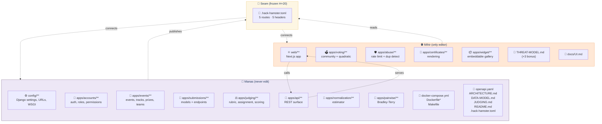

# HACK HAMSTER 2026 — MIHIR: FRONTEND, PUBLIC SURFACE, THREAT MODEL

**Role:** Frontend, public surface, threat model, demo video.

**Owner:** Mihir (`Mihir-Rabari`)
**Partner:** Manas (`choksi2212`) — backend, data, judging maths
**Plan:** `HACK HAMSTER-PLAN.md` · **Partner's doc:** `HACK HAMSTER-MANAS.md` · **Machine setup:** `HACK HAMSTER-SETUP-MIHIR.md`
**Scope:** T1 + T2 + T3 + T4, all four bonuses. Nothing cut.

**Read this whole file before Sep 26.** Machine setup this week, not on kickoff day.

> **SPEC IS LIVE (Sep 23).** `.hack-hamster.toml` is the seam, not `openapi.yaml`. Acceptance is `run.py`, seven HTTP checks. T3 and T4 have zero checks; scored on docs + demo video.

---

## Contents

- [The ownership tree](#the-ownership-tree-top-to-bottom)
- [Part I — The conflict-zero contract](#part-i--the-conflict-zero-contract)
- [Part II — Your build](#part-ii--your-build)

---

## The ownership tree



---

# Part I — The conflict-zero contract

## 1.1 Why it matters

A merge conflict at hour 60, resolved badly by a tired person, silently breaks something that was green an hour earlier. Avoided by construction: **no file has two owners.** Disjoint edits → no conflict.

## 1.2 Ownership

**YOURS — only you edit these:**

```
web/**                      the entire Next.js app
apps/voting/**              community voting + quadratic voting
apps/abuse/**               rate limits, duplicate detection, sybil heuristics
apps/certificates/**        certificate rendering
apps/widget/**              embeddable gallery widget
THREAT-MODEL.md             the bonus
docs/UI.md                  your architecture notes
```

**MANAS'S — never open these in an editor:**

```
config/**                   Django settings, URLs, WSGI
apps/accounts/**            auth, roles, permissions
apps/events/**              events, tracks, prizes, teams
apps/submissions/**         submission models and endpoints
apps/judging/**             rubric, assignment, scoring
apps/api/**                 the REST surface
apps/normalization/**       the estimator
apps/pairwise/**            Bradley-Terry
docker-compose.yml  Dockerfile*  Makefile
openapi.yaml
ARCHITECTURE.md  DATA-MODEL.md  JUDGING.md  README.md  .hack-hamster.toml
```

If you need a change in a file he owns, you ask. Never edit it "just quickly" — including at hour 70, especially at hour 70.

## 1.3 Git rules

1. **Never `git add .` or `git add -A`.** Explicit paths, every time.
2. **Commit after every change.** Many small honest commits beat six giant ones.
3. **Never force-push a shared branch.**
4. **Never commit on `main` directly.** You work on `mihir`, Manas works on `manas`.
5. **Pull before you push, every time.**
6. **Nothing pushed to `hack-hamster-hackathon` before Sep 26 18:00 UTC.** Rule 04: project code committed before kickoff is **disqualification**.

## 1.4 The frozen contract — `.hack-hamster.toml`

`.hack-hamster.toml` is the seam: a ~15-line config at the repo root, **published by Manas at H+20** and frozen after that except by checkpoint-call agreement. Spec: *"No fixed API routes. Yours are yours."* The file declares five route names and five pre-baked session headers. The checker **never logs in**.

**The five routes:**

| Key | What it is | Example |
|---|---|---|
| `gallery` | Public project gallery (no auth) | `/api/gallery` |
| `submit` | Project submission endpoint (participant auth) | `/api/events/sample-hack-2026/submit` |
| `judge_scores` | "Scores I gave" — judge reads own work | `/api/judge/scores` |
| `peer_scores` | "Scores another judge gave" — graded 401/403 cross-judge | `/api/judge/peer-scores?judge=judge_a` |
| `csv_export` | Organizer's CSV export | `/api/csv_export` |

**The five auth headers:**

| Header | Who it authenticates |
|---|---|
| `organizer` | The event organizer (an admin). |
| `judge_a` | A first seeded judge. |
| `judge_b` | A second seeded judge. |
| `judge_c` | A third seeded judge (`priya.nair@example.org`). |
| `participant` | A participant on a team. |

Your frontend hits only URLs declared in `[routes]`. No special backdoor, no server-side template shortcut, no direct DB reads — **this is how we earn the API First bonus.**

`openapi.yaml` is still useful for the bonus but no longer load-bearing for run.py.

## 1.5 Branch model — you are the integrator

```
main      ← LICENSE + README only, until the first integration. Judges clone this.
  ▲          Everything reaches main through YOUR branch.
  │
mihir     ← you live here. You are the integration point.
  ▲
  │
manas     ← he lives here. He never merges to main himself.
```

**One direction only:** Manas pushes to `manas`. **You merge `manas` → `mihir`** (your job, not his). **You merge `mihir` → `main`** (the only path into `main`). `main` has exactly one upstream, so it can never receive two conflicting merges.

```bash
# take his work into yours
git checkout mihir
git pull origin mihir
git fetch origin
git merge origin/manas          # resolve in YOUR branch, never in main
git push origin mihir
```

```bash
# publish to main — at every gate, with Manas present
git checkout main
git pull origin main
git merge --no-ff mihir
make up && make accept          # main must be green before you push it
git add acceptance-report.txt
git commit -m "docs: publish acceptance-report.txt for <gate>"
git push origin main
git checkout mihir              # go straight back; never work on main
```

**At every gate, not once at the end.** G2, G3, G4, G5, G6, G7 — each ends with `main` updated and green. A first merge at hour 68 is how a hackathon ends with finished code on a branch nobody looked at.

Manas stays current by merging `main` back into `manas` after each integration. Disjoint ownership → conflict-free by construction.

G2 (H+20) matters most — the first time his backend and your frontend have ever been in the same tree, and the first time `main` is more than a licence file. Do it early and together. Everything after G2 is a repeat.

## 1.6 Line endings and commit hygiene

You are on Windows. Git's default will rewrite line endings and manufacture conflicts in files neither of us touched.

```bash
git config --global core.autocrlf false
```

Repo `.gitattributes` (Manas commits this at G1):

```
* text=auto eol=lf
```

If you see a diff where "every line changed" and you changed nothing — this is why. Stop and tell Manas.

**Commit format:** imperative, scoped by area, body explains *why* when it is not obvious.

**If you hit a conflict:** stop. Do not resolve it alone under time pressure. `git merge --abort`, message Manas, fix it together in 5 minutes.

---

# Part II — Your build

## 2. Mandate

You own everything a human looks at, plus the security story.

| What | Tier | Why it scores |
|---|---|---|
| Public gallery, search, filter | T1 | Part of the 40% gate |
| Submission create/edit flow | T1 | Draft-and-edit, deadline enforcement |
| Team formation UI | T1 | Invite links |
| **Judge console** | T2 | Where Judging Integrity becomes visible |
| Organizer dashboard, live progress | T2 | |
| Community voting + comments | T3 | |
| **Anti-abuse** | T3 | Rate limits, duplicate detection, readable audit trail |
| Certificates, embeddable widget | T4 | |
| **`THREAT-MODEL.md`** | Bonus | **+3** |
| Pairwise compare console | Bonus | Half of **+5** |
| **The demo video** | Deliverable | No partial credit |

**Trap:** the brief lists *"a beautiful frontend over hardcoded data"* as scoring **zero** on the 40%. A screen is done when it is talking to the real API, never earlier.

## 3. Pre-kickoff work

All legal — none committed to the competition repo.

| Dates | Do this |
|---|---|
| Sep 13–15 | Join the Discord (this *is* registration). Use Devpost and Devfolio **as a judge and as a participant** — note every friction point; they are our feature list. |
| Sep 16–18 | Wireframe on paper: gallery, submission form, judge console, organizer dashboard, voting, pairwise compare. Start `THREAT-MODEL.md` — paper work; full draft before kickoff. |
| Sep 19–21 | Next.js + API-client fluency in a **throwaway repo**. Build a component inventory: button, field, card, table, modal, toast, empty state, skeleton. Retype at kickoff from memory. |
| Sep 22–23 | Demo video script. Attend Raptors Conference (Sep 23, free). Machine setup done and verified. |
| ~~Sep 23–25~~ *(past)* | Spec dropped a day early. Re-read §1–§11. Update this doc and the partner doc. Reconcile at 22:00. Pre-pull base images. Rest. |
| **Sep 26 ← we are here** | **KICKOFF. Build begins.** |

### 3.1 Draft the threat model now

A +3 bonus that is almost entirely writing — 80% doable before kickoff. Structure: assets → actors → trust boundaries → threats → mitigations → **residual risk**.

| Threat | Mitigation |
|---|---|
| Judge scores their own team's project | COI check at assignment; enforced at the API |
| Judge sees peer scores and anchors | Backend isolation (FIG. 02); scores unreadable cross-judge |
| Participant edits a submission after the deadline | Server-side deadline check; `submitted_at` immutable |
| Ballot stuffing in community voting | Rate limits, email gating, duplicate detection, audit trail |
| Sybil voting from one person, many identities | Fingerprint + rate limit + review queue; **mitigated, not solved** |
| Organizer silently edits scores | Audit log, append-only, visible |
| Results leaked during the voting window | Aggregates gated server-side until publication |
| Vote order bias | Randomised ballot ordering, seeded per voter |

**The section that wins the bonus is "Residual risk."** Name what you did *not* solve. Winning entries concede their own weaknesses before a judge finds them.

## 4. Build order

Blocked on the API until H+20.

**H+0 → H+20 · Shell and components**

Next.js app in `web/`, routing, layout, design tokens. Component inventory built and working. API client layer written against the **five route names** with a mock adapter behind the same interface. Every screen scaffolded with loading, empty, and error states.

The five are the only URLs run.py hits. If you build against these names, **the H+20 switch is a one-line change to the base URL**. If you scatter `fetch` calls against draft paths, it is four hours.

**H+20 → H+34 · T1 screens on real data**

Gallery with search and filter · submission create/edit with draft state and deadline behaviour · team formation and invite links · auth screens · custom questions rendered dynamically from the organizer's config (do not hardcode the field list).

**H+34 → H+48 · Judge console + organizer dashboard, then T3**

**The judge console is the most important screen in the product.** This hackathon is about judging. Needs: the judge's batch, the weighted rubric rendered from config, per-criterion scoring, save-as-draft, submit, progress. Must show the judge *only their own* work — verify by trying to load a peer's score in the console and confirming the API refuses you.

Then T3: voting (open / email-gated / authenticated), quadratic mode, comments, results hidden during the window, randomised ballot order, anti-abuse layer with a **human-readable** audit trail.

**H+48 → H+62 · Pairwise console, certificates, widget**

Pairwise compare: two projects, pick one, next pair. Fast keyboard flow — a judge doing 40 comparisons should never touch the mouse. Certificates and the embeddable widget follow.

**H+62 → H+68 · Freeze, then the video**

**Feature freeze at H+62.** `THREAT-MODEL.md` and `docs/UI.md` finished.

**Record the video at H+68. Not later.** Five minutes, one full lifecycle: create event → submit project → judge scores → results published. Script in advance, dry run, then record. Show the *product working*, not slides.

## 5. Definition of done

- [ ] Every screen talks to the real API — zero hardcoded data anywhere
- [ ] Every API call goes through documented endpoints only (API First proof)
- [ ] Judge console shows only the judge's own work, and the API refuses the rest
- [ ] Loading, empty, and error states exist on every screen
- [ ] Anti-abuse: rate limits, duplicate detection, readable audit trail
- [ ] `THREAT-MODEL.md` complete **with a residual-risk section**
- [ ] Zero console errors, zero build warnings
- [ ] Demo video recorded, under 5 minutes, shows a full lifecycle

## 6. Checkpoints

| When | Gate | What you do |
|---|---|---|
| H+3 | G1 | Confirm the repo runs on your machine |
| **H+20** | **G2** | **`.hack-hamster.toml` handover — switch off mocks. First real merge to `main`.** |
| H+34 | G3 | Merge `manas` → `mihir` → `main`. Suite green on `main`. |
| H+40 | G4 | Same. |
| H+48 | G5 | Same. Video script locked. |
| H+56 | G6 | Same. Pairwise console live. |
| H+62 | G7 | Same. **Feature freeze.** |
| H+68 | — | **Video recorded.** |
| H+70 | G9 | Final clean-machine run on `main`, together |

Every row ends with `main` green and pushed. You are the only person who moves it.

## 7. The two things most likely to go wrong

1. **You build ahead of the API and integrate late.** The mock adapter sits behind the same interface as the real client; switch is one line. Test the switch at H+20 even if only one route is ready.
2. **The video gets left to the last hour.** The one deliverable with no partial credit, always underestimated. It is also **the only thing scoring T3 and T4** — run.py has zero checks for either tier. H+68 is a hard commitment.

---

[← Back to README.md](README.md)
