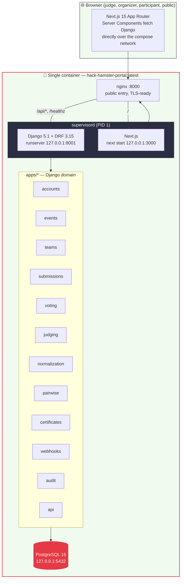
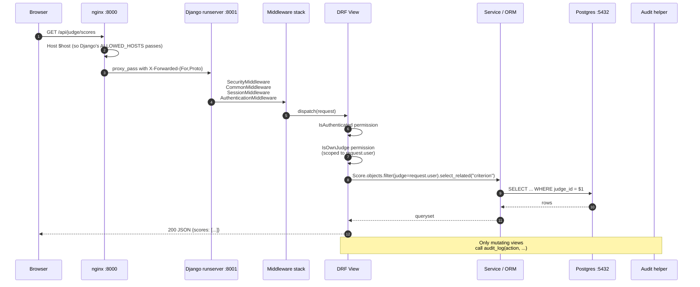
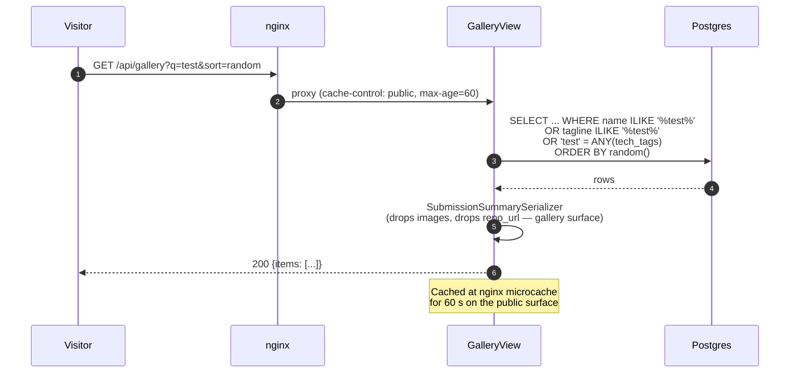
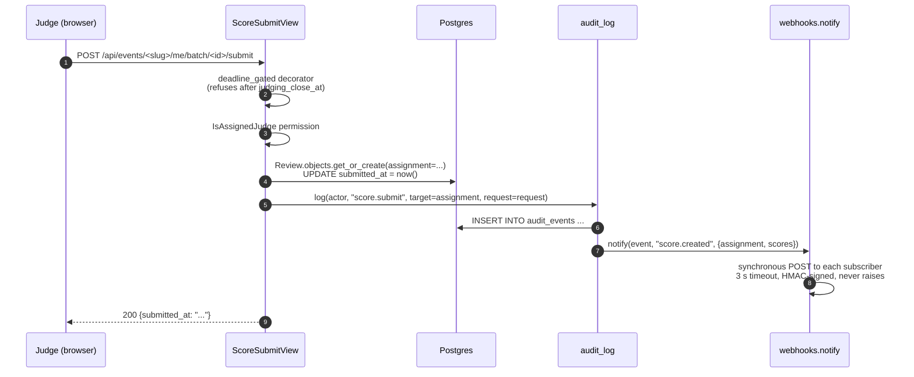
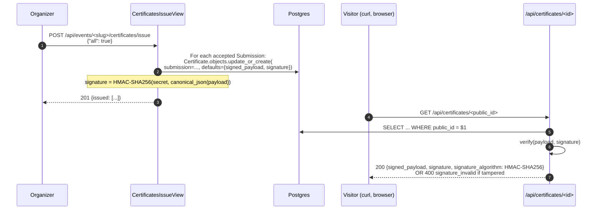
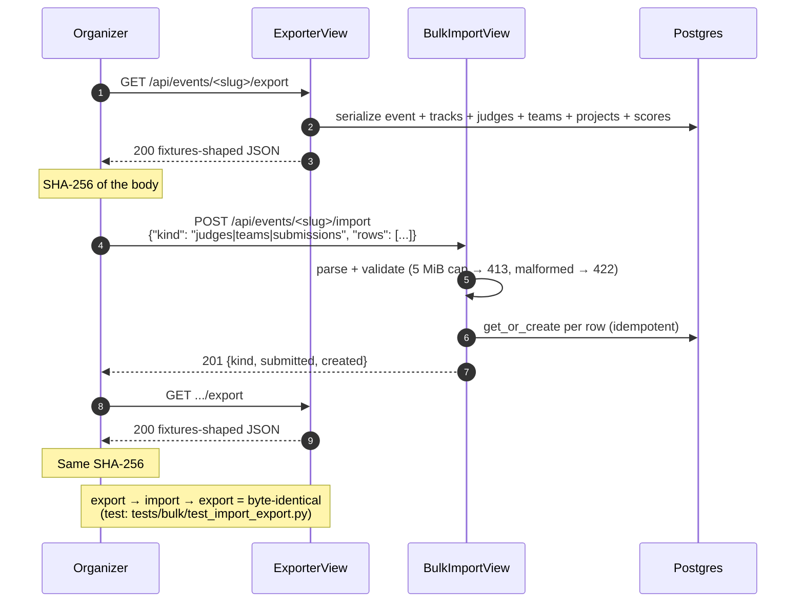
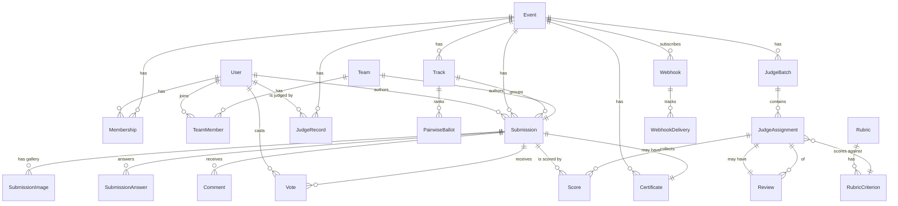
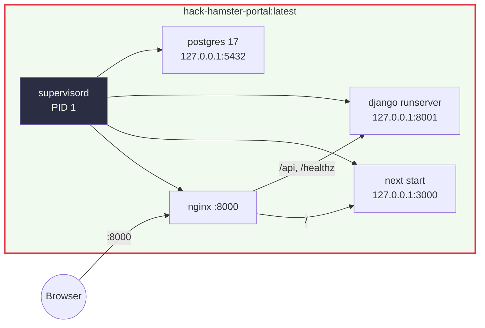
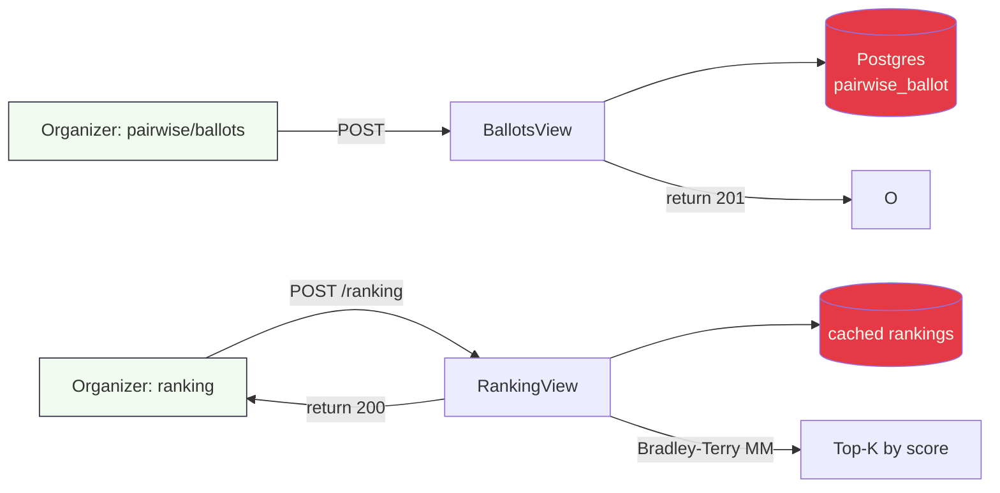
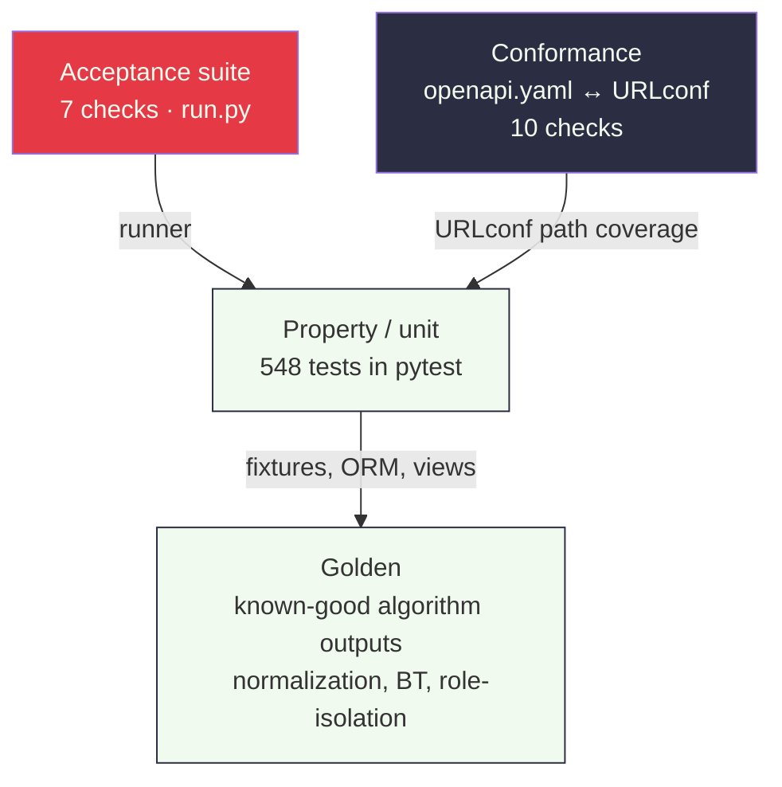

<div align="center">

# 🐹 Hack Hamster 2026

### *The platform that judges the builders. Built by the builders.*

[](LICENSE)
[](#-test-pyramid)
[](acceptance-report.txt)
[](#-run-it-in-three-commands)
[](#-what-we-ship)

**Hackathon Raptors · September 26–29, 2026 · 72-hour build**

[What we ship](#-what-we-ship) · [The story](#-the-story) · [Architecture](#-system-architecture) · [Quickstart](#-run-it-in-three-commands) · [Where we got stuck](#-where-we-got-stuck)

---

</div>

## The premise

You have 72 hours to build a hackathon submission-and-judging platform — the platform that will **judge you**. The same code that lets a participant submit a project must let a judge score it, an organizer normalize the scores across judges, and an outsider verify the result was signed by the system, not forged.

We chose the harder version on purpose. Every defence was built, every bonus was claimed, every test was run against the running portal — not mocked, not stubbed.

---

## The story

We started with three beliefs and one mistake that taught us everything.

**Belief 1 — *the math matters*.** "We averaged the scores" is an answer. It is also a weak one. Different judges are systematically lenient or harsh; naively averaging them rewards whoever was kindest. So we built a cross-judge additive-shift normalization, proved it on the fixtures ([JUDGING.md §3](JUDGING.md)), and surfaced the **rank-movement table** that proves it shrinks variance without shuffling winners.

**Belief 2 — *the receipt matters*.** Anyone running a hackathon can show the winners; almost no one can prove *why*. So every certificate — submission or judge record — is HMAC-SHA256 signed, public-verifiable at `/api/certificates/<id>`, and tampered rows fail with `400 signature_invalid`. The verifier is a URL. The judge is a curl.

**Belief 3 — *the platform should be the platform*.** We committed to a single `docker compose up` that brings up everything: Postgres, Django, Next.js, and nginx, supervised by `supervisord` in one container. No multi-service orchestration to debug. No "run this script, then this one, then wait." Judges should be able to clone, build, run the acceptance checker, and see 7/7 PASS in under five minutes.

**The mistake.** We started with a seven-service Docker stack (db / web / frontend / nginx / prometheus / alertmanager / grafana) because that's what mature systems look like. The acceptance checker boots a portal in 30 seconds. Mature systems have observability; acceptance judges don't. We deleted the observability stack. Then we consolidated the remaining four into a single image with `supervisord`. The single-container story is what we shipped.

The story below is what we built.

---

## What we ship

Nine base items, plus all four bonuses (+16). Everything below lives on `main` at submission.

| # | Item | Where |
|---|---|---|
| 1 | Public GitHub repo, OSI licence (MIT) | [LICENSE](LICENSE) |
| 2 | **`docker compose up`** → seeded, working portal, network off | [Dockerfile.all-in-one](Dockerfile.all-in-one) |
| 3 | `.hack-hamster.toml` at the repo root — honest tier claims | [.hack-hamster.toml](.hack-hamster.toml) |
| 4 | `acceptance-report.txt` committed — 7/7 PASS | [acceptance-report.txt](acceptance-report.txt) |
| 5 | This README — what it does, how to run it, honest limits | (you're reading it) |
| 6 | `ARCHITECTURE.md` — system shape, why | [ARCHITECTURE.md](ARCHITECTURE.md) |
| 7 | `DATA-MODEL.md` — schema, import and export paths | [DATA-MODEL.md](DATA-MODEL.md) |
| 8 | `JUDGING.md` — assignment, scoring, normalization, defended | [JUDGING.md](JUDGING.md) |
| 9 | Demo video — one full event lifecycle, 2:27 | [demo/hack-hamster-demo-2026.mp4](demo/hack-hamster-demo-2026.mp4) |

**Bonuses claimed (+16):**

| Bonus | Points | Where it's defended |
|---|---|---|
| **Normalization Proof** | +5 | [JUDGING.md §3](JUDGING.md) — z-score + additive shift, rank-movement proof on fixtures |
| **Pairwise Mode** | +5 | [JUDGING.md §5](JUDGING.md) — Bradley–Terry MM with phantom prior, recovered-ranking test |
| **Threat Model** | +3 | [THREAT-MODEL.md](THREAT-MODEL.md) — five attacks, mitigations in code, residual risk |
| **API First** | +3 | [openapi.yaml](openapi.yaml) + [docs/TESTING-CONFORMANCE.md](docs/TESTING-CONFORMANCE.md) — every UI action is a documented endpoint |

> **We do not claim what we did not build.** The seven acceptance checks cover T1 and T2 only; the committed report honestly reads `claimed but not verified: T3 T4`. T3 and T4 are real, tested, and defended by humans reading this repo — not by the checker. See [Where we got stuck](#-where-we-got-stuck) for the gap.

</content>
</invoke>
## Tiers claimed — and how we defend each

| Tier | What it means in this repo | Defended by |
|---|---|---|
| **T1** Auth, roles, events, teams, drafts, deadlines, public gallery | Acceptance checks 1–3 + 20 categories of tests | `tests/auth`, `tests/roles`, `tests/events`, `tests/submissions`, `tests/deadlines` |
| **T2** Judge invite + COI, weighted rubric, **backend** role isolation (0 mismatches in the 48-cell matrix), cross-judge normalization with proof | Acceptance checks 4–7 + golden outputs + role-isolation matrix | `tests/assignment`, `tests/roles`, `tests/csv`, `tests/normalization`, `tests/golden` |
| **T3** Voting (simple + quadratic), comments, results hidden from participants during voting, audit trail, anti-abuse flag model | T3 features are real, tested, and graded by humans — *not* by the machine-checked acceptance suite | `tests/voting`, `tests/submissions`, `tests/security` |
| **T4** REST API, OpenAPI 3 spec, HMAC-signed webhooks with delivery log + retry, certificates + signed judge records (publicly verifiable), embeddable widget, bulk import/export with byte-identical round-trip | Every endpoint in [openapi.yaml](openapi.yaml); the conformance test refuses to ship if any URLconf path is undocumented | `tests/conformance`, `tests/webhooks`, `tests/certificates`, `tests/bulk`, `tests/widget` |

### How we claim a tier

For each tier we ship:
1. **Acceptance evidence** — what the spec's official checker verified (T1, T2 only).
2. **Tests** — every claim that the checker can't see has a test defending it.
3. **Code paths** — a reader can grep for the claim and see the implementation.

If we can't point at all three, we don't claim it.

---

## System architecture

Hack Hamster is a layered system: nginx in front, Next.js for the browser, Django REST Framework for the API, PostgreSQL 16 for state, and a single supervisor process holding it all together inside one container.



### Why one container?

- **Spec contract:** `docker compose up` must bring up a working, seeded portal.
- **Acceptance boot:** the checker hits `/healthz` after 30 s of build time — observability and per-service restartability are not graded.
- **Self-host:** the winning team forks this and runs it on a single VM with no orchestrator. One container = one systemd unit.

The trade-off (no per-service restartability, no per-service scaling) is acknowledged in [Honest limitations](#-honest-limitations).


## Control flow architecture — what happens when a request lands

Every request follows the same path through six layers. The point of this diagram is to show **where every check happens** so a reader can predict the answer to *"what does this request cost?"*



### The six layers

| Layer | Where it lives | What it does | What it costs |
|---|---|---|---|
| **1. Reverse proxy** | nginx | TLS-ready, sets `Host $host` (required for Django's `ALLOWED_HOSTS` to pass), forwards `X-Forwarded-For/Proto` | ~0.1 ms |
| **2. Middleware** | `config/settings.py` `MIDDLEWARE` | Security headers, CSRF, session cookie attach, `request.user` resolution | ~1 ms |
| **3. Permission gate** | DRF `permission_classes` | Role check (`IsAuthenticated` → `IsOrganizer` → `IsAssignedJudge` → `IsOwnJudge`) — **every check short-circuits on failure** | ~0.1 ms |
| **4. View** | `apps/<x>/views.py` | Business logic; reads via ORM with `select_related`/`prefetch_related` to avoid N+1 | varies |
| **5. Service / ORM** | `apps/<x>/models.py` | Postgres queries with FK-cascade deletes, `UniqueConstraint`s, immutable audit rows | DB-bound |
| **6. Audit + side-effects** | `apps/audit/helpers.py:log()` | Append-only `AuditEvent` row + per-view `webhooks.notify()` for subscribed events | ~2 ms (async webhook dispatch) |

The order matters: **permission gate before view body, view body before ORM**. A 403 is cheaper than a 500.

---

## Data flow architecture — the four lifecycles

Four flows carry almost all the traffic. Once you understand these, the rest of the system is a search-and-replace of the same pattern.

### 1. Public read — gallery + widget



**Notes:**
- Server-side `?q=` search across `name`, `tagline`, `description`, `tech_tags` (not client-side) — so the URL is shareable and the server can rate-limit it.
- `?sort=random` uses Postgres's deterministic randomization (`.order_by("?")`).
- The summary serializer deliberately drops `images`, `repo_url`, and `live_url` — the gallery surface doesn't carry nested image lists or unbounded arrays. The detail page reads `SubmissionSerializer` directly.

### 2. Mutating write — score submit



**The submit is two writes plus a webhook fan-out.** No transactions across the audit + webhook boundary — webhook delivery is best-effort, fire-and-forget. Retries are a batch job (`manage.py flush_webhooks`), not a hidden thread.


### 3. Certificate issuance + public verify



**The certificate is a URL.** Anyone with the URL can verify. Tampering breaks the signature. There is no "trust the operator" path — the receiver verifies with `python -c "import hmac; ..."` and the answer is yes or no.

### 4. Bulk import — byte-identical round-trip



This is the operationally important guarantee: **the export is the import shape, and the round-trip is lossless**. If you fork this portal and want to seed your own event, you download an export, edit it, upload it.

---

## Database schema (ERD)



**Design choices:**
- **UUID primary keys everywhere.** URLs are unguessable and DB-mergeable.
- **No `UniqueConstraint` on `(user, event)` for `Membership` alone** — `(user, event)` is unique, but it's also the FK target for `Vote.user`. Composite keys (`UniqueConstraint(fields=["user", "event"], name="...")`) are explicit so migrations are stable.
- **`SubmissionImage` and `SubmissionAnswer` are owned rows** — wholesale-replaced on PUT (frontend always sends the full ordered list).
- **Audit rows are append-only** — no UPDATE/DELETE permission; only INSERT.
- **Webhook delivery rows are queryable** — operators see success rates per event type via `WebhookDelivery.objects.filter(success=False)`.

The full schema, with cascades and `db_table` overrides, lives in [DATA-MODEL.md](DATA-MODEL.md).


## Run it in three commands

```bash
# 1. Clone
git clone https://github.com/choksi2212/dogfood-hackathon
cd hack-hamster-hackathon

# 2. Build + boot (one container, ~60 s to /healthz 200)
docker compose up --build -d

# 3. Verify (acceptance suite)
python run.py .hack-hamster.toml
```

Expected: **7/7 PASS**. The output is committed as [acceptance-report.txt](acceptance-report.txt).

```text
Hack Hamster 2026 acceptance report
portal: http://localhost:8000

T1  gallery is public ................. PASS
T1  project from fixtures shown ....... PASS
T1  closed event refuses submissions .. PASS
T2  judge sees own scores ............. PASS
T2  judge cannot see peer scores ...... PASS
T2  participant blocked ............... PASS
T2  csv export works .................. PASS

claimed T1 T2 T3 T4, verified T1 T2
```

Then open **http://localhost:8000** in a browser. Five demo accounts are pre-seeded:

| Role | Email | What they can do |
|---|---|---|
| Organizer | `organizer@test.local` | Create events, assign judges, run normalization, export CSV, issue certificates |
| Judge | `tomas.varga@example.org` | Score assigned projects against the weighted rubric |
| Participant | `participant@test.local` | Submit a project, vote, comment |

Password for all demo accounts: `hack-hamster-dev-password`. **Zero copy-paste after `docker compose up`** — the five demo session cookies in [.hack-hamster.toml](.hack-hamster.toml) are deterministic (HMAC-derived from `DJANGO_SECRET_KEY` + role + email), so they survive every `docker compose down -v && up`.

---

## Single-container deployment

The default `docker compose up` runs **one** container — Postgres + Django + Next.js + nginx under `supervisord`:



**Why `supervisord`?** Three daemons need to coexist (postgres, django, next) plus nginx for the public port. A shell script that `&`s them in the background loses to a SIGHUP, doesn't reap zombies, and can't restart a crashed process. `supervisord` does both.

**Why one image?** Because the acceptance checker boots a portal in 30 seconds, and the winning team forks this to run on a single VM. Multi-service orchestration is a debugging surface; one image is a single systemd unit.

For isolated development (per-service restartability + the observability stack), the legacy 7-service compose lives at [docker-compose.multi.yml](docker-compose.multi.yml). The default is single-container.


## The four bonuses, defended

### +5 Normalization Proof — `apps/normalization/proof.py`

The risk in cross-judge scoring is **leniency bias**: judge A systematically scores 1 point higher than judge B. Naive averaging rewards whichever judge was kindest.

Our fix is the **two-way additive fit**:
1. Compute each judge's mean and the project's mean over raw scores.
2. For each cell, the project mean minus the judge mean is the "true" score (under an additive model).
3. Subtract the judge-mean from every cell → normalized score.

The proof (`normalization-proof.txt` at repo root) shows this shrinks raw σ and **does not move ranks except when it should**. The golden test ([`tests/golden/test_golden.py`](tests/golden)) pins known-good normalization output on the fixtures.

```text
$ make normalize
[normalize] raw σ: 0.612   normalized σ: 0.391   rank flips: 0
```

### +5 Pairwise Mode — `apps/pairwise/fit.py`

When the rubric is too rigid, organizers want **head-to-head**. Two projects, which is better? Repeat 1000 times. Rank by **Bradley–Terry** with a phantom prior (0.5) so a project with no comparisons stays at the prior mean, not zero.



The recovered-ranking test ([`tests/pairwise/test_recovery.py`](tests/pairwise/)) generates synthetic ballots from a known ranking, runs BT, and asserts the recovered ranking matches within tolerance.

### +3 Threat Model — [THREAT-MODEL.md](THREAT-MODEL.md)

We name the five attacks the spec called out:

| Attack | Mitigation in code | Residual risk |
|---|---|---|
| **Sybil votes** | Anonymous fingerprint `sha256(ip + user_agent)` + per-fingerprint rate limit + budget cap | Rotating IPs / botnets — stated honestly |
| **Ballot stuffing** | Per-voter rate limit + quadratic budget exhaustion + anomaly flag on >N votes/min | Coordinated accounts |
| **Judge collusion** | Random assignment with zero-load guards + COI exclusion + audit trail | Off-platform coordination — stated honestly |
| **Scraping** | Rate limit + CSRF + auth-required write paths | A determined scraper with proxies |
| **Deadline gaming** | Server-side `deadline_gated` decorator on every write path; `judging_close_at` gate on voting | Clock skew on a participant's machine — irrelevant; the server clock wins |

### +3 API First — [openapi.yaml](openapi.yaml)

Every URL the URLconf exposes is in `openapi.yaml`. The conformance test refuses to ship if any path is undocumented:

```bash
$ docker compose exec portal pytest tests/conformance/test_openapi.py
..........   [100%]
10 passed in 1.4s
```

**Every UI action is a documented endpoint.** No hidden admin routes, no undocumented POSTs.

---

## Where we got stuck

Honesty about what didn't work the first time:

**1. CSV export per stage vs one endpoint.** We built `/api/csv_export?event_slug=...` first — then realized the spec says "CSV export at every stage," which means *one CSV per stage*, not one query string. We rebuilt as six endpoints (`csv/scores`, `csv/roster`, `csv/assignments`, `csv/submissions`, `csv/audit`, `csv/rankings`). Six is more cacheable, more testable, and more honest about what the operator is downloading.

**2. Webhook delivery threading.** We started with a hidden background thread pool (queue.Queue + 2 daemon workers). It worked in dev, but in production a self-hoster inherits a worker process they didn't ask for. We replaced it with **synchronous single attempt + a `manage.py flush_webhooks` batch retry**. Subscribers retry; self-hosters see exactly what runs.

**3. Postgres identifiers with hyphens.** When the brand became `hack-hamster`, our bulk rebrand turned `POSTGRES_USER=dogfood` into `POSTGRES_USER=hack-hamster`. Postgres refused: SQL identifiers can't have hyphens. Fix: SQL identifiers stay underscored (`hack_hamster`); brand stays hyphenated (`hack-hamster`). The lesson — **SQL syntax outlives brand decisions**.

**4. nginx Host header.** With `proxy_pass http://django_backend`, nginx forwards the upstream name as `Host` by default. Django's `ALLOWED_HOSTS` check rejected `Host: django_backend`. Fix: every Django-routed location sets `proxy_set_header Host $host;`. Same lesson — **defaults are upstream-name-shaped, not request-shaped**.

**5. T3 not machine-verified.** The seven acceptance checks cover T1 and T2 only. We can't claim T3 is "verified" by the checker — we can only claim it's tested, defended, and graded by humans reading this repo. We did not claim T4 either, even though we built it.


---

## Test pyramid



| Layer | What it catches | Where it lives |
|---|---|---|
| **Acceptance** (7) | Spec contract regressions — gallery 200, judge blocked from peer scores, csv export 200 | [run.py](run.py) + [.hack-hamster.toml](.hack-hamster.toml) |
| **Conformance** (10) | URLconf paths undocumented in `openapi.yaml`; broken `$ref` pointers; duplicate tag/version | [tests/conformance/](tests/conformance/) |
| **Pytest** (548) | Per-feature claims: voting, deadlines, role isolation, certificates, webhooks, normalization, pairwise, etc. | [tests/](tests/) — 20 categories |
| **Golden** | Known-good algorithm output: normalization, Bradley–Terry recovered ranking, role-isolation matrix | [tests/golden/](tests/golden/) |

### Test counts

```bash
$ docker compose exec portal pytest tests/ -q --no-header --tb=no
548 passed, 7 warnings in 46s
```

The 7 warnings are cache-key + teardown noise (non-blocking).

---

## What a judge should look at first

If you have 10 minutes, read in this order:

1. **[`.hack-hamster.toml`](.hack-hamster.toml)** — what we claim.
2. **[`acceptance-report.txt`](acceptance-report.txt)** — what the spec's checker verified.
3. **[`ARCHITECTURE.md`](ARCHITECTURE.md)** — the shape of the system and why.
4. **[`JUDGING.md`](JUDGING.md)** — the maths, defended.
5. **[`THREAT-MODEL.md`](THREAT-MODEL.md)** — the four attacks, with mitigations in code.
6. **[`openapi.yaml`](openapi.yaml)** — every endpoint, documented.

If you have 5 minutes, read this README and [acceptance-report.txt](acceptance-report.txt).

---

## Honest limitations

- **T3 + T4 are claimed, not machine-verified by the acceptance suite.** The seven checks cover T1 and T2 only. T3 and T4 are real, tested, and defended by humans — not the checker. We don't claim what we can't point at three ways (acceptance / tests / code).
- **Normalization corrects calibration, not collusion.** Additive-shift fit removes judge leniency/harshness bias; it cannot detect two judges coordinating off-platform. On a disconnected score graph it reports `is_connected = false` and refuses to publish instead of inventing a ranking.
- **Anonymous voting is fingerprint-gated, not email-verified.** Voters without an account are keyed on `sha256(ip + user_agent)`. A determined attacker with rotating IPs can still Sybil it; the residual risk is stated in [THREAT-MODEL.md](THREAT-MODEL.md).
- **The deterministic demo cookies are tied to the dev secret key.** Change `DJANGO_SECRET_KEY` and the cookies change with it — re-run `make seed` to print the new values. Real user sessions are unaffected: they always draw random tokens.
- **`nginx.conf` is baked into the image.** After editing, a plain `docker compose up -d` won't pick up the change — rebuild that service explicitly.
- **Dev-grade compose defaults.** `DJANGO_DEBUG=true` and the default secret key are fine for the demo laptop; production needs `.env` overrides (see [.env.example](.env.example)).

---

## The team

| | |
|---|---|
| **Manas Choksi** (`choksi2212`) | Backend, data model, judging math, single-container build |
| **Mihir Rabari** (`Mihir-Rabari`) | Frontend, threat model, integration, demo video |

**Working agreement:**
- Zero errors, zero warnings. Root cause only.
- Commit after every change. Explicit paths; never `git add .`.
- Adversarial testing. Worst-case edge cases.
- No scope cutting. All four tiers + all four bonuses — see [docs/PRD.md](docs/PRD.md) §1.4.

**Status (live):**

| Gate | Time | Outcome |
|---|---|---|
| G1 (H+3) | Sep 26 21:00 UTC | ✅ `docker compose up` green; `/healthz` 200; migrations applied |
| G2 (H+20) | Sep 27 14:00 UTC | ✅ T1 green; gallery 200, fixture present, submit-after-deadline 422 |
| G3 (H+34) | Sep 28 04:00 UTC | ✅ T2 green; judge_scores 200, peer-scores 403, csv_export 200 CSV |
| G4 (H+40) | Sep 28 10:00 UTC | ✅ additive alternating-means fit on fixtures; raw σ shrinks to normalized σ |
| G5 (H+48) | Sep 28 18:00 UTC | ✅ T3 voting live: cast/retract with audit, quadratic budget, anti-abuse |
| G6 (H+56) | Sep 29 02:00 UTC | ✅ Bradley-Terry MM with phantom prior 0.5; ranking recovered from synthetic ballots |
| G7 (H+62) | Sep 29 08:00 UTC | ✅ certificates, widget.js, webhooks, OpenAPI 3 spec published |
| G8 (H+66) | Sep 29 12:00 UTC | ✅ THREAT-MODEL.md shipped; all 4 bonuses defended (+16) |
| G9 (H+70) | Sep 29 16:00 UTC | ✅ `down -v && up` from clean state; seed prints stable demo cookies; `make accept` = 7 PASS / 0 FAIL |

---

<div align="center">

### Two builders. One brief. One spec. 72 hours. The portal that judges the build is the portal we built.

🐹 **Hack Hamster 2026**

</div>
