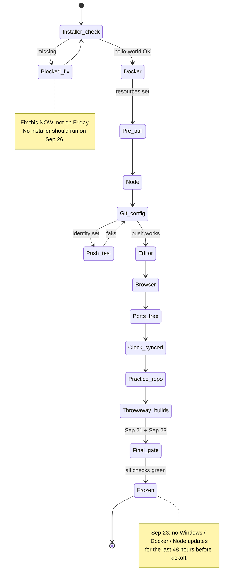

# HACK HAMSTER 2026 — MIHIR: MACHINE SETUP

**Role:** Pre-kickoff machine setup checklist for Mihir. Done once, verified twice.

**Do this by Sep 21. Not on kickoff day.**
Installers fail in ways that take an hour to unpick. None of this touches the competition repo, so all of it is legal under Rule 04.

---

## Contents

- [Setup phases, end to end](#setup-phases-end-to-end)
- [0. The one command that checks everything](#0-the-one-command-that-checks-everything)
- [1. Docker Desktop](#1-docker-desktop)
- [2. Node](#2-node)
- [3. Git and the line-ending trap](#3-git-and-the-line-ending-trap)
- [4. Editor](#4-editor)
- [5. Browser](#5-browser)
- [6. Ports](#6-ports)
- [7. Clock](#7-clock)
- [8. Throwaway practice repo](#8-throwaway-practice-repo)
- [9. Final gate — what "ready" looks like](#9-final-gate--what-ready-looks-like)
- [10. What NOT to do before kickoff](#10-what-not-to-do-before-kickoff)

---

## Setup phases, end to end



---

## 0. The one command that checks everything

```bash
for c in docker node npm git curl python3; do printf '%-10s ' "$c"; $c --version 2>/dev/null | head -1 || echo "NOT FOUND"; done; printf '%-10s ' "compose"; docker compose version 2>/dev/null | head -1 || echo "NOT FOUND"
```

| Tool | Minimum | Why |
|---|---|---|
| Docker Desktop | 24+ | the whole product runs in it |
| `docker compose` | v2+ | plugin form (`docker compose`, not `docker-compose`) |
| Node | 20 LTS or newer | Next.js frontend |
| Git | 2.40+ | |
| curl | any | proves the API refuses you |
| **python3** | **3.10+** | **`run.py` runs on the host — spec: "Any Python 3, including the one already on your Mac. Standard library only, nothing to install."** |

If all seven print versions, jump to §5.

---

## 1. Docker Desktop

Install from docker.com. **Enable the WSL 2 backend** when asked — Hyper-V has more filesystem edge cases on Windows.

```bash
docker run --rm hello-world
```

If this fails, nothing else works. Fix it now.

**Resources** — Settings → Resources. Give it at least **4 GB RAM and 2 CPUs**.

### 1.1 Pre-pull the images — Sep 23

Spec is live a day early; stack is unchanged.

```bash
docker pull postgres:16-alpine
docker pull python:3.12-slim
docker pull node:22-alpine
```

Manas confirms the exact tags if they differ.

---

## 2. Node

Install the current **LTS** from nodejs.org. Not the "Current" build.

```bash
node --version   # v20.x or v22.x
npm --version
```

Next.js 15 wants 20+. Upgrade any older Node.

---

## 3. Git and the line-ending trap

The single most common way a Windows teammate creates conflicts in files they never touched.

```bash
git config --global core.autocrlf false
git config --global core.longpaths true
git config --global init.defaultBranch main
git config --global pull.rebase false
```

**Set your identity** — must be your real GitHub account (wrong email = commits not attributed to you = judges can't read your history):

```bash
git config --global user.name "Mihir Rabari"
git config --global user.email "<the email on your GitHub account>"
git config --global --get user.name
git config --global --get user.email
```

### 3.1 Confirm you can push, this week

Test it now in a scratch repo you own — **not** in `hack-hamster-hackathon`:

```bash
mkdir -p ~/scratch/push-test && cd ~/scratch/push-test
git init && echo test > a.txt && git add a.txt && git commit -m "test"
# add a remote to a throwaway repo of your own, push, confirm it lands, then delete it
```

You need push access to `github.com/choksi2212/hack-hamster-hackathon` before kickoff. Ask Manas to add you as a collaborator **this week**. Do not clone or push anything to it yet.

---

## 4. Editor

VS Code, with ESLint, Prettier, Docker, and **a line-ending indicator in the status bar**.

Set VS Code default end-of-line to `\n`: Settings → search `files.eol` → set to `\n`.

---

## 5. Browser

Chrome or Edge with DevTools fluent. You will live in the Network tab proving the frontend only calls documented endpoints.

Also a second browser (or private window) — you need **two simultaneous sessions as different roles** constantly: judge in one, organizer in the other.

---

## 6. Ports

| Port | Service |
|---|---|
| 3000 | Next.js dev server |
| 8000 | Django |
| 5432 | Postgres |

```bash
netstat -ano | grep -E ':(3000|8000|5432)\s' || echo "all free"
```

If something is listening, stop it. **Verify a kill by PID, not by image name**:

```bash
netstat -ano | grep ':5432'       # note the PID in the last column
tasklist | grep <PID>             # confirm what it is before killing
taskkill //PID <PID> //F
```

A local Postgres from a previous project squatting on 5432 is the classic case.

---

## 7. Clock

Deadline enforcement is a graded T1 feature; JWT/session expiry breaks in confusing ways when the clock drifts.

Windows Settings → Time & language → set time automatically **on**, click "Sync now".

Kickoff is **Sep 26, 18:00 UTC**; freeze is **Sep 29, 18:00 UTC**. Every deadline is UTC.

```bash
date -u
```

---

## 8. Throwaway practice repo

```bash
mkdir -p ~/scratch/hack-hamster-practice && cd ~/scratch/hack-hamster-practice
```

- No remote to `hack-hamster-hackathon`
- Nothing in it is copied into the real repo at kickoff
- You rebuild from empty on Sep 26 — fluency crosses the line, files do not

Practice until each is boring: a Next.js app from scratch, an API client layer with a mock adapter you can switch, form validation, a table with sort and filter, reading an OpenAPI spec.

---

## 9. Final gate — what "ready" looks like

Run through this on **Sep 21** and again on **Sep 23**.

- [ ] `docker run --rm hello-world` succeeds; `docker compose version` prints v2+
- [ ] Base images pulled (**Sep 23 check — spec is live**)
- [ ] `node --version` is 20+; `python3 --version` is 3.10+
- [ ] `git config --global core.autocrlf` is `false`; `user.email` is your GitHub email
- [ ] Collaborator invite to `hack-hamster-hackathon` accepted; pushed to a scratch repo this week
- [ ] Ports 3000, 8000, 5432 free; clock synced with offset from UTC known
- [ ] VS Code default EOL is `\n`; line-ending indicator visible in status bar
- [ ] You are in the HACK HAMSTER Discord
- [ ] Read `HACK HAMSTER-PLAN.md`, `HACK HAMSTER-MIHIR.md`, and `spec.md` (already live Sep 23)

---

## 10. What NOT to do before kickoff

- **Do not commit or push anything to `hack-hamster-hackathon`.** Rule 04: project code committed before Sep 26 18:00 UTC is **disqualification**.
- Do not write components to paste in — commit timestamps are public.
- Do not install a local Postgres (fights for port 5432) or upgrade Windows/Docker/Node in the last 48 hours. **Freeze your machine Sep 23.**
- Do not skip the spec read. **Already live (Sep 23)**; both docs re-planned against it.

---

[← Back to MIHIR.md](MIHIR.md)
