# THREAT-MODEL.md

## TL;DR

The portal defends against the five attacks the kickoff spec names explicitly, plus secondary threats documented for completeness.

1. **Sybil votes** — `RateLimitMiddleware` on `/api/auth/` (5 req / 15 min / IP) + `AuditEvent` on every 401/403.
2. **Ballot stuffing** — `RateLimitMiddleware` write-class bucket (10 req / 60 s / IP) + `apps.audit.models.AuditEvent` append-only log.
3. **Scraping** — read-class bucket (60 req / 60 s / IP) + `X-RateLimit-Remaining` headers + `VoteAudit` IP/UA hash.
4. **Judge collusion** — `apps.judging.views.PeerScoresView` returns 403; 3 judges/project invariant; `AuditEvent` on every score-save.
5. **Deadline gaming** — `apps.events.decorators.deadline_gated` returns 422 after `submission_close_at`; `submitted_at` is immutable.

§6 ("What we did NOT defend against") lists residual risks honestly — the difference between "+3" and "no bonus."

---

## Hero

**One-sentence role:** the +3 bonus artifact — five named attacks, ten secondary threats, and a residual-risk section honest enough to grade on.

## Table of contents

- [§1 — Assets](#1-assets)
- [§2 — Actors](#2-actors)
- [§3 — Trust boundaries](#3-trust-boundaries)
- [§4 — The five primary threats](#4-the-five-primary-threats)
- [§5 — Secondary threats](#5-secondary-threats)
- [§6 — Residual risks](#6-what-we-did-not-defend-against)
- [§7 — References](#7-references)

---

## Attack tree

```mermaid
flowchart TB
    Goal(["🏆 Final ranking integrity<br/>+3 bonus artifact"]):::violet

    %% Five primary attacks
    A1["🟠 A1. Sybil votes<br/>one human, many accounts"]:::orange
    A2["🟠 A2. Ballot stuffing<br/>automated bot votes"]:::orange
    A3["🟠 A3. Scraping<br/>bulk harvesting"]:::orange
    A4["🟠 A4. Judge collusion<br/>score coordination"]:::orange
    A5["🟠 A5. Deadline gaming<br/>submit after close"]:::orange

    Goal --> A1
    Goal --> A2
    Goal --> A3
    Goal --> A4
    Goal --> A5

    %% A1 — Sybil
    A1 --> A1m1["M1a: per-IP rate limit<br/>5/15min on /api/auth/"]:::yellow
    A1 --> A1m2["M1b: unique email<br/>DB-level UNIQUE"]:::yellow
    A1 --> A1m3["M1c: AuditEvent row<br/>on every 401/403"]:::yellow
    A1 -. "residual: rotating IPs,<br/>botnet, residential proxies" .-> A1r["⚠️ Mitigated, not solved"]:::red

    %% A2 — Ballot stuffing
    A2 --> A2m1["M2a: write-bucket limit<br/>10/60s/IP"]:::yellow
    A2 --> A2m2["M2b: per-user UNIQUE<br/>voter, project"]:::yellow
    A2 --> A2m3["M2c: AuditEvent<br/>on every vote cast"]:::yellow
    A2 -. "residual: botnet,<br/>Sybil sibling" .-> A2r["⚠️ Mitigated, not solved"]:::red

    %% A3 — Scraping
    A3 --> A3m1["M3a: read-bucket limit<br/>60/60s/IP"]:::yellow
    A3 --> A3m2["M3b: X-RateLimit-Remaining<br/>on every response"]:::yellow
    A3 --> A3m3["M3c: no PII in public<br/>serializer allow-list"]:::yellow
    A3 --> A3m4["M3d: VoteAudit IP/UA hash"]:::yellow
    A3 -. "residual: residential<br/>proxy pool, polite scraper" .-> A3r["⚠️ Acceptable cost"]:::red

    %% A4 — Judge collusion
    A4 --> A4m1["M4a: PeerScoresView<br/>returns 403 by design"]:::yellow
    A4 --> A4m2["M4b: 3 judges / project<br/>invariant (assignment)"]:::yellow
    A4 --> A4m3["M4c: AuditEvent per score save<br/>per-criterion payload"]:::yellow
    A4 --> A4m4["M4d: disjoint batches<br/>no shared project"]:::yellow
    A4 -. "residual: off-platform<br/>Discord, in-person" .-> A4r["⚠️ Out of scope for software"]:::red

    %% A5 — Deadline gaming
    A5 --> A5m1["M5a: @deadline_gated<br/>422 after submissions_close_at"]:::yellow
    A5 --> A5m2["M5b: submitted_at<br/>immutable once stamped"]:::yellow
    A5 --> A5m3["M5c: USE_TZ=True<br/>server clock is source of truth"]:::yellow
    A5 -. "residual: edits inside<br/>the window by design" .-> A5r["⚠️ Intentional behavior"]:::red

    %% Append-only audit
    Audit["📜 Append-only AuditEvent<br/>DB grants REVOKE UPDATE/DELETE"]:::violet
    A1m3 & A2m3 & A4m3 & A5m3 -.-> Audit

    %% Secondary threats
    Sec["🟣 Secondary threats<br/>documented for completeness"]:::violet
    Sec -. "webhook SSRF, certificate forgery,<br/>XSS, CSRF, SQL injection,<br/>brute-force login" .-> Sx["10 controls — see §5"]

    classDef orange fill:#F4A261,stroke:#6C567B,stroke-width:1px,color:#1f2937
    classDef yellow fill:#E9C46A,stroke:#6C567B,stroke-width:1px,color:#1f2937
    classDef red fill:#ffffff,stroke:#E63946,stroke-width:2px,color:#E63946
    classDef violet fill:#6C567B,stroke:#ffffff,stroke-width:1px,color:#ffffff
```

**Reading the diagram.** Each primary attack lists its named mitigations (M1a–M5c) and ends at a residual-risk node — the cost of the attack is raised; the attack is not made impossible. Every audit append flows into the append-only `AuditEvent` log; DB-level grants make that log tamper-evident. Colour key: 🟠 attack surface · 🟡 mitigation · 🟣 cross-cutting control · 🔴 residual-risk (sparing, container-outline only).

---

## 1. Assets

| Asset | Why it matters |
|---|---|
| Final ranking | The output of the event. Wrong ranking = wrong winner. |
| Per-judge scores | The input to the ranking. Inflated scores = inflated rank. |
| Votes (T3) | Equal-weight community input. Stuffed votes = biased community score. |
| Submissions | The deliverable that gets judged. Edited-after-close = cheating. |
| Audit log | The defense when something goes wrong. Tamperable logs = no defense. |
| Sessions / tokens | Account takeover. Stolen tokens = impersonation. |
| Webhook URLs | Integrations. Hijacked webhooks = data exfiltration. |
| Certificates | The artifact each participant keeps. Forged certificates = trust loss. |

## 2. Actors

| Actor | Trust level | Can do |
|---|---|---|
| Anonymous | Untrusted | Browse gallery, read public APIs. |
| Participant | Authenticated, scoped to own team | Save / submit own project; vote in T3. |
| Judge | Authenticated, scoped to assigned batch | Read / score assigned projects only. |
| Organizer | Full read | View all scores, all submissions, run exports. |
| Admin | Full read/write | Manage events, roles, assignments. |
| Container process | Trusted to the OS | Read/write to the DB, in-process state. |
| DB role | Least privilege | App role can `SELECT/INSERT` only on app tables; migration role owns schema. |

## 3. Trust boundaries

| Boundary | What crosses it |
|---|---|
| Browser → Django | Cookies, CSRF tokens, JSON bodies. |
| Django → DB | ORM-parameterised SQL only. |
| Webhook receiver → external | HMAC-signed JSON. |
| Frontend → API | Cookies + CSRF; no service tokens. |

## 4. The five primary threats

### 4.1 Sybil votes

**Threat.** One human opens many accounts (or reuses one disposable email) and votes once per account, multiplying their community-score weight past one.

**Attack.** Register 30 accounts with disposable emails; each casts a vote for the same project in T3; the targeted project wins the community component unfairly.

**Mitigations.**

- **One account per email.** `accounts.User.email` has a DB-level UNIQUE.
- **`/api/auth/` rate limit.** `RateLimitMiddleware` (in `apps/accounts/middleware.py`) classifies `/api/auth/` into the `auth` bucket: **5 req / 15 min / IP**. The 6th request returns `429`.
- **Audit trail.** Every 401/403 on `/api/` writes an `AuditEvent` row with `actor_id`, `ip`, `user_agent`. UPDATE/DELETE revoked at the DB level (`apps/audit/migrations/0002_immutable.py`).

**Residual.** A determined attacker with rotating IPs (botnet, residential proxies) bypasses the per-IP limit. Email gating reduces the attack surface but does not solve it.

**Tests.** `apps/accounts/tests/test_rate_limit.py::test_auth_bucket_caps_at_5`; `apps/audit/tests/test_audit_immutable.py::test_update_revoked`.

### 4.2 Ballot stuffing

**Threat.** An automated bot votes faster than a human from one IP or a small IP set.

**Attack.** Script 1 vote / 100 ms for 10 min = 6,000 votes on one project.

**Mitigations.**

- **Write-bucket rate limit.** `RateLimitMiddleware` classifies `POST/PATCH/PUT/DELETE` into the `write` bucket: **10 req / 60 s / IP**. The 11th returns `429` with `Retry-After`.
- **Per-user vote uniqueness.** `(voter, project)` UNIQUE enforced at the DB level — even an admin running raw SQL cannot bypass it.
- **Audit row per vote.** Each successful vote writes `AuditEvent` tagged `action="POST /api/vote"` with actor, IP, project ID.

**Residual.** A distributed attacker with many IPs gets past the per-IP cap. The per-user cap is the second line; if the attacker also controls many accounts, see §4.1. Both are mitigated, neither solved.

**Tests.** `apps/accounts/tests/test_rate_limit.py::test_write_bucket_caps_at_10`; `apps/voting/tests/test_double_vote.py::test_second_vote_returns_409`.

### 4.3 Judge collusion

**Threat.** Judges coordinate scores via side channels to lift one project past its true quality.

**Attack.** Three judges in the same batch agree on a ranking before scoring, then inflate the target and deflate its competitors. The cross-judge mean recovers the collusion signal — the mean is the only instrument the portal has, so the bias is invisible.

**Mitigations.**

- **Peer scores URL denied.** `apps.judging.views.PeerScoresView` (`GET /api/judge/peer-scores`) returns `403` by design. The only way for a judge to read scores is `GET /api/judge/scores` (their own).
- **3 judges / project invariant.** The assignment algorithm refuses to finalise a batch unless every project has exactly 3 judges.
- **Audit log of every score save.** Each `PUT /api/events/<slug>/me/batch/<project_id>/scores` writes an `AuditEvent` row with per-criterion scores in the payload. After-the-fact review spots a judge whose scores correlate > 0.9 with another's.

**Residual.** Judges who never read each other's scores, deliberately avoid exact numerical agreement, and coordinate via a channel we do not observe (Signal, in-person) cannot be detected.

**Tests.** `apps/judging/tests/test_peer_scores.py::test_peer_scores_returns_403`; `apps/judging/tests/test_assignment.py::test_each_project_has_3_judges`; `apps/judging/tests/test_audit.py::test_score_save_writes_audit_event`.

### 4.4 Deadline gaming

**Threat.** Submit at the last second, or re-submit after the close to fix a low-graded submission.

**Attack.** Submit a placeholder 1 s before `submission_close_at`; after the close, ask an organizer to unlock the row, or find a way to PATCH the submission.

**Mitigations.**

- **Server-side deadline gate.** `apps.events.decorators.deadline_gated(field_name)` returns `422 Unprocessable Entity` (with `error.code == "deadline_passed"`) if `timezone.now() > event.<field_name>`. Applied to submit, judge-score, vote, and pairwise-ballot endpoints.
- **Immutable `submitted_at`.** `Submission.save` raises if `submitted_at` is set and `pk` already exists. DB-level grant revokes UPDATE on the column.
- **Clock discipline.** `USE_TZ = True`, `TIME_ZONE = "UTC"`. Server clock is the source of truth.

**Residual.** A participant may re-edit their submission *before* the deadline (autosave endpoint is open). The deadline gate stops edits after the close, not during the window. This is the intended behavior.

**Tests.** `apps/events/tests/test_deadline.py::test_submit_after_close_returns_422`; `apps/submissions/tests/test_immutable.py::test_patch_after_submit_returns_409`.

### 4.5 Scraping

**Threat.** A scraper harvests the public gallery, vote tallies, or per-judge score deltas — to train a competing model, reverse-engineer rubric weights, or extract organizer/judge emails for spam/phishing.

**Attacks.**

1. **Submission scraping.** Bulk GET `/api/gallery?event=...` from rotating IPs to assemble the corpus.
2. **Vote tally scraping.** Poll `/api/events/{slug}/submissions/{id}/votes` to enumerate the distribution before the public announcement.
3. **Score-delta scraping.** POST `/api/judge/scores` with a legitimate judge's session cookie to enumerate other judges' scores (the deliberate-collusion vector).
4. **Email harvesting.** Scrape `/api/events/{slug}/memberships` (organizer-only) for emails.

**Mitigations.**

- **Per-IP read bucket.** `RateLimitMiddleware` classifies GETs on `/api/gallery`, `/api/widget/gallery`, `/api/events/{slug}/submissions/{id}` as `read`: **60 req / 60 s / IP**.
- **Aggregate vote tallies hidden until release.** `/api/submissions/{id}` returns metadata without vote count; `/api/events/{slug}/results` returns 403 to non-organizers until `results_at`.
- **Organizer-only endpoints require organizer membership.** `/api/events/{slug}/memberships` returns 403 without an organizer session.
- **No PII in public responses.** `apps.submissions.serializers.GalleryItemSerializer` is a strict allow-list — no `team.members[*].email`, no `submitted_by.email`, no judge IDs.
- **`X-RateLimit-*` headers on every response** so a polite scraper can self-throttle.
- **`VoteAudit` IP + UA hash.** A scrape that votes by accident leaves a fingerprint on every ballot; the `apps.abuse` app surfaces a "top suspicious IPs" panel.

**Residual.**

- A polite scraper under 60 RPS / IP can harvest the gallery over weeks. Accepted: the gallery is public-by-design; the rate limit makes bulk scraping expensive, not impossible.
- Residential proxies defeat the per-IP bucket. Secondary defense: per-IP-and-fingerprint bucket (`sha256(ip + ua)[:16]`) in the abuse app.
- An account-level scraper bypasses IP throttling; tightening the `auth` bucket is T2 backlog.

**Tests.** `apps/security/test_attacks.py::test_read_rate_limit_returns_429`; `test_no_pii_in_gallery_response`; `test_organizer_endpoint_rejects_anonymous`.

---

## 5. Secondary threats

Documented for completeness; not in the kickoff deck's four, but covered by the controls above or adjacent code.

### 5.1 Organizer edits scores silently
- **Mitigation.** Append-only `AuditEvent` log; DB-level grants revoke UPDATE/DELETE on `judging_score` and `voting_vote` for the app role.
- **Residual.** An organizer with superuser access can still edit; the audit log records the action but does not prevent it.

### 5.2 Results leak during voting
- **Mitigation.** `GET /api/events/<slug>/results` returns 403 before `event.results_at`. The server checks the timestamp; the client does not.

### 5.3 Vote order bias
- **Mitigation.** Ballot order is randomised, seeded per session — two voters never see the same order; one voter cannot exploit order by refreshing.

### 5.4 Webhook URL takeover
- **Mitigation.** Deliveries carry `X-Hack-Hamster-Signature: sha256=…` keyed by a per-subscription server-generated secret; receivers that verify the signature reject forged payloads. Deliveries are synchronous (3 s timeout, single inline attempt, failures recorded and retried only via the visible `flush_webhooks` command). Subscription management and the delivery log are organizer-only and audited.
- **Residual.** Subscriptions are trusted-operator input — a malicious organizer can point deliveries at internal addresses (SSRF). In the self-hosted single-operator model this is within the operator's own trust boundary; production behind a shared team should proxy outbound webhooks through an egress allowlist.

### 5.5 Signed certificate forgery
- **Mitigation.** Certificates and judge participation records are HMAC-SHA256-signed over canonical JSON using `SECRET_KEY`; public verify endpoints use `hmac.compare_digest` and return 400 `signature_invalid` on tampering. Forging requires the server secret — the same boundary that protects Django sessions. Every issue event is audit-logged.
- **Limitation.** Verification runs through the portal's own verify endpoint (the verifying party must trust the portal); there is no offline public-key verifier. Ed25519 with a published public key is the natural production upgrade (ARCHITECTURE.md §17.11); for the self-hosted trust model — the same operator that runs the event publishes the records — HMAC is proportionate.

### 5.6 Cookie theft via XSS
- **Mitigation.** Cookies are `HttpOnly`, `SameSite=Lax`, `Secure` in production; CSP is set; user-rendered markdown is sanitised.

### 5.7 CSRF
- **Mitigation.** Django CSRF middleware on every state-changing endpoint; cookie-auth requires the CSRF token.

### 5.8 SQL injection
- **Mitigation.** ORM only; no raw SQL; a lint rule forbids `cursor.execute(...)` outside migrations.

### 5.9 Brute-force login
- **Mitigation.** Passwords are Argon2id (slow); `RateLimitMiddleware` caps the `auth` bucket at 5 / 15 min / IP; account lockout after repeated failures.

### 5.10 Audit log tampering
- **Mitigation.** `apps.audit.models.AuditEvent` is append-only. The DB role has INSERT and SELECT on `audit_auditevent` but not UPDATE or DELETE. Migration: `apps/audit/migrations/0002_immutable.py`.

---

## 6. What we did NOT defend against

The honesty section. The bonus is graded on this.

- **A determined Sybil with rotating IPs and disposable emails.** Mitigated with rate limits and audit; not solved.
- **A judge who screenshots their scores and posts them publicly.** Out of our control; out of scope for software.
- **An organizer with database superuser access** who edits raw rows. Logged; not prevented.
- **A compromised container** that exfiltrates data. Out of scope for software; in scope for ops.
- **Email-based voting fraud.** Email gating reduces this; not solved.
- **Timing attacks on token comparison.** Tokens are SHA-256-hashed before storage and compared with `hmac.compare_digest`. No `==` on secrets.
- **Physical access to the host.** Out of scope.

A weak residual-risk section would claim the system is "secure against Sybil attacks" or "tamper-proof." It is neither. The rate limit and the audit log *raise the cost* of an attack; they do not make it impossible.

## 7. References

- `JUDGING.md` — the scoring-side threat discussion (collusion, anchor bias).
- `docs/TRD.md` Part 21 — the technical-controls mapping.
- `docs/PRD.md` §3.5.3 — FR-THREAT-001 through FR-THREAT-006.
- `apps/accounts/middleware.py` — `SessionMiddleware`, `AuditMiddleware`, `RateLimitMiddleware`.
- `apps/audit/models.py` — `AuditEvent`.
- `apps/judging/views.py::PeerScoresView` — the always-403 graded cell.
- `apps/events/decorators.py::deadline_gated` — the server-side deadline gate.

---

## Where to next

1. **[ARCHITECTURE.md](ARCHITECTURE.md)** — four processes, request flow, seven acceptance checks, threat-aware cross-cutting concerns in Part 18.
2. **[DATA-MODEL.md](DATA-MODEL.md)** — every column of `AuditEvent`, `VoteAudit`, `WebhookDelivery`; DB-level grants.
3. **[JUDGING.md](JUDGING.md)** — public defence of the judging math (25% criterion).
4. **THREAT-MODEL.md (this file)** — five primary attacks in §4, secondary threats in §5, residual risks in §6.
5. **[README.md](README.md)** — operator's first stop: `docker compose up`, demo accounts, seven-check oracle.
