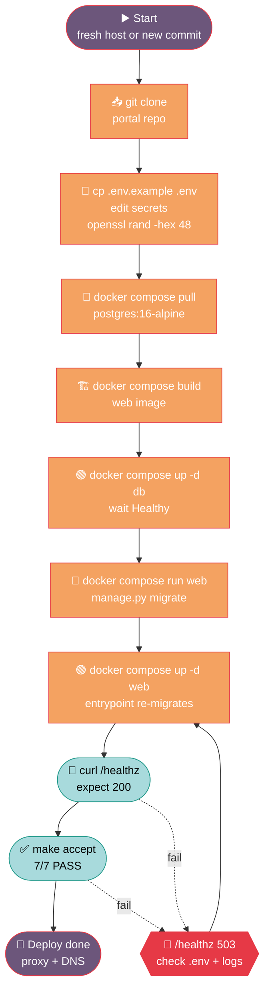

# HACK HAMSTER Portal — Production Deploy Guide

> **Hero.** Single-host Docker compose deploy — clone, build, up, healthz, accept, done. For whoever is putting the portal on a real host for the first time, or rolling out the next commit.

## Contents

- [1. Prerequisites](#1-prerequisites)
- [2. First-time deploy](#2-first-time-deploy)
- [3. Subsequent deploys](#3-subsequent-deploys)
- [4. Environment variables](#4-environment-variables)
- [5. TLS](#5-tls)
- [6. Scaling](#6-scaling)
- [Related docs](#related-docs)

---

## Deploy flowchart



> **Palette** — `🟠 #F4A261` compute, `🔵 #A8DADC` state/data, `🟣 #6C567B` control, `🟢 #2A9D8F` data-store border, `🔴 #E63946` outline only (alert).

---

## 1. Prerequisites

On the deploy host:

- **Docker Engine 24+** with the Compose v2 plugin (`docker compose version` prints a 2.x line). Docker Desktop on Windows/macOS or `docker.io` + `docker-compose-plugin` on Linux both work.
- **PostgreSQL 16 client tools** (`psql`, `pg_dump`, `pg_restore`) for the backup/restore story in [`docs/BACKUP-DR.md`](BACKUP-DR.md). On Debian/Ubuntu: `apt-get install -y postgresql-client-16`.
- **A domain name** with an A/AAAA record pointed at the host's public IP. TLS terminates at a reverse proxy (§5), not inside Django.
- **No DNS record for `db`** — `db` is a compose service name, only resolvable inside the compose network. Postgres is bound to the `db` container's network namespace only; the host's 5432 stays free for any other Postgres you may already be running (see §10 trap in `docs/PLAN.md`).
- **Outbound HTTPS** from the host for `pip` (first build) and the Postgres image pull.

On the workstation you deploy from:

- Git, a clone of this repo at `N:\hack-hamster-hackathon` (or preferred path), and `ssh` access to the host.

## 2. First-time deploy

Run every block from the repo root on the deploy host (or from your laptop if `ssh`-ed in). Commands below are copy-pasteable on Git Bash on Windows or any POSIX shell.

### 2.1 Clone and configure secrets

```bash
git clone <your-fork-url> hack-hamster-portal
cd hack-hamster-portal

cp .env.example .env
# edit .env — see §4 for the full key list
```

Open `.env` and replace the dev defaults:

```env
POSTGRES_DB=hack-hamster
POSTGRES_USER=hack-hamster
POSTGRES_PASSWORD=<long-random-string>
POSTGRES_HOST=db
POSTGRES_PORT=5432

DJANGO_DEBUG=false
DJANGO_SECRET_KEY=<openssl rand -hex 48>
DJANGO_ALLOWED_HOSTS=portal.example.com,127.0.0.1,web

LOG_LEVEL=INFO
```

`DJANGO_SECRET_KEY` must be at least 50 chars of high-entropy random. Generate one with `openssl rand -hex 48`. Treat `.env` as a secret — it is in `.gitignore`; **never commit it**.

### 2.2 Bring up Postgres and wait for it to be healthy

```bash
docker compose up -d db
docker compose ps          # db should reach "Healthy" within ~10s
```

The `db` service has its own healthcheck (`docker-compose.yml:18`) that runs `pg_isready` every 5s. Do not move on until `docker compose ps` shows `Healthy` next to `db` — `web` will fail its migrate step otherwise.

### 2.3 Apply migrations

```bash
docker compose run --rm web python manage.py migrate
```

A list of `[X] <migration_name>` lines per app prints. Safe to re-run; Django no-ops already-applied migrations.

### 2.4 Seed fixtures (dev / demo only)

```bash
docker compose run --rm web python manage.py seed_fixtures
```

Seeds the demo event, teams, judges, projects, and a few accounts; prints organizer tokens to stdout. **Skip this step in production** — the seed creates fixed credentials and is meant for local demo runs and the acceptance suite. For a real event, create the event through the API with an admin-issued token.

### 2.5 Bring up the web tier

```bash
docker compose up -d web
docker compose ps          # web should reach "Healthy" within ~30s
```

`web`'s in-container healthcheck (`docker-compose.yml:48`) curls `/healthz` every 10s. The entrypoint (`entrypoint.sh`) also re-runs `migrate` on every container start, so a missed migration is loud, not silent.

### 2.6 Smoke test

From the host:

```bash
curl -fsS http://127.0.0.1:8001/healthz
# expected: {"status":"ok","checks":{"app":"ok","db":"ok"},"db_ms":<n>}
```

From the public hostname (after §5 TLS is wired):

```bash
curl -fsS https://portal.example.com/healthz
```

A 503 means `web` cannot reach `db`. Re-check `POSTGRES_*` in `.env` — they must match between `db:` and `web:` in `docker-compose.yml` exactly.

## 3. Subsequent deploys

For every commit you want to roll out:

```bash
cd hack-hamster-portal
git pull
docker compose up -d --build web
```

`--build` is needed only when `requirements.txt`, `Dockerfile`, or `entrypoint.sh` changed. For pure code changes (`apps/**`, `config/**`), `docker compose up -d web` is enough — the source tree is bind-mounted into the container at `/app` (`docker-compose.yml:41`), so Django's runserver auto-reloads. If you have switched to Gunicorn for production, treat every commit as requiring `--build` and a restart.

Always re-run migrations explicitly when a new migration file lands:

```bash
docker compose run --rm web python manage.py migrate
```

The entrypoint also runs them on the next container restart, but running by hand gives you the migration list in your terminal log.

If you also bumped Postgres itself (image tag or volume layout), back up first — see [`docs/BACKUP-DR.md`](BACKUP-DR.md) §3.

## 4. Environment variables

Every key in `.env.example`, what it controls, and the production value:

| Variable | Consumed in | Purpose | Production value |
|---|---|---|---|
| `POSTGRES_DB` | `docker-compose.yml` (both services), `config/settings.py:101` | Logical database name | Same as dev (`hack-hamster`) is fine |
| `POSTGRES_USER` | `docker-compose.yml`, `config/settings.py:102` | DB role used by Django | Dedicated role, not `postgres` |
| `POSTGRES_PASSWORD` | `docker-compose.yml`, `config/settings.py:103` | Password for that role | Long random; treat as a secret |
| `POSTGRES_HOST` | `config/settings.py:104` | Postgres hostname | `db` (compose service name) |
| `POSTGRES_PORT` | `config/settings.py:105` | Postgres port | `5432` |
| `DJANGO_DEBUG` | `config/settings.py:17` | Toggles Django debug mode | **`false`** — debug pages leak stack traces and settings |
| `DJANGO_SECRET_KEY` | `config/settings.py:13` | Signing key for sessions, CSRF, password reset, etc. | 50+ chars of `openssl rand -hex 48`; rotate = logged-out everyone |
| `DJANGO_ALLOWED_HOSTS` | `config/settings.py:18` | Comma-separated hostnames Django will serve | Your public domain + `127.0.0.1` + `web` |
| `LOG_LEVEL` | `config/settings.py:145` | Root logger verbosity | `INFO` normally; `DEBUG` to chase a request; `WARNING` to quiet logs |
| `WEB_REPLICAS` | (not yet read by code — see §6) | Number of `web` containers to run | `2` for a real event, `1` for a demo |
| `WEB_CONCURRENCY` | (passed to Gunicorn if you swap the CMD) | Workers per replica | `4` on a 2-core box |

Anything not in `.env.example` is read straight from Django defaults or hardcoded — there is no hidden config. Add new variables to `.env.example` in the same commit that adds the consumer, so a fresh clone always boots.

## 5. TLS

Django runs **plain HTTP** on container port 8000. Terminate TLS at a reverse proxy in front of the compose network:

- **Caddy** (simplest) — one `Caddyfile` reverse-proxying `portal.example.com` to `http://127.0.0.1:8001` and auto-issuing a Let's Encrypt cert. Caddy reads the public hostname from the request, so no config change is needed when you add a second hostname.
- **nginx** (more control) — `proxy_pass http://127.0.0.1:8001;` plus the usual `ssl_certificate`, `ssl_certificate_key`, `proxy_set_header X-Forwarded-For $proxy_add_x_forwarded_for;` (the rate limiter and audit middleware already read `HTTP_X_FORWARDED_FOR` at [`apps/accounts/middleware.py:72`](../../apps/accounts/middleware.py#L72) and [`apps/accounts/middleware.py:136`](../../apps/accounts/middleware.py#L136)).

The compose file binds `web` to `127.0.0.1:8001:8000` (`docker-compose.yml:46`), which means the proxy must run on the same host. That is intentional — it keeps the database port off the public network and avoids a second firewall to manage.

After TLS is up, re-run the §2.6 smoke test against the public hostname. `DJANGO_ALLOWED_HOSTS` must include whatever hostname the proxy is serving — Django rejects the request with 400 otherwise.

## 6. Scaling

The compose stack as shipped runs a single `web` container. For a real event with concurrent voters and judges, run more than one.

### 6.1 Vertical (one bigger container)

Edit `docker-compose.yml` and bump the `web` service's resource limits, or give the host more cores. Nothing in the app code changes.

### 6.2 Horizontal (multiple `web` containers)

Add a `deploy.replicas` block (Compose v2 ignores it unless you pass `--scale`, but it documents intent) and a `WEB_REPLICAS` env var that your entrypoint reads:

```bash
docker compose up -d --scale web=3
```

Each replica will bind `127.0.0.1:8001`, which **will fail** — only one process can hold that port. Two options:

- **Switch the host bind to a high port** and put a load balancer in front. Change `docker-compose.yml:46` from `"127.0.0.1:8001:8000"` to `"127.0.0.1:8001-8003:8000"` and bring the stack up with `--scale web=3`. nginx `upstream` then lists `127.0.0.1:8001`, `127.0.0.1:8002`, `127.0.0.1:8003`.
- **Put the proxy on the same Docker network** as `web` (recommended). Add an `nginx` service to `docker-compose.yml` that depends on `web` and use `http://web:8000` as the upstream. Then `docker compose up -d --scale web=3` "just works" — Docker's embedded DNS round-robins across the replicas.

### 6.3 Caveats when scaling out

- **Rate limiter is in-memory.** `RateLimitMiddleware` keeps buckets in `self.buckets` per worker process (`apps/accounts/middleware.py:93`). Two workers means two sets of counters and a 2× effective limit per IP. For the hackathon threat model this is fine; if you need shared limits, back the bucket dict with Redis. Document the change in `THREAT-MODEL.md`.
- **Sessions are DB-backed.** Sliding TTL is updated in `apps/accounts/middleware.py:35` on every request; multiple workers contend on the same row. This is intentional and bounded by `CONN_MAX_AGE=60` (`config/settings.py:106`).
- **Static files.** `STATIC_ROOT` is `BASE_DIR/staticfiles` (`config/settings.py:122`). With multiple replicas, run `collectstatic` once and either share the volume or serve via the proxy with a separate `location /static/` block.

---

## Related docs

- [`docs/RUNBOOK.md`](RUNBOOK.md) — what to do when /healthz goes red after a deploy.
- [`docs/BACKUP-DR.md`](BACKUP-DR.md) — `pg_dump` + restore flow that runs against this same layout.
- [`docs/BACKEND-IMPL.md`](BACKEND-IMPL.md) — what the `web` and `db` containers are actually running.
- [`README.md`](../README.md) · [`ARCHITECTURE.md`](../ARCHITECTURE.md) — pitch + system diagram.
