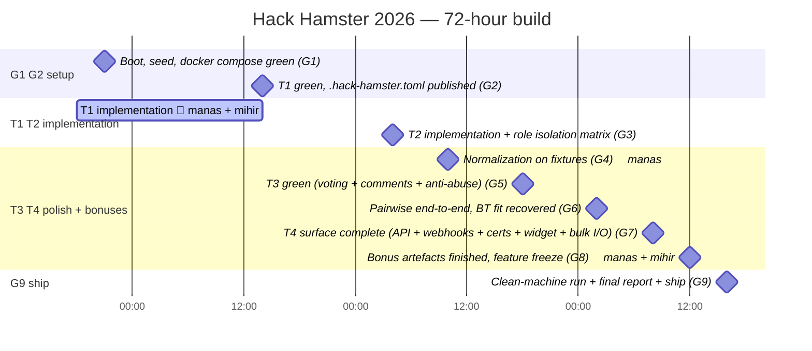

# HACK HAMSTER 2026 — Operational Plan

**Event:** hackhamster.com · Hackathon Raptors · "Build the platform that will judge you"
**Window:** Sep 26 18:00 UTC → Sep 29 18:00 UTC, 2026 (72h)
**Today:** Sep 26, 2026 — **KICKOFF DAY. Build begins at 18:00 UTC.**
**Team:** Manas (`choksi2212`) + Mihir (`Mihir-Rabari`)
**Repo:** `https://github.com/choksi2212/dogfood-hackathon` — **empty, and stays empty until kickoff**
**Prize pool:** $2,500 · 10 payable slots

---

## Hero

**Role:** Operational plan for the 72-hour Hack Hamster 2026 build. For the two builders (Manas and Mihir) executing kickoff-to-freeze, with gates, hour-by-hour strategy, ownership, traps, and the discipline that replaces a cut list.

## TOC

- [1. Scoring — the seven acceptance checks](#1-scoring)
- [2. Target — every tier, every bonus, claimed honestly](#2-target)
- [3. The three figures are a spec leak](#3-the-three-figures-are-a-spec-leak)
- [4. Fixture edge cases — pre-announced in the FAQ](#4-fixture-edge-cases)
- [5. Deliverables](#5-deliverables)
- [6. Stack — Django + DRF + Postgres + Next.js](#6-stack)
- [7. Ownership split — conflict-zero by construction](#7-ownership-split)
- [8. Pre-kickoff plan (Sep 13 → Sep 26)](#8-pre-kickoff-plan)
- [9. The 72 hours — hour-by-hour](#9-the-72-hours)
- [10. Traps — named in the brief + post-mortem](#10-traps)
- [11. Write Up Quest](#11-write-up-quest)
- [12. Known unknowns](#12-known-unknowns)
- [13. Post-freeze](#13-post-freeze)
- [Related docs](#related-docs)

## Hack Hamster 2026 — 72-hour build



> *Palette: 🟡 yellow (read paths / public surface), 🟠 orange (services / compute),
> 🔵 blue (state / data stores), 🟣 violet (domain / types), 🟢 teal (data-store
> borders), 🔴 red (outline only, sparing).*

> **SPEC IS LIVE (Sep 23, a day early).** This plan is rewritten against the real spec. Anything that conflicts with spec.md or run.py is wrong by definition — they are what runs.

> **SCOPE DECISION: everything. All four tiers, all four bonuses, nothing cut.**
> No cut list. What replaces it is a **completion order** where every stage ends in something that runs — so the clock can stop at any point and what exists is whole, not half-open.

---

## 0. DO TODAY

- [ ] Join Discord — **this is registration**: https://discord.gg/xfYPDZYqeh
- [ ] Read all 15 references linked at the bottom of hackhamster.com
- [ ] Register for Raptors Conference, Sep 23, free
- [ ] Alarm: **Sep 24 — spec.md drops. Read it before anything else.**
- [ ] Alarm: **Sep 26 18:00 UTC — kickoff. fixtures.json + acceptance suite released.**

Team is fixed. Nothing to do for the Sep 21 team-formation date.

---

## 1. Scoring

| Weight | Criterion | Verified by |
|---|---|---|
| **40%** | Tier Completion & Correctness | **`run.py` — seven HTTP checks (see §1.1)** |
| **25%** | Judging Integrity | JUDGING.md + backend enforcement (suite `peer_scores` check) |
| **20%** | Adoptability & Operability | `docker compose up` — objective |
| **15%** | Code Quality & Innovation | Human read |

### 1.1 The acceptance mechanism — seven HTTP checks, not a per-tier suite

The acceptance mechanism is `run.py`, a 30-line Python script that runs seven HTTP checks against our portal. All seven are published in full in the spec; nothing hidden. The seven are:

| # | Check | Verifies |
|---|---|---|
| 1 | `GET {gallery}` no auth → 200 | T1 public gallery |
| 2 | `GET {gallery}` contains a known fixture title | T1 seeded with fixtures |
| 3 | `POST {submit}` as participant, after deadline → 4xx | T1 deadline enforcement |
| 4 | `GET {judge_scores}` as `judge_a` → 200 | T2 role: a judge reads their own |
| 5 | `GET {peer_scores}` as `judge_b` → 401 or 403 | **T2 role isolation — the graded cell** |
| 6 | `GET {judge_scores}` as `participant` → 401 or 403 | T2 role isolation — second cell |
| 7 | `GET {csv_export}` as `organizer` → 200 + CSV body | T2 CSV export |

**T3 and T4 have ZERO checks in run.py.** Scored entirely by the demo video, README, ARCHITECTURE.md, DATA-MODEL.md, JUDGING.md, and human eyes. The `tiers.claimed` list in `.hack-hamster.toml` is checked against the report — a "claimed but not verified" gap is the *only* thing that directly costs points. Honesty is the discipline.

**The acceptance report is whatever run.py prints.** Run `python3 run.py .hack-hamster.toml > acceptance-report.txt` and commit it. The format is fixed: PASS / FAIL per check, with enough detail under a FAIL to fix without guessing. The spec is explicit: *"A report with two honest FAIL lines reads better than a README claiming everything works."*

**The single check that costs the most points: hiding another judge's scores in a template.** *"The check has to live in the backend, because the backend is where curl arrives."* — FIG. 03 in the spec. One `if` statement, but easy to get wrong.

### 1.2 Bonuses — taking all four

| Bonus | Difficulty | Points | Owner |
|---|---|---|---|
| Normalization Proof | Hard | +5 | Manas |
| Pairwise Mode | Hard | +5 | Manas (maths) + Mihir (console) |
| API First | Medium | +3 | Manas (spec) + Mihir (proves it) |
| Threat Model | Medium | +3 | Mihir |
| | | **+16** | |

Bonuses *"break ties, they do not add up."* The spec is explicit on this in §09 — the score is the weighted average of the four main criteria. Bonuses separate tied projects and decide the Best Judging Engine prize.

The brief says `NOBODY SHOULD` take all four, and *"1 DONE PROPERLY BEATS FOUR STARTED."* That warning is about *half-done* bonuses. Four **finished** bonuses score +16 and no penalty for breadth is written anywhere. The rule we hold ourselves to:

> **A bonus is either complete and documented, or it is not claimed in `.hack-hamster.toml`.**
> Nothing goes in the claim file at 90%.

Three of the four are substantially designable **before kickoff** — the maths, the threat model, and the API surface are all paper work. That is what makes four achievable.

### 1.3 What run.py does not check (spec §10, verbatim)

The spec names eleven things it does not look at: language, framework, database, ORM, schema, route names, CSS, component library, repo layout, commit style, branch names, tests, AI tool used, work split, sleep. *"A boring stack you are fluent in will get you further in 72 hours than an exciting one you are learning."* We picked Django + DRF + Postgres + Next.js on Sep 13 because we know it.

### 1.4 What the spec requires that earlier reading missed

- **The checker never logs in.** The seed script prints five pre-baked session headers when the portal boots. Those go straight into `.hack-hamster.toml`'s `[auth]` block. No login flow, no credential exchange — just attach the right header.
- **The portal is on localhost at whatever port we choose.** `.hack-hamster.toml` declares `base_url`. If we bind to `:8080`, the checker hits `http://localhost:8080`. The checker has no opinion on port.

---

## 2. Target

**Claim T1 + T2 + T3 + T4, all four bonuses. Every claim backed by the acceptance report.**

Governing rules from the brief:
- *"A clean, correct T2 scores above a broken T4 every time."*
- *"Honest tier claims beat inflated ones."*
- *"Overclaiming costs more than the tier was worth."*

So the target is not "claim T4" — it is **earn T4**, and claim exactly what the report proves.

### Completion order — every stage ends in something that runs

Not a cut list. An integration order. At the end of each stage the product is whole and demoable; the next stage adds a layer rather than opening one.

| Stage | Ends with |
|---|---|
| **G1** | `docker compose up` → empty portal, migrations applied, healthcheck green |
| **G2** | T1 complete: auth, 5 roles, event, teams, submissions, gallery. Suite green on T1. |
| **G3** | T2 complete: assignment, weighted rubric, role isolation, dashboard, CSV. Suite green on T2. |
| **G4** | Normalization running on fixtures — raw σ, normalized σ, rank movement table |
| **G5** | T3 complete: voting, comments, hidden results, randomised ballots, anti-abuse |
| **G6** | Pairwise mode live end to end, Bradley-Terry ranking recovered |
| **G7** | T4: API + webhooks, certificates, verifiable records, widget, bulk import/export |
| **G8** | All four bonus artifacts written and defended |
| **G9** | Docs complete, video recorded, acceptance report regenerated, final clean-machine run |

---

## 3. The three figures are a spec leak — build them literally

**FIG. 02 — role isolation matrix.** 5 actors × {own scores, peer scores, other track, aggregate, audit log}. Footer: *"DENIED AT THE API, NOT IN THE UI · VERIFIED BY ACCEPTANCE SUITE T2.03"*
→ Generate this exact table from **real HTTP calls**. Commit the output as `role-isolation-matrix.txt`. 30 cells, every one an assertion.

**FIG. 03 — normalization proof.** Raw `σ = 0.94 · UNCALIBRATED` → normalized `σ = 0.31 · METHOD DOCUMENTED`, plus rank movement (`▲ 4 PROJECT 17`, `▼ 6 PROJECT 09`).
→ Reproduce exactly this shape on the fixture data as `normalization-proof.txt`.

**FIG. 04 — assignment.** `40 PROJECTS · 30 JUDGES · 3 REVIEWS PER PROJECT`
→ 120 reviews ÷ 30 judges = **4 projects per judge**, disjoint batches. Build the assignment algorithm to that shape and prove disjointness in a test.

---

## 4. Fixture edge cases — pre-announced in the FAQ

The dataset deliberately contains **a rater who scores everything the same, an incomplete batch, and a duplicate entry.** Design for them now; do not discover them on Friday.

| Edge case | What naively breaks | Handling |
|---|---|---|
| Zero-variance rater | z-score divides by σ=0 | Judge carries no ranking signal → shrink toward global mean, leverage → 0 |
| Incomplete batch | unequal reviews per project | Two-way additive model handles sparse/unbalanced designs natively |
| Duplicate entry | double-counted score | Dedup at ingest **and** write to the audit trail — never silently drop |

**Normalization method:** two-way additive model, `score = μ + judge_bias + project_quality + ε`,
fitted by least squares. Correct under unbalanced designs, degrades gracefully on missing cells, defensible in a paragraph. Derivation goes in JUDGING.md to a standard where *"a statistician would not wince."*

---

## 5. Deliverables

- [ ] Public GitHub repo, OSI license (MIT or Apache-2.0)
- [ ] `docker compose up` → seeded working portal, **network off**
- [ ] `acceptance-report.txt` — suite output, tier by tier, **regenerated immediately before submit**
- [ ] `README.md` — what it does, how to run, **what it does not do yet**
- [ ] `ARCHITECTURE.md` — shape of the system and why
- [ ] `DATA-MODEL.md` — schema + import/export paths
- [ ] `JUDGING.md` — assignment, scoring maths, normalization, **defended**
- [ ] `THREAT-MODEL.md` — bonus (Mihir)
- [ ] `openapi.yaml` + rendered docs — bonus (Manas)
- [ ] `normalization-proof.txt` — bonus (Manas)
- [ ] `role-isolation-matrix.txt` — generated from real HTTP calls
- [ ] `.hack-hamster.toml` — tiers claimed, one-line pitch
- [ ] `tests/` — our own tests, beyond the acceptance suite
- [ ] **5-minute demo video** — create → submit → judge → publish

---

## 6. Stack

**Django 5 + Django REST Framework + PostgreSQL 16 + Next.js frontend, all in docker compose.**

| Need | What it gives free |
|---|---|
| T1 auth + 5 roles | `django.contrib.auth` + groups |
| Organizer dashboard | Django admin, styled |
| **Backend role isolation (25%)** | **DRF permission classes — enforced at the API by default, not bolted on** |
| API First (+3) + T4 | `drf-spectacular` → OpenAPI from the same code that serves it |
| DATA-MODEL.md | migrations are the schema history |
| Normalization + Bradley-Terry | numpy/scipy, or pure-Python if we want it auditable |
| Adoptability (20%) | one `docker-compose.yml`, one `make up` |

Dependency count is explicitly **not** a constraint here — the FAQ says so outright (*"That was a different hackathon."*). Do not bring zerodeps instincts into this.

---

## 7. Ownership split

Conflict-zero by construction: **no file has two owners.**

**MANAS — backend, data, maths**
`config/**`, `apps/accounts/**`, `apps/events/**`, `apps/submissions/**`, `apps/judging/**`,
`apps/api/**`, `apps/normalization/**`, `apps/pairwise/**`, `docker-compose.yml`,
`Dockerfile*`, `Makefile`, `openapi.yaml`, `ARCHITECTURE.md`, `DATA-MODEL.md`, `JUDGING.md`,
`normalization-proof.txt`, `role-isolation-matrix.txt`, `.hack-hamster.toml`, `README.md`

**MIHIR — frontend, public surface, security narrative**
`web/**` (entire Next.js app), `apps/voting/**`, `apps/abuse/**`, `apps/certificates/**`,
`apps/widget/**`, `THREAT-MODEL.md`, `docs/UI.md`, the demo video

**Shared contract:** `.hack-hamster.toml` is the seam. Manas publishes it at G2; it declares the five route names and five pre-baked session headers that run.py will use. **Mihir's frontend hits only the URLs declared in `[routes]` — no special backdoors.** `openapi.yaml` is still useful for the API First bonus, but the spec is explicit that we own our route names: *"No fixed API routes. Yours are yours."*

### Branch and merge flow — one integrator, one direction

```
main      ← LICENSE + README only until the first integration. This is what judges clone.
  ▲
  │  merged by MIHIR only
mihir     ← the integration branch
  ▲
  │  merged by MIHIR
manas     ← never merges to main directly
```

1. Manas pushes to `manas`.
2. **Mihir merges `manas` into `mihir`**, builds, tests.
3. **Mihir merges `mihir` into `main`** — the only path in.
4. Manas merges `main` back into `manas` to stay current. Conflict-free: disjoint ownership.

`main` has exactly one upstream, so it can never receive two conflicting merges. Nobody commits to `main` directly; it only ever receives a tested merge.

**Integration happens at every gate (G2–G7), not once at the end.** The acceptance suite (40%) and `docker compose up` (20%) are graded on `main`. Both of us are present for each merge to `main`, and `make up && make accept` runs on `main` before it is pushed.

---

## 8. Pre-kickoff plan (Sep 13 → Sep 26)

**Legal per Rule 04:** planning, schema sketching, reading the spec, choosing the stack, tuning prompts. **Illegal:** any project code committed before kickoff = disqualification.

| Dates | Manas | Mihir |
|---|---|---|
| ~~Sep 13–15~~ *(past)* | Discord. Read all 15 references. Study Gavel/Crowd-BT. | Discord. Study Devpost + Devfolio judge consoles as a user. |
| ~~Sep 16–18~~ *(past)* | Schema on paper. Role matrix. Derive normalization maths. | Wireframe judge console + gallery. Draft threat model. |
| ~~Sep 19–21~~ *(past)* | Draft `openapi.yaml` on paper. Stack fluency via local practice. | Next.js fluency via local practice. Component inventory. |
| ~~Sep 23~~ *(past)* | Spec dropped a day early — re-reading §1–§11, recalibrating this plan. | Same. Re-reading against Mihir's build. Updating §1.4 of the partner doc. |
| ~~Sep 24~~ *(past)* | Re-read spec. Pre-pull base images for confirmed stack. Rehearse `docker compose` cold. | Final pre-kickoff pass. Pre-pull. |
| ~~Sep 25~~ *(past)* | Re-read spec once more separately. Reconcile at 22:00. Pre-pull base images. | Final pre-kickoff pass. |
| **Sep 26 ← we are here** | **KICKOFF. `fixtures.json` + `run.py` released. Build begins.** | **Build.** |

> **Nothing from prior practice is copied into the submission.** We rebuild from empty
> at kickoff. Fluency carries over; code does not.

### 8.1 What the spec told us (Sep 23, a day early)

Spec is live. The 12-day pre-kickoff plan (Sep 13–24) was written against the marketing site alone. The spec changes three load-bearing things:

1. **The acceptance mechanism is `run.py`, a 30-line Python script.** Seven HTTP checks, published in full in the spec — nothing hidden. The seven are in §1.1 above.
2. **`.hack-hamster.toml` is a config file we write.** It declares our `base_url`, the five route names (`gallery`, `submit`, `judge_scores`, `peer_scores`, `csv_export`), and four pre-baked session headers (`organizer`, `judge_a`, `judge_b`, `participant`). The checker never logs in; we hand it the headers, it attaches them. Spec §03 is the spec for this file. Mis-filling it is the easiest way to lose points.
3. **We own our routes, schema, framework, ORM, database — everything except the seven checks.** Spec §10 is explicit on this. *"A boring stack you are fluent in will get you further in 72 hours than an exciting one you are learning."* We are not switching.

**What this means for our work** (re-cut against the real spec, not the marketing site):

| Old assumption | What the spec says | Net |
|---|---|---|
| 30-cell role isolation matrix is the graded surface | ONE cell is checked: `peer_scores` as `judge_b` returns 401/403. Spec §05 FIG. 03 | Build the full matrix in permission classes (defense in depth, audit story); the graded surface is 1 cell + 1 symmetric (`judge_scores` as `participant`). |
| Acceptance suite is per-tier | Seven checks total; T3 and T4 have zero checks | T3 + T4 score entirely on docs + demo video. Stop optimizing them for invisible gates. |
| `openapi.yaml` is the H+20 seam to Mihir | `.hack-hamster.toml` is the seam (5 routes); `openapi.yaml` still useful for the API First bonus | The H+20 handover is a 15-line TOML file. openapi.yaml becomes evidence, not contract. |
| Suite assumes specific path shapes | *"No fixed API routes. Yours are yours."* | Total route freedom. Pick names that read well. |
| Suite logs in | Suite never logs in; we hand it headers | Auth model is whatever we want, as long as the seed script prints the four headers when the portal boots. |
| 40% of score is "machine-checked" | 7 checks is the entire mechanism | Same word, much smaller surface. Most of 40% is graded by humans reading docs. |
| Spec adds ambiguity to verify | Spec is **less** ambiguous than the marketing site; runs against itself | Use the spec, not the brief, when they disagree. The brief is for tone; the spec is for grading. |

**Sep 24 work — now that spec is live, this is the day that earns the most:**

1. **Mihir — write the first draft of `.hack-hamster.toml` with placeholder route names.** Five routes, four headers. This is the shape that run.py will read. Even before any backend exists, the file declares the API we are committing to.
2. **Manas — pre-pull base images** for the confirmed stack: `postgres:16-alpine`, `python:3.12-slim`, `node:22-alpine`. Kickoff has no time for downloads.
3. **Rehearse the first 30 minutes cold, timed.** Empty directory → `docker compose up` → migrations applied → `/healthz` green. If it takes over 30 minutes live, the 3-hour G1 will slip.
4. **Both — re-read the spec once more, separately.** Each writes two lists: *things I want to double-check* and *things I still don't understand*. Reconcile at 22:00.
5. **Rehearse writing `.hack-hamster.toml`.** Open a blank file, fill it in from memory, against the spec's §03 schema. Time it. This is the only "design" work that has a hard deadline (the H+20 G2).

### 8.2 Kickoff hour discipline — Sep 26, 18:00 UTC

**Do not start coding at 18:00.** Spend the first 30–60 minutes on this:

1. Pull `fixtures.json` and `run.py` from the spec download links. Drop them in the repo root.
2. **Read `run.py` (it's 30 lines).** It is the 40% criterion, made executable and handed to us. Even though the spec describes the seven checks in prose, the script is the source of truth. Where it and the prose disagree, run.py is what runs.
3. **Run it against an empty portal.** It should print seven FAIL lines with `connection refused`. That is your T+0 baseline — every PASS from here is progress you can show.
4. **Confirm the four auth headers** that the seed script prints match what `.hack-hamster.toml` expects. If they don't, fix the seed script first — it is the single point of failure.
5. `LICENSE` + `README.md` on `main`. Then G1.

Most teams will start typing at 18:01 and run the suite for the first time at hour 30, having built against their own reading of the prose. That hour is the cheapest score in the event.

---

## 9. The 72 hours

Organizers' own recommended split (FIG. 05): schema/auth/submission → judging/normalization → acceptance/docs/video. **A full third is non-feature work, by their plan.** Honour it.

| Hour | Gate |
|---|---|
| **H+3** | G1. `docker compose up` from clean clone. Never allowed to regress. |
| **H+8** | `make accept` wired to `python3 run.py .hack-hamster.toml > acceptance-report.txt`. Runs on demand from here on. |
| **H+20** | G2. T1 green. First `acceptance-report.txt` committed. **`.hack-hamster.toml` published to Mihir** with the five routes + four auth headers. |
| **H+34** | G3. T2 green. **Role isolation provable by curl: `peer_scores` as `judge_b` returns 401/403 (spec FIG. 03 right side).** |
| **H+40** | G4. Normalization on fixtures. Raw σ / normalized σ / rank movement. |
| **H+48** | G5. T3 green. Voting, comments, anti-abuse, audit trail. (Zero run.py checks — scored on docs + video.) |
| **H+56** | G6. Pairwise mode end to end. |
| **H+62** | G7. T4 surface complete. (Zero run.py checks — scored on docs + video.) |
| **H+66** | G8. All four bonus documents finished. **Feature freeze.** |
| **H+68** | **Record the demo video.** Not later. No partial credit on this deliverable. |
| **H+70** | G9. Clean-machine `down -v && up`, network off. Regenerate acceptance report. |
| **H+71** | `.hack-hamster.toml` final. Claims match the report exactly. Final commit. |

**Sleep is scheduled, not skipped.** Two people, 72 hours: alternate 5h blocks from H+24 so one of us is always on the build. A wrong schema at H+50 from a tired brain costs more than the hours saved.

---

## 10. Traps

**Named in the brief:**
- Frontend-only role checks — *"if I can curl another judge's scores it is not isolation"*
- Cloud account / hosted DB / auth provider dependency
- A staging URL instead of a runnable repo
- Beautiful frontend over hardcoded data → **zero on the 40%**
- Overclaiming tiers — costs more than the tier was worth
- LLM dumps with no architecture doc and nobody able to defend the schema
- A renamed fork of an existing open-source platform
- **Any project code committed before kickoff**
- **Publishing host ports that are already taken on the judge's machine.** Manas's laptop runs a native Postgres on 5432 — a judge's very likely does too. Publish no DB port, make the web port configurable, and test `docker compose up` with local Postgres *running*. A README whose first command fails is a failed 20% criterion.

**From the Zero Dependency post-mortem (4th/295, 4.66, lost by 0.13):**
- **No limits section** — README here *must* say what it does not do yet
- **Thin scoring docs** — JUDGING.md is inside the 25%; *"we averaged the scores"* is named as a weak answer
- **Self-verification over external oracles** — here the oracle is handed to us. Run the suite constantly.
- **Effort ≠ score** — revenant took 3rd with 14 commits. Volume is not the currency.
- **The video is the one deliverable with no partial credit**

**Working agreement:**
- Zero errors, zero warnings, fixed at root cause — never suppressed
- Commit after every change
- Never `git add .` / `git add -A` — explicit paths only

---

## 11. Write Up Quest — take it

$400 / four winners, judged on **insight not follower count**, explicitly winnable by small accounts, does not affect the main score, and most teams skip it. Write while building. Closes **Oct 6, 18:00 UTC**. Tag Hackathon Raptors.

Two write-ups, one each — doubles the odds in a four-slot prize.

---

## 12. Known unknowns (after spec release)

Resolved:
- `spec.md` — live 2026-09-23 (a day early). The acceptance mechanism is `run.py`, seven HTTP checks. `.hack-hamster.toml` is structural.
- The judging panel — 36 seats, published. Heavily Microsoft / Meta / AWS / Walmart / Avito / Adobe / Wise / GoDaddy / Yahoo / T-Bank.

Still unknown until kickoff:
- `fixtures.json` (Sep 26, 18:00 UTC) — the *real* dataset. Shape is previewed in spec §04. Edge cases previewed: zero-variance rater, incomplete batches, duplicate entry.
- `run.py` itself (Sep 26) — the seven checks are described verbatim in the spec, so we can pre-write the matching endpoints. But the script's actual code is the oracle.

The site is marked **REV 2.6** and has been revised before. **Re-read it Sep 24 for any mid-week edits.**

---

## 13. Post-freeze

Judging **Sep 29 → Oct 9**, 11 days, **36 panel seats, 3 reviews per project**. Rule 08:
*"the team must be reachable for written follow-up by judges during the evaluation window."*

Be reachable. Answer in writing, fast, and concede what is weak. The winners of the last event all wrote documents that admitted their own flaws before a judge could find them.

---

## Related docs

- [README](../README.md) — the 30-second pitch, the three commands, the limitations section.
- [PRD](PRD.md) — what the product is, who each persona is, the per-tier feature list, the per-screen walkthroughs, the user scenarios.
- [TRD](TRD.md) — how it is built: stack, components, API surface, data flow, performance budget, security controls, testing strategy.
- [JUDGING](../JUDGING.md) — assignment algorithm, scoring maths, the normalization proof, the pairwise BT fit, the defended methods.
- [THREAT-MODEL](../THREAT-MODEL.md) — assets, actors, threats, mitigations, the residual-risk section (the +3 bonus).
- [ARCHITECTURE](../ARCHITECTURE.md) — the shape of the system and the reasoning behind it.
