# HACK HAMSTER 2026 — Product Requirements Document

**Event:** hackhamster.com · Hackathon Raptors · "Build the platform that will judge you"
**Window:** Sep 26 18:00 UTC → Sep 29 18:00 UTC, 2026 (72h)
**Team:** Manas (`choksi2212`) + Mihir (`Mihir-Rabari`)
**Repo:** `https://github.com/choksi2212/dogfood-hackathon`
**Spec:** live Sep 23, 2026 — `https://hackhamster.com/spec`
**Stack:** Django 5 + Django REST Framework + PostgreSQL 16 + Next.js 15, all in one `docker compose up`

---

## Hero

**Role:** Product requirements for the Hack Hamster 2026 portal. **This doc is for:** Manas (decides the data model and the API), Mihir (decides the screens and the state), and the 36 judging-panel engineers who read it to verify we built what the brief asked for.

## TOC

- [Part 1 — Strategic Context](#part-1--strategic-context)
- [Part 2 — Users & Personas](#part-2--users--personas)
- [Part 3 — Feature Requirements by Tier (T1, T2, T3, T4 + bonuses)](#part-3--feature-requirements-by-tier)
- [Part 4 — Non-functional Requirements](#part-4--non-functional-requirements)
- [Part 5 — Acceptance & Verification (the seven checks)](#part-5--acceptance--verification)
- [Part 6 — Out of Scope](#part-6--out-of-scope)
- [Part 7 — Risks & Mitigations](#part-7--risks--mitigations)
- [Part 8 — Timeline & Milestones](#part-8--timeline--milestones)
- [Part 9 — Screen-by-Screen Walkthroughs](#part-9--screen-by-screen-walkthroughs)
- [Part 10 — Error Handling Matrix](#part-10--error-handling-matrix)
- [Part 11 — Operational Runbook](#part-11--operational-runbook)
- [Part 12 — Glossary](#part-12--glossary)
- [Part 13 — User Scenarios](#part-13--user-scenarios)
- [Part 14 — Final Acceptance Criteria](#part-14--final-acceptance-criteria)
- [Related docs](#related-docs)

## User journey — visitor → participant → submit → vote → results

```mermaid
flowchart LR
    Visitor(["🌐 Visitor<br/>(unauthenticated)"])
    Participant(["👤 Participant<br/>(per-event role)"])
    Judge(["⚖️ Judge<br/>(per-event role)"])
    Organizer(["🛠️ Organizer<br/>(per-event role)"])
    Admin(["🛡️ Admin<br/>(platform-global)"])

    Gallery["📂 Public Gallery<br/>GET /api/events/.../gallery"]
    Register["📝 Register / Login<br/>POST /api/auth/{register,login}"]
    Team["👥 Team Formation<br/>invite link, ≤ 4 members"]
    Submission["📄 Project Submission<br/>draft → submit → lock"]
    Locked["🔒 Locked at<br/>submissions_close_at"]
    Assignment["🎯 Judge Assignment<br/>120 reviews, 30 judges"]
    Score["📊 Rubric Scores<br/>per-criterion, 1–5"]
    Norm["📐 Normalized Ranking<br/>additive two-way model"]
    Voting["🗳️ Community Voting<br/>open / email / auth / quadratic"]
    Cert["🎓 Signed Certificate<br/>HMAC-SHA256"]
    Results["🏆 Published Results<br/>after results_at"]

    Visitor -->|browse| Gallery
    Visitor --> Register
    Register -->|new membership| Participant
    Participant --> Team
    Team --> Submission
    Submission -->|deadline| Locked
    Locked -->|judging_open_at| Assignment
    Judge -->|bulk-invite and assign| Assignment
    Assignment --> Score
    Score -->|trigger| Norm
    Organizer -->|trigger and export| Norm
    Norm -->|publish| Results
    Locked -->|voting window| Voting
    Voting -->|with judge scores| Results
    Results --> Cert
    Visitor -->|after results_at| Results
    Admin -.->|platform-wide| Organizer

    style Visitor fill:#E9C46A,stroke:#E76F51,color:#1D3557
    style Participant fill:#F4A261,stroke:#E76F51,color:#1D3557
    style Judge fill:#EDE7F6,stroke:#6C567B,color:#1D3557
    style Organizer fill:#A8DADC,stroke:#2A9D8F,color:#1D3557
    style Admin fill:#A8DADC,stroke:#2A9D8F,color:#1D3557
    style Gallery fill:#FDF6E3,stroke:#E9C46A,color:#1D3557
    style Register fill:#FDF6E3,stroke:#E9C46A,color:#1D3557
    style Team fill:#FFE8D6,stroke:#F4A261,color:#1D3557
    style Submission fill:#FFE8D6,stroke:#F4A261,color:#1D3557
    style Locked fill:#FFE8D6,stroke:#F4A261,color:#1D3557
    style Assignment fill:#EDE7F6,stroke:#6C567B,color:#1D3557
    style Score fill:#EDE7F6,stroke:#6C567B,color:#1D3557
    style Norm fill:#A8DADC,stroke:#2A9D8F,color:#1D3557
    style Voting fill:#A8DADC,stroke:#2A9D8F,color:#1D3557
    style Cert fill:#EDE7F6,stroke:#6C567B,color:#1D3557
    style Results fill:#F1FAEE,stroke:#E63946,color:#1D3557
```



> *Palette: 🟡 yellow (read paths / public surface), 🟠 orange (services / compute),
> 🔵 blue (state / data stores), 🟣 violet (domain / types), 🟢 teal (data-store
> borders), 🔴 red (outline only, sparing).*

> This is the PRD — the *what* and the *why*. The TRD says *how*. The architecture says *how the how is shaped*. The backend impl doc says *exactly what to type*.

---

## Part 1 — Strategic Context

### 1.1 Document purpose

| Reader | What they use this for |
|---|---|
| **Manas (us, backend)** | Decides what the data model must support. Determines which API endpoints exist and what each returns. Decides what is testable. Owns the schema doc. |
| **Mihir (us, frontend)** | Decides what screens to build and what state they hold. Determines which API calls each screen makes. Owns the threat model. |
| **Judges** | Read this when deciding whether we built what the brief asked for. The 25% Judging Integrity criterion reads DATA-MODEL.md and JUDGING.md, but reads this PRD to know what we *thought* we were building. |

The PRD is read first, top-to-bottom. Later sections depend on earlier ones. If you skim, you miss the rubric-to-feature mapping in §1.4 and the per-tier feature lists in §3.

### 1.2 Product one-liner

**A self-hostable, offline-runnable, single-binary-deployable hackathon submission and judging portal that an organizer can stand up with `docker compose up`, seed with a realistic dataset, and use to run an event with 40 projects, 30 judges, 8 tracks, and community voting — without a cloud account, an API key, or an external service.**

The product is one thing. Every feature in this document serves that thing. Features that do not serve it are out of scope (§6).

### 1.3 Business context — why this exists

Hackathon Raptors has run 35 hackathons since 2023, across 85+ countries. They need a platform to run their own events and have not been able to buy one that satisfies them. The existing market converges on the same nine features and then stops moving. The brief frames this as a *commission*, not a *contest*: the winner is forked and self-hosted for real Raptors events. The prize pool ($2,500 across 10 slots) is the entry fee, not the value. The value is "your code runs the events."

Two structural gaps in the market that this product fills:

1. **No official public API on any major platform.** The brief's footnote [14] cites an unofficial Devpost API scraper as evidence. Every action that an organizer might want to automate (assignment, normalization, results publication, certificate generation) requires screen-scraping or manual export. We ship an OpenAPI spec and every UI action through the same backend.

2. **No documented normalization method.** Devfolio advertises "automatic score normalization" but does not document the method. Hackathon judging produces rankings that are visibly unfair (a strong judge shifts everything up; a strict judge shifts everything down). We document the method (`y_ij = μ + b_j + q_i + ε`, fitted by alternating means, in §3.2.4 and in JUDGING.md) and ship a proof on the fixture data.

Both gaps are addressable in 72 hours. Both are explicitly named in the scoring rubric. Strategy: target the gaps, not the features.

### 1.4 Strategic goals for the 72 hours

We have four weighted criteria (40% / 25% / 20% / 15%) plus four bonuses (+5/+5/+3/+3). Each goal below maps to one of those numbers — the goal without a number is decoration.

**The kickoff deck restates the rubric:**

- 40% — **Tier Completion & Correctness.** T1 is a *gate*, not a score. Above T1, correctness beats breadth. A clean T2 outranks a T4 with three half-finished features.
- 25% — **Judging Integrity.** Role isolation provable by curl, not template-hidden. Defence lives in `JUDGING.md` — *"we averaged the scores"* is an answer, and a weak one.
- 20% — **Adoptability & Operability.** `docker compose up` works cold, on any laptop, with the network off. The README is part of the product.
- 15% — **Code Quality & Innovation.** Readable enough to defend in writing.
- Bonuses — break ties, do not change the weighted average. *"Pick one and nail it. Do not half-do all four."* A half-finished bonus scores zero; a finished one scores its full points. We target finished bonuses, not maximum line items.

**Tier weighting inside the 40%.** T1 is binary — pass/fail to be judged at all. The remaining 40% is split among T2, T3, T4 with T2 carrying the most weight, since T2 is *"where the real engineering starts"*. A defensible weighting: T2 = 20%, T3 = 12%, T4 = 8% (out of the 40% block). A submission that nails T2 and skips T4 outranks one that half-builds T4.

| Goal | Rubric line | Where it lives in the PRD |
|---|---|---|
| T1 clears the gate: auth, roles, event, teams, submission, deadline, gallery | 40% Tier Completion (gate) | §3.1 |
| T2 — assignment, weighted rubric, backend role isolation, dashboard, cross-judge normalization, CSV | 40% Tier Completion (20% of block) | §3.2, `JUDGING.md` |
| T3 — community voting, comments, hidden results, randomised ballots, anti-abuse + audit trail | 40% Tier Completion (12% of block) | §3.3 |
| T4 — REST + webhooks, certificates, verifiable judge records, embeddable gallery, bulk I/O | 40% Tier Completion (8% of block) | §3.4, `openapi.yaml` |
| Role isolation provable by curl, not template-hidden | 25% Judging Integrity | §3.2.3, §5, `JUDGING.md` |
| `docker compose up` works cold, on any laptop, network off | 20% Adoptability & Operability | §4.7, §5, README |
| Code is readable enough to defend in writing | 15% Code Quality & Innovation | §4, §6, ARCHITECTURE.md |
| Normalization documented and provably correct | +5 Normalization Proof (tiebreak) | §3.2.4, `JUDGING.md`, `normalization-proof.txt` |
| Pairwise mode produces recovered rankings | +5 Pairwise Mode (tiebreak) | §3.5, `JUDGING.md` |
| Threat model names the four attacks | +3 Threat Model (tiebreak) | §3.6, `THREAT-MODEL.md` |
| Every UI action is a documented API endpoint | +3 API First (tiebreak) | §4.5, §3.4, `openapi.yaml` |

**No tier or bonus is claimed in `.hack-hamster.toml` unless it is complete and verifiable.** A bonus at 90% is not claimed at 90% — it is finished or it is not in the file.

### 1.5 Target metrics

| Metric | Target | How measured |
|---|---|---|
| `run.py` PASS lines | 7 of 7 | committed `acceptance-report.txt` |
| `docker compose up` cold start | ≤ 5 min from clean clone | README's first command |
| `make accept` (full run) | ≤ 30 seconds | `time make accept` on the final clean-machine run |
| Memory (working set, single instance) | ≤ 512 MB | `docker stats` after warm-up |
| Postgres cold-start to ready | ≤ 10 seconds | healthcheck latency |
| Frontend initial paint (gallery) | ≤ 1.5 seconds on localhost | Lighthouse, manual |
| Role isolation matrix | 30/30 cells verified by real HTTP | committed `role-isolation-matrix.txt` |
| `.hack-hamster.toml` claimed tiers | exactly what the report verifies | diff script, run on the final commit |
| Bonuses claimed | all four, each with its artefact present | ls of the deliverable list |

**Qualitative targets (the 15% Code Quality criterion):**
- A code reviewer running $8B in production assets could read JUDGING.md in five minutes and not wince.
- A frontend engineer who has never seen the codebase can ship a new screen against the API client in under an hour.

### 1.6 What this PRD does *not* do

- It does not specify implementation. That is the TRD.
- It does not specify deployment topology. That is the architecture doc.
- It does not dictate the data model. That is the backend impl doc.
- It does not replace the brief. The brief is the marketing site and the spec is the acceptance mechanism. This PRD is the internal interpretation of both, expanded to the level of detail we need to build from without guessing.

If this PRD and the spec disagree, the spec wins (it is what runs). If this PRD and the brief disagree, the spec wins. If this PRD and a later edit disagree, the later edit wins **only if** it is recorded in the commit history with reasoning. Verbal edits do not exist.

---

## Part 2 — Users & Personas

### 2.0 The role model, on paper

Five roles. Every feature in this product is answerable to one of them. Every deny in this product is provable by `curl` against one of them.

| Role | Powers | Scope |
|---|---|---|
| **Visitor** | Read the public gallery; read published results | Event-global (when results are public) |
| **Participant** | Form a team; submit a project; edit until deadline; vote on others; comment; see own project's scores once published | Per-event |
| **Judge** | Read assigned projects; score against rubric; comment; participate in pairwise mode | Per-event |
| **Organizer** | Everything participant can do + create event; invite judges; configure rubric; view all scores; trigger normalization; export CSV; manage voting window | Per-event |
| **Admin** | Everything organizer can do + manage organizers across events; manage the platform; view audit log | Platform-global |

**Role is per-event.** A user with `is_organizer=True` for event A is `is_visitor` for event B. This is enforced at the API, not in the template (spec §05 FIG. 03).

### 2.1 Visitor

**Who they are.** Anyone with the URL. A recruiter checking out a hackathon. A participant's friend looking at their friend's project. A judge from another track curious about the event. A press person writing about the event.

**Top jobs:** browse the gallery; filter by track; click into a project; read published results.

**Top frustrations to avoid:** a gallery that loads slowly, requires JS, hides projects behind login, or 404s on shared links (Open Graph metadata matters even offline).

**Functional requirements:** T1.7 public gallery with search/filter, T2.6 CSV export (organizer-side; visitor sees published results), T4.4 signed publicly-verifiable judge records.

### 2.2 Participant

**Who they are.** A hacker forming or in a team. Probably between 18 and 35. Has shipped at least one side project. Expects the platform to *not* be in their way during the 72 hours of building their own project.

**Top jobs:** find or form a team (invite link, accept invite); submit a project, save drafts, edit freely until the deadline; view gallery; vote and comment; see published scores.

**Top frustrations to avoid:** losing a draft because the platform didn't autosave, finding out submission was "submitted" before they meant it, seeing peer scores before results are published.

**Functional requirements:** T1.1 auth, T1.4 team formation, T1.5 submission create/edit/draft, T1.6 deadline enforcement, T1.7 gallery, T3.1 voting, T3.2 comments, T2.6 CSV export (organizer uses; participant may request their own data).

### 2.3 Judge

**Who they are.** A senior engineer invited by the organizer. Has done this before. Has 5 hours to score 30 projects. Will read JUDGING.md and either nod or close the tab in the first 30 seconds.

**Top jobs:** open the judge console, see their batch; score each project against each criterion, save as draft; submit; optionally participate in pairwise mode; trust that scores will not be seen by peers until publication.

**Top frustrations to avoid:** peer scores visible in the console (anchoring bias); a rubric that doesn't render correctly; a submission button that 404s.

**Functional requirements:** T2.1 assignment, T2.2 weighted rubric, T2.3 role isolation, T2.4 live progress, T2.5 cross-judge normalization (organizer-side), T2.6 CSV export, T3.5 pairwise mode.

### 2.4 Organizer

**Who they are.** The person running the event. Has 1 hour to set up the portal before registration opens. Has 72 hours to handle problems. Has another week to publish results.

**Top jobs:** stand up the portal (`docker compose up`, seed); configure the event; invite judges; monitor progress live; trigger normalization; publish results; export CSV; read audit log.

**Top frustrations to avoid:** not finding which judge hasn't scored yet; a CSV that doesn't include comment text; a normalization that doesn't explain rank movement; a results publication that leaks before publish.

**Functional requirements:** all of T1, T2, T3, T4 except participant-only flows; T2.4 live dashboard; T2.5 normalization; T2.6 CSV; T4.1 REST API; T4.6 bulk import/export.

### 2.5 Admin

**Who they are.** In a self-hosted single-event deployment, the same person as the organizer. In the eventual Raptors deployment, a platform operator managing multiple events.

**Top jobs:** create organizers and events; view the audit log; rotate the JWT signing key; backup and restore.

**Functional requirements:** all T1–T4 plus a thin admin layer in §3.7.

### 2.6 Cross-persona concerns

- **Sybil resistance.** A single human with multiple accounts should not be able to vote 40 times in T3, or stuff a judge's ballot. Not solved in 72 hours; mitigated with rate limits, audit trails, documented residual-risk.
- **Accessibility.** Usable on a screen reader (20% Adoptability + 15% Code Quality criteria).
- **Offline-first.** Runs on `localhost` with the network off (spec §11 rule 1). No external fonts, no external CDNs, no analytics pings.
- **Keyboard-only flows.** Pairwise mode and judge console must be navigable with the keyboard alone.


## Part 3 — Feature Requirements by Tier

### 3.0 How to read Part 3

Each feature has: **Description** (one paragraph of what it is), **Functional requirements** (numbered, testable), **API surface** (method, path, auth, expected status), **Data model** (the models it owns), **Acceptance criteria**, **Edge cases**, **Out of scope**. Features are numbered FR-NNN; the same number appears in TRD and backend impl.

### 3.1 T1 — Core (the floor)

T1 is the gate. A submission not clearing T1 is not judged.

#### 3.1.1 Authentication and sessions — FR-001..008

Email + password auth. Server-side sessions keyed by an opaque 256-bit token in a cookie named `session`. Token rotated on login and privilege change.

- FR-001 — Email is the unique identifier.
- FR-002 — Passwords hashed with Argon2id (memory 64 MB, time 3, parallelism 4).
- FR-003 — Sessions server-side, keyed by SHA-256-hashed token.
- FR-004 — Sessions expire after 14 days of inactivity.
- FR-005 — Login rate-limited: 5 attempts per email per 15 min, then 1h, then 24h cooldown.
- FR-006 — Cookie: `HttpOnly`, `SameSite=Lax`, `Secure` in production.
- FR-007 — No remember-me.
- FR-008 — Logout invalidates the session server-side immediately.

| Method | Path | Auth | Returns |
|---|---|---|---|
| POST | `/api/auth/register` | none | 201 + cookie, or 4xx |
| POST | `/api/auth/login` | none | 200 + cookie, or 401/429 |
| POST | `/api/auth/logout` | session | 204 |
| GET | `/api/auth/me` | session | 200 + user with memberships |

```
User          id (uuid), email (unique, citext), password_hash, name, is_active,
              created_at, updated_at
Session       id (uuid), user_id, token_hash (unique, sha256),
              created_at, last_seen_at, expires_at, ip, user_agent
```

**Acceptance:** the five pre-baked session headers in `.hack-hamster.toml` produce distinct, non-privileged sessions that authenticate as the right role. Seed script prints these on portal boot.

**Edge cases:** duplicate email → 409; 5 wrong passwords → 429 then 1h; password reset mid-session → session invalidated.

#### 3.1.2 Roles and membership — FR-010..017

A user has zero or more `Membership` rows, one per event. Each membership has a role.

- FR-010 — Five roles: visitor, participant, judge, organizer, admin. String enum.
- FR-011 — A `Membership` row binds (user, event, role). Unique together.
- FR-012 — A user has at most one membership per event.
- FR-013 — A user has zero memberships by default; accessing an event without a membership defaults to `visitor`.
- FR-014 — `admin` membership is platform-global.
- FR-015 — Role checks happen in the API layer via DRF permission classes. The API denies first, then the template does not render the control.
- FR-016 — The 30-cell role-isolation matrix is enforced by permission classes.
- FR-017 — Role change is audited.

| Method | Path | Auth |
|---|---|---|
| GET | `/api/events/{event_id}/members` | organizer, admin |
| POST | `/api/events/{event_id}/members` | organizer, admin |
| PATCH | `/api/events/{event_id}/members/{user_id}` | organizer, admin |
| DELETE | `/api/events/{event_id}/members/{user_id}` | organizer, admin |

```
Membership    id (uuid), user_id, event_id, role (enum),
              created_at, created_by_id
              unique (user_id, event_id)
```

**Acceptance:** the two cells — `peer_scores` as `judge_b` → 401/403; `judge_scores` as `participant` → 401/403. Full 30-cell matrix verified by `role-isolation-matrix.txt`.

**Edge cases:** a user removed from an event mid-session → next request fails; a user with both `judge` and `participant` → disallowed at the data model level.

**Out of scope:** per-track roles; bootstrap self-assignment of admin.

#### 3.1.3 Event creation and configuration — FR-020..029

An organizer creates an event with a name, slug, dates, tracks, prizes, and a rubric.

- FR-020 — Event fields: name (≤ 80), slug (unique, kebab, ≤ 60), description (markdown, ≤ 4000), open_at, submissions_close_at, judging_open_at, judging_close_at, results_at (optional).
- FR-021 — All dates UTC; rendered in user local timezone via `Intl.DateTimeFormat`.
- FR-022 — Tracks: 1–16, each name (≤ 40), slug, description (≤ 200).
- FR-023 — Prizes: 0–N, each name (≤ 80), value (decimal ≥ 0), optional track_id.
- FR-024 — Rubric: 1–8 criteria, each name (≤ 40), description (≤ 200), weight (0 < w ≤ 1), min 1, max 5.
- FR-025 — Weights sum to 1.0 ± 1e-6.
- FR-026 — Lifecycle is computed from dates, not stored: `now < open_at → draft`; `open_at ≤ now < submissions_close_at → registration`; etc.
- FR-027 — An organizer can manually trigger a transition by writing `now()` to the date. Reversible within 5 minutes.
- FR-028 — Archived event is read-only.
- FR-029 — The portal ships with one seeded event (`Sample Hack 2026`, fixtures).

| Method | Path | Auth |
|---|---|---|
| POST | `/api/events` | organizer, admin |
| GET | `/api/events/{slug}` | session |
| PATCH | `/api/events/{slug}` | organizer, admin |
| POST | `/api/events/{slug}/tracks` | organizer, admin |
| POST | `/api/events/{slug}/prizes` | organizer, admin |
| POST | `/api/events/{slug}/rubric` | organizer, admin |

```
Event         id, slug (unique), name, description, dates..., created_by_id
Track         id, event_id, name, slug, description, order; unique (event_id, slug)
Prize         id, event_id, track_id (nullable), name, value, order
Rubric        id, event_id, name
RubricCriterion  id, rubric_id, name, description, weight, min, max, order
```

**Acceptance:** seed event is readable (`GET {gallery}` → 200, contains a known fixture title).

**Edge cases:** rubric edited while judges are scoring → existing scores kept but flagged; `submissions_close_at` in the past at creation → event starts in `submissions closed`; two events with same slug → 409.

**Out of scope:** multi-tenant event hosting; templates; per-track deadlines.

#### 3.1.4 Team formation — FR-030..038

Participants form teams of 1–4 by invite link. Single-use URL with a token.

- FR-030 — Team: name (≤ 60), event_id, invite_token (unique).
- FR-031 — Invite tokens: 32-byte URL-safe random; hashed (SHA-256) before storage.
- FR-032 — Invites expire 7 days after creation or at `submissions_close_at`, whichever is sooner.
- FR-033 — Teams 1–4 members; fifth invite → 409.
- FR-034 — A user can be in at most one team per event.
- FR-035 — Removing a member is allowed until `submissions_close_at`; team locked after.
- FR-036 — Team creator recorded.
- FR-037 — A team with no project at `submissions_close_at` is marked `incomplete`, not judged.
- FR-038 — Team formation is independent of submission.

| Method | Path | Auth |
|---|---|---|
| POST | `/api/events/{slug}/teams` | session (participant) |
| GET | `/api/events/{slug}/teams/{id}` | session (member or organizer) |
| POST | `/api/events/{slug}/teams/{id}/invites` | team member (captain) |
| POST | `/api/teams/join` | session |
| DELETE | `/api/events/{slug}/teams/{id}/members/{user_id}` | team creator or organizer |
| GET | `/api/events/{slug}/teams` | organizer |

```
Team          id, event_id, name, created_by_id, created_at, locked_at
TeamMember    id, team_id, user_id, joined_at, role_in_team (member, captain)
              unique (team_id, user_id)
TeamInvite    id, team_id, token_hash (unique), created_by_id,
              created_at, expires_at, consumed_at, consumed_by_id
```

**Acceptance:** team formation indirectly tested via gallery/deadline/scoring.

**Edge cases:** invitee already on another team in same event → 409; invitee already on this team → 200 no-op; reused token → 410.

#### 3.1.5 Submission create and edit — FR-040..052

A team creates one project, saves as draft, edits freely until deadline, submits. Locked after deadline.

- FR-040 — Submission: name (≤ 80), tagline (≤ 140), description (markdown, ≤ 8000), thumbnail (image, ≤ 1 MB), gallery (1–8 images, each ≤ 2 MB), demo_video_url, repo_url, live_url, tech_tags (1–10 tags, ≤ 24 chars), track_id.
- FR-041 — Status: `draft` → `submitted`, both editable.
- FR-042 — At `submissions_close_at`, locked (status `locked`); no further edits; lock time recorded.
- FR-043 — A submission without `submitted` status is not eligible for judging, even if deadline passed.
- FR-044 — Custom questions: ordered list per event; prompt (≤ 200), type (short_text, long_text, url, single_choice, multi_choice, number, boolean), required, order; answers stored against the submission.
- FR-045 — A submitted submission has answers to all required custom questions. API rejects otherwise.
- FR-046 — Image uploads stored in local `media/`, served by Django in dev. UUID-prefixed file names.
- FR-047 — Image dimensions validated (min 800×600, max 4096×4096). JPEG, PNG, WebP. Animated GIFs for thumbnail only.
- FR-048 — Team can delete a draft. Submitted cannot be deleted; can be withdrawn before deadline.
- FR-049 — Withdrawn submission is not eligible.
- FR-050 — After `results_at`, the submission field set is frozen.
- FR-051 — Editable by any team member; no per-field locking.
- FR-052 — Autosave on every field change, debounced 1 second client-side.

| Method | Path | Auth |
|---|---|---|
| POST | `/api/events/{slug}/submissions` | participant (in a team) |
| GET | `/api/events/{slug}/submissions/{id}` | session (member or organizer) |
| PATCH | `/api/events/{slug}/submissions/{id}` | participant (in team) |
| POST | `/api/events/{slug}/submissions/{id}/submit` | participant (in team) |
| POST | `/api/events/{slug}/submissions/{id}/withdraw` | participant (in team) |
| POST | `/api/events/{slug}/submissions/{id}/images` | participant (in team) |
| DELETE | `/api/events/{slug}/submissions/{id}/images/{image_id}` | participant (in team) |

```
Submission    id, team_id, event_id, track_id, name, tagline, description,
              thumbnail_path, demo_video_url, repo_url, live_url, status,
              submitted_at, locked_at, withdrawn_at, created_at, updated_at,
              search_vector
SubmissionImage  id, submission_id, path, width, height, order, mime_type
TechTag       id, name (unique)
SubmissionTag  submission_id, tag_id; unique (submission_id, tag_id)
CustomQuestion   id, event_id, prompt, type, required, order, choices
CustomAnswer  id, submission_id, question_id, value_text, value_number, value_bool
              unique (submission_id, question_id)
```

**Acceptance:** `POST {submit}` as participant after `submissions_close_at` → 4xx.

**Edge cases:** no team → 422; invalid track → 422; missing required answer → 422; image > 2 MB → 413; withdraw after deadline → 422.

**Out of scope:** rich text editor; collaborative editing; version history; cloning.

#### 3.1.6 Deadline enforcement — FR-060..067

The portal enforces `submissions_close_at` and other event dates server-side. The client cannot bypass this by sending old timestamps.

- FR-060 — Every deadline-gated mutation checks the relevant date server-side.
- FR-061 — `submissions_close_at` gates: create/edit/submit/withdraw submission, upload/delete images.
- FR-062 — `judging_close_at` gates: create/update score, create review, pairwise comparison.
- FR-063 — `results_at` gates: results publication. Before `results_at`, aggregate scores not visible to anyone except organizer.
- FR-064 — Deadline enforcement is implemented as a single decorator `@deadline_gated(field_name)`.
- FR-065 — Clock is the server's, not the client's.
- FR-066 — 1-second clock skew tolerated; larger skews not.
- FR-067 — Deadlines are not auto-extended.

**Acceptance:** `POST {submit}` after `submissions_close_at` → 4xx; unit test on every mutation endpoint at T=deadline.

**Out of scope:** NTP enforcement; per-track deadlines.

#### 3.1.7 Public gallery with search and filter — FR-070..081

The public gallery shows all submitted projects in the active event. Reachable without authentication. Server-rendered.

- FR-070 — `GET /api/events/{slug}/gallery` (no auth). Paginated list of submitted submissions.
- FR-071 — Search: case-insensitive substring on name, tagline, tech tags. `q=` max 200 chars.
- FR-072 — Filter by track via `?track=slug`. Multiple via comma-separated.
- FR-073 — Pagination: 24 per page. Total in headers.
- FR-074 — Sort: `?sort=alpha|newest|track`. Default `track` then `alpha`.
- FR-075 — Returns 200 even with zero submissions (not 404).
- FR-076 — Only `submitted` status appears.
- FR-077 — Server-rendered as a Next.js page at `/{event_slug}` and `/{event_slug}/gallery`.
- FR-078 — Detail page at `/{event_slug}/projects/{id}` with all fields, gallery, custom answers. Read-only.
- FR-079 — Open Graph metadata on the detail page.
- FR-080 — No third-party scripts, CDN fonts, analytics.
- FR-081 — Search uses Postgres full-text search via `tsvector` + GIN.

| Method | Path | Auth |
|---|---|---|
| GET | `/api/events/{slug}/gallery` | none |
| GET | `/api/events/{slug}/projects/{id}` | none |
| GET | `/api/events/{slug}/tracks` | none |

**Acceptance:** `GET {gallery}` no auth → 200; response contains a known fixture project title.

**Edge cases:** no matches → 200 empty; non-existent track filter → 200 empty; >60 reads/min from same IP → 429; project withdrawn between gallery and detail click → 410.

### 3.2 T2 — Judging (locked)

T2 is what 25% of the score is graded on. The acceptance mechanism exercises T2 via four of the seven checks.

#### 3.2.1 Judge invitation and assignment — FR-100..112

Organizer invites judges by email; the portal creates accounts (or attaches to existing). The assignment algorithm produces disjoint batches: every project has exactly 3 reviews, every judge has at most 4 projects, no judge sees their own team project, batches are disjoint.

- FR-100 — Judge invited via `POST /api/events/{slug}/judges/bulk-invite` with email list. Each creates a `User`, a `Membership(role=judge)`, sends invitation.
- FR-101 — Setup link with one-time token; judge sets password.
- FR-102 — Existing user added to event with `judge` role; no new password.
- FR-103 — Assignment algorithm: project list, judge list, `reviews_per_project` (default 3), `projects_per_judge` (default 4). Returns list of `(judge_id, project_id, batch_id)` triples.
- FR-104 — Invariants: every project has exactly `reviews_per_project`; every judge has ≤ `ceil(target/judges)`; no self-assignment; track spread balanced (≥ N-1 of N); batches disjoint.
- FR-105 — Deterministic given seed. Re-running with same seed produces same assignment. Seed recorded.
- FR-106 — Organizer can run multiple times and pick best result.
- FR-107 — Assignment committed in a single transaction.
- FR-108 — Late-joining judge gets manual assignment.
- FR-109 — Assignment visible to judge only after `judging_open_at`.
- FR-110 — Algorithm has unit tests verifying each invariant on the fixture dataset.
- FR-111 — `JudgeAssignment` per (judge, project, batch). batch_id is UUID.
- FR-112 — Judge can see at most projects in their batch; API denies others with 403.

| Method | Path | Auth |
|---|---|---|
| POST | `/api/events/{slug}/judges/bulk-invite` | organizer |
| GET | `/api/events/{slug}/judges` | organizer |
| POST | `/api/events/{slug}/assignments/run` | organizer |
| GET | `/api/events/{slug}/assignments` | organizer |
| GET | `/api/events/{slug}/me/batch` | judge (after judging_open_at) |
| POST | `/api/events/{slug}/assignments/{id}/manual` | organizer |

```
JudgeBatch    id, event_id, seed, created_at, created_by_id,
              reviews_per_project, projects_per_judge
JudgeAssignment  id, batch_id, judge_id, project_id, assigned_at
                 unique (batch_id, judge_id, project_id)
JudgeInvite   id, event_id, email, token_hash (unique),
              created_at, expires_at, consumed_at, consumed_by_id
```

**Acceptance:** `GET {judge_scores}` as `judge_a` → 200; `GET {peer_scores}` as `judge_b` → 401/403 (THE graded cell).

**Edge cases:** judge has same email as participant in same event → 409; seed produces unbalanced assignment → algorithm retries up to 10 times; judge removed mid-judging → manual reassignment; project count not divisible by 3 → some get 4 reviews.

**Out of scope:** skill-based assignment; self-assignment; drag-and-drop UI.

#### 3.2.2 Weighted organizer-configurable rubric — FR-120..128

Organizer defines 1–8 weighted criteria. Judges see the rubric rendered; per-criterion scoring produces a `Score` row per `(assignment, criterion)`. Aggregate = `Σ (criterion_score × criterion_weight)`.

- FR-120 — Rubric per event (see FR-024). Default (in fixtures): Functionality 0.6, Quality 0.4.
- FR-121 — Per-criterion score 1–5 integer.
- FR-122 — Aggregate computed on read; not stored.
- FR-123 — A criterion can be optional. Unscored optional doesn't block review submission.
- FR-124 — Required criterion without score blocks review submission.
- FR-125 — Judge console renders criterion name, description, weight (visible not editable), 1–5 radio buttons or slider, comment field.
- FR-126 — Save-as-draft on every change.
- FR-127 — Submitted review is immutable.
- FR-128 — Per-criterion scoring: normalize per-criterion, aggregate after.

| Method | Path | Auth |
|---|---|---|
| GET | `/api/events/{slug}/me/batch/{project_id}/rubric` | judge (assigned) |
| PUT | `/api/events/{slug}/me/batch/{project_id}/scores` | judge (assigned) |
| POST | `/api/events/{slug}/me/batch/{project_id}/submit` | judge (assigned) |

```
Score         id, assignment_id, criterion_id, value (int 1-5), updated_at
              unique (assignment_id, criterion_id)
Review        id, assignment_id (unique), comment, submitted_at, created_at, updated_at
```

**Acceptance:** `GET {judge_scores}` as `judge_a` → 200; unit tests verify weight sum and aggregate.

**Edge cases:** weight changed mid-scoring → existing kept, new uses new weight; outside batch → 403; before judging_open_at → 403; missing required criterion → 422; double-submit → 409.

**Out of scope:** scores outside 1–5; per-judge calibration (handled by normalization); cloud autosave.

#### 3.2.3 Role isolation, enforced in the backend — FR-130..142

A judge cannot read peer scores. A participant cannot read judge scores. A visitor cannot read anything privileged. Enforced by DRF permission classes.

- FR-130 — Every API endpoint has a permission class. Only the public gallery, public project detail, public track list, public results (after `results_at`), auth, and static files are `AllowAny`.
- FR-131 — Permission classes: `IsAuthenticated`, `IsOrganizer`, `IsJudge`, `IsParticipant`, `IsAdmin`, `IsAssignedJudge(project_id)`, plus combinations.
- FR-132 — The 30-cell matrix is implemented as permission classes. Each cell verified by a real HTTP call from `role-isolation-matrix.txt`.
- FR-133 — Deny is `403` if authenticated but lacking permission; `401` if not authenticated.
- FR-134 — Deny happens before the view body runs.
- FR-135 — Deny is logged: `AuditEvent` row with `actor`, `target_endpoint`, `result=denied`.
- FR-136 — `peer_scores` endpoint must return 401/403 to any judge other than whose scores are requested.
- FR-137 — `judge_scores` as `participant` must return 401/403.
- FR-138 — Cross-track scores (if implemented) must also be denied.
- FR-139 — Aggregate results visible to all after `results_at`.
- FR-140 — Audit log reads restricted to organizers and admins.
- FR-141 — Isolation matrix test runs as part of `make accept`; committed as `role-isolation-matrix.txt`.
- FR-142 — Adding a new endpoint requires adding a permission class. Sweep test asserts.

**Acceptance:** the two graded cells (`peer_scores` as `judge_b` → 401/403; `judge_scores` as `participant` → 401/403). 30/30 in `role-isolation-matrix.txt`.

**Edge cases:** judge+organizer in same event → impossible by FR-012; organizer viewing peer scores → allowed; judge on assigned project's team → 403 with audit; not in event at all → 403 (no info leak).

**Out of scope:** per-track permission checks; time-based permission changes (handled by deadline decorator).

#### 3.2.4 Cross-judge normalization with documented method — FR-150..163

Raw scores have judge-level bias. Normalization removes it. Method: `y_ij = μ + b_j + q_i + ε`, fitted by alternating means. Output: `normalization-proof.txt` showing raw σ, normalized σ, rank movement.

- FR-150 — Model `y_ij = μ + b_j + q_i + ε_ij`, constraint `Σ_j b_j = 0` for identifiability.
- FR-151 — Fit: least squares over observed cells, alternating means until convergence (`max change < 1e-9`).
- FR-152 — Output: `q_i` per project, `b_j` per judge, `leverage_j = n_j / total_reviews`, raw σ, normalized σ, rank movement.
- FR-153 — Zero-variance rater: `b_j` estimable from project means; leverage computed correctly.
- FR-154 — Incomplete batch: model fits on observed cells; `q_i` uses whatever data exists.
- FR-155 — Duplicate entry: seed ingest dedupes by `(judge_id, project_id)`, keeps later score, audit event records dedup.
- FR-156 — Judge-project bipartite graph verified connected before normalization; otherwise fail with clear error.
- FR-157 — `NormalizationRun(id, event_id, method, params, created_at)`. Re-running creates a new run. Latest is active.
- FR-158 — Output committed as `normalization-proof.txt` in FIG. 03 shape.
- FR-159 — CPU-only, <5 seconds for 40 projects and 120 reviews.
- FR-160 — Judge console shows own `b_j` after run with one-sentence explanation.
- FR-161 — Triggered by organizer action `POST /api/events/{slug}/normalize`, not automatic.
- FR-162 — Method documented in `JUDGING.md` (equation, fitting algorithm, why z-scoring is worse, connectivity check, shrinkage extension).
- FR-163 — Unit tests on synthetic data with known ground truth.

| Method | Path | Auth |
|---|---|---|
| POST | `/api/events/{slug}/normalize` | organizer |
| GET | `/api/events/{slug}/normalization-runs` | organizer |
| GET | `/api/events/{slug}/normalization-runs/{id}` | organizer, admin |
| GET | `/api/events/{slug}/normalization-runs/latest/proof.txt` | organizer, admin |

```
NormalizationRun    id, event_id, method, params, created_at, created_by_id,
                    raw_sigma, normalized_sigma, is_connected
NormalizedScore     run_id, project_id, raw_mean, adjusted, rank_before, rank_after
                    unique (run_id, project_id)
JudgeBias           run_id, judge_id, bias, n_reviews, leverage
                    unique (run_id, judge_id)
```

**Acceptance:** bonus (+5) requires `normalization-proof.txt` in FIG. 03 shape and defensible `JUDGING.md`. Unit tests on synthetic data.

**Edge cases:** disconnected graph → run fails with clear error; judge with 1 review → leverage 0; zero-variance judge → FR-153; two runs produce different rankings → latest is active, previous archived.

**Out of scope:** Bayesian methods (MCMC); multi-criterion joint normalization.

#### 3.2.5 Live progress dashboard — FR-170..176

Organizer dashboard shows live progress during judging: per-judge progress, per-project coverage, time remaining.

- FR-170 — `GET /api/events/{slug}/dashboard` (organizer). JSON snapshot.
- FR-171 — Per-judge: id, name (if available), progress `n_scored / n_assigned`.
- FR-172 — Per-project: id, title, coverage `n_scores / reviews_per_project`.
- FR-173 — Refreshes every 10s via SSE (`/dashboard/stream`). Polling fallback at 10s.
- FR-174 — Aggregate-only; no individual scores before `results_at`.
- FR-175 — "Judge has not started" badge after 1 hour; turns red after 4 hours.
- FR-176 — Read-only; no in-dashboard action.

| Method | Path | Auth |
|---|---|---|
| GET | `/api/events/{slug}/dashboard` | organizer |
| GET | `/api/events/{slug}/dashboard/stream` | organizer |

**Acceptance:** <500ms for 40 projects and 30 judges; reflects new score within 10 seconds.

**Edge cases:** judging window not yet open → 403; judge disconnects → SSE reconnects with latest snapshot.

**Out of scope:** direct messages to judges; per-judge score distributions (privacy).

#### 3.2.6 CSV export at every stage — FR-180..189

Organizer exports a CSV of the current state at any pipeline stage.

- FR-180 — `GET /api/events/{slug}/export.csv` (organizer). Stage-dependent columns.
- FR-181 — Includes: project id, title, track, team, scores per criterion per judge, aggregate score, normalized score, rank.
- FR-182 — Generated by streaming; not built in memory.
- FR-183 — Downloaded as `event-{slug}-{stage}.csv`.
- FR-184 — RFC 4180 compliant (LF for our tooling).
- FR-185 — `GET {csv_export}` as organizer → 200 + CSV body (acceptance check #7).
- FR-186 — Computed at request time; no caching.
- FR-187 — Header row with column names matching the brief and spec.
- FR-188 — Footer with export timestamp and source pipeline stage.
- FR-189 — Downloadable with organizer auth header.

**Acceptance:** `GET {csv_export}` as organizer → 200, `Content-Type: text/csv`, ≥1 row.

**Edge cases:** mid-judging → partial scores; no assignments → projects list only; Excel opens (UTF-8 BOM included).

**Out of scope:** XLSX; scheduled exports.


### 3.3 T3 — Public (locked)

T3 covers what happens after judging but before results: the community participates. T3 has zero acceptance checks in `run.py` — scored entirely on docs and the demo video. Features are real, but the grading surface is human judgment.

#### 3.3.1 Community voting — FR-200..216

Visitors, participants, and organizers can vote on submitted projects. Modes: `open` (anyone), `email_gated` (one per email), `authenticated` (one per user), `quadratic` (credits).

- FR-200 — Mode configured per event: `open`, `email_gated`, `authenticated`, `quadratic`. Default `email_gated`.
- FR-201 — `open`: anyone (no auth) can vote. Identified by fingerprint (cookie + IP + User-Agent hash). One vote per fingerprint per project.
- FR-202 — `email_gated`: voter provides email, receives one-time link, confirms. One vote per email per project.
- FR-203 — `authenticated`: only logged-in users with participant or organizer membership. One vote per user per project.
- FR-204 — `quadratic`: 100 credits per voter. Cost of `n` votes on one project = `n²`. Total cost across projects ≤ 100. Server validates budget; client shows remaining.
- FR-205 — Voter cannot vote on own team project. API returns 403.
- FR-206 — Votes (cast/retract) accepted only after `judging_close_at`; deadline decorator on POST and DELETE.
- FR-207 — A vote is a single API call; no per-project "vote count" UI; voter sees own vote and (in quadratic) remaining credits.
- FR-208 — Vote retractable within voting window; after retraction, voter can re-vote.
- FR-209 — Voting window enforced server-side via deadline decorator.
- FR-210 — Aggregate vote counts visible only to organizers/admins before `results_at`.
- FR-211 — In `quadratic` mode, server computes budget cost; projects score = sum of votes weighted by credits (a 1-credit vote and 4-credit vote on same project contribute `1+4=5`, not `1+16=17`).
- FR-212 — Vote totals stored in `Vote` row per voter; aggregate counts computed, not stored.
- FR-213 — Vote has timestamp, IP, user-agent, `voter_key`.
- FR-214 — Vote model is auditable: every cast/retraction is `AuditEvent`.
- FR-215 — `email_gated` mode: email stored; voter identified by hash of email + event id.
- FR-216 — `authenticated` mode: voter is user; team-membership-of-self enforced at API.

| Method | Path | Auth |
|---|---|---|
| GET | `/api/events/{slug}/voting/config` | none |
| POST | `/api/events/{slug}/projects/{id}/vote` | varies by mode |
| DELETE | `/api/events/{slug}/projects/{id}/vote` | same as POST |
| GET | `/api/events/{slug}/me/votes` | session |
| GET | `/api/events/{slug}/me/vote-token` | email_gated |
| POST | `/api/events/{slug}/vote/confirm` | token |

```
Vote          id, event_id, project_id, voter_key, voter_user_id (nullable),
              voter_email_hash, votes (default 1), created_at, retracted_at
              unique (event_id, project_id, voter_key)
VoteBudget    event_id (unique), voter_key, spent_credits
              unique (event_id, voter_key)
VoteAudit     vote_id, action (cast, retract), at, ip, ua
```

**Acceptance:** no acceptance checks. T3 scored on docs + video. Unit tests verify each mode's invariants.

**Edge cases:** quadratic n=15 (cost 225, budget 100) → 422; same email two projects → both count (per-email-per-project); retract+re-vote in same second → idempotent; organizer changes mode mid-window → existing votes stay, new use new mode.

**Out of scope:** per-track voting limits; anonymous voting; vote buying.

#### 3.3.2 Comments on gallery projects — FR-220..226

Authenticated users can post comments. Public, ordered chronologically, editable by author for 5 minutes.

- FR-220 — Comment: author, project, body (markdown, ≤ 2000), created_at, updated_at, deleted_at (nullable).
- FR-221 — Visible to everyone. Oldest-first default; `?order=newest` reverses.
- FR-222 — Author can edit own comment for 5 minutes.
- FR-223 — Author can delete own comment; replaced with `[deleted]`, author hidden.
- FR-224 — Organizer can delete any comment with reason in audit log.
- FR-225 — Pagination: 20 per page.
- FR-226 — Rate-limited: 5 per user per 5 minutes.

| Method | Path | Auth |
|---|---|---|
| GET | `/api/events/{slug}/projects/{id}/comments` | none |
| POST | `/api/events/{slug}/projects/{id}/comments` | session |
| PATCH | `/api/events/{slug}/comments/{id}` | session (author, <5 min) |
| DELETE | `/api/events/{slug}/comments/{id}` | session (author or organizer) |

```
Comment       id, project_id, author_id, body, created_at, updated_at,
              deleted_at, deleted_by_id, delete_reason
```

**Edge cases:** comment on withdrawn project → comment stays (project page still exists); removed user → comment stays; organizer delete → audit log records reason.

**Out of scope:** threaded comments; reactions; remote images in comments (offline-first).

#### 3.3.3 Hidden results during voting window — FR-230..233

While voting is open, no aggregate results visible to non-organizers. After `results_at`, everything visible.

- FR-230 — Before `results_at`, returns 403 to non-organizers: `/results`, `/projects/{id}/judge-scores`, `/projects/{id}/votes`, `/dashboard`.
- FR-231 — After `results_at`, returns 200 to any session.
- FR-232 — `judge-scores` shows per-judge scores with judge names hidden until `results_at`; revealed after.
- FR-233 — Pre-results viewer sees only project names, descriptions, gallery.

| Method | Path | Auth |
|---|---|---|
| GET | `/api/events/{slug}/results` | varies by time |

**Edge cases:** organizer tries to publish before `results_at` → allowed (write `now()`); cached page on client → next refresh shows results.

**Out of scope:** per-track result publication.

#### 3.3.4 Randomised ballot ordering — FR-240..243

Lists presented in randomised order to mitigate position bias. Seed reproducible for audit.

- FR-240 — Judge batch projects randomised. Seed `(judge_id, batch_id)`.
- FR-241 — Gallery projects randomised. Seed `(voter_key, event_id)`.
- FR-242 — Stable within a session; different across sessions.
- FR-243 — Order recorded in audit log.

**Edge cases:** anonymous session → seed `(ip, user_agent, event_id)`; judge opens on two devices → different order, intentional.

**Out of scope:** custom sort orders.

#### 3.3.5 Anti-abuse — FR-250..265

Mitigates (does not solve) ballot stuffing, sybil attacks, brigading, scraping. Documented in `THREAT-MODEL.md` with residual-risk section.

- FR-250 — Rate limiting at API gateway and view layer. Defaults: 60/min/IP read, 10/min write.
- FR-251 — Duplicate detection: `Vote` unique on `(event_id, project_id, voter_key)`. Second vote rejected (or updates in quadratic).
- FR-252 — Fingerprinting in `open` mode: `sha256(cookie + ip + user_agent)`.
- FR-253 — Email gating: email must be confirmed before vote counts.
- FR-254 — CAPTCHA NOT used. Rate limits + audit trail.
- FR-255 — Audit trail: every consequential action is `AuditEvent`. JSONL format.
- FR-256 — Audit trail human-readable.
- FR-257 — Audit events immutable. No API to delete/edit. DB-level immutability via revoke.
- FR-258 — Sybil detection: same IP submits 100 votes/60s → flagged in audit, organizer alerted.
- FR-259 — Sybil resistance documented as mitigated, not solved.
- FR-260 — Comment moderation: organizer can hide with one click. Hidden visible only to organizers.
- FR-261 — Brigading mitigation: tighter write-endpoint rate limits. Sudden spike → temporary block.
- FR-262 — Scraping mitigation: gallery paginated and rate-limited. Bulk export requires organizer auth.
- FR-263 — Anti-abuse layer auditable: every block is `AuditEvent` with reason.
- FR-264 — Heuristics simple and explicit. No ML.
- FR-265 — Threat model written before any code (`THREAT-MODEL.md`, +3 bonus).

**Edge cases:** shared IP (corporate NAT) → rate limit applies to IP, false positives documented; legitimate user rate-limited → they wait 60s, error includes reset time.

**Out of scope:** solving sybil; ML-based detection; third-party CAPTCHA; legal response.

### 3.4 T4 — Stretch (locked)

T4: API for automation, signed certificates, bulk import/export. Like T3, zero acceptance checks.

#### 3.4.1 REST API and webhooks — FR-300..310

Every UI action reachable via a documented REST API. `openapi.yaml` published. Webhooks notify external systems.

- FR-300 — Every UI action reachable via a documented endpoint. API generated from same code that serves requests (`drf-spectacular`).
- FR-301 — `openapi.yaml` published at `/api/schema/` and committed.
- FR-302 — Webhooks: organizer registers URL with event types. Portal POSTs signed payload on event.
- FR-303 — Webhook events: `submission.created`, `submission.submitted`, `score.submitted`, `review.submitted`, `assignment.created`, `vote.cast`, `results.published`.
- FR-304 — Webhook signatures: HMAC-SHA256 with per-webhook secret. Receiver verifies.
- FR-305 — Webhook delivery: at-least-once. Failed → exponential backoff up to 24h, then `failed` in audit.
- FR-306 — Receiver returns 2xx to acknowledge. Non-2xx → retry.
- FR-307 — Organizer can disable a webhook.
- FR-308 — Webhook payloads immutable; receiver gets event as it happened with timestamp.
- FR-309 — Webhook secret shown once on creation; organizer copies it.
- FR-310 — API First bonus (+3) requires this.

| Method | Path | Auth |
|---|---|---|
| GET | `/api/schema/` | none |
| POST | `/api/events/{slug}/webhooks` | organizer |
| GET | `/api/events/{slug}/webhooks` | organizer |
| DELETE | `/api/events/{slug}/webhooks/{id}` | organizer |

```
Webhook       id, event_id, url, secret_hash, events (jsonb), active,
              created_at, created_by_id
WebhookDelivery  id, webhook_id, event_type, payload, signature,
                 attempted_at, status_code, response_body, next_retry_at
```

**Edge cases:** unreachable webhook URL → retried; payload > 64 KB → rejected at registration.

**Out of scope:** webhook filtering; asymmetric signing.

#### 3.4.2 Certificate and record generation — FR-320..326

Signed certificate records (JSON, not PDF) for submissions after results published. HMAC-SHA256 signed, verifiable at a public endpoint.

- FR-320 — Certificate generated for: each participant (after `results_at`), each judge (after `judging_close_at`), each organizer (event-end).
- FR-321 — Certificate has: recipient name, event name, role, date, signature.
- FR-322 — Certificate is JSON record served by the API (no PDF, no reportlab); payload carries `"signature_algorithm": "HMAC-SHA256"`.
- FR-323 — Signed with HMAC-SHA256 keyed by `SECRET_KEY`, over canonical JSON. No separate keypair, no key row.
- FR-324 — Anyone verifies at `GET /api/certificates/{public_id}`: 200 with record, or 400 `signature_invalid` if tampered.
- FR-325 — Certificate retrievable by `public_id`; no `/{event_slug}/certificates/{kind}/{user_id}.pdf` path.
- FR-326 — Certificate generated on demand; not pre-rendered.

| Method | Path | Auth |
|---|---|---|
| POST | `/api/events/{slug}/certificates/issue` | organizer |
| GET | `/api/certificates/{public_id}` | none |

```
Certificate   id, public_id (char(64), unique), submission_id,
              signed_payload (json), signature (char(64)),
              issued_at, issued_by_id (nullable)
```

No signing-key table — HMAC keyed by `SECRET_KEY`.

**Edge cases:** tampered row (direct DB edit) → verification recomputes HMAC, fails with 400 `signature_invalid`; re-issue mints fresh `public_id`, old record keeps verifying; certificate for draft/withdrawn submission → not certifiable.

**Out of scope:** per-track certificates; bulk download.

#### 3.4.3 Signed judge participation records — FR-330..336

Judge receives a signed JSON record of participation: projects scored, when, against what rubric. Publicly verifiable.

- FR-330 — Participation record per judge per event, after judging closes.
- FR-331 — Record: judge name, event name, projects reviewed (id, title, track, submitted_at), scores per criterion, rubric, signature.
- FR-332 — JSON, HMAC-SHA256, keyed by `SECRET_KEY`, no key row.
- FR-333 — Served at `GET /api/records/judge/{public_id}`; listed for organizer at `GET /api/events/{slug}/records/judge`.
- FR-334 — Verifiable at the same public endpoint; recomputes signature on read, 400 `signature_invalid` on mismatch.
- FR-335 — Record includes hash of event rubric for verifier to check.
- FR-336 — Record verifiable without an account (endpoint unauthenticated). Offline public-key verifier labeled future work.

| Method | Path | Auth |
|---|---|---|
| POST | `/api/events/{slug}/records/judge` | organizer |
| GET | `/api/events/{slug}/records/judge` | organizer |
| GET | `/api/records/judge/{public_id}` | none |

**Edge cases:** judge without reviews → record generated with empty `projects`; before `judging_close_at` → 403.

**Out of scope:** per-criterion signatures.

#### 3.4.4 Embeddable gallery widget — FR-340..345

Small JS bundle renders the public gallery for embedding. No external dependencies.

- FR-340 — Single JS file (~10 KB minified), no deps, no external network.
- FR-341 — Renders into `<div data-hack-hamster-gallery="event-slug"></div>`.
- FR-342 — Fetches gallery JSON from portal.
- FR-343 — Scoped styles (no global CSS pollution).
- FR-344 — Keyboard-navigable, screen-reader-friendly.
- FR-345 — Generated from same Next.js code as gallery page.

**Edge cases:** strict CSP → inline styles configurable; portal unreachable → widget shows error.

**Out of scope:** multi-event embedding; custom theming per embed.

#### 3.4.5 Bulk import and export — FR-350..358

Organizer bulk-imports projects (migration from another platform) and bulk-exports everything (backup).

- FR-350 — Bulk import accepts fixtures-shaped JSON (same keys as `fixtures.json`). Not CSV.
- FR-351 — Transactional: either whole body applies or nothing.
- FR-352 — Pre-validation: >5 MiB → 413 before parsing; malformed JSON → 422.
- FR-353 — Organizers/admins only; `bootstrap` mode imports into fresh slug.
- FR-354 — Export: fixtures-shaped JSON dump (event, tracks, rubric, judges, teams, projects, scores).
- FR-355 — `GET /api/events/{slug}/export`.
- FR-356 — Organizers/admins only.
- FR-357 — Round-trip: export → import → export byte-identical, with name-derived `trk_`/`jdg_`/`tm_`/`prj_` ids.
- FR-358 — Import idempotent.

| Method | Path | Auth |
|---|---|---|
| POST | `/api/events/{slug}/import` | organizer |
| GET | `/api/events/{slug}/export` | organizer |

**Edge cases:** malformed JSON or truncated → 422, nothing written; >5 MiB → 413; non-bootstrap with existing slug → rejected.

**Out of scope:** selective export (table-by-table); incremental backup.

### 3.5 Bonus features

#### 3.5.1 Normalization Proof (+5) — FR-NORM-001..008

- FR-NORM-001 — `normalization-proof.txt` in repo root.
- FR-NORM-002 — FIG. 03 shape: header with event name, raw σ, normalized σ, method, seed.
- FR-NORM-003 — Rank-movement table: project id, name, rank before/after, delta.
- FR-NORM-004 — JUDGING.md includes model equation, fitting algorithm in prose, comparison to z-scoring, connectivity check rationale.
- FR-NORM-005 — Proof generated from fixtures, not hand-typed.
- FR-NORM-006 — Edge cases (zero-variance rater, incomplete batch, duplicate) explicitly handled in proof output.
- FR-NORM-007 — Unit tests verify ground-truth recovery on synthetic data.
- FR-NORM-008 — Implementation auditable: ~30 lines of pure Python (no numpy).

#### 3.5.2 Pairwise Mode (+5) — FR-PAIR-001..009

- FR-PAIR-001 — Pairwise comparison: judge, event, left_project, right_project, winner (left or right), created_at.
- FR-PAIR-002 — Judge can compare any two projects in their batch.
- FR-PAIR-003 — Pair selection: highest information value (uncertain outcome, fewest comparisons).
- FR-PAIR-004 — Bradley-Terry: `P(i beats j) = exp(θ_i) / (exp(θ_i) + exp(θ_j))`. Fit by MM algorithm.
- FR-PAIR-005 — Output: each project has `theta` and `stderr`. Ranking by `theta` descending.
- FR-PAIR-006 — Undefeated/winless handling: half-win/half-loss against phantom average opponent.
- FR-PAIR-007 — Disconnected comparison graph: same connectivity check as normalization.
- FR-PAIR-008 — Pairwise mode optional.
- FR-PAIR-009 — Recovered ranking correlates with source ranking (synthetic test, correlation > 0.9).

| Method | Path | Auth |
|---|---|---|
| GET | `/api/events/{slug}/me/pairwise/next` | judge |
| POST | `/api/events/{slug}/me/pairwise/{id}/answer` | judge |
| GET | `/api/events/{slug}/pairwise/ranking` | organizer |

```
PairwiseComparison  id, judge_id, event_id, left_project_id, right_project_id,
                    winner, created_at
PairwiseRun         id, event_id, method, params, created_at, created_by_id
PairwiseRating      run_id, project_id, theta, stderr
                    unique (run_id, project_id)
```

#### 3.5.3 Threat Model (+3) — FR-THREAT-001..006

- FR-THREAT-001 — `THREAT-MODEL.md` in repo root.
- FR-THREAT-002 — Sections: assets, actors, trust boundaries, threats, mitigations, residual risk.
- FR-THREAT-003 — At least 8 threats identified.
- FR-THREAT-004 — Each threat: description, attack scenario, mitigation, residual risk.
- FR-THREAT-005 — Residual risk section names what we did not solve.
- FR-THREAT-006 — Threat model referenced from `JUDGING.md` and `DATA-MODEL.md`.

#### 3.5.4 API First (+3) — FR-API-001..005

- FR-API-001 — `openapi.yaml` in repo root, served at `/api/schema/`.
- FR-API-002 — Every UI action maps to a documented endpoint. CI check (best-effort).
- FR-API-003 — No special backdoor routes for frontend.
- FR-API-004 — Spec generated from same code (`drf-spectacular`).
- FR-API-005 — Spec human-readable: descriptions, example payloads, auth requirements per endpoint.

---

## Part 4 — Non-functional Requirements

### 4.1 Performance

| Metric | Target |
|---|---|
| Gallery initial paint (40 projects) | ≤ 1.5 s on localhost |
| Gallery with 1000 projects (stress) | ≤ 3 s |
| Submission save (autosave) | ≤ 500 ms |
| Judge console project render | ≤ 1 s |
| CSV export of 40 projects, 120 reviews | ≤ 5 s |
| `docker compose up` cold start | ≤ 5 min |
| Normalization run | ≤ 5 s for 40 projects |
| Pairwise MM iteration | ≤ 100 iterations to converge |

The two that matter most are cold-start (20% Adoptability) and gallery paint (15% Code Quality). The rest are documented but not graded.

### 4.2 Reliability

- The portal runs on `localhost` with the network off. No external dependency is required.
- Postgres crash recovery within 10 seconds (Docker restart policy).
- A bad request does not crash the server. The API returns 4xx with a clear error.
- The audit log is durable: server restart preserves all events.
- The portal does not lose data on a clean shutdown (`docker compose down`).

### 4.3 Security

The 25% Judging Integrity criterion is the primary security gate. The threat model documents the full threat surface. Key controls:

- All cookies `HttpOnly`, `SameSite=Lax`, `Secure` (in production).
- Passwords Argon2id-hashed.
- Sessions server-side; tokens SHA-256-hashed before storage.
- API denies are 401/403, not 404 (no information leak).
- CSRF protection on all state-changing endpoints.
- CORS restricted to frontend origin.
- SQL injection prevented by ORM parameterization.
- XSS prevented by template auto-escaping + CSP.
- File upload validation: type, size, dimensions.

### 4.4 Accessibility

- WCAG 2.1 AA conformance target.
- Keyboard navigation on every screen.
- Screen-reader landmarks present.
- Color contrast meets AA (4.5:1 for body text).
- Focus indicators visible.
- Pairwise mode keyboard-only.

### 4.5 Internationalization

- All dates UTC; rendered in user timezone via `Intl.DateTimeFormat`.
- English strings only at launch. i18next/gettext wired but only English populated.

### 4.6 Observability

- Structured JSON logs to stdout.
- Every consequential action is `AuditEvent`, queryable via organizer UI.
- `/healthz` returns 200 if app and DB are reachable.
- `/readyz` returns 200 only after migrations applied and seed loaded.

### 4.7 Compatibility

- Linux, macOS, Windows (Docker Desktop / WSL 2).
- Latest two versions of Chrome, Firefox, Safari, Edge.
- 1024×768 minimum.

---

## Part 5 — Acceptance & Verification

### 5.1 The acceptance mechanism (spec §05)

The acceptance mechanism is `run.py`, a 30-line Python script that runs seven HTTP checks against our portal. The output is `acceptance-report.txt`, committed.

```bash
python3 run.py .hack-hamster.toml > acceptance-report.txt
git add acceptance-report.txt
git commit -m "docs: publish acceptance-report.txt for <gate>"
```

`run.py` is standard library only. It reads `.hack-hamster.toml`, attaches the four auth headers, makes seven GET/POST requests. Each request is logged with the URL, the auth used, and the response. A PASS line per check; a FAIL line with enough detail to fix without guessing.

### 5.2 The seven checks mapped to features

| Check | Spec | Features |
|---|---|---|
| 1 | `GET {gallery}` no auth → 200 | FR-070..076 |
| 2 | `GET {gallery}` contains fixture title | FR-029, FR-070 |
| 3 | `POST {submit}` as participant → 4xx | FR-040..052, FR-060..067 |
| 4 | `GET {judge_scores}` as `judge_a` → 200 | FR-120..128 |
| 5 | `GET {peer_scores}` as `judge_b` → 401/403 | FR-130..142 (THE graded cell) |
| 6 | `GET {judge_scores}` as `participant` → 401/403 | FR-130..142 |
| 7 | `GET {csv_export}` as `organizer` → 200 + CSV | FR-180..189 |

### 5.3 Honest tier claim discipline

The `.hack-hamster.toml` `claimed` list is what we assert. The `acceptance-report.txt` is what the machine says. The gap between them is the only thing that costs points.

- A tier is claimed iff the corresponding acceptance checks pass (T1, T2) and the corresponding docs and video exist (T3, T4, bonuses).
- A bonus is claimed iff its artifact is present and defensible.
- The final `.hack-hamster.toml` is committed at H+71. Before that, intermediate files may overclaim; the final commit is canonical.
- A claim that cannot be backed by an artifact is removed, not softened.

A line `claimed but not verified: T3 T4` is the only thing that directly costs. A clean report with two honest FAILs is better than a README claiming everything works.

### 5.4 What we measure vs what we assert

**Measured (machine-checked):** 7 acceptance checks; `docker compose up` cold start; `make accept` runtime; memory footprint.

**Asserted (human-judged):** 25% Judging Integrity (docs + role isolation + matrix); 20% Adoptability; 15% Code Quality; all four bonuses (artifacts + bonus-specific tests).

---

## Part 6 — Out of Scope

### 6.1 Explicit no-builds

The brief §08 lists these as scoring zero:

- Design mockups without a working portal.
- Anything requiring a cloud account, hosted DB, or auth provider.
- Auth demo that stops at login.
- Gallery with no judging.
- Frontend-only role checks (acceptance catches this).
- LLM dumps with no architecture doc.
- Closed source.
- Custom hardware.
- Rewrite of an existing platform (we are building ours, not forking Devpost).

### 6.2 What we could build but do not, in 72 hours

Two-factor auth; OAuth / social login; magic-link; password reset by email; per-track roles; skill-based judge assignment; Bayesian normalization; threaded comments; real-time collaborative editing; mobile native apps; Slack/Discord integrations; email notifications (we send invitations via SMTP, not voting notifications); multi-tenant event hosting.

### 6.3 When we would build them

If 6-month project: OAuth and magic-link first; email notifications second; skill-based assignment and per-track roles third. Remaining items prioritized by adoption signal from the first self-hosted Raptors event.

---

## Part 7 — Risks & Mitigations

### 7.1 Technical risks

| Risk | Likelihood | Impact | Mitigation |
|---|---|---|---|
| Postgres cold-start takes too long | Medium | High (20%) | Pre-pull images; tune healthcheck timeout |
| Acceptance mechanism misinterpreted | Low | High | Read run.py verbatim; do not guess |
| Role isolation breaks on a curl we did not test | Medium | High | Generate `role-isolation-matrix.txt` from real HTTP |
| Image uploads fail on Windows path encoding | Medium | Medium | UUID-prefixed file names; avoid `os.path` quirks |
| Frontend and backend drift | High | Medium | Five-route contract in `.hack-hamster.toml` is the only contract |
| Fixtures have unannounced edge case | Medium | Medium | Three announced edge cases handled; spec says "include awkward cases on purpose" |
| Audit log fills Postgres | Low | Low | Append-only, no delete; volume bounded by event activity |

### 7.2 Schedule risks

| Risk | Likelihood | Impact | Mitigation |
|---|---|---|---|
| T3 more work than estimated | High | Medium | No acceptance checks; ship last, video-only |
| Video takes longer than 3 hours | Medium | High | Lock script H+48; rehearse H+66; record H+68 |
| Documents drift from code | Medium | Medium | Commit documents with code |
| `docker compose up` breaks at H+70 | Medium | High (20%) | Test on fresh clone H+66 and H+70; pre-pull images |
| `make accept` fails on final run | Medium | High (40%) | Run after every backend change; never let it go red |

### 7.3 Security risks

See `THREAT-MODEL.md` for the full list. High-impact:

| Threat | Mitigation | Residual risk |
|---|---|---|
| Judge sees peer scores | Permission classes; matrix verified by HTTP | A bypass we did not think of |
| Participant edits after deadline | Server-side deadline check | Clock-skew exploit |
| Ballot stuffing | Rate limits, email gating, audit | Sybil from coordinated attacker |
| Organizer edits scores silently | Audit log append-only | Organizer with DB access edits raw rows; documented |
| Results leak during voting | Server-side gating | Cached response on client |
| Vote-order bias | Randomised ballots, seeded per session | Voter opens many sessions |
| Signed certificates forged | HMAC-SHA256 over canonical JSON; verify-on-read | Organizer with SECRET_KEY/DB mints records; documented |
| API endpoints bypass auth | Every endpoint has permission class; sweep test | New endpoint added without one |

### 7.4 Mitigation matrix

**We will:** run the suite after every backend change; run the role-isolation matrix from real HTTP; pre-pull base images; rehearse cold start before kickoff; lock the demo video script at H+48; generate the demo video at H+68.

**We will not:** switch stacks mid-event; add a feature not in §3; claim a bonus we cannot defend; commit before kickoff.


## Part 8 — Timeline & Milestones

### 8.1 Pre-kickoff plan (Sep 13 → Sep 24)

| Dates | Status |
|---|---|
| Sep 13–15 — Discord, references, Devpost/Devfolio study | Done |
| Sep 16–18 — Schema on paper, role matrix, normalize maths, threat model | Done |
| Sep 19–21 — Stack fluency, Next.js components, local practice | Done |
| Sep 22 — Pre-pull base images (Sep 23 update: pulled today) | Done |
| Sep 23 — **spec dropped a day early**; re-plan against the real spec | Done |
| Sep 24 — Re-read spec separately; reconcile; final pre-kickoff pass | Pending |

### 8.2 Kickoff hour discipline (Sep 26, 18:00 UTC)

1. Pull `fixtures.json` and `run.py`.
2. Read `run.py` (30 lines).
3. Run it against an empty portal — expect 7 FAILs with `connection refused`.
4. Confirm the four auth headers from the seed script match `.hack-hamster.toml`.
5. `LICENSE` + `README.md` on `main`. Then G1.

### 8.3 The 72 hours

| Hour | Gate | Outcome |
|---|---|---|
| H+3 | G1 | docker compose up green |
| H+8 | — | make accept wired |
| H+20 | G2 | T1 green, first acceptance report, .hack-hamster.toml to Mihir |
| H+34 | G3 | T2 green, role isolation provable |
| H+40 | G4 | Normalization on fixtures |
| H+48 | G5 | T3 green, video script locked |
| H+56 | G6 | Pairwise live |
| H+62 | G7 | T4 complete, feature freeze |
| H+66 | G8 | All four bonus docs finished |
| H+68 | — | Demo video recorded |
| H+70 | G9 | Clean-machine run |
| H+71 | — | .hack-hamster.toml final, last commit |

### 8.4 Post-freeze

Judging **Sep 29 → Oct 9**, 36 panel seats, 3 reviews per project. Be reachable for written follow-up. Concede what is weak. Winners announced Oct 10. Write Up Quest closes Oct 6.

---

## Part 9 — Screen-by-Screen Walkthroughs

Each screen corresponds to a Next.js route and a set of API calls. The walkthrough covers: route, persona access, content, API calls, state transitions, edge cases. The numbering (`S-NNN`) is stable across the docs.

### 9.1 Public surface (no auth)

| S-NNN | Route | Persona | Content | API |
|---|---|---|---|---|
| **S-001** | `/` (or `/{event_slug}`) | visitor | event name, tagline, dates, primary CTA | `GET /api/events/{slug}`, `GET /api/events/{slug}/tracks` |
| **S-002** | `/{event_slug}/gallery` | visitor | paginated grid of project cards | `GET /api/events/{slug}/gallery?page=N&track=X&q=Y&sort=alpha` |
| **S-003** | `/{event_slug}/projects/{id}` | visitor (read), organizer (read + audit) | name, tagline, description, gallery, video, repo, links, tags, team, custom answers | `GET /api/events/{slug}/projects/{id}` |
| **S-004** | `/{event_slug}/tracks` | visitor | list of tracks with name, description, count | `GET /api/events/{slug}/tracks` |
| **S-005** | `/{event_slug}/login` | visitor | email + password form | `POST /api/auth/login` |
| **S-006** | `/{event_slug}/register` | visitor | email + password + name form | `POST /api/auth/register` |

### 9.2 Participant surface (auth)

| S-NNN | Route | Persona | Content | API |
|---|---|---|---|---|
| **S-010** | `/dashboard` | participant (default), judge, organizer | role-aware tiles | `GET /api/auth/me`, role-specific follow-ups |
| **S-011** | `/teams/{id}` | team member, captain, organizer | team name, member list, invites (captain) | `GET /api/events/{slug}/teams/{id}`, `POST /api/events/{slug}/teams/{id}/invites`, `DELETE /api/events/{slug}/teams/{id}/members/{user_id}` |
| **S-012** | `/teams/new` | participant (not on a team) | team name input | `POST /api/events/{slug}/teams` |
| **S-013** | `/teams/join?token=X` | any participant with link | team preview, join button | `POST /api/teams/join` with token |
| **S-014** | `/submissions/{id}` | team member, organizer | editable form, draft/submit toggle, deadline countdown | `GET/PATCH /api/events/{slug}/submissions/{id}`, `POST .../submit`, `POST .../withdraw` |
| **S-015** | `/projects/{id}/vote` | varies by mode | vote button or credit budget | `POST /api/events/{slug}/projects/{id}/vote` |
| **S-016** | `/projects/{id}#comments` | authenticated | comments list, add form | `GET/POST /api/events/{slug}/projects/{id}/comments`, `PATCH /api/events/{slug}/comments/{id}` |

### 9.3 Judge surface (auth)

| S-NNN | Route | Persona | Content | API |
|---|---|---|---|---|
| **S-020** | `/judge` | judge | my batch — list of projects, randomised order, progress | `GET /api/events/{slug}/me/batch` |
| **S-021** | `/judge/projects/{id}` | judge (assigned) | project detail, rubric form, save/submit | `GET /api/events/{slug}/me/batch/{project_id}/rubric`, `PUT .../scores`, `POST .../submit` |
| **S-022** | `/judge/pairwise` | judge | two project cards, keyboard pick (Q/P/Esc), counter | `GET /api/events/{slug}/me/pairwise/next`, `POST /api/events/{slug}/me/pairwise/{id}/answer` |
| **S-023** | `/judge/summary` | judge | progress (X of Y), submitted reviews, my bias `b_j` after normalization | `GET /api/events/{slug}/me/judging-summary` |

### 9.4 Organizer surface (auth)

| S-NNN | Route | Persona | Content | API |
|---|---|---|---|---|
| **S-030** | `/organize` | organizer, admin | event summary, deadlines, judging/voting progress | `GET /api/events/{slug}/dashboard`, `GET /api/events/{slug}/dashboard/stream` |
| **S-031** | `/organize/event` | organizer | name, slug, dates, description form | `POST /api/events`, `PATCH /api/events/{slug}` |
| **S-032** | `/organize/tracks` | organizer | tracks list, add/edit/delete | `POST /api/events/{slug}/tracks`, `PATCH`, `DELETE` |
| **S-033** | `/organize/prizes` | organizer | prizes list with track assignment | `POST /api/events/{slug}/prizes`, `PATCH`, `DELETE` |
| **S-034** | `/organize/rubric` | organizer | criteria list with weights, weight-sum indicator | `POST /api/events/{slug}/rubric`, `PATCH` |
| **S-035** | `/organize/judges` | organizer | bulk invite by email list | `POST /api/events/{slug}/judges/bulk-invite`, `GET /api/events/{slug}/judges` |
| **S-036** | `/organize/assignments` | organizer | "Run assignment" with seed input, current table | `POST /api/events/{slug}/assignments/run`, `GET /api/events/{slug}/assignments`, `POST .../assignments/{id}/manual` |
| **S-037** | `/organize/judging` | organizer | progress by judge and project, time remaining | `GET /api/events/{slug}/dashboard`, `GET /api/events/{slug}/dashboard/stream` |
| **S-038** | `/organize/normalize` | organizer | "Run normalization" button, runs list, rank movement | `POST /api/events/{slug}/normalize`, `GET /api/events/{slug}/normalization-runs`, `GET .../latest/proof.txt` |
| **S-039** | `/organize/publish` | organizer | preview, "Publish now" or schedule | `PATCH /api/events/{slug}` (write `results_at`) |
| **S-040** | `/organize/export` | organizer | "Download CSV" | `GET /api/events/{slug}/export.csv` |
| **S-041** | `/organize/webhooks` | organizer | webhooks list with URL, events, status | `POST/GET/DELETE /api/events/{slug}/webhooks` |
| **S-042** | `/organize/audit` | organizer, admin | filterable list of `AuditEvent` | `GET /api/events/{slug}/audit?actor=X&action=Y&from=Z` |

### 9.5 Admin surface (auth)

| S-NNN | Route | Persona | Content | API |
|---|---|---|---|---|
| **S-050** | `/admin` | admin | all events across organizers, all users | `GET /api/admin/events`, `GET /api/admin/users` |
| **S-051** | `/admin/dump` | admin | "Download full dump" | `GET /api/admin/dump` |
| **S-052** | `/admin/keys` | admin | current signing key, retired keys, "Rotate key" | `POST /api/admin/keys/rotate` |

---

## Part 10 — Error Handling Matrix

Every API endpoint returns a defined set of error codes. The matrix below covers each endpoint's failure modes. Frontend translates each error to a user-facing message via i18n keys.

### 10.1 Authentication errors (all endpoints)

| Code | When | User-facing message |
|---|---|---|
| 401 `not_authenticated` | No session, auth required | "Please log in to continue." |
| 401 `session_expired` | Session past expires_at | "Your session expired. Please log in again." |
| 401 `session_revoked` | Session explicitly invalidated | "Your session was ended. Please log in again." |
| 403 `forbidden_role` | Authenticated, wrong role | "You do not have permission to do that." |
| 403 `forbidden_event` | Authenticated, not in this event | "You are not a member of this event." |
| 429 `rate_limited` | Too many requests | "Slow down — try again in {retry_after} seconds." |

### 10.2 Validation errors

| Code | When | User-facing message |
|---|---|---|
| 400 `bad_request` | Malformed JSON | "Something is wrong with the request." |
| 422 `validation_failed` | Schema validation failed | "{field}: {reason}" (per-field list) |
| 409 `conflict` | Unique constraint violation | "That {resource} already exists." |
| 413 `payload_too_large` | Upload exceeds limit | "That file is too large (max {limit})." |

### 10.3 Deadline errors

| Code | When | User-facing message |
|---|---|---|
| 422 `deadline_passed` | Mutation after deadline | "The {phase} window has closed." |
| 422 `deadline_not_open` | Mutation before window | "The {phase} window opens at {date}." |
| 422 `event_archived` | Mutation on archived event | "This event has ended." |

### 10.4 Resource errors

| Code | When | User-facing message |
|---|---|---|
| 404 `not_found` | Resource does not exist | "Not found." |
| 410 `gone` | Resource was deleted/withdrawn/consumed | "This {resource} is no longer available." |

### 10.5 System errors

| Code | When | User-facing message |
|---|---|---|
| 500 `internal_error` | Unhandled exception | "Something went wrong. Please try again." (logged with correlation id) |
| 503 `service_unavailable` | Dependency unavailable | "Service temporarily unavailable." |

For each endpoint, the matrix above applies with the specific resource and field names. The full per-endpoint matrix is in the backend impl doc.

---

## Part 11 — Operational Runbook

### 11.1 First-time deployment

```bash
git clone https://github.com/choksi2212/dogfood-hackathon
cd hack-hamster-hackathon
docker compose up
# entrypoint waits for postgres, migrates, then runs import_fixtures,
# which seeds five demo sessions with DETERMINISTIC cookies
# (HMAC-SHA256 of DJANGO_SECRET_KEY + label + email). The committed
# .hack-hamster.toml [auth] values are already correct — no copy-paste step.
python3 acceptance.py .hack-hamster.toml > acceptance-report.txt
# inspect the report; if PASS, the portal is verified
```

### 11.2 Daily operation

There is no daily operation in the 72-hour window. The portal runs, judges score, participants submit, votes are cast. Organizer monitors `/organize/judging`.

For eventual Raptors deployment (post-freeze):
- A cron job backs up Postgres nightly.
- The audit log is rotated monthly.
- The signing key is rotated yearly.
- The Docker image is rebuilt on dependency updates.

### 11.3 Monitoring

- Structured JSON logs to stdout.
- `/healthz` returns 200 if the app process is alive.
- `/readyz` returns 200 only after migrations and seed are applied.
- The dashboard SSE stream is the live-monitoring surface during judging.

### 11.4 Backup and restore

- Postgres dump: `docker compose exec db pg_dump -U hack-hamster hack-hamster > dump.sql`.
- Postgres restore: `cat dump.sql | docker compose exec -T db psql -U hack-hamster hack-hamster`.
- Full dump (admin only): `GET /api/admin/dump` returns a JSON dump with signature.
- Restore from JSON dump: `POST /api/admin/restore` (admin only).

### 11.5 Disaster recovery

- The portal is stateless except for Postgres. Any instance can serve any request.
- A crashed app container is replaced by Docker within 10 seconds.
- A crashed Postgres container is replaced; data is preserved if the volume is mounted.
- A corrupted Postgres volume is restored from the latest dump (RPO = 24 hours, RTO = 30 minutes).

### 11.6 Pre-freeze checklist (organizer runs at H+66)

- [ ] `docker compose down -v && docker compose up` works cold.
- [ ] Network is off; the portal is reachable at `localhost`.
- [ ] `.hack-hamster.toml` is filled in with the four auth headers from the seed script.
- [ ] `python3 run.py .hack-hamster.toml` passes all seven checks.
- [ ] `role-isolation-matrix.txt` shows 30/30.
- [ ] `normalization-proof.txt` exists with FIG. 03 shape.
- [ ] `THREAT-MODEL.md` has a residual-risk section.
- [ ] `openapi.yaml` is published at `/api/schema/`.
- [ ] README.md has a Limitations section.
- [ ] ARCHITECTURE.md, DATA-MODEL.md, JUDGING.md are present and current.
- [ ] The demo video is recorded, under 5 minutes.

### 11.7 Final-commit discipline

- `.hack-hamster.toml` matches `acceptance-report.txt` exactly.
- Every bonus claimed has its artifact in the repo.
- No new files committed after H+71.
- The final commit message: `freeze: H+71, ready for judging`.
- The repo URL is submitted to Raptors before the deadline.

---

## Part 12 — Glossary

| Term | Definition in this product |
|---|---|
| **Event** | One hackathon instance. Has a name, dates, tracks, prizes, judges, teams, projects, scores. Exactly one event is live in a single portal deployment at a time. |
| **Track** | A category inside an event. An event has 1–N tracks (fixtures have 8). A project belongs to exactly one track. |
| **Team** | 1–4 participants, formed by invite link, who submit exactly one project (or none). |
| **Project** | A team's submission. Draft until deadline; immutable after. Has track, repo URL, live URL, thumbnail, image gallery, demo video URL, tech-tag set, organizer-defined custom-question answers. |
| **Role** | One of: visitor, participant, judge, organizer, admin. **Per-event, not global** — an organizer of event A is a visitor in event B. |
| **Rubric** | The set of weighted criteria a judge scores a project against. Organizer-configurable. Weights sum to 1.0. |
| **Score** | A value a judge assigns to a project against one rubric criterion. Integer, 1–5. |
| **Review** | A judge's completed pass over their assigned projects. N scores + 1 comment per project per review. |
| **Normalization** | The process of removing judge-level bias from raw scores before ranking. Two-way additive model — see §3.2.4. |
| **Pairwise comparison** | A judge's pick of which of two projects is better. Input to the Bradley-Terry model. |
| **CSV export** | Organizer-facing dump of all data at any pipeline stage. |
| **Acceptance mechanism** | `run.py` reading `.hack-hamster.toml` and making seven HTTP calls. Output is `acceptance-report.txt`. |
| **`.hack-hamster.toml`** | Repo-root config: portal URL, tier claims, five pre-baked session headers, five route names. |
| **Audit event** | Append-only record of every consequential action. |
| **Public API** | HTTP surface documented in `openapi.yaml`. |
| **HACK HAMSTER window** | Sep 26 18:00 UTC → Sep 29 18:00 UTC, 2026. |
| **G1–G9** | The nine gates; checkpoints where the build is verified. |
| **H+N** | Hours since kickoff (H+0 = 18:00 UTC on Sep 26). |
| **Clean-machine run** | Final `docker compose down -v && up` test. |
| **The graded cell** | Check 5 (`peer_scores` as `judge_b` → 403). |

---

## Part 13 — User Scenarios

### 13.1 A participant submits a project

1. Participant browses `https://hackathon.example.com/`.
2. Sees the public gallery (no login).
3. Clicks "Register". Fills email + password + name. Submits.
4. Browser sets the `session` cookie. Authenticated.
5. Clicks "My dashboard". Sees "you're not in a team yet — create one or join via invite".
6. Clicks "Create team". Names it. Submits.
7. Captain clicks "New submission". Fills name, tagline, description, track, uploads thumbnail, adds gallery images, repo URL.
8. Captain answers the two custom questions.
9. Captain clicks "Submit". Server checks: team exists, track valid, required questions answered, deadline not passed.
10. Server returns 200; submission is `status=submitted`.
11. The project appears in the public gallery.

**Verifies:** T1.1, T1.2, T1.4, T1.5, T1.6, T1.7.

### 13.2 A judge scores a project

1. Organizer runs assignment algorithm with seed=42. Produces 120 assignments across 30 judges.
2. Organizer invites 30 judges by bulk email upload.
3. Judge clicks setup link, sets password, logs in.
4. Judge sees their batch at `/judge`. Order randomised.
5. Judge opens a project. Rubric loads (2 criteria, Functionality 60%, Quality 40%).
6. Judge scores Functionality 4, Quality 3. Autosave fires.
7. Judge moves to next project. Same flow.
8. Judge finishes all 4. Clicks "Submit review" on last.
9. Server validates required criteria scored. Marks submitted.
10. Judge tries to view peer score URL (`?judge=judge_a`). Returns 403.
11. Judge navigates to `/judge/summary`. Sees progress and (later) their bias.

**Verifies:** T2.1, T2.2, T2.3 (THE graded cell), T2.5.

### 13.3 An organizer runs normalization

1. Judging closed (`judging_close_at` passed).
2. Organizer opens `/organize/normalize`. Clicks "Run normalization".
3. Server loads scores, dedupes, verifies connectivity, fits additive model, saves run.
4. Server generates `normalization-proof.txt`.
5. Page displays: `raw_sigma = 0.94`, `normalized_sigma = 0.31`, rank movement table, zero-variance ratters.
6. Organizer downloads proof file.
7. Organizer opens `/organize/publish`. Reviews preview.
8. Organizer clicks "Publish now". Server writes `now()` to `results_at`.
9. Visitors see results at `/{event_slug}/results`.

**Verifies:** T2.4, the +5 Normalization Proof bonus, T2.6.

### 13.4 A participant votes in quadratic mode

1. Event voting_mode = 'quadratic'. Judging closed.
2. Participant browses gallery, finds a project they like.
3. Clicks "Vote". Modal shows credit budget (100 credits).
4. Allocates 5 votes to project A (cost: 25 credits, 75 remaining).
5. Allocates 3 votes to project B (cost: 9 credits, 66 remaining).
6. Clicks "Submit". Server validates budget (25 + 9 = 34 ≤ 100). Saves votes with `votes=5` and `votes=3`. Updates `VoteBudget`.
7. Participant tries to allocate 12 votes to project C (cost 144). Returns 422.
8. Participant retracts vote for A. Refunds 25 credits.

**Verifies:** T3.1, T3.5.

### 13.5 A judge does a pairwise comparison

1. Judge opens `/judge/pairwise`. Two projects side-by-side.
2. Judge hits `Q` to pick left project.
3. Page POSTs to `/me/pairwise/{id}/answer` with `winner=left`. Polls `/pairwise/next`. Shows next pair.
4. After 40 comparisons, "All pairs done."
5. Organizer runs BT fit on 40 comparisons. Produces theta values.
6. Organizer publishes ranking by theta (descending).

**Verifies:** T3.5 (Pairwise Mode bonus) end-to-end.

### 13.6 A webhook receiver gets a notification

1. Organizer registers webhook: URL `https://example.com/hook`, events `submission.submitted`, `results.published`. Secret shown once.
2. A participant submits a project. View calls `deliver_webhook()`.
3. HMAC-SHA256 signs payload with secret. POSTs to URL with `X-Hack-Hamster-Signature` header.
4. Receiver recomputes HMAC, compares, returns 200.
5. View logs delivery as success.

**Verifies:** T4.1 webhooks.

### 13.7 A participant downloads their certificate

1. Event has results published.
2. Participant navigates to `/dashboard`. Sees "Certificate available".
3. Opens verify URL: `/api/certificates/{public_id}`.
4. Server recomputes HMAC-SHA256 over stored canonical JSON, compares with `hmac.compare_digest`.
5. On match: 200 with record. On mismatch: 400 `signature_invalid`.
6. Anyone can repeat the check later, no account needed.

**Verifies:** T4.2 certificate generation + public verify-on-read verification.

### 13.8 A clean-machine run at H+70

1. Manas opens a fresh terminal.
2. `git clone https://github.com/choksi2212/dogfood-hackathon`.
3. `cd hack-hamster-hackathon`.
4. `cp .env.example .env`. Edit passwords.
5. `docker compose down -v` (in case anything is running).
6. `docker compose up -d`.
7. Wait for "Application startup complete" in logs.
8. `curl http://localhost:8000/healthz` → 200.
9. `make accept` → 7 PASS.
10. Inspect `acceptance-report.txt`. Verify it matches the report from H+62.
11. Final commit: `freeze: H+71, ready for judging`.

**Verifies:** 20% Adoptability, 40% Tier Completion, 25% Judging Integrity, 15% Code Quality.

### 13.9 The seven acceptance checks in sequence

1. `make accept` runs `run.py` against the running portal.
2. Check 1: `GET /api/events/sample-hack-2026/gallery` with no auth → 200, JSON body has known fixture project title.
3. Check 2: same endpoint, response contains "Quiet Hours".
4. Check 3: `POST /api/events/sample-hack-2026/submissions/{id}/submit` as participant → 422 `deadline_passed`.
5. Check 4: `GET /api/judge/scores` as judge_a → 200, JSON has scores.
6. Check 5: `GET /api/judge/scores?judge=judge_a` as judge_b → 403 (THE GRADED CELL).
7. Check 6: `GET /api/judge/scores` as participant → 403.
8. Check 7: `GET /api/events/sample-hack-2026/export.csv` as organizer → 200, `Content-Type: text/csv`, body has CSV header row.
9. Output written to `acceptance-report.txt`.
10. The report is committed. The build is verified.

---

## Part 14 — Final Acceptance Criteria

The single, definitive acceptance criteria for the HACK HAMSTER 2026 portal. Every criterion here is verifiable; every criterion is owned; every criterion maps to a graded artifact.

### 14.1 The seven acceptance checks (40% Tier Completion)

| # | Check | Endpoint | Auth | Expected |
|---|---|---|---|---|
| 1 | Gallery public | `/api/events/{slug}/gallery` | none | 200 |
| 2 | Gallery shows fixtures | same | none | fixture title in body |
| 3 | Submit closed event refuses | `/api/events/{slug}/submissions/{id}/submit` | participant | 4xx |
| 4 | Judge reads own scores | `/api/judge/scores` | judge_a | 200 |
| 5 | **Judge cannot read peer scores** | `/api/judge/scores?judge=judge_a` | judge_b | **401/403** |
| 6 | Participant is not judge | `/api/judge/scores` | participant | 401/403 |
| 7 | Organizer CSV export | `/api/events/{slug}/export.csv` | organizer | 200 + CSV |

All seven must pass for full 40%.

### 14.2 The role-isolation matrix (25% Judging Integrity)

30 cells. The graded cell is check #5 above. Full matrix in `role-isolation-matrix.txt` (committed at G3). Generated from real HTTP calls.

### 14.3 `docker compose up` (20% Adoptability)

Must work cold on a fresh clone with the network off. Documented in `README.md` first command.

### 14.4 Code quality (15%)

- Architecture doc + DATA-MODEL.md explain the schema in 5 minutes.
- JUDGING.md defends the maths.
- THREAT-MODEL.md names the residual risk.

### 14.5 The four bonuses

| Bonus | Artifact | Owner |
|---|---|---|
| Normalization Proof +5 | `normalization-proof.txt` + JUDGING.md | Manas |
| Pairwise Mode +5 | Pairwise implementation + recovered-ranking test | Manas + Mihir |
| Threat Model +3 | `THREAT-MODEL.md` with residual-risk section | Mihir |
| API First +3 | `openapi.yaml` + every UI action through API | Manas + Mihir |

### 14.6 The artifacts checklist

For full marks, the repo root contains:
- `LICENSE` (MIT or Apache-2.0)
- `README.md` (with Limitations section)
- `ARCHITECTURE.md`
- `DATA-MODEL.md`
- `JUDGING.md`
- `THREAT-MODEL.md`
- `openapi.yaml`
- `acceptance-report.txt`
- `role-isolation-matrix.txt`
- `normalization-proof.txt`
- `.hack-hamster.toml`
- `docker-compose.yml`
- `src/` (the implementation)
- `tests/` (our tests)
- `demo-video.mp4` or link

### 14.7 The disciplinary checklist

- [ ] No commit before Sep 26 18:00 UTC.
- [ ] No `.hack-hamster.toml` edit after H+71.
- [ ] No new feature after H+62.
- [ ] All commits use explicit paths (no `git add .`).
- [ ] No suppressed warnings (`# noqa`, `# type: ignore` in shipped code).

---

## Related docs

- [README](../README.md) — the 30-second pitch, the three commands, the limitations section.
- [PLAN](PLAN.md) — gates, hour-by-hour schedule, ownership split, traps, kickoff discipline, post-freeze protocol.
- [TRD](TRD.md) — how it is built: stack, components, API surface, data flow, performance budget, security controls, testing strategy.
- [ARCHITECTURE](../ARCHITECTURE.md) — the shape of the system and the reasoning behind it.
- [JUDGING](../JUDGING.md) — assignment algorithm, scoring maths, normalization proof, pairwise BT fit, the defended methods.
- [THREAT-MODEL](../THREAT-MODEL.md) — assets, actors, threats, mitigations, the residual-risk section (the +3 bonus).
