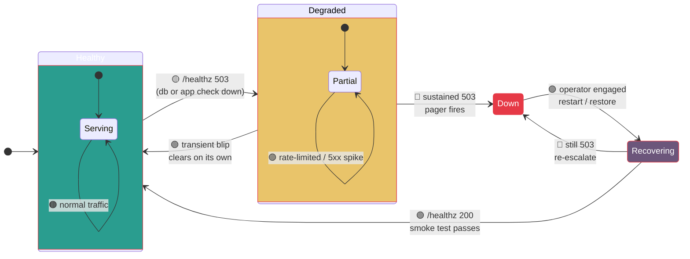

# HACK HAMSTER Portal — On-Call Runbook

> **Hero.** State machine of a healthy portal, and what to do when it isn't. For whoever is paged at 2 a.m. for the portal in `N:\hack-hamster-hackathon` — assume Docker Desktop is running, the `hack-hamster-portal` compose project is up, and you can open Git Bash on `N:`.

## Contents

- [1. Service overview](#1-service-overview)
- [2. Health checks](#2-health-checks)
- [3. Common alerts](#3-common-alerts)
- [4. Where to look](#4-where-to-look)
- [5. Paging](#5-paging)
- [Related docs](#related-docs)

---

## Incident state machine



> **Palette** — `🟢 #2A9D8F` healthy (data store border), `🟡 #E9C46A` degraded (read paths), `🔴 #E63946` down (outline only), `🟣 #6C567B` recovering (domain layer), `🟠 #F4A261` compute.

---

## 1. Service overview

Two containers in `docker compose`: `web` (Django 5.1 + DRF on Gunicorn/runserver) and `db` (PostgreSQL 16). Fronted by whatever reverse proxy terminates TLS. For pitch/architecture, see [`README.md`](../README.md) and [`ARCHITECTURE.md`](../ARCHITECTURE.md).

## 2. Health checks

Single liveness endpoint: `GET /healthz` (mounted in [`config/urls.py:46`](../../config/urls.py), implemented in [`apps/health/views.py`](../../apps/health/views.py)). Runs `SELECT 1` against Postgres:

```json
{"status":"ok","checks":{"app":"ok","db":"ok"},"db_ms":5}
```

Returns **200** when both checks pass. Any DB failure flips `status` to `degraded`, `checks.db` to `down`, adds a `db_error` string, and returns **503**.

From the host:

```bash
curl -sS http://127.0.0.1:8001/healthz
```

If 503, jump to **§3.1**.

Compose also runs an in-container healthcheck pinging `/healthz` every 10s (`docker-compose.yml:48`). Failing healthchecks show `Unhealthy` in `docker compose ps`.

## 3. Common alerts

### 3.1 "DB degraded" — Postgres connection lost

**Symptom:** `/healthz` 503 with `checks.db: down`. `web` is `Restarting` or `Unhealthy`. `docker compose logs web` shows `django.db.utils.OperationalError: could not connect to server`.

**Recovery:**

```bash
cd /n/hack-hamster-hackathon
docker compose restart db
docker compose restart web
```

`db` carries the named volume `pgdata`; restart does **not** lose data. If the cycle repeats and `/healthz` is still 503, confirm the DB actually came up:

```bash
docker compose exec db pg_isready -U hack-hamster -d hack-hamster
docker compose exec db psql -U hack-hamster -c '\l'
```

If `pg_isready` says `no response`, Postgres died — check `docker compose logs db` for panic/OOM. If DB exists but `web` cannot connect, the cause is a stale `POSTGRES_*` in `.env`; fix and `docker compose up -d web` again.

### 3.2 "Rate limit storm" — IP flagged

**Symptom:** A client (or CI runner) sees HTTP **429** with body `{"error":{"code":"rate_limited", ...}}`. `docker compose logs web` shows a flood of `429` from one IP.

The limiter is `RateLimitMiddleware` in [`apps/accounts/middleware.py`](../../apps/accounts/middleware.py). Bucket table is the `LIMITS` dict at [`apps/accounts/middleware.py:84`](../../apps/accounts/middleware.py#L84):

```python
LIMITS = {
    "auth":  (5,  15 * 60),   # 5 / 15min on /api/auth/*
    "read":  (60, 60),        # 60 / min on GETs
    "write": (10, 60),        # 10 / min on POST/PATCH/PUT/DELETE
}
```

Buckets are in-memory and process-local. Fast-path mitigation:

```bash
docker compose restart web
```

If the traffic is legitimate (load test, organizer-OK'd scraper), bump the limit and redeploy:

```bash
# edit apps/accounts/middleware.py -> LIMITS["write"] = (60, 60)
cd /n/hack-hamster-hackathon
docker compose up -d --build web
```

Do **not** raise the limit without confirming the source IP via the audit log (§4).

### 3.3 "Vote 422 storm" — judging window has closed

**Symptom:** Sudden spike of HTTP **422** against `POST /api/events/<slug>/submissions/<id>/vote`. Clients report ballots "stopped going through".

**Cause:** Voting is `@deadline_gated("judging_close_at")` at [`apps/voting/views.py`](../../apps/voting/views.py): community vote runs while judges deliberate and **closes** at the event's `judging_close_at` ([`apps/events/models.py`](../../apps/events/models.py)). Once passed, the decorator returns 422 — votes admitted only while judging is open, results stay hidden until `results_at`.

**Confirm:**

```bash
# the actual meta endpoint is /api/events/<slug>/ (EventDetailView)
curl -sS http://127.0.0.1:8001/api/events/<slug>/ | python -m json.tool
```

Look at `judging_close_at`. If **in the past** and the spike is recent, expected behavior — point users at the event timeline. If still in the future and 422s are firing, the wall clock on `web` is wrong (Django returns UTC); fix with `docker compose exec web date -u` and reconcile the host.

### 3.4 "CSV export 500" — usually a malformed score row

**Symptom:** `GET /api/csv_export?event_slug=<slug>` returns HTTP **500**. Other endpoints on the same event work fine.

The view is `CSVExportView` at [`apps/judging/views.py:314`](../../apps/judging/views.py#L314). It walks every normalized score for the event and emits one CSV row per `(project, criterion, judge)`. A 500 in the streaming generator almost always means a `NULL` where a number is expected, or a constraint that broke between a migration and a fixture.

**Diagnose:**

```bash
docker compose logs --tail=200 web | grep -A 20 csv_export
```

The traceback names the `project_id` (UUID) and field. Pull that row:

```bash
docker compose exec db psql -U hack-hamster -d hack-hamster \
  -c "SELECT * FROM judging_score WHERE project_id='<uuid>';"
```

Patch the row by hand or via `make web-shell`. If structurally fine, the issue is in the serializer — read `apps/judging/views.py` around line 314.

## 4. Where to look

In rough order of usefulness:

1. **Live logs** — `docker compose logs -f web` (or `make logs`). Add `--tail=200` to scroll back. `LOG_LEVEL=DEBUG` in `.env` turns on Django's request log; flip back to `INFO` after.
2. **Postgres shell** — `make db-shell` (i.e. `docker compose exec db psql -U hack-hamster -d hack-hamster`). Schema lives in `public`; tables named `<app>_<model>` (e.g. `judging_score`, `voting_vote`, `events_event`).
3. **Django shell** — `make web-shell` for ad-hoc ORM queries.
4. **Audit table** — every 401/403 on `/api/*` is appended by `AuditMiddleware` ([`apps/accounts/middleware.py:46`](../../apps/accounts/middleware.py#L46)) into `audit_auditevent`, model `AuditEvent` at [`apps/audit/models.py`](../../apps/audit/models.py). Quick query:

   ```sql
   SELECT created_at, action, ip, result
   FROM audit_auditevent
   WHERE created_at > NOW() - INTERVAL '1 hour'
   ORDER BY created_at DESC
   LIMIT 100;
   ```

   UPDATE/DELETE on this table are revoked at the DB level (`apps/audit/migrations/0002_immutable.py`), so a "row went missing" report is never an in-app accident.
5. **Health from outside Docker** — `curl -fsS http://127.0.0.1:8001/healthz` (the host-side bind from `docker-compose.yml:46`).

## 5. Paging

Page the **on-call channel** for:

- **Backend (this runbook):** any item in §3, anything 5xx, anything that takes `/healthz` to 503.
- **Infrastructure:** host disk full, container host down, network partition between `web` and `db`.
- **Security:** suspected cookie theft, unexpected admin actions, or any row in `audit_auditevent` with `result='error'` from an action you do not recognize.

Do **not** page for: scheduled restarts, expected 422s after a deadline, or `make down && make up` after a config bump.

---

## Related docs

- [`docs/DEPLOY.md`](DEPLOY.md) — first-time install, env vars, TLS, scaling.
- [`docs/BACKUP-DR.md`](BACKUP-DR.md) — `pg_dump` schedule, restore procedure, RPO/RTO targets.
- [`docs/BACKEND-IMPL.md`](BACKEND-IMPL.md) — request lifecycle, middleware stack, ORM layers.
- [`README.md`](../README.md) · [`ARCHITECTURE.md`](../ARCHITECTURE.md) — pitch + system diagram.
