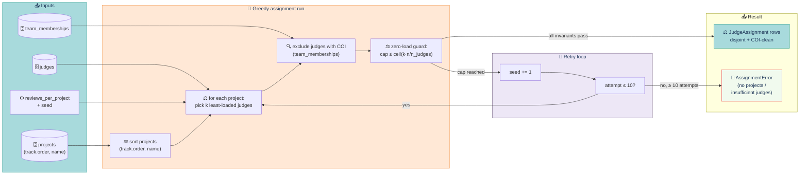

# Test suite — assignment

> **Greedy bipartite judge assignment with COI exclusion, retry-with-seed, and the per-judge zero-load guard.** Tests live in `tests/assignment/test_assignment.py` under `@pytest.mark.assignment`.

## Contents

- [Pipeline at a glance](#pipeline-at-a-glance)
- [What it covers](#what-it-covers)
- [Algorithm](#algorithm)
- [Known drift](#known-drift)
- [Run](#run)

## Pipeline at a glance



## What it covers

Greedy bipartite assignment with COI. Invariants per PLAN.md §3.

| Test | Asserts |
|---|---|
| Disjoint batches | Two runs with different seeds produce non-overlapping JudgeAssignment rows |
| Reviews per project exactly | Each project has exactly `reviews_per_project` assignments |
| Per-judge cap | No judge exceeds `ceil(reviews_per_project × n_projects / n_judges)` |
| COI respected | A judge who is a TeamMember of project X is never assigned to X |
| Insufficient judges (reviews_per_project=3, only 2 judges) | raises AssignmentError |
| Zero projects | raises AssignmentError("Need at least one submitted project.") |
| Cap reached → retries with offset seed | Up to 10 attempts |
| Determinism | Same seed → same assignments across two runs |
| Different seed → different picks | At least some projects change judge |
| Track spread | Each judge covers at least `n_tracks − 1` distinct tracks |
| Status filter | Only `status='submitted'` projects get assigned (withdrawn/draft excluded) |

## Algorithm

Sort projects by (track.order, name). For each project, pick the `reviews_per_project` least-loaded judges with no COI. Retry with offset seed if invariants fail.

## Known drift

- `test_coi_respected_judge_never_reviews_own_team`: Algorithm uses `team_memberships` for the blacklist — verify judge memberships are captured before relying on this.
- `test_same_seed_same_assignments`: Only holds when project and judge sets are identical across runs; depends on deterministic fixture order.
- `test_different_seed_yields_different_picks`: With small fixtures (10 projects, 3 judges), greedy can converge on identical picks regardless of seed. Test should assert not-equal under a stress fixture.

## Run

```bash
make test-assignment
```

---

[← Back to TESTING.md](TESTING.md)
