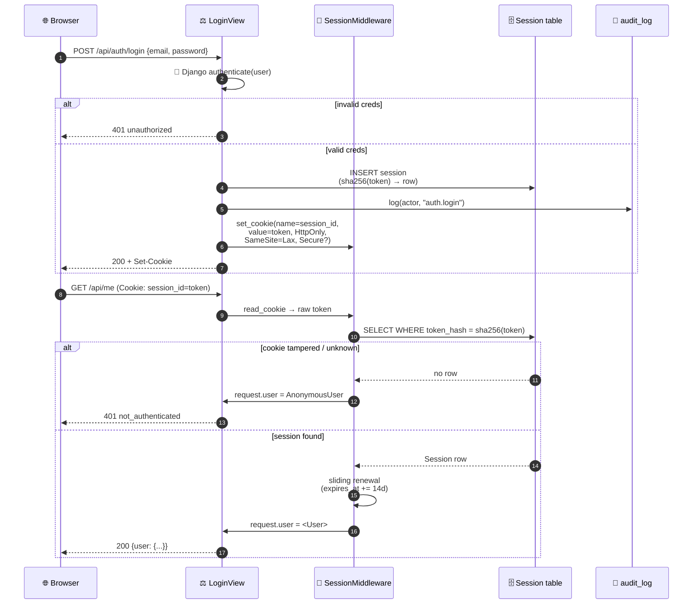

# Test suite — auth

> **Session lifecycle, cookie behaviour, register/login/logout.** Tests live in `tests/auth/test_auth.py` under `@pytest.mark.auth`.

## Contents

- [Login handshake at a glance](#login-handshake-at-a-glance)
- [What it covers](#what-it-covers)
- [Known drift](#known-drift)
- [Run](#run)

## Login handshake at a glance



## What it covers

Session lifecycle, cookie behaviour, register/login/logout.

| Test | Asserts |
|---|---|
| Session lookup | Valid cookie → request.user resolves, is_authenticated=True |
| No cookie | request.user is AnonymousUser, is_authenticated=False |
| Tampered cookie | Random string as cookie → no session found, AnonymousUser |
| Expired session | Session with `expires_at` in the past → purged, subsequent request is anonymous |
| Sliding renewal | Valid session extends `expires_at` by 14 days on each request |
| Register | POST `/api/auth/register` with email+password → 201, session cookie set |
| Login | POST `/api/auth/login` with valid creds → session cookie; wrong password → 401 |
| Logout | POST `/api/auth/logout` (authed) → clears cookie, subsequent request is anonymous |
| Cookie HttpOnly | Login response sets HttpOnly on the cookie |
| Cookie SameSite | Login response sets SameSite=Lax |
| Cookie Secure (DEBUG=False) | When DEBUG is false, the cookie has `Secure` |
| Cookie Secure (DEBUG=True) | When DEBUG is true, the cookie does NOT have `Secure` |

## Known drift

- `test_login_cookie_is_not_secure_when_debug_true`: Settings default DEBUG=false, so the cookie is always Secure unless the test explicitly sets DEBUG=true. Decision pending — either set DEBUG in the test, or flip the test default to true.

## Run

```bash
make test-auth
docker compose exec web pytest tests/auth/ -v
```

---

[← Back to TESTING.md](TESTING.md)
