# Test suite — certificates

> **HMAC-SHA256-signed per-submission certificates: sign, verify, tamper detection, canonical-JSON stability.** Tests live in `tests/certificates/test_certificates.py` under `@pytest.mark.certificates`.

## Contents

- [Issue → sign → verify → tamper at a glance](#issue--sign--verify--tamper-at-a-glance)
- [What it covers](#what-it-covers)
- [HMAC scheme](#hmac-scheme)
- [Known drift](#known-drift)
- [Run](#run)

## Issue → sign → verify → tamper at a glance

```mermaid
flowchart LR
    subgraph I["📥 Issue"]
        direction TB
        O["🧑‍💼 Organizer<br/>POST /api/events/&lt;slug&gt;/certificates/issue"]
        PAY["📦 {submission_id,<br/>team_name, event_slug}"]
    end

    subgraph S["🔏 Sign"]
        direction TB
        CAN["⚖️ canonical_json(payload)<br/>sort_keys + no whitespace"]
        HMAC["⚖️ HMAC-SHA256(<br/>SECRET_KEY, payload)"]
        SIG["📜 signature = hex digest"]
    end

    subgraph DB["🗄️ Postgres"]
        direction TB
        ROW[("certificate row<br/>(public_id, signed_payload,<br/>signature, algorithm)")]
    end

    subgraph V["🔍 Verify"]
        direction TB
        V1["🌐 GET /api/certificates/&lt;public_id&gt;"]
        V2["⚖️ recompute HMAC over stored payload"]
        V3["⚖️ hmac.compare_digest()<br/>(constant-time)"]
    end

    subgraph T["🧪 Tamper test"]
        direction TB
        T1["⚖️ mutate one byte of<br/>signed_payload in DB"]
        T2["🔴 HMAC mismatch → 400<br/>signature_invalid"]
    end

    O --> PAY --> CAN --> HMAC --> SIG --> ROW
    ROW --> V1 --> V2 --> V3
    V3 -->|match| OK["✅ 200 + signature"]
    V3 -->|mismatch| T1 --> T2

    style I fill:#FFE8D6,stroke:#F4A261,color:#1D3557
    style S fill:#EDE7F6,stroke:#6C567B,color:#1D3557
    style DB fill:#A8DADC,stroke:#2A9D8F,color:#1D3557
    style V fill:#FDF6E3,stroke:#E9C46A,color:#1D3557
    style T fill:#F1FAEE,stroke:#E63946,color:#1D3557
    style OK fill:#A8DADC,stroke:#2A9D8F,color:#1D3557
```



## What it covers

HMAC-SHA256-signed per-submission certificates: sign, verify, tamper detection, canonical-JSON stability, view-level roundtrip.

| Test | Asserts |
|---|---|
| Sign + verify | Signed certificate verifies with correct key |
| Wrong key | Different SECRET_KEY fails verification |
| Tampered payload | Mutate one byte of signed_payload → verify() returns False |
| Canonical-JSON stability | Two equivalent dicts (different key order / whitespace) → identical signatures |
| public_id uniqueness | Two issue() calls on different submissions → different public_ids |
| Issue → fetch via view | GET /api/certificates/<public_id> → 200 with signed payload + signature |
| Issue → fetch with tampered public_id | 404 |
| Tampered fetch | GET real cert, mutate DB payload, GET again → 400 `signature_invalid` |
| Public access | Anonymous GET allowed |
| Re-issuing | Two issue() calls on same submission → two distinct Certificate rows |
| Payload schema | submission_id, team_name, event_slug at minimum |
| Signature length | Constant (hex sha256 = 64 chars) |
| Real hmac module matches | Independent computation of HMAC matches our sign_payload |

## HMAC scheme

```
key      = settings.SECRET_KEY (UTF-8)
payload  = canonical-JSON(payload) — sort_keys, no whitespace
sig      = hmac.new(key, payload, hashlib.sha256).hexdigest()
verify   = constant-time hmac.compare_digest(sig, sign_payload(payload))
```

## Known drift

- Fixed: `config/urls.py` mounted `apps.certificates.urls` under `path("api/", ...)` instead of `path("api/certificates/", ...)` — route was `/api/<public_id>`, missing the `certificates/` prefix every other doc reference assumed. The frontend's certificate lookup screen (`web/app/certificates/`) hit this live while wiring against the real backend.

## Run

```bash
make test-certificates
```

---

[← Back to TESTING.md](TESTING.md)
