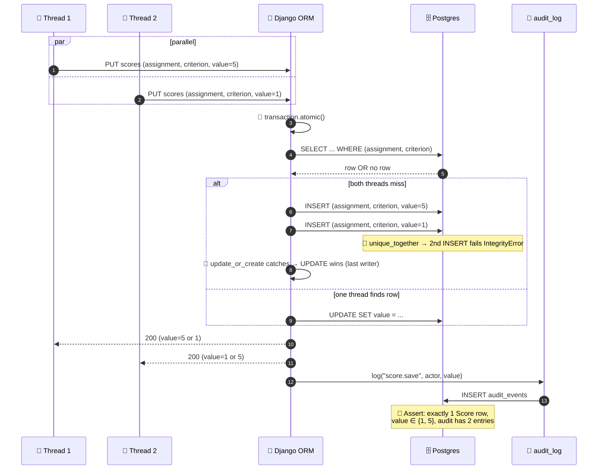

# Concurrency tests

**Role:** Race-condition probes for the portal's save endpoints. Seven tests in `tests/concurrency/test_concurrency.py`, all `@pytest.mark.concurrency`. Proves: `update_or_create` is sufficient under contention, the lock manager is never mocked, every state change is audited.

> Dev server is process-serial (one Django worker), but the test client and ORM both run concurrently when two requests fan out on a thread pool — so the patterns these tests exercise are exactly what would break under real concurrent load.

---

## Contents

- [Race detection at a glance](#race-detection-at-a-glance)
- [How to run](#how-to-run)
- [How concurrency is faked](#how-concurrency-is-faked)
- [Tests](#tests)
- [Why we don't mock the lock manager](#why-we-dont-mock-the-lock-manager)
- [Files](#files)

---

## Race detection at a glance



---

## How to run

```bash
docker compose exec web pytest tests/concurrency/ -v
```

All seven tests pass on a fresh database.

---

## How concurrency is faked

`ThreadPoolExecutor` runs callables in parallel; each sends a request through a Django test `Client`. In-process WSGI dispatch means no true socket-level races, but the ORM is shared between threads — assertions are valid under any interleaving real concurrency would produce.

```python
def _run_in_threads(callables):
    with ThreadPoolExecutor(max_workers=len(callables)) as pool:
        futures = [pool.submit(fn) for fn in callables]
        for f in as_completed(futures):
            f.result()
```

After every parallel block, `connections.close_all()` so pytest-django's transaction rollback isn't fighting open cursors on worker threads.

---

## Tests

### 1. `test_concurrent_score_save_creates_one_row`

**Scenario.** `judge_a` fires two PUTs to `/api/events/<slug>/me/batch/<project>/scores` in parallel, both updating the same `(assignment, criterion)` cell.

**Race.** Two threads race on `Score.objects.update_or_create(assignment=..., criterion=...)`. `unique_together=(assignment, criterion)`. Without `update_or_create`'s internal `atomic()` (Django ≥ 1.11), both threads could find no row, both insert, one silently fails.

**Invariant.** Exactly one `Score` row. Both responses 200.

### 2. `test_concurrent_score_save_last_write_wins`

**Scenario.** Same setup as test 1, but values are 5 and 1.

**Race.** Lost-update: A reads, B reads, both write — final value is whichever `.save()` ran last.

**Invariant.** Persisted `value` ∈ {1, 5}. Not `None`, not the mean. We don't assert which wins — only that there is no corruption.

### 3. `test_concurrent_vote_same_voter_key_collapses`

**Scenario.** Two anonymous POSTs to `/api/events/<slug>/submissions/<id>/vote` from the same `REMOTE_ADDR` + `User-Agent`. `VoteView._voter_key` collapses both to `fp:<sha256(ip + ua)[:32]>`.

**Race.** `unique_together=(event, project, voter_key)`. Two threads each call `Vote.objects.update_or_create(...)` with the same key — the second races the first's INSERT.

**Invariant.** Exactly one `Vote` row with `votes == 1`. `VoteAudit` holds **two** rows — every successful state change appends an entry, regardless of fresh vs pre-existing.

### 4. `test_concurrent_vote_different_voter_keys_creates_two_rows`

**Scenario.** Two anonymous POSTs from different `REMOTE_ADDR`.

**Race.** Same path as test 3, but `voter_key` differs.

**Invariant.** Two `Vote` rows, same project, distinct `voter_key`.

### 5. `test_normalize_two_posts_each_internally_consistent`

**Scenario.** Bipartite `(projects × judges)` connected (judge_a→project_0, judge_b→project_0+1, judge_c→project_1, all criteria scored). Two POSTs to `/api/events/<slug>/normalize` in parallel from the organizer client.

**Race.** `NormalizeView` runs the additive alternating-means fit inside `transaction.atomic`. Each POST creates its own `NormalizationRun` (append-only — no row-level contention). Risk is consistency: identical numbers, per-run counts matching run-level counters.

**Invariant.**

- Two `NormalizationRun` rows.
- Each run's `NormalizedScore.count() == run.n_projects`, `JudgeBias.count() == run.n_judges`.
- Both runs report identical `raw_sigma`, `normalized_sigma`, `n_reviews`, `n_projects`, `n_judges` (same input → same fit).
- Both runs `is_connected = True`.

### 6. `test_webhook_get_during_post_returns_200`

**Scenario.** Organizer client: GET `/api/webhooks` in parallel with POST creating a new webhook for the sample event.

**Race.** GET `SELECT ... FROM webhooks`; POST INSERT. Disjoint rows; GET must not block on POST's row lock.

**Invariant.** GET 200, POST 201, no deadlock / lock-wait timeout.

### 7. `test_concurrent_logins_create_n_sessions`

**Scenario.** Five concurrent POSTs to `/api/login` for the same `participant` user.

**Race.** `LoginView` does `Session.objects.filter(user=user).delete()` then `Session.create(...)` (new `token_hash`). Each login issues a new random token — `token_hash` unique constraint is not the contention point. Risk: delete+insert might drop a write if one thread's delete sweeps another thread's pending insert.

**Invariant.**

- Exactly five `Session` rows for the user.
- `token_hash` values pairwise distinct.
- Each `Set-Cookie` accepted by a follow-up GET `/api/me` (200).

---

## Why we don't mock the lock manager

The threat model relies on `update_or_create` (and its `atomic()`) being sufficient. Mocking the lock manager would let a test pass while production code still has a real race. Tests run against the real Postgres container with `transaction=True` so each test gets its own DB transaction — rather than the single-transaction default that wouldn't tolerate the threads' parallel commits.

---

## Files

- `tests/concurrency/test_concurrency.py` — the seven tests
- `tests/concurrency/factories.py` — local fixtures (event with two projects, single-judge assignment, organizer-auth client, login helper)

---

[← Back to TESTING.md](TESTING.md)
