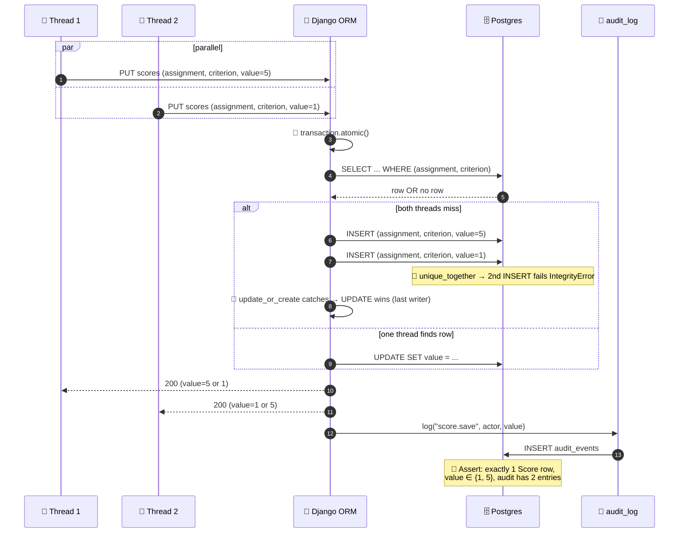

# Concurrency tests

**Role:** Race-condition probes for the hackathon judging portal's save endpoints. Seven tests in `tests/concurrency/test_concurrency.py`, all marked `@pytest.mark.concurrency`. What they prove: the ORM's `update_or_create` is sufficient under contention, no test mocks the lock manager, and every state change is audited.

> **The dev server is process-serial (one Django worker), but the test client and the ORM both run concurrently when we fan two requests out on a thread pool — so the patterns these tests exercise are exactly the ones that would break under real concurrent load.**

---

## Contents

- [Race detection at a glance](#race-detection-at-a-glance)
- [How to run](#how-to-run)
- [How concurrency is faked](#how-concurrency-is-faked)
- [Tests](#tests)
- [Why we don't mock the lock manager](#why-we-dont-mock-the-lock-manager)
- [Files](#files)

---

## Race detection at a glance



---

## How to run

```bash
docker compose exec web pytest tests/concurrency/ -v
```

All seven tests are expected to pass on a fresh database.

---

## How concurrency is faked

`ThreadPoolExecutor` runs two callables in parallel. Each callable sends a request through a Django test `Client`. Django's in-process WSGI dispatch means we're not getting true socket-level races, but the ORM **is** shared between threads, and the assertions below are valid under any reasonable interleaving that real production concurrency would produce.

```python
def _run_in_threads(callables):
    with ThreadPoolExecutor(max_workers=len(callables)) as pool:
        futures = [pool.submit(fn) for fn in callables]
        for f in as_completed(futures):
            f.result()
```

After every parallel block we call `connections.close_all()` so pytest-django's transaction rollback isn't fighting open cursors on worker threads.

---

## Tests

### 1. `test_concurrent_score_save_creates_one_row`

**Scenario.** `judge_a` fires two PUTs to `/api/events/<slug>/me/batch/<project>/scores` in parallel, both updating the same `(assignment, criterion)` cell.

**Race simulated.** Two threads race on `Score.objects.update_or_create(assignment=..., criterion=...)`. The table has `unique_together=(assignment, criterion)`. Without the internal `atomic()` block that `update_or_create` carries since Django 1.11, both threads could find no row, both could insert, and one insert would silently fail.

**Expected invariant.** Exactly one `Score` row exists after both PUTs. Both responses are HTTP 200.

### 2. `test_concurrent_score_save_last_write_wins`

**Scenario.** Same setup as test 1, but the two PUTs carry *different* values (5 and 1) for the same criterion.

**Race simulated.** The classic lost-update: thread A reads, thread B reads, both write — the final value is whichever `.save()` ran last, not a blended or default value.

**Expected invariant.** The persisted `value` is one of {1, 5}. Not a default like `None`, not the arithmetic mean. We don't assert *which* value wins — the assertion is the weaker (and only meaningful) one: there is no corruption.

### 3. `test_concurrent_vote_same_voter_key_collapses`

**Scenario.** Two anonymous POSTs to `/api/events/<slug>/submissions/<id>/vote` from the same `REMOTE_ADDR` and `User-Agent`. In `VoteView._voter_key`, both collapse to the same `fp:<sha256(ip + ua)[:32]>` string.

**Race simulated.** The vote table has `unique_together=(event, project, voter_key)`. Two threads each call `Vote.objects.update_or_create(...)` with the same key — the second one would race the first's INSERT.

**Expected invariant.** Exactly one `Vote` row exists with `votes == 1`. The `VoteAudit` table holds **two** rows — every successful state change appends an audit entry, regardless of whether the underlying ballot row is fresh or pre-existing.

### 4. `test_concurrent_vote_different_voter_keys_creates_two_rows`

**Scenario.** Two anonymous POSTs from different `REMOTE_ADDR` values.

**Race simulated.** Same `update_or_create` path as test 3, but the `voter_key` differs, so the rows are distinct.

**Expected invariant.** Two `Vote` rows exist, both with the same project. The `voter_key` column differs between them.

### 5. `test_normalize_two_posts_each_internally_consistent`

**Scenario.** With the bipartite `(projects × judges)` connected (judge_a on project_0, judge_b on project_0 + project_1, judge_c on project_1, all criteria scored), two POSTs to `/api/events/<slug>/normalize` are fired in parallel from the organizer's client.

**Race simulated.** `NormalizeView` runs the additive alternating-means fit inside `transaction.atomic`. Two concurrent POSTs each create their own `NormalizationRun` row (no row-level contention, since the runs are append-only by design). The risk is not a write conflict — it's a *consistency* one: do both runs produce the same numbers, and do the per-run row counts (`NormalizedScore`, `JudgeBias`) line up with the run-level counters?

**Expected invariant.**

- Two `NormalizationRun` rows exist.
- Each run's `NormalizedScore.count() == run.n_projects` and `JudgeBias.count() == run.n_judges`.
- Both runs report identical `raw_sigma`, `normalized_sigma`, `n_reviews`, `n_projects`, `n_judges` (same input -> same fit).
- Both runs have `is_connected = True`.

### 6. `test_webhook_get_during_post_returns_200`

**Scenario.** From the organizer's client, a GET on `/api/webhooks` is fired in parallel with a POST that creates a new webhook for the sample event.

**Race simulated.** The GET does `SELECT ... FROM webhooks`; the POST does an INSERT. They touch disjoint rows in the table, so the GET must not block behind the POST's row lock.

**Expected invariant.** GET returns 200, POST returns 201, no deadlock or lock-wait timeout.

### 7. `test_concurrent_logins_create_n_sessions`

**Scenario.** Five concurrent POSTs to `/api/login` for the same `participant` user.

**Race simulated.** `LoginView` does `Session.objects.filter(user=user).delete()` and then `Session.create(...)` (which inserts a new row with a fresh `token_hash`). Each login issues a *new* random token — so the unique constraint on `token_hash` is not a contention point. The risk is that the sequential delete+insert might silently drop a write if one thread's delete sweeps the row another thread is about to insert.

**Expected invariant.**

- Exactly five `Session` rows exist for the user.
- The five `token_hash` values are pairwise distinct.
- Each round-trip's `Set-Cookie` value is accepted by a follow-up GET on `/api/me` (returns 200).

---

## Why we don't mock the lock manager

The hackathon's threat model relies on the ORM's `update_or_create` (and its internal `atomic()`) being sufficient for the upserts we do. Mocking the lock manager would let a test pass while the production code still has a real race; we want to exercise the actual DB-level behavior, so the tests run against the real Postgres container with `transaction=True` so each test gets its own DB transaction (rather than the single-transaction default that wouldn't tolerate the parallel commits the threads issue).

---

## Files

- `tests/concurrency/test_concurrency.py` — the seven tests
- `tests/concurrency/factories.py` — local fixtures (event with two projects, single-judge assignment, organizer-auth client, login helper)

---

[← Back to TESTING.md](TESTING.md)
