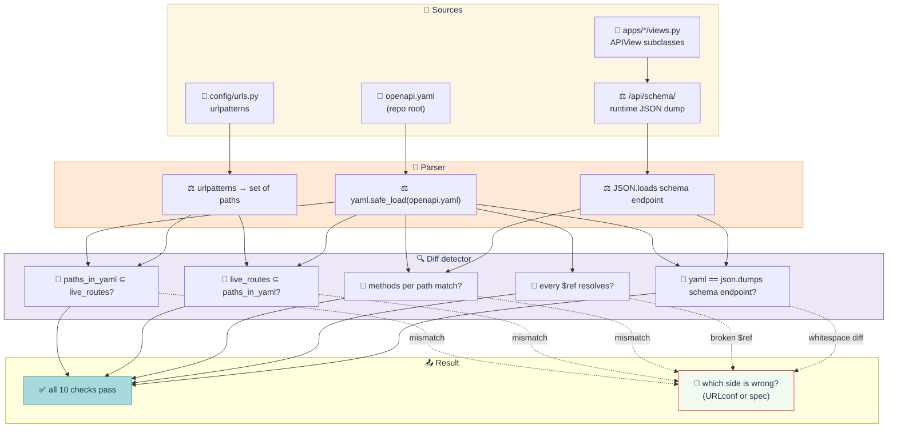

# Test suite — OpenAPI conformance

> **`openapi.yaml` at repo root + `/api/schema/` accurately describe the live endpoints.** Tests live in `tests/conformance/test_openapi.py` under `@pytest.mark.conformance`. The API First bonus artefact.

## Contents

- [URLconf vs openapi.yaml — diff detector at a glance](#urlconf-vs-openapiyaml--diff-detector-at-a-glance)
- [What it covers](#what-it-covers)
- [Known drift](#known-drift)
- [Run](#run)

## URLconf vs openapi.yaml — diff detector at a glance



## What it covers

`openapi.yaml` at repo root + `/api/schema/` accurately describe the live endpoints. The API First bonus artefact.

| Test | Asserts |
|---|---|
| /api/schema/ valid OpenAPI 3 | Has `openapi: 3.0.3`, `info.title`, `info.version`, `paths` |
| openapi.yaml matches /api/schema/ | JSON served by view equals YAML loaded + dumped |
| All paths in spec exist | For each path in `spec['paths']`, GET → 200 or 401/403/404 |
| No undocumented paths | For each path in urlpatterns, must be in `spec['paths']` |
| Spec endpoints have correct methods | GET /api/gallery, POST /api/events/<slug>/submit, etc. |
| Security scheme referenced | `cookie` referenced where required |
| Schemas referenced | Submission, Certificate, Error used by at least one response |
| No broken $ref | Each `$ref` resolves to a defined schema |

## Known drift

- `test_yaml_matches_schema_endpoint`: JSON formatting (key order, whitespace) differs from YAML — compare structurally, not by string.
- `test_all_spec_paths_exist_on_running_service`: 401 with no auth is acceptable. Some spec paths may not be implemented yet (e.g., T3/T4 endpoints).
- `test_no_undocumented_paths_in_urlconf`: All Django urlpatterns must appear in spec. Run before each release.

## Run

```bash
make test-conformance
```

---

[← Back to TESTING.md](TESTING.md)
