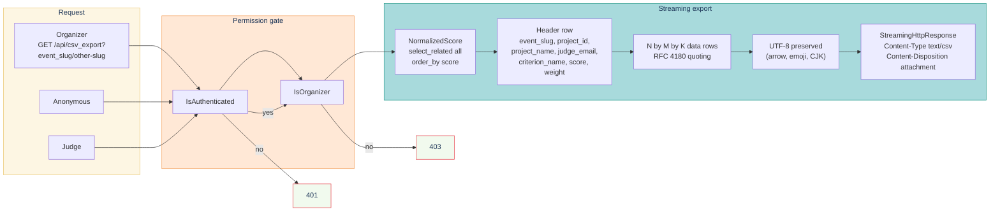

# Test suite — CSV

> **Streaming CSV export from `apps.judging.views.CSVExportView`.** Tests live in `tests/csv/test_csv_export.py` under `@pytest.mark.csv`. Comma-separated, RFC 4180 quoting, unicode-preserving, organizer-only.

## Contents

- [Stream at a glance](#stream-at-a-glance)
- [What it covers](#what-it-covers)
- [Known drift](#known-drift)
- [Run](#run)

## Stream at a glance



## What it covers

Streaming CSV export from `apps.judging.views.CSVExportView`.

| Test | Asserts |
|---|---|
| Shape | Header + N×M×K data rows |
| Header columns | event_slug, project_id, project_name, judge_email, criterion_name, score, weight |
| CSV dialect | Comma-separated, RFC 4180 quoting |
| Special characters | Commas/quotes/newlines in names → properly quoted |
| Unicode (→, emoji) | UTF-8 preserved |
| Empty event | Header row only |
| Streaming | StreamingHttpResponse, Content-Type: text/csv |
| Content-Disposition | `attachment; filename="scores-<slug>.csv"` |
| Organizer-only | Non-organizer → 403 |
| Anonymous | 401 |
| Multi-event | `?event_slug=<other>` returns that event |
| Weight column | Reflects criterion.weight |
| ?event_slug missing | Defaults to organizer's only event |

## Known drift

- `test_unicode_arrow_in_project_name`: csv writer may quote `→` differently; pass `utf-8` explicitly if needed.
- `test_non_organizer_gets_403`: View returns 422 (validation, missing `?event_slug` for non-organizers) before the organizer check. Reorder: organizer first, then event resolution.

## Run

```bash
make test-csv
```

---

[← Back to TESTING.md](TESTING.md)
