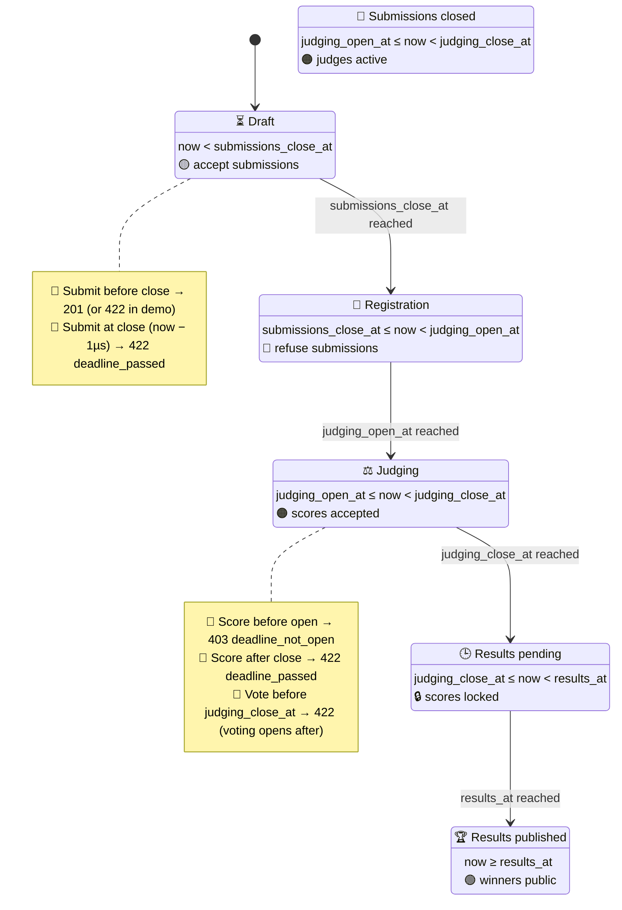

# Test suite — deadlines

> **Boundary conditions on `submissions_close_at`, `judging_open_at`, `judging_close_at`.** Tests live in `tests/deadlines/test_deadlines.py` under `@pytest.mark.deadlines`. Just-before / at / just-after each.

## Contents

- [State machine at a glance](#state-machine-at-a-glance)
- [What it covers](#what-it-covers)
- [Run](#run)

## State machine at a glance



## What it covers

Boundary conditions on `submissions_close_at`, `judging_open_at`, `judging_close_at`. Just-before / at / just-after each.

| Test | Asserts |
|---|---|
| Submission before close | 201 accepted (in demo event submissions are closed, asserts the opposite: 422) |
| Submission exactly at close (now − 1µs) | 422 `deadline_passed` |
| Judging before open | 403 `deadline_not_open` |
| Judging after close | 422 `deadline_passed` |
| Judging exactly at close (now − 1µs) | 422 `deadline_passed` |
| Voting before `judging_close_at` | 422 (voting opens at `judging_close_at`) |
| Event.state() — draft | `now < open_at` |
| Event.state() — registration | `open_at ≤ now < submissions_close_at` |
| Event.state() — submissions_closed | `submissions_close_at ≤ now < judging_open_at` |
| Event.state() — judging | `judging_open_at ≤ now < judging_close_at` |
| Event.state() — results_pending | `judging_close_at ≤ now < results_at` |
| Event.state() — results_published | `now ≥ results_at` |
| Validation | `submissions_close_at ≤ open_at` raises `ValidationError` on `clean()` |

Uses `freezegun` to control `now()` for the state machine tests.

## Run

```bash
make test-deadlines
```

---

[← Back to TESTING.md](TESTING.md)
