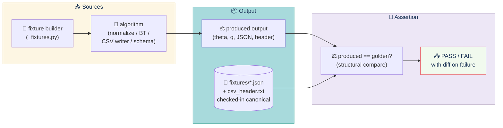

# Golden-file tests

**Role:** Pins the platform's behaviour against known-good outputs. When an algorithm drifts (the additive fit converging to the wrong q, the BT fit landing in a different ordering, the CSV header silently renamed), this suite fails CI loudly instead of silently corrupting a downstream judge's report.

> **`tests/golden/` is the suite that pins the platform's behaviour against known-good outputs.** It exists so that an algorithmic drift (the additive fit converging to the wrong q, the BT fit landing in a different ordering, the CSV header silently renamed) fails CI loudly instead of silently corrupting a downstream judge's report.

---

## Contents

- [Loop at a glance](#loop-at-a-glance)
- [What it covers](#what-it-covers)
- [How to run](#how-to-run)
- [How to regenerate a golden](#how-to-regenerate-a-golden)
- [When to regenerate](#when-to-regenerate)
- [When a failure is a regression (not a regenerate)](#when-a-failure-is-a-regression-not-a-regenerate)
- [Tie-breaking note](#tie-breaking-note)
- [Marker discipline](#marker-discipline)
- [Files in this directory](#files-in-this-directory)

---

## Loop at a glance



---

## What it covers

| Golden | What it asserts | Fixture |
|---|---|---|
| Normalization output | `apps.normalization.fit.normalize()` on a 30-review deterministic input produces the canonical FitResult. | `tests/golden/fixtures/normalization_output.json` |
| Normalization input shape | The 30-review fixture builder stays at 30 cells × 10 projects × 3 judges. | n/a (asserts the builder directly) |
| Bradley-Terry output | `apps.pairwise.fit.bradley_terry()` on 20 unanimous synthetic ballots produces the canonical theta / ranking. | `tests/golden/fixtures/bt_output.json` |
| BT input shape | The 20-ballot fixture builder stays at 20 ballots. | n/a (asserts the builder directly) |
| Role-isolation matrix | The canonical grid of `actor × cell → status` parsed from `role-isolation-matrix.txt` matches the live parse; key invariants hold. | `tests/golden/fixtures/role_isolation.json` |
| Acceptance report | The canonical 7-check parse of `acceptance-report.txt` matches; every check is PASS in the baseline. | `tests/golden/fixtures/acceptance.json` |
| OpenAPI minimal | The path list returned by `/api/schema/` is a superset of the canonical paths; per-endpoint response shapes match. | `tests/golden/fixtures/openapi_minimal.json` |
| CSV header | The first line of the CSV export equals the stored literal byte-for-byte. | `tests/golden/fixtures/csv_header.txt` |

The deterministic fixtures (`build_normalization_input()` and `build_bt_input()` in `tests/golden/_fixtures.py`) are themselves part of the golden contract: changing them without regenerating the goldens breaks the suite.

---

## How to run

From the repo root:

```sh
docker compose exec web pytest tests/golden/ -v
```

Expected output:

```
collected 9 items
tests/golden/test_golden.py .........                                    [100%]
9 passed
```

The suite is pure-Python. It does not need a Postgres database, a running portal, or any HTTP fixtures from the root `tests/conftest.py` — a local `conftest.py` in `tests/golden/` overrides the autouse DB fixture to a no-op. Run time is well under a second.

---

## How to regenerate a golden

Golden files are checked in. The regenerate script lives at `tests/golden/_regenerate.py`; it is the **only** supported way to refresh a fixture.

```sh
docker compose exec -T web python tests/golden/_regenerate.py
```

What it does:

1. Runs `normalize()` on the deterministic 30-review input and writes `normalization_output.json`.
2. Runs `bradley_terry()` on the 20-ballot input and writes `bt_output.json`.
3. Parses the existing `role-isolation-matrix.txt` and writes `role_isolation.json`.
4. Parses the existing `acceptance-report.txt` and writes `acceptance.json`.
5. Calls `apps.api.views._openapi_spec()` and writes `openapi_minimal.json`.
6. Re-asserts the CSV header literal against `apps/judging/views.py` and writes `csv_header.txt`.

The script is idempotent. Re-running overwrites every fixture.

---

## When to regenerate

You regenerate a golden only when the underlying behaviour has **intentionally** changed. Each case is different:

### Algorithm changed (legit)

If `apps/normalization/fit.py` or `apps/pairwise/fit.py` was edited to fix a real bug, change the convergence criterion, or switch to a different regularisation, the goldens will fail in CI. Investigate the diff, confirm the change is correct, then regenerate:

```sh
docker compose exec -T web python tests/golden/_regenerate.py
git add tests/golden/fixtures/
git commit -m "test(golden): regenerate after <change>"
```

### Schema drift (cosmetic, allowed)

OpenAPI descriptions, example values, and minor wording changes **do not** require a golden update — the minimal schema fixture only checks paths and response-shape keys. If a test starts failing on a description change, fix the test to be less strict; do not regenerate.

### Role or route change (substantive)

If a permission or route is added/removed, the role-isolation golden **does** need to be re-parsed. Regenerate after re-running the live `role_isolation_matrix.py` and `acceptance.py` against the new portal.

---

## When a failure is a regression (not a regenerate)

The goldens are designed to fail loudly on real regressions. The failure modes:

- `normalize()` converges to a different q (different rank ordering, different bias estimates) → real regression in the algorithm.
- `bradley_terry()` recovers a different theta or different ranking → real regression in the MM iteration or the phantom-prior.
- `role_isolation.json` shows an actor missing/added → the test event changed; investigate before regenerating.
- `acceptance.json` shows a check flipped to FAIL → the platform has regressed; do not regenerate, fix the underlying check.
- `openapi_minimal.json` shows a path missing → a route was removed; this is a breaking change for integrators. Investigate.
- `csv_header.txt` shows the columns drifted → CSV consumers will break. Investigate before regenerating.

The rule: **if a test fails, the algorithm or surface changed in a way that is wrong until proven otherwise.** Regenerating is the proof.

---

## Tie-breaking note

`apps.normalization.fit.normalize()` iterates `projects: set[str]` when computing ranks. Python sets are hash-randomised across processes (`PYTHONHASHSEED`), so the iteration order — and therefore the within-tie-group rank assignment — varies between runs.

The golden test handles this by asserting **rank consistency**, not exact rank equality: a project with a strictly higher adjusted score must have a strictly lower rank number; projects with equal adjusted may have any rank ordering within their tie group. This means the suite is stable across `PYTHONHASHSEED=0` and `PYTHONHASHSEED=42`, which we verify before committing.

---

## Marker discipline

Every test in this suite carries `@pytest.mark.golden`. The marker is registered in `pytest.ini`. To run only the golden suite, invoke pytest with the marker selector:

```sh
docker compose exec web pytest -m golden -v
```

To skip the golden suite (e.g., during a long refactor):

```sh
docker compose exec web pytest -m "not golden" -v
```

---

## Files in this directory

```
tests/golden/
├── __init__.py                  # pytest package marker
├── conftest.py                  # local fixture overrides (no-DB)
├── _fixtures.py                 # deterministic input builders
├── _regenerate.py               # goldens regeneration script
├── test_golden.py               # the test suite itself
└── fixtures/
    ├── __init__.py
    ├── normalization_output.json
    ├── bt_output.json
    ├── role_isolation.json
    ├── acceptance.json
    ├── openapi_minimal.json
    └── csv_header.txt
```

The `_` prefix on `_fixtures.py` and `_regenerate.py` keeps pytest from collecting them as tests.

---

[← Back to TESTING.md](TESTING.md)
