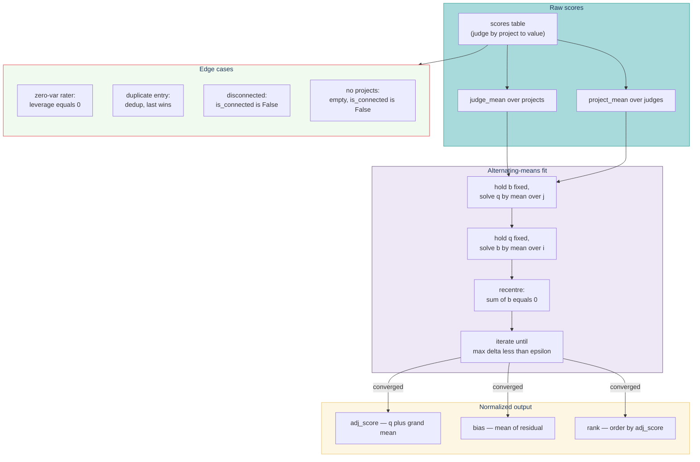

# Test suite — normalization

> **Additive alternating-means fit.** Tests live in `tests/normalization/test_normalization.py` under `@pytest.mark.normalization`. Edge cases per PLAN.md §4 — zero-variance raters, incomplete batches, duplicate entries, disconnected graphs.

## Contents

- [Fit at a glance](#fit-at-a-glance)
- [What it covers](#what-it-covers)
- [Mathematical note](#mathematical-note)
- [Run](#run)

## Fit at a glance



## What it covers

Additive alternating-means fit. Edge cases per PLAN.md §4.

| Test | Asserts |
|---|---|
| Zero-variance rater | leverage = 0, bias = grand_mean − mean(constant) |
| Incomplete batch | Fit converges; σ non-zero on partial design |
| Duplicate entry | Dedup at ingest; later value wins |
| Disconnected bipartite graph | is_connected=False returned |
| Single project (1 × N judges) | σ = 0 vacuously |
| No projects | 0 scores, is_connected=False |
| All identical scores | σ_raw = 0, σ_norm = 0, all tied at rank 1 |
| Rank movement stability | movement = raw_rank − adj_rank reported correctly in proof |
| Weight matters | Weighted-mean match produces equal adj_rank |
| Negative bias | Judge scoring below mean has bias < 0 |
| Convergence within 1000 iterations | iterations ≤ 1000 |
| Sum-to-zero recentring | sum(b) = 0 |
| **Unbalanced bipartite moves ranks** | A judge with one-side leverage produces non-trivial bias; every project's adjusted mean differs from raw |
| **Demo fixture is balanced** | Pins the cause of "delta = 0" in `normalization-proof.txt` — full bipartite coverage means additive normalization is a no-op on ranks (mathematically correct) |

## Mathematical note

The fit minimizes residual sum of squares for `y_ij = μ + b_j + q_i + ε` subject to `Σb = 0` (identifiability). The alternating-means algorithm is Gauss-Seidel: hold b fixed, solve for q by averaging; then hold q fixed, solve for b by averaging; then re-centre. Convergence is guaranteed for connected bipartite graphs.

## Run

```bash
make test-normalization
```

---

[← Back to TESTING.md](TESTING.md)
