# Performance Tests

**Role:** Latency ceilings, leak detection, concurrency robustness. Six tests in `tests/performance/test_load.py`, all `@pytest.mark.performance`. Total runtime on a clean dev machine: **~30–60 seconds** (dominated by the 1 000-request gallery/healthz loops and the 10-worker concurrent run).

> Six tests in `tests/performance/test_load.py`, all `@pytest.mark.performance`. Total runtime on a clean dev machine: ~30–60 seconds.

---

## Contents

- [Load test phases at a glance](#load-test-phases-at-a-glance)
- [How to run](#how-to-run)
- [Per-test reference](#per-test-reference)
- [Baselines and budgets](#baselines-and-budgets)
- [What this suite does NOT cover](#what-this-suite-does-not-cover)

---

## Load test phases at a glance

```mermaid
gantt
    title Performance load phases (per test)
    dateFormat X
    axisFormat %s

    section gallery (1k GETs)
    Warmup (50 reqs)        :a1, 0, 5
    Load (1000 reqs)        :a2, after a1, 30
    Cooldown (drain pool)   :a3, after a2, 5

    section healthz (1k GETs)
    Warmup                  :b1, 0, 3
    Load                    :b2, after b1, 20
    Cooldown                :b3, after b2, 2

    section judge_scores (100 GETs)
    Warmup                  :c1, 0, 2
    Load                    :c2, after c1, 10
    Cooldown                :c3, after c2, 1

    section csv_export (100 GETs)
    Warmup                  :d1, 0, 2
    Load (streaming drain)  :d2, after d1, 15
    Cooldown                :d3, after d2, 1

    section concurrent_gallery (10×100)
    Warmup (workers up)     :e1, 0, 5
    Load (10 workers)       :e2, after e1, 40
    Cooldown                :e3, after e2, 5

    section response_size (5×200)
    Warmup                  :f1, 0, 3
    Load (5 blocks)         :f2, after f1, 25
    Cooldown                :f3, after f2, 2
```



What they catch:

- Gallery hot path regressing past the 100 ms average ceiling.
- `/healthz` DB roundtrip regressing past 50 ms — canary for ORM + psycopg + per-request overhead.
- Judge-scores endpoint silently adding a query or losing a `select_related` (no hard threshold; reports trend).
- CSV export path missing its streaming budget — any single request > 1 s is a bug.
- Concurrency regression where one in ten gallery reads 5xx under ten-way load.
- Object-lifetime leak in the gallery serializer showing as monotonic response-size growth across 1 000 requests.

This suite is **opt-in**. Excluded from default run via `pytest -m "not performance"`.

---

## How to run

```bash
docker compose exec web pytest tests/performance/ -v
docker compose exec web pytest -m performance -v
docker compose exec web pytest -m "not performance" -v
docker compose exec web pytest tests/performance/ -v -k gallery_load
```

The `performance` marker is registered in `tests/performance/conftest.py` via `pytest_configure`, not the top-level `pytest.ini` — local to this tier, doesn't pollute the shared marker list. With `--strict-markers`, every marker must be registered before collection; the local registration satisfies that without touching the shared file.

Each test prints a one-line `[perf]` summary under `-s` or `-v`. Compare numbers run-over-run.

---

## Per-test reference

### `test_gallery_load_average_under_100ms`

**1 000 sequential GETs against `/api/gallery`.** Average per-request latency stays under 100 ms; reports median, p99, min, max.

**Target.** Gallery is the only public spec route, fetched by the embeddable widget on every page load, polled first by `acceptance.py`. 100 ms is the "feels fast" floor.

**Result.** Clean: `[perf] gallery: n=1000 avg=4.12ms p50=3.9ms p99=8.7ms min=2.1ms max=22.4ms`. Average past 100 ms → check `p99` next. High `p99` with normal average: intermittent N+1 query. Uniformly-elevated average: missing index on `submissions.status` / `submissions.track_id`.

### `test_healthz_load_average_under_50ms`

**1 000 GETs against `/healthz`.** Average stays under 50 ms.

**Target.** `/healthz` runs `SELECT 1` per request. The 50 ms ceiling captures ORM + psycopg + the full request/response cycle with no business logic. A 30 ms healthz regression ≈ 30 ms regression on the slowest read endpoint.

**Result.** Clean: `[perf] healthz: n=1000 avg=2.41ms p99=6.10ms min=1.80ms max=11.20ms`. Expected baseline: single-digit ms. Past 20 ms average: suspect psycopg connection-pool churn or in-process rate-limiter bucket logic doing a write per request.

### `test_judge_scores_load_average_latency`

**100 GETs against `/api/judge/scores` with the `judge_a` cookie.** Observational — no hard threshold.

**Target.** Trend detection: average jumping between runs without a code change means the view is doing an extra query or losing a `select_related`.

**Result.** Clean: `[perf] judge_scores: n=100 avg=2.10ms p99=4.80ms min=1.60ms max=6.30ms`. Single-digit ms on a seeded event with one team and two criteria; scales roughly linearly with score count on denser events.

### `test_csv_export_under_1s_per_request`

**100 GETs against `/api/csv_export` with the `organizer` cookie.** Each request < 1 s.

**Target.** `StreamingHttpResponse` joins all normalized scores and streams row-by-row. 1 s ceiling = "the organizer does not perceive the button as broken". A single request > 1 s almost always means unbounded queryset or dropped `select_related`.

**Result.** Clean: `[perf] csv_export: n=100 avg=18.30ms max=42.10ms bytes_total=48200`. The test drains the streaming body before stopping the timer, so average includes serialization cost. Max spikes past 200 ms with flat average: single cold query (prepared-statement cache miss after a long pause).

### `test_concurrent_gallery_all_200_no_5xx`

**10 workers × 100 GETs against `/api/gallery` = 1 000 concurrent reads.** Every response 200; no 5xx tolerated.

**Target.** Catches what single-threaded suites can't: Django connection-pool starvation, `select_for_update` accidentally applied to a read, serializer that explodes on a non-main-thread request.

**Result.** `pytest.mark.django_db(transaction=True)` so each worker sees a committed DB view; without it, `pytest-django`'s savepoint wrapping is invisible to worker connections. Each worker calls `connections.close_all()` before returning. Clean: `[perf] concurrent_gallery: workers=10 per_worker=100 total=1000 200=1000 5xx=0 other=[]`. Any 5xx is a hard fail.

### `test_gallery_response_size_stable`

**Five blocks of 200 GETs against `/api/gallery`.** Last block's average size within 20 % of the first block's.

**Target.** Monotonic growth across many requests = object-lifetime leak (queryset caching previous response, serializer building unfreed dict, list-comp doubling length each iteration). 20 % tolerance covers Postgres TOAST and JSON-encoder object-pool variance.

**Result.** Clean: `[perf] response_size_growth: blocks=5 means=['2410', '2412', '2411', '2410', '2411'] first=2410B last=2411B growth=0.04%`. Past 5 % growth on a stable codebase: suspect a new field on `SubmissionSummarySerializer` loading related rows lazily.

---

## Baselines and budgets

Budgets in `test_load.py` are ceilings; baselines (above per test) are what healthy runs print.

- A **budget** is a hard fail point — crossing it means regression.
- A **baseline** is the run-over-run comparison. ±15 % variance is normal on shared CI hardware.

If numbers are above baseline but below budget, capture in the perf-trend doc and continue. Crossing a budget → investigate; the fix is rarely "raise the budget". Budgets are tight on purpose.

---

## What this suite does NOT cover

- **Network latency.** In-process Django test client removes nginx / gunicorn / TCP overhead. For end-to-end, run `acceptance.py` against the live compose stack.
- **Production-scale data.** Standard `sample_event` fixture (one team, one submission). Seed the dev DB with `docker compose exec web python manage.py seed_fixtures` for heavier stress.
- **Write-path performance.** Voting, normalization, pairwise, certificates are write-heavy and deadline-gated; budgets belong in per-feature suites.
- **Memory in bytes.** Response-size growth is a leak proxy. For precise RSS or per-line allocation tracking, run under `tracemalloc` outside pytest.

---

[← Back to TESTING.md](TESTING.md)
