# Performance Tests

**Role:** Latency ceilings, leak detection, concurrency robustness. Six tests in `tests/performance/test_load.py`, all marked `@pytest.mark.performance`. Total runtime on a clean dev machine: **~30–60 seconds** (dominated by the 1 000-request gallery/healthz loops and the 10-worker concurrent run).

> **Six tests in `tests/performance/test_load.py`, all marked `@pytest.mark.performance`.** Total runtime on a clean dev machine: **~30–60 seconds** (dominated by the 1 000-request gallery/healthz loops and the 10-worker concurrent run).

---

## Contents

- [Load test phases at a glance](#load-test-phases-at-a-glance)
- [How to run](#how-to-run)
- [Per-test reference](#per-test-reference)
- [Baselines and budgets](#baselines-and-budgets)
- [What this suite does NOT cover](#what-this-suite-does-not-cover)

---

## Load test phases at a glance

```mermaid
gantt
    title Performance load phases (per test)
    dateFormat X
    axisFormat %s

    section gallery (1k GETs)
    Warmup (50 reqs)        :a1, 0, 5
    Load (1000 reqs)        :a2, after a1, 30
    Cooldown (drain pool)   :a3, after a2, 5

    section healthz (1k GETs)
    Warmup                  :b1, 0, 3
    Load                    :b2, after b1, 20
    Cooldown                :b3, after b2, 2

    section judge_scores (100 GETs)
    Warmup                  :c1, 0, 2
    Load                    :c2, after c1, 10
    Cooldown                :c3, after c2, 1

    section csv_export (100 GETs)
    Warmup                  :d1, 0, 2
    Load (streaming drain)  :d2, after d1, 15
    Cooldown                :d3, after d2, 1

    section concurrent_gallery (10×100)
    Warmup (workers up)     :e1, 0, 5
    Load (10 workers)       :e2, after e1, 40
    Cooldown                :e3, after e2, 5

    section response_size (5×200)
    Warmup                  :f1, 0, 3
    Load (5 blocks)         :f2, after f1, 25
    Cooldown                :f3, after f2, 2
```



What they catch:

- The gallery hot path (the public read endpoint every widget hits on every page load) regressing past the 100 ms average ceiling.
- The `/healthz` DB roundtrip regressing past the 50 ms ceiling — this is the canary for ORM + psycopg + per-request overhead before any business logic runs.
- The judge-scores endpoint silently adding an extra query or losing a `select_related` (no hard threshold; reports trend).
- The CSV export path missing its streaming budget — any single request that takes longer than 1 s is a bug.
- A concurrency regression where one in ten gallery reads 5xx under ten-way load.
- An object-lifetime leak in the gallery serializer showing up as monotonic response-size growth across 1 000 requests.

This suite is **opt-in**. It is excluded from the default run via `pytest -m "not performance"`. See *How to run* below.

---

## How to run

```bash
# All performance tests
docker compose exec web pytest tests/performance/ -v

# Marker-based selection
docker compose exec web pytest -m performance -v
docker compose exec web pytest -m "not performance" -v

# Single test
docker compose exec web pytest tests/performance/ -v -k gallery_load
```

The `performance` marker is registered in `tests/performance/conftest.py` via `pytest_configure` rather than the top-level `pytest.ini`, so the marker is local to this tier and does not pollute the shared marker list. With `--strict-markers` turned on in `pytest.ini`, every marker must be registered before collection — the local registration satisfies that without touching the shared file.

Each test prints a one-line `[perf]` summary under `-s` or `-v` output. Look for the `[perf]` lines in the test logs to compare numbers run-over-run.

---

## Per-test reference

### `test_gallery_load_average_under_100ms`

**1 000 sequential GETs against `/api/gallery`.** Asserts the average per-request latency stays under 100 ms and reports the median, p99, min, and max.

**What we're targeting.** The gallery is the only public spec route, the one the embeddable widget fetches on every page load, and the endpoint `acceptance.py` polls first. 100 ms is the floor of "feels fast" — anything past that and the widget starts to feel sluggish on slow networks.

**How to read the result.** A clean run on a developer laptop prints something like `[perf] gallery: n=1000 avg=4.12ms p50=3.9ms p99=8.7ms min=2.1ms max=22.4ms`. If the average climbs past 100 ms, look at `p99` next — a high `p99` with a normal average points at an N+1 query surfacing intermittently; a uniformly-elevated average points at a missing index on `submissions.status` / `submissions.track_id`.

### `test_healthz_load_average_under_50ms`

**1 000 GETs against `/healthz`.** Asserts the average per-request latency stays under 50 ms.

**What we're targeting.** `/healthz` runs `SELECT 1` on every request. The 50 ms ceiling captures ORM + psycopg + the full request/response cycle with no business logic. If this slips, every other endpoint is paying the same per-request overhead *before* doing real work — a 30 ms healthz regression is approximately a 30 ms regression on the slowest read endpoint.

**How to read the result.** A clean run prints `[perf] healthz: n=1000 avg=2.41ms p99=6.10ms min=1.80ms max=11.20ms`. The expected baseline is "single-digit milliseconds" because the handler is just a `JsonResponse` over one round-trip. Past 20 ms average, suspect either psycopg connection-pool churn or the in-process rate-limiter bucket logic doing a write per request.

### `test_judge_scores_load_average_latency`

**100 GETs against `/api/judge/scores` with the `judge_a` cookie.**

**What we're targeting.** This test is observational — there is no hard threshold. The endpoint serializes the authenticated judge's own score set, and the latency depends on how many scores exist after seeding. The point is the *trend*: if the average jumps between runs without a code change, the view is doing an extra query or losing a `select_related`.

**How to read the result.** A clean run prints `[perf] judge_scores: n=100 avg=2.10ms p99=4.80ms min=1.60ms max=6.30ms`. On a seeded event with one team and two criteria, expect single-digit milliseconds. On a denser event (many projects, many criteria), expect the average to scale roughly linearly with score count.

### `test_csv_export_under_1s_per_request`

**100 GETs against `/api/csv_export` with the `organizer` cookie.** Each request must complete in under 1 s.

**What we're targeting.** CSV export is a `StreamingHttpResponse` that joins all normalized scores across events and streams them row-by-row. The 1 s ceiling is "the organizer does not perceive the button as broken". A single request taking longer than 1 s almost always means the queryset was unbounded or a `select_related` was dropped — the body itself is small once it starts streaming.

**How to read the result.** A clean run prints `[perf] csv_export: n=100 avg=18.30ms max=42.10ms bytes_total=48200`. The test drains the streaming body before stopping the timer, so the average includes serialization cost. If the *max* spikes past 200 ms while the average stays flat, that points at a single cold query — the next call after a long pause tends to be the slowest because of prepared-statement cache misses.

### `test_concurrent_gallery_all_200_no_5xx`

**10 workers × 100 GETs against `/api/gallery` = 1 000 concurrent reads.** Every response must be 200; no 5xx tolerated.

**What we're targeting.** This is the test that catches the kind of bug a single-threaded suite cannot: a Django connection-pool starvation, a `select_for_update` accidentally applied to a read, or a serializer that explodes on a non-main-thread request.

**How to read the result.** The test uses `pytest.mark.django_db(transaction=True)` so each worker thread sees a committed view of the test DB; without that, `pytest-django`'s savepoint wrapping is invisible to worker connections and they race against uncommitted state. Each worker calls `connections.close_all()` before returning so we do not exhaust the connection pool across iterations. A clean run prints `[perf] concurrent_gallery: workers=10 per_worker=100 total=1000 200=1000 5xx=0 other=[]`. Any 5xx in the report is a hard fail.

### `test_gallery_response_size_stable`

**Five blocks of 200 GETs against `/api/gallery`.** The last block's average response size must be within 20 % of the first block's.

**What we're targeting.** A monotonic growth in response size across many requests is the canonical signature of an object-lifetime leak: a queryset caching the previous response, a serializer building a per-request dict that is never freed, a list-comprehension that doubles its length each iteration. The 20 % tolerance covers normal variance from Postgres TOAST buffers and JSON-encoder object-pool reuse.

**How to read the result.** A clean run prints `[perf] response_size_growth: blocks=5 means=['2410', '2412', '2411', '2410', '2411'] first=2410B last=2411B growth=0.04%`. Stable, single-byte-different means are the expected signal. Past 5 % growth on a stable codebase, suspect a new field added to `SubmissionSummarySerializer` that loads related rows lazily.

---

## Baselines and budgets

The budgets in `test_load.py` are the *ceiling* numbers. The *baseline* numbers — what a healthy run prints — are above for each test. The two are intentionally separated:

- A **budget** is a hard fail point. If you cross it, something regressed and you need to investigate before shipping.
- A **baseline** is the number you compare against over time. Cross-run variance of ±15 % is normal on shared CI hardware.

If a run prints numbers above the baseline by a wide margin but below the budget, capture the result in the perf-trend doc and keep going. If a run crosses a budget, the test fails — and the fix is rarely "raise the budget". The budgets are set tight on purpose so they catch the small regressions that compound.

---

## What this suite does NOT cover

- **Network latency.** All tests use the in-process Django test client, which removes nginx / gunicorn / TCP overhead from the picture. For end-to-end timing, run `acceptance.py` against the live compose stack and read the timings it prints.
- **Production-scale data.** The suite uses the standard `sample_event` fixture: one team, one submission. To stress the gallery or CSV export, seed the dev DB with the heavier fixture set via `docker compose exec web python manage.py seed_fixtures` before running.
- **Write-path performance.** Voting, normalization, pairwise, and certificate endpoints are write-heavy and deadline-gated; latency budgets belong in the per-feature suite, not here.
- **Memory in bytes.** This suite uses response-size growth as a leak proxy. For precise RSS or per-line allocation tracking, run under `tracemalloc` outside pytest.

---

[← Back to TESTING.md](TESTING.md)
