# Test suite — roles

> **Full 6 × 8 actor × route matrix.** Tests live in `tests/roles/test_role_isolation.py` under `@pytest.mark.roles`. Proves the 25% Judging Integrity criterion programmatically.

## Contents

- [48-cell matrix at a glance](#48-cell-matrix-at-a-glance)
- [What it covers](#what-it-covers)
- [The graded cell](#the-graded-cell)
- [Known drift](#known-drift)
- [Run](#run)

## 48-cell matrix at a glance

```mermaid
flowchart TB
    subgraph ACTORS["Actors (rows)"]
        direction TB
        A1["organizer"]
        A2["judge a"]
        A3["judge b"]
        A4["judge c"]
        A5["participant"]
        A6["anonymous"]
    end

    subgraph ROUTES["Routes (cols)"]
        direction TB
        R1["api gallery"]
        R2["api events submit"]
        R3["api judge scores"]
        R4["api judge peer scores"]
        R5["api csv export"]
        R6["api events normalize"]
        R7["api events assignments run"]
        R8["api webhooks"]
    end

    subgraph OK["200 OK cells"]
        direction TB
        O1["organizer sees gallery"]
        O2["judges see gallery"]
        O3["participant sees gallery"]
        O4["anonymous sees gallery"]
        O5["organizer sees csv export"]
        O6["organizer sees normalize"]
        O7["organizer sees assignments run"]
        O8["organizer sees webhooks"]
        O9["judges see judge scores"]
    end

    subgraph FORBID["403 / 401 cells"]
        direction TB
        F1["judges blocked from peer scores"]
        F2["judges blocked from submit"]
        F3["judges blocked from csv export"]
        F4["judges blocked from normalize"]
        F5["judges blocked from assignments run"]
        F6["judges blocked from webhooks"]
        F7["organizer blocked from submit"]
        F8["organizer blocked from judge scores"]
        F9["organizer blocked from peer scores"]
        F10["participant blocked from everything else"]
        F11["anonymous blocked from everything else"]
    end

    subgraph DRIFT["Drift cells"]
        direction TB
        D1["participant submit 422<br/>deadline passed in demo"]
    end

    ACTORS --> OK
    ACTORS --> FORBID
    ACTORS --> DRIFT
    ROUTES --> OK
    ROUTES --> FORBID
    ROUTES --> DRIFT

    style ACTORS fill:#FDF6E3,stroke:#E9C46A,color:#1D3557
    style ROUTES fill:#FDF6E3,stroke:#E9C46A,color:#1D3557
    style OK fill:#A8DADC,stroke:#2A9D8F,color:#1D3557
    style FORBID fill:#F1FAEE,stroke:#E63946,color:#1D3557
    style DRIFT fill:#EDE7F6,stroke:#6C567B,color:#1D3557
```



## What it covers

Full 6 × 8 actor × route matrix. Proves the 25 % Judging Integrity criterion programmatically.

| Actor × Route | Expected |
|---|---|
| organizer × gallery | 200 |
| organizer × submit | 403 |
| organizer × judge_scores | 403 |
| organizer × peer_scores | 403 |
| organizer × csv_export | **200** |
| organizer × normalize | **200** |
| organizer × assignments/run | **200** |
| organizer × webhooks | **200** |
| judge_a/b/c × gallery | 200 |
| judge_a/b/c × submit | 403 |
| judge_a/b/c × judge_scores | **200** |
| judge_a/b/c × peer_scores | **403 (graded cell)** |
| judge_a/b/c × csv_export | 403 |
| judge_a/b/c × normalize | 403 |
| judge_a/b/c × assignments/run | 403 |
| judge_a/b/c × webhooks | 403 |
| participant × gallery | 200 |
| participant × submit | 422 (deadline_passed in demo event) |
| participant × everything else | 403 |
| anonymous × gallery | 200 |
| anonymous × everything else | 401 |

## The graded cell

`peer_scores` is a separate URL (not the same view behind a `?judge=` param). **Every actor** that hits it gets 403 — no clever request crosses judges. URL-named protection.

## Known drift

- `test_matrix_cell["csv_export__judge_a/b/c/participant"]`: View resolves the event first, then checks organizer role. Non-participant → 422 (validation) instead of 403 (forbidden). Reorder: organizer first, then event resolution.

## Run

```bash
make test-roles
```

---

[← Back to TESTING.md](TESTING.md)
