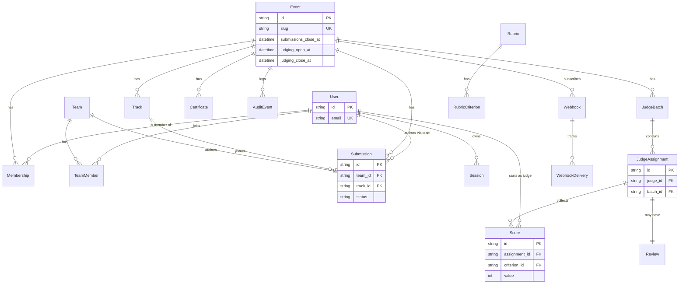

# Test suite — schema

> **Database schema integrity: migrations present for every app, applied on fresh DB, UUID PKs, FK cascades, AUTH_USER_MODEL usage, no migration cycles.** Tests live in `tests/schema/test_migrations.py` under `@pytest.mark.schema`.

## Contents

- [Model subset at a glance](#model-subset-at-a-glance)
- [What it covers](#what-it-covers)
- [Known drift](#known-drift)
- [Run](#run)

## Model subset at a glance



## What it covers

Schema integrity: migrations present for every app, applied on fresh DB, UUID PKs, FK cascades, AUTH_USER_MODEL usage, no migration cycles.

| Test | Asserts |
|---|---|
| All local apps have migrations | One+ migration per app in INSTALLED_APPS |
| No unapplied migrations | `makemigrations --dry-run --check` clean |
| Models declare primary keys | Every model has a PK field |
| UUIDs for PKs | Apps with UUID PKs actually use them |
| Unique constraints enforced | Two users same email → IntegrityError |
| FK cascade | Delete Event → Teams/Submissions/Memberships cascade |
| FK to AUTH_USER_MODEL | No model has `auth_user` db_column |
| No migration cycles | Topological sort has no cycles |
| Models import cleanly | `from apps.<name>.models import *` succeeds |

## Known drift

- `test_event_delete_cascades_to_teams_submissions_memberships`: Some FKs may be PROTECT (intentional — e.g., `Event.created_by`). Audit which cascade vs protect.
- `test_local_pk_columns_are_uuid`: `AbstractUser.username` is a CharField; `AbstractUser.id` is a BigAutoField. Our `accounts.User` inherits both. Override `id` to UUIDField for full UUID coverage.

## Run

```bash
make test-schema
```

---

[← Back to TESTING.md](TESTING.md)
