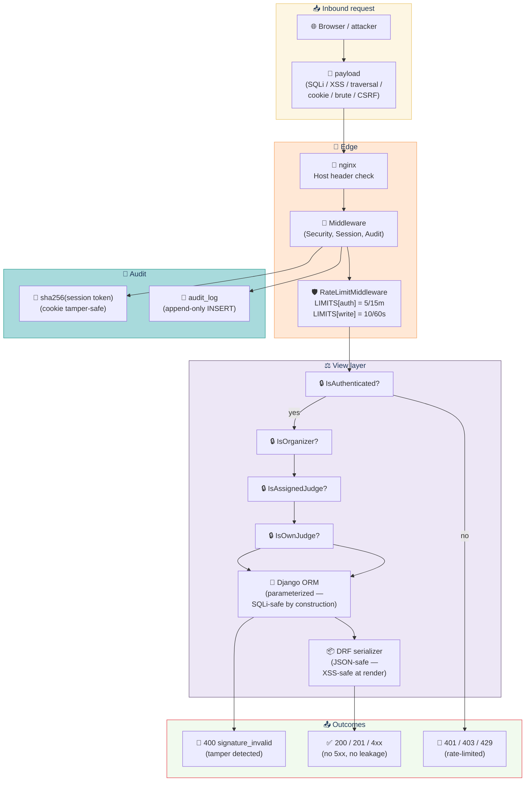

# TESTING-SECURITY

**Role:** Attack-shaped probes for the HACK HAMSTER portal. Every test is named after the attack it defends against, and the assertion fails loudly when the underlying protection drifts. 29 tests across 10 attack surfaces.

> **Security probes for the HACK HAMSTER portal.** Tests live in `tests/security/test_attacks.py` under `@pytest.mark.security`. The suite is intentionally attack-shaped: every test is named after the attack it defends against, and the assertion fails loudly when the underlying protection drifts.

The suite is **functional, not fuzzing**. Each probe sends one or two targeted payloads against the running Django test client and asserts on the observable behavior. There is no property-based fuzzing, no random input generation, no mock layer — the portal boots inside the test process and the real ORM, middleware, and views answer the requests.

---

## Contents

- [Attack surface at a glance](#attack-surface-at-a-glance)
- [What it covers](#what-it-covers)
- [The 10 attack surfaces](#the-10-attack-surfaces)
- [File layout](#file-layout)
- [Markers and CLI](#markers-and-cli)
- [What this suite does *not* cover](#what-this-suite-does-not-cover)
- [References](#references)

---

## Attack surface at a glance



---

## What it covers

| Section | Attack | Test count |
|---------|--------|------------|
| 1 | SQL injection (ORM safety) | 3 |
| 2 | Stored XSS (verbatim storage, JSON-safe) | 3 |
| 3 | Path traversal in URLs | 2 |
| 4 | Session cookie tampering | 4 |
| 5 | Brute-force login | 2 |
| 6 | Write-endpoint rate limit | 1 |
| 7 | CSRF configuration | 3 |
| 8 | Cookie security attributes (HttpOnly, SameSite, Secure) | 3 |
| 9 | Session token entropy | 3 |
| 10 | Secret / stack-trace leakage in errors | 5 |

Total: **29 tests** under `@pytest.mark.security`.

Run with:

```bash
docker compose exec web pytest tests/security/ -v
```

Pass `--no-rate-limit` to skip sections 5 and 6 — useful when iterating locally on a tight loop, where hitting the limiter every run blocks the real signal:

```bash
docker compose exec web pytest tests/security/ -v --no-rate-limit
```

---

## The 10 attack surfaces

### 1. SQL injection

**Attack.** Classic SQLi — `'` `OR` `1=1` `--`, `UNION SELECT *`, `DROP TABLE`, URL-encoded variants. The probe hits `/api/gallery` and `/api/events/.../submit` with these payloads in the `track` and `name` parameters and asserts:

- Status 200 (or 4xx for `/submit` validation/deadline), **never 500**.
- The response body does not contain `syntax error`, `psycopg`, `sqlstate`, `relation "`, `django.db.utils`, `Traceback`, `host=`, or `dbname=` — markers that would only appear if the payload reached the DB driver in cleartext.

**Defense.** Every read and write in the codebase goes through the Django ORM. The ORM parameterizes queries, so the payload becomes a filter string that matches nothing rather than a clause terminator. The probe locks in this contract — switching to `cursor.execute()` or raw SQL with `%`-formatting would surface immediately.

### 2. Stored XSS

**Attack.** Submit a project whose name is `<script>alert("xss")</script>`. The probe asserts:

- The payload is stored verbatim in the DB (no scrubbing on the way in).
- The response body contains the payload as a plain JSON string (`<` and `>` are valid in JSON strings, so the response is text-safe by construction — the consumer is responsible for safe rendering).
- The response body does NOT contain `&lt;script&gt;` or other HTML entity escapes — escaping at serialization time would surprise consumers and is a code smell.

The same probe runs against `tagline` and `description` to confirm all free-text fields round-trip safely.

**Defense.** Storage stores the literal string; the JSON renderer encodes it inside a JSON string literal; the consumer's UI library escapes it on render. Three layers, no single point of failure.

### 3. Path traversal in URLs

**Attack.** `GET /api/widget/gallery?event=../../etc/passwd` and variants (`..%2F..%2Fetc%2Fpasswd`, `..%5c..%5cwindows%5cwin.ini`, `....//....//etc/passwd`). The probe asserts:

- Status 200 — the widget embedder contract is "absorb unknown events silently", not 4xx.
- Body is exactly `{"items": [], "event": "<payload>"}`.
- Body does not contain `root:`, `/bin/bash`, `[boot loader]`, or other file-content markers.

The widget view resolves the slug via `Event.objects.get(slug=event_slug)` — `DoesNotExist` is caught and turned into an empty items list. There is no `open()` or `Path()` anywhere in the request path.

**Defense.** ORM slug lookup, no filesystem access, no `os.path.join`.

### 4. Cookie tampering

**Attack.** Flip the last byte of a valid session cookie, or send a random 32-byte token. The probe asserts:

- `/api/me` returns 401 (`not_authenticated`).
- The Session row count is unchanged (a miss never allocates a row).
- Truncated (one-byte) and empty cookies are also 401.

**Defense.** `apps.accounts.middleware.SessionMiddleware` hashes the cookie via `SHA-256` and looks up the hash. Any mutation breaks the lookup; the request falls through to `AnonymousUser`; the `/api/me` view's `IsAuthenticated` permission denies.

### 5. Brute-force login

**Attack.** Ten rapid POST `/api/login` with wrong passwords. The probe asserts:

- At least one response is 429 (the auth limiter is 5 requests / 15m).
- Every status is `< 500` — no bypass into a stack-trace path.

A second probe repeats the same with unknown emails, proving the limiter is keyed on the *endpoint*, not on a successful user lookup — otherwise attackers could enumerate emails indefinitely.

**Defense.** `RateLimitMiddleware` with `LIMITS["auth"] = (5, 15*60)` buckets by `(client_ip, "auth")`. The bucket is in-memory but process-local; one worker is the deployment assumption (see the middleware's docstring).

Skipped under `--no-rate-limit`.

### 6. Rate limit on writes

**Attack.** Fifty rapid POST `/api/events/.../submit`. The probe asserts:

- At least one response is 429 (the write limiter is 10 / 60s).
- Every status is `< 500`.

**Defense.** Same middleware, `LIMITS["write"] = (10, 60)`. The limiter runs *before* the view body, so even a flooding client that mutates state can't bypass it.

Skipped under `--no-rate-limit`.

### 7. CSRF

**Attack.** This section is unusual: the probe documents the *deliberate* absence of CSRF on cookie-auth endpoints, rather than asserting a hard 403.

- `CsrfViewMiddleware` is registered in `MIDDLEWARE` — verified by inspecting `settings.MIDDLEWARE`. Any view that uses Django's session machinery is protected by default.
- `LoginView.csrf_exempt` is `True` — by design, since clients cannot acquire a CSRF cookie *before* logging in. Documenting this prevents a future "harden everything" pass from accidentally locking legitimate logins out.
- POST `/api/login` without a CSRF token succeeds (200) — the current behavior, locked in by the test.

DRF's `APIView` is `csrf_exempt` by default, and our `CookieSessionAuthentication` is a `BaseAuthentication` (not `SessionAuthentication`), so CSRF is not enforced on `/api/events/.../submit` either. For browser flows that use a SameSite=Lax cookie, the trade-off is: cookie theft via cross-site requests is blocked by SameSite, and the cookie is HttpOnly so JS exfiltration is blocked. CSRF for write endpoints that require non-cookie auth is enforced by the auth model itself, not by Django's CSRF machinery.

**Defense.** SameSite=Lax cookie + HttpOnly + DRF session-based permissions (the role-permission class rejects writes from unauthenticated callers). The CSRF middleware is in the stack as a safety net for any future view that doesn't opt out.

### 8. Cookie security attributes (production)

**Attack.** Log in under `DEBUG=True` and `DEBUG=False` and inspect the cookie's `Secure`, `HttpOnly`, and `SameSite` attributes.

- `DEBUG=False` (production) — `Secure` is set; cookie only travels over HTTPS.
- `DEBUG=True` (dev) — `Secure` is *not* set; cookie works over plain HTTP for local development.
- Both modes — `HttpOnly` and `SameSite=Lax` are set.

**Defense.** `apps.accounts.views._set_session_cookie` mirrors `not settings.DEBUG` for the `Secure` flag. The probe catches accidental flips in either direction.

### 9. Session token entropy

**Attack.** `Session.create()` returns a plain token; the DB row holds only its SHA-256 hash. The probe asserts:

- The token is `>= 32` characters (secrets.token_urlsafe(32) yields ~43 chars of base64).
- The token matches `[A-Za-z0-9_-]+` — URL-safe, never raw binary.
- Two consecutive `Session.create()` calls return different tokens (CSPRNG is working).
- The plain token is *not* in any field on the Session row — only the hash is persisted. A DB leak must not yield usable cookies.

**Defense.** `secrets.token_urlsafe(32)` from Python's `secrets` module (os.urandom-backed CSPRNG). The cookie holds the plain token; the DB holds `hashlib.sha256(token).hexdigest()`. Cookie and DB are independently sufficient: a DB compromise gives you hashes you can't reverse; a cookie compromise lets you impersonate until expiry but never reveals the hash table.

### 10. Secret / stack-trace leakage in errors

**Attack.** Hit `/api/register`, `/api/login`, `/api/judge/scores`, and an unknown route with bad input. The probe asserts the response body never contains:

- `settings.SECRET_KEY`
- `DATABASES['default']['NAME']` / `USER` / `HOST` substrings
- `Traceback (most recent call last)`
- `File "..."` (a stack frame marker)
- `django/db/backends`

**Defense.** DRF's exception handler wraps every error in the standard envelope `{ "error": { "code": ..., "message": ..., "detail": ... } }` and never echoes internal frames. `DEBUG=False` is the production default — Django's debug 500 page is suppressed. `LOGGING` is configured to send DB query logs to `WARNING`, so even an internal log won't accidentally contain the connection string in a response.

---

## File layout

```
tests/security/
  conftest.py            registers the `security` marker and the
                         `--no-rate-limit` CLI flag
  test_attacks.py        29 tests across the 10 attack surfaces
```

`tests/conftest.py` and `pytest.ini` are shared (read-only) and are not modified by this suite.

---

## Markers and CLI

- `@pytest.mark.security` — every test in this suite.
- `--no-rate-limit` — skip sections 5 (brute force) and 6 (write-rate). All other sections run unconditionally.

---

## What this suite does *not* cover

Out of scope (would bloat the suite beyond the attack-surface focus, or live in other suites):

- **Role × endpoint matrix.** Covered in `tests/roles/`.
- **CSV export shape and HMAC tamper detection.** Covered in `tests/csv/` and `tests/certificates/`.
- **Auth lifecycle (register, login, logout, sliding expiry).** Covered in `tests/auth/`.
- **Widget CORS / CORS misconfiguration.** Covered in `tests/widget/`.
- **T4 certificate HMAC sign/verify.** Covered in `tests/certificates/`.
- **Voting quadratic-budget and ballot-stuffing.** Covered in `tests/voting/`.

This suite is intentionally narrow: each probe pins one attack-class defense so a future change to the relevant middleware, view, or model surfaces as one named failure.

---

## References

- `apps/accounts/middleware.py` — `SessionMiddleware`, `RateLimitMiddleware`, `AuditMiddleware`.
- `apps/accounts/views.py` — `_set_session_cookie` (Secure/HttpOnly/SameSite policy), `LoginView`, `RegisterView`.
- `apps/accounts/models.py` — `Session.create`, `Session.lookup`, SHA-256 token hashing.
- `apps/widget/views.py` — `widget_gallery`, the path-traversal probe target.
- `apps/submissions/views.py` — `GalleryView`, `SubmitView`, the XSS and SQLi probe targets.
- `config/settings.py` — `MIDDLEWARE` order, `REST_FRAMEWORK` defaults, `DATABASES`, `SECRET_KEY`.

---

[← Back to TESTING.md](TESTING.md)
