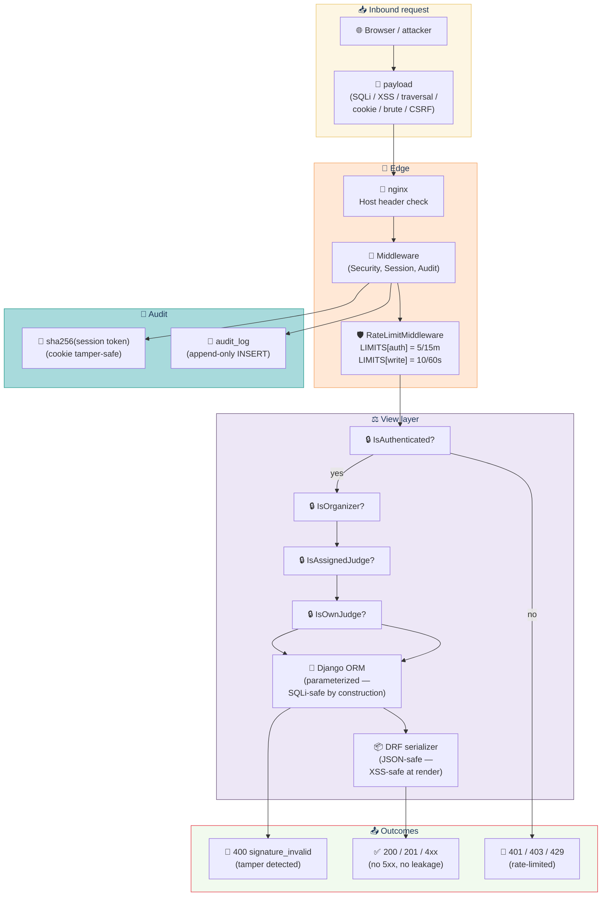

# TESTING-SECURITY

**Role:** Attack-shaped probes for the HACK HAMSTER portal. Every test is named after the attack it defends against; the assertion fails loudly when the underlying protection drifts. 29 tests across 10 attack surfaces.

> Security probes for the HACK HAMSTER portal. Tests live in `tests/security/test_attacks.py` under `@pytest.mark.security`. Suite is intentionally attack-shaped.

Functional, not fuzzing. Each probe sends one or two targeted payloads against the Django test client and asserts on observable behavior. No property-based fuzzing, no random input, no mock layer — real ORM, middleware, and views answer the requests.

---

## Contents

- [Attack surface at a glance](#attack-surface-at-a-glance)
- [What it covers](#what-it-covers)
- [The 10 attack surfaces](#the-10-attack-surfaces)
- [File layout](#file-layout)
- [Markers and CLI](#markers-and-cli)
- [What this suite does *not* cover](#what-this-suite-does-not-cover)
- [References](#references)

---

## Attack surface at a glance



---

## What it covers

| # | Attack | Tests |
|---|---|---|
| 1 | SQL injection (ORM safety) | 3 |
| 2 | Stored XSS (verbatim storage, JSON-safe) | 3 |
| 3 | Path traversal in URLs | 2 |
| 4 | Session cookie tampering | 4 |
| 5 | Brute-force login | 2 |
| 6 | Write-endpoint rate limit | 1 |
| 7 | CSRF configuration | 3 |
| 8 | Cookie security attributes (HttpOnly, SameSite, Secure) | 3 |
| 9 | Session token entropy | 3 |
| 10 | Secret / stack-trace leakage in errors | 5 |

Total: **29 tests** under `@pytest.mark.security`.

```bash
docker compose exec web pytest tests/security/ -v
docker compose exec web pytest tests/security/ -v --no-rate-limit
```

`--no-rate-limit` skips sections 5 and 6 — useful when iterating locally on a tight loop where the limiter blocks real signal.

---

## The 10 attack surfaces

### 1. SQL injection

**Attack.** Classic SQLi — `'` `OR` `1=1` `--`, `UNION SELECT *`, `DROP TABLE`, URL-encoded variants. Hits `/api/gallery` and `/api/events/.../submit` with payloads in `track` and `name`. Asserts:

- Status 200 (or 4xx for `/submit` validation/deadline), **never 500**.
- Body lacks `syntax error`, `psycopg`, `sqlstate`, `relation "`, `django.db.utils`, `Traceback`, `host=`, `dbname=` — markers that would only appear if the payload reached the DB driver in cleartext.

**Defense.** Every read and write goes through the Django ORM, which parameterizes queries — payload becomes a filter string that matches nothing. Switching to `cursor.execute()` or raw SQL with `%`-formatting would surface immediately.

### 2. Stored XSS

**Attack.** Submit a project whose name is `<script>alert("xss")</script>`. Asserts:

- Payload stored verbatim (no scrubbing on the way in).
- Body contains the payload as a plain JSON string (`<` and `>` valid in JSON strings; consumer handles safe rendering).
- Body does NOT contain `&lt;script&gt;` or other HTML entity escapes — escaping at serialization would surprise consumers.

Same probe runs against `tagline` and `description`.

**Defense.** Storage keeps literal string; JSON renderer encodes it inside a JSON string literal; consumer's UI escapes on render. Three layers, no single failure point.

### 3. Path traversal in URLs

**Attack.** `GET /api/widget/gallery?event=../../etc/passwd` and variants (`..%2F..%2Fetc%2Fpasswd`, `..%5c..%5cwindows%5cwin.ini`, `....//....//etc/passwd`). Asserts:

- Status 200 — widget contract is "absorb unknown events silently", not 4xx.
- Body is exactly `{"items": [], "event": "<payload>"}`.
- Body lacks `root:`, `/bin/bash`, `[boot loader]`, other file-content markers.

Widget resolves via `Event.objects.get(slug=event_slug)` — `DoesNotExist` becomes an empty items list. No `open()` or `Path()` in the request path.

**Defense.** ORM slug lookup, no filesystem access, no `os.path.join`.

### 4. Cookie tampering

**Attack.** Flip the last byte of a valid session cookie, or send a random 32-byte token. Asserts:

- `/api/me` returns 401 (`not_authenticated`).
- Session row count unchanged (a miss never allocates a row).
- Truncated (one-byte) and empty cookies also 401.

**Defense.** `apps.accounts.middleware.SessionMiddleware` hashes the cookie via SHA-256 and looks up the hash. Mutation breaks the lookup → request falls through to `AnonymousUser` → `IsAuthenticated` denies.

### 5. Brute-force login

**Attack.** Ten rapid POST `/api/login` with wrong passwords. Asserts:

- At least one 429 (auth limiter = 5 requests / 15 m).
- Every status `< 500` — no bypass into stack-trace path.

Second probe repeats with unknown emails, proving the limiter is keyed on the *endpoint*, not on a successful user lookup — otherwise attackers enumerate emails indefinitely.

**Defense.** `RateLimitMiddleware` with `LIMITS["auth"] = (5, 15*60)` buckets by `(client_ip, "auth")`. Bucket is in-memory, process-local; one worker is the deployment assumption (see middleware docstring).

Skipped under `--no-rate-limit`.

### 6. Rate limit on writes

**Attack.** Fifty rapid POST `/api/events/.../submit`. Asserts:

- At least one 429 (write limiter = 10 / 60 s).
- Every status `< 500`.

**Defense.** Same middleware, `LIMITS["write"] = (10, 60)`. Limiter runs *before* the view body — flooding client that mutates state can't bypass.

Skipped under `--no-rate-limit`.

### 7. CSRF

Documents the *deliberate* absence of CSRF on cookie-auth endpoints, not a hard 403.

- `CsrfViewMiddleware` is registered in `MIDDLEWARE` (verified by inspecting `settings.MIDDLEWARE`). Views using Django's session machinery are protected by default.
- `LoginView.csrf_exempt` is `True` — by design, clients cannot acquire a CSRF cookie *before* logging in.
- POST `/api/login` without a CSRF token succeeds (200) — current behavior locked in by the test.

DRF's `APIView` is `csrf_exempt` by default; `CookieSessionAuthentication` is `BaseAuthentication` (not `SessionAuthentication`), so CSRF isn't enforced on `/api/events/.../submit` either. Trade-off: cookie theft via cross-site is blocked by SameSite; JS exfiltration blocked by HttpOnly. Write endpoints requiring non-cookie auth are enforced by the auth model itself, not Django's CSRF.

**Defense.** SameSite=Lax + HttpOnly + DRF session-based permissions (role-permission class rejects unauthenticated writes). CSRF middleware is a safety net for any future view that doesn't opt out.

### 8. Cookie security attributes (production)

**Attack.** Log in under `DEBUG=True` and `DEBUG=False`, inspect `Secure`, `HttpOnly`, `SameSite`.

- `DEBUG=False` (prod) — `Secure` set; cookie travels only over HTTPS.
- `DEBUG=True` (dev) — `Secure` not set; cookie works over plain HTTP.
- Both modes — `HttpOnly` and `SameSite=Lax` set.

**Defense.** `apps.accounts.views._set_session_cookie` mirrors `not settings.DEBUG` for the `Secure` flag. Catches accidental flips.

### 9. Session token entropy

**Attack.** `Session.create()` returns a plain token; DB row holds only its SHA-256 hash. Asserts:

- Token `>= 32` chars (`secrets.token_urlsafe(32)` yields ~43 base64 chars).
- Token matches `[A-Za-z0-9_-]+` — URL-safe, never raw binary.
- Two consecutive `Session.create()` calls return different tokens (CSPRNG working).
- Plain token is *not* in any Session row field — only the hash persists. A DB leak must not yield usable cookies.

**Defense.** `secrets.token_urlsafe(32)` (os.urandom-backed CSPRNG). Cookie holds plain token; DB holds `hashlib.sha256(token).hexdigest()`. Independent: DB compromise gives unreversable hashes; cookie compromise lets you impersonate until expiry but never reveals the hash table.

### 10. Secret / stack-trace leakage in errors

**Attack.** Hit `/api/register`, `/api/login`, `/api/judge/scores`, an unknown route with bad input. Asserts the response body never contains:

- `settings.SECRET_KEY`
- `DATABASES['default']['NAME']` / `USER` / `HOST` substrings
- `Traceback (most recent call last)`
- `File "..."` (stack frame marker)
- `django/db/backends`

**Defense.** DRF's exception handler wraps every error in `{ "error": { "code": ..., "message": ..., "detail": ... } }` and never echoes internal frames. `DEBUG=False` is the production default — debug 500 page suppressed. `LOGGING` sends DB query logs to `WARNING`, so internal logs don't accidentally leak the connection string in a response.

---

## File layout

```
tests/security/
  conftest.py            registers the `security` marker and `--no-rate-limit` CLI flag
  test_attacks.py        29 tests across the 10 attack surfaces
```

`tests/conftest.py` and `pytest.ini` are shared (read-only); this suite does not modify them.

---

## Markers and CLI

- `@pytest.mark.security` — every test in this suite.
- `--no-rate-limit` — skip sections 5 and 6. All other sections run unconditionally.

---

## What this suite does *not* cover

Out of scope (covered in other suites):

- Role × endpoint matrix — `tests/roles/`.
- CSV export shape and HMAC tamper — `tests/csv/`, `tests/certificates/`.
- Auth lifecycle (register, login, logout, sliding expiry) — `tests/auth/`.
- Widget CORS — `tests/widget/`.
- T4 certificate HMAC — `tests/certificates/`.
- Voting quadratic budget / ballot stuffing — `tests/voting/`.

Suite is intentionally narrow: each probe pins one attack-class defense so a future change to the relevant middleware, view, or model surfaces as one named failure.

---

## References

- `apps/accounts/middleware.py` — `SessionMiddleware`, `RateLimitMiddleware`, `AuditMiddleware`.
- `apps/accounts/views.py` — `_set_session_cookie` (Secure/HttpOnly/SameSite), `LoginView`, `RegisterView`.
- `apps/accounts/models.py` — `Session.create`, `Session.lookup`, SHA-256 token hashing.
- `apps/widget/views.py` — `widget_gallery`, path-traversal probe target.
- `apps/submissions/views.py` — `GalleryView`, `SubmitView`, XSS and SQLi probe targets.
- `config/settings.py` — `MIDDLEWARE` order, `REST_FRAMEWORK` defaults, `DATABASES`, `SECRET_KEY`.

---

[← Back to TESTING.md](TESTING.md)
