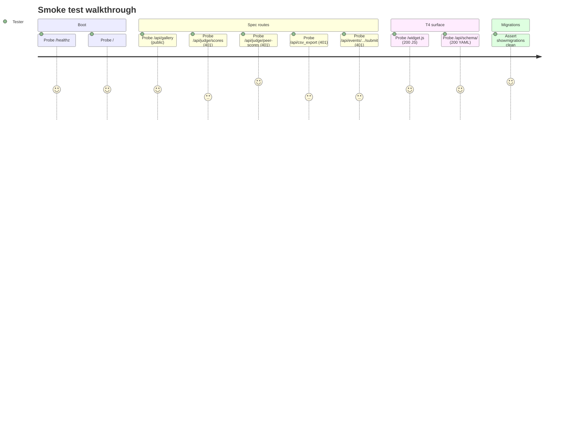

# Smoke Tests

**Role:** The canary. Ten fast tests that prove the portal is alive (boot, spec routes, T4 surface, migrations). If smoke is red, **nothing else is real** — debug smoke first, every time.

> **Ten tests in `tests/smoke/test_smoke.py`, marked `@pytest.mark.smoke`.** Run time on a clean dev machine: ~3–6 seconds (dominated by the test-DB creation that Django does once per session).

---

## Contents

- [Smoke walkthrough at a glance](#smoke-walkthrough-at-a-glance)
- [How to run](#how-to-run)
- [Per-test reference](#per-test-reference)
- [What NOT to expect from this suite](#what-not-to-expect-from-this-suite)
- [Troubleshooting](#troubleshooting)

---

## Smoke walkthrough at a glance



What they catch:

- The compose stack is up (`web` can reach `db`).
- Django booted and routes mounted (`/`, `/healthz`, `/widget.js`, `/api/schema/`, all five spec routes).
- Migrations are applied for every local app. If a model file landed without its migration, the test process uses a different schema than the dev process and everything else lies.

If any smoke test fails, **stop and fix it before running anything else.** The whole point of this suite is to fail loudly when the system is fundamentally broken. A green smoke run is the prerequisite for every other tier.

---

## How to run

```bash
docker compose exec web pytest tests/smoke/ -v
```

That single command is the canary. If the output ends with `10 passed`, the portal is alive and you can move on. If it ends with anything else, debug that first.

The smoke marker is registered in `pytest.ini`. To run just the smoke tier of a larger suite:

```bash
docker compose exec web pytest -m smoke
```

---

## Per-test reference

### Boot

**`test_healthz_reports_db_ok`** — `GET /healthz` → 200, body has `status: "ok"`, `checks.db: "ok"`, `db_ms` is a non-negative int. Why it matters: `/healthz` is the first thing the accept suite pings. If it can't reach Postgres, nothing else is real.

**`test_root_returns_service_name`** — `GET /` → 200, body has `service: "hack-hamster-portal"`. Why it matters: the root route is the "is Django even up?" probe. It serves from memory and doesn't need the DB, so a 200 here means URL conf loaded and the process is responsive.

### Five spec routes

**`test_gallery_is_public`** — `GET /api/gallery` → 200 without a session. This is the only spec route with `permission_classes = [AllowAny]`. If it returns 401, someone accidentally locked the gallery down and the public-facing accept script breaks.

**`test_judge_scores_requires_auth`** — `GET /api/judge/scores` → 401 without a session. The route exists for authenticated judges to read their own scores; without a cookie the permission class denies.

**`test_judge_peer_scores_requires_auth`** — `GET /api/judge/peer-scores` → 401 without a session. This is the graded cell: the route always denies, by design. A 200 here would mean cross-judge reads are accidentally allowed and the role isolation matrix is broken.

**`test_csv_export_requires_auth`** — `GET /api/csv_export` → 401 without a session. Organizer-only. A 200 here would expose every judge's scores to anyone.

**`test_submit_requires_auth`** — `POST /api/events/sample-hack-2026/submit` → 401 without a session. Participant-only, deadline-gated. The permission check runs before the deadline decorator, so the 401 fires before the 422 deadline-passed response.

### T4 surface

**`test_widget_js_served_with_correct_content_type`** — `GET /widget.js` → 200 with `Content-Type: application/javascript`. The embeddable widget must be servable as JS so external sites can `<script src=".../widget.js"></script>` it. If the content type is wrong, browsers refuse to execute it.

**`test_openapi_schema_served`** — `GET /api/schema/` → 200, body has an `openapi` key. The schema is consumed by client generators and the conformance test suite. If it disappears, the T4 surface is broken.

### Migrations

**`test_local_migrations_all_applied`** — runs `manage.py showmigrations` against every app in `config.settings.INSTALLED_APPS` (filtered to local apps only) and asserts no `[ ]` (unapplied) lines. Why it matters: an unapplied migration means the test process queries a schema that doesn't match the dev process. Tests pass, prod breaks. Catching this at the smoke tier costs a second; catching it after deploy costs a rollback.

---

## What NOT to expect from this suite

This is intentionally a small suite. It does not cover:

- **Auth flow.** Signup, login, session expiry, cookie rotation — that's `tests/auth/`.
- **Role enforcement.** Judge can read own scores, can't read peer scores, organizer-only CSV — that's `tests/roles/`.
- **Business logic.** Voting budget, retraction, pairwise ballots, normalization fit, certificate HMAC — each lives in its own `tests/<feature>/` directory.
- **Concurrency.** Race conditions on save endpoints — that's `tests/concurrency/`.
- **Schema conformance.** Every endpoint matches `openapi.yaml` — that's `tests/conformance/`.

If you find yourself adding a smoke test that asserts a business rule, it belongs in the feature suite, not here. The smoke tier should stay under 30 seconds total.

---

## Troubleshooting

### "database test_hack-hamster does not exist" mid-run

The test DB was dropped out from under pytest. Re-run from a clean state:

```bash
docker compose exec db dropdb -U hack-hamster test_hack-hamster
docker compose exec web pytest tests/smoke/ -v
```

### All routes return 400 with "Invalid HTTP_HOST header"

`ALLOWED_HOSTS` in dev is `localhost,127.0.0.1,web`. The Django test client defaults to `testserver` which is rejected, so every request in this suite overrides `HTTP_HOST=localhost`. If you copy a test out of this suite, copy the `HTTP_HOST` argument too.

### "Database access not allowed" in a 401 path

The `AuditMiddleware` writes a row for every 401/403 response. That means every "requires auth" test needs the `db` fixture even though the view itself denies before any DB query. If you add a no-auth smoke test, give it `(db, client)`.

---

[← Back to TESTING.md](TESTING.md)
