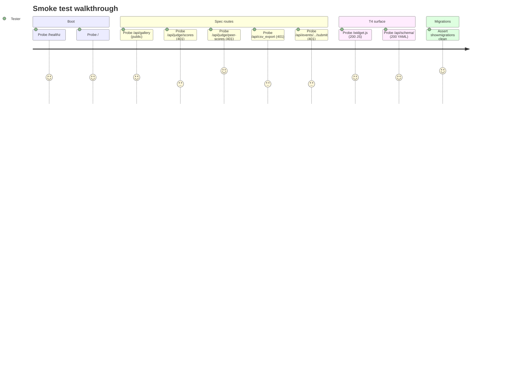

# Smoke Tests

**Role:** The canary. Ten fast tests that prove the portal is alive (boot, spec routes, T4 surface, migrations). If smoke is red, nothing else is real — debug smoke first.

> Ten tests in `tests/smoke/test_smoke.py`, marked `@pytest.mark.smoke`. Run time on a clean dev machine: ~3–6 s (dominated by test-DB creation that Django does once per session).

---

## Contents

- [Smoke walkthrough at a glance](#smoke-walkthrough-at-a-glance)
- [How to run](#how-to-run)
- [Per-test reference](#per-test-reference)
- [What NOT to expect from this suite](#what-not-to-expect-from-this-suite)
- [Troubleshooting](#troubleshooting)

---

## Smoke walkthrough at a glance



What they catch:

- Compose stack is up (`web` can reach `db`).
- Django booted and routes mounted (`/`, `/healthz`, `/widget.js`, `/api/schema/`, all five spec routes).
- Migrations applied for every local app. A model file landing without its migration means the test process uses a different schema than the dev process and everything else lies.

If any smoke test fails, stop and fix it before running anything else. Green smoke run is the prerequisite for every other tier.

---

## How to run

```bash
docker compose exec web pytest tests/smoke/ -v
```

That single command is the canary. Output ending in `10 passed` → portal is alive. Anything else → debug first.

Smoke marker is registered in `pytest.ini`. To run just the smoke tier:

```bash
docker compose exec web pytest -m smoke
```

---

## Per-test reference

### Boot

**`test_healthz_reports_db_ok`** — `GET /healthz` → 200, body has `status: "ok"`, `checks.db: "ok"`, `db_ms` is a non-negative int. Why: `/healthz` is what the accept suite pings first. If it can't reach Postgres, nothing else is real.

**`test_root_returns_service_name`** — `GET /` → 200, body has `service: "hack-hamster-portal"`. Why: root is the "is Django even up?" probe. Serves from memory, no DB — a 200 means URLconf loaded and the process is responsive.

### Five spec routes

**`test_gallery_is_public`** — `GET /api/gallery` → 200 without a session. Only spec route with `permission_classes = [AllowAny]`. 401 here means someone accidentally locked the gallery down.

**`test_judge_scores_requires_auth`** — `GET /api/judge/scores` → 401 without a session. Authenticated judges read their own scores; permission class denies without a cookie.

**`test_judge_peer_scores_requires_auth`** — `GET /api/judge/peer-scores` → 401 without a session. The graded cell: the route always denies by design. 200 here would mean cross-judge reads are accidentally allowed.

**`test_csv_export_requires_auth`** — `GET /api/csv_export` → 401 without a session. Organizer-only. 200 here would expose every judge's scores.

**`test_submit_requires_auth`** — `POST /api/events/sample-hack-2026/submit` → 401 without a session. Participant-only, deadline-gated. Permission check runs before the deadline decorator, so 401 fires before 422 deadline-passed.

### T4 surface

**`test_widget_js_served_with_correct_content_type`** — `GET /widget.js` → 200 with `Content-Type: application/javascript`. Must be servable as JS so external sites can `<script src=".../widget.js"></script>` it. Wrong content type → browsers refuse to execute.

**`test_openapi_schema_served`** — `GET /api/schema/` → 200, body has `openapi` key. Consumed by client generators and the conformance suite. Gone → T4 surface broken.

### Migrations

**`test_local_migrations_all_applied`** — `manage.py showmigrations` against every app in `INSTALLED_APPS` (local apps only); asserts no `[ ]` (unapplied) lines. Unapplied migration = test process queries a schema that doesn't match dev. Tests pass, prod breaks. Catching this at smoke costs a second; catching it after deploy costs a rollback.

---

## What NOT to expect from this suite

This is intentionally small. It does not cover:

- **Auth flow** — `tests/auth/`.
- **Role enforcement** — `tests/roles/`.
- **Business logic** — voting, retraction, pairwise, normalization, certificates; each in `tests/<feature>/`.
- **Concurrency** — `tests/concurrency/`.
- **Schema conformance** — `tests/conformance/`.

Adding a smoke test that asserts a business rule → it belongs in the feature suite. Smoke tier stays under 30 s.

---

## Troubleshooting

### "database test_hack-hamster does not exist" mid-run

Test DB dropped out from under pytest. Re-run clean:

```bash
docker compose exec db dropdb -U hack-hamster test_hack-hamster
docker compose exec web pytest tests/smoke/ -v
```

### All routes return 400 with "Invalid HTTP_HOST header"

`ALLOWED_HOSTS` in dev is `localhost,127.0.0.1,web`. Django test client defaults to `testserver` which is rejected; every request here overrides `HTTP_HOST=localhost`. Copy a test out → copy the `HTTP_HOST` argument too.

### "Database access not allowed" in a 401 path

`AuditMiddleware` writes a row for every 401/403. Every "requires auth" test needs the `db` fixture even though the view denies before any DB query. Add a no-auth smoke test → give it `(db, client)`.

---

[← Back to TESTING.md](TESTING.md)
