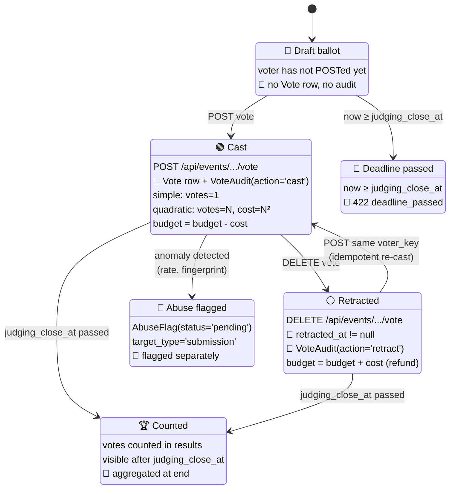

# Test suite — voting

> **T3 voting: simple mode, quadratic mode, self-vote check, retraction, idempotency, audit trail, anonymous vs authenticated voter keys, abuse flag model.** Tests live in `tests/voting/test_voting.py` under `@pytest.mark.voting`.

## Contents

- [Vote lifecycle at a glance](#vote-lifecycle-at-a-glance)
- [What it covers](#what-it-covers)
- [Known drift](#known-drift)
- [Run](#run)

## Vote lifecycle at a glance



## What it covers

T3 voting: simple mode, quadratic mode, self-vote check, retraction,
idempotency, audit trail, anonymous vs authenticated voter keys,
abuse flag model.

| Test | Asserts |
|---|---|
| Simple mode cast | POST without `votes` field → Vote row with `votes=1` |
| Quadratic mode (n=3) | Deducts `9` credits from voter budget |
| Quadratic mode (n=2 cumulative) | Total budget = 9 + 4 = 13 |
| Quadratic budget cap | 11 votes (cost 121) rejected with 422 `Exceeds budget` |
| Self-vote | TeamMember of project's team → 403 `forbidden_role` |
| Retraction | DELETE → sets `retracted_at`, refunds quadratic cost |
| Idempotent cast | Two POSTs same voter_key → one Vote row, updated |
| Anonymous voter_key | sha256(ip+ua)[:32] prefix `fp:` |
| Different IPs | Different anon voter_keys |
| Audit row on cast | VoteAudit row created with action='cast' |
| Audit row on retract | VoteAudit row with action='retract' |
| AbuseFlag model | create with target_type='submission' succeeds |
| AbuseFlag default status | status='pending' |
| Vote after `judging_close_at` | 422 `deadline_passed` — voting closes when judging closes |
| Quadratic refunds on retract | cost refunded |

## Known drift

- `test_quadratic_budget_cap_returns_422`: View deducts cost incrementally; cap check happens after deduction. If deduction order changes, this test fails. Read the source before changing.

## Run

```bash
make test-voting
```

---

[← Back to TESTING.md](TESTING.md)
