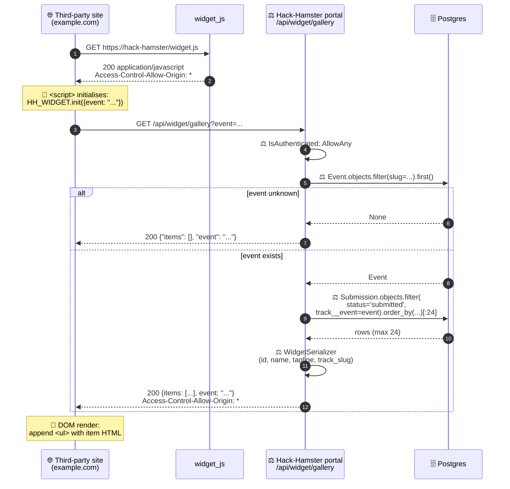

# Test suite — widget

> **Embeddable widget: `/widget.js` (JS shim) and `/api/widget/gallery` (JSON feed).** Tests live in `tests/widget/test_widget.py` under `@pytest.mark.widget`. CORS, content-type, JSON shape, public access.

## Contents

- [Embed at a glance](#embed-at-a-glance)
- [What it covers](#what-it-covers)
- [Known drift](#known-drift)
- [Run](#run)

## Embed at a glance



## What it covers

Embeddable widget: `/widget.js` (JS shim) and `/api/widget/gallery` (JSON feed). CORS, content-type, JSON shape, public access.

| Test | Asserts |
|---|---|
| /widget.js returns JS | 200, application/javascript, contains `HH_WIDGET` |
| /widget.js valid JS (issue #13) | Body is a parseable IIFE (`node --check` when node available), `HACK HAMSTER_WIDGET` token absent |
| next.config.ts widget rewrite (issue #13) | `/widget.js` proxied to Django on the Next.js public surface |
| /widget.js CORS | `Access-Control-Allow-Origin: *` |
| /widget.js no auth required | Anonymous GET → 200 |
| /api/widget/gallery returns JSON | 200, application/json |
| /api/widget/gallery CORS | `Access-Control-Allow-Origin: *` |
| /api/widget/gallery JSON shape | `{items: [{id, name, tagline, track_slug}, ...], event}` |
| /api/widget/gallery empty event | `{items: [], event}` |
| /api/widget/gallery bogus event | 200 with empty items (no 404) |
| /api/widget/gallery only submitted | Drafts and withdrawn excluded |
| /api/widget/gallery 24-item cap | 30 projects → 24 items |
| /api/widget/gallery trailing slash | Both `/api/widget/gallery` and `/api/widget/gallery/` work |

## Known drift

- `test_widget_gallery_bogus_event_returns_empty_not_404`: View returns `{items: []}` without the `event` key for unknown events. Tests should assert `{items: []}` only.

## Run

```bash
make test-widget
```

---

[← Back to TESTING.md](TESTING.md)
