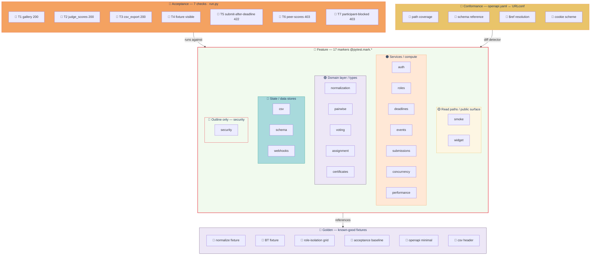

# HACK HAMSTER test suite — master index

> **20 categories, ~340 tests, run with `make test`.** Umbrella page; each `TESTING-*.md` drills into one category.

## Contents

- [The pyramid at a glance](#the-pyramid-at-a-glance)
- [The 20 categories](#the-20-categories)
- [How to run](#how-to-run)
- [Where things live](#where-things-live)
- [When to run what](#when-to-run-what)
- [Adding a new test category](#adding-a-new-test-category)
- [CI](#ci)
- [Test/production drift](#testproduction-drift)

## The pyramid at a glance



## The 20 categories

| # | Category | Doc | Marker | Covers |
|---|---|---|---|---|
| 1 | smoke | [TESTING-SMOKE.md](TESTING-SMOKE.md) | `smoke` | boot, healthz, spec-route reachability |
| 2 | auth | [TESTING-AUTH.md](TESTING-AUTH.md) | `auth` | session lifecycle, cookie tamper, sliding renewal, register/login/logout |
| 3 | roles | [TESTING-ROLES.md](TESTING-ROLES.md) | `roles` | 6 × 8 actor × route matrix, graded cell |
| 4 | deadlines | [TESTING-DEADLINES.md](TESTING-DEADLINES.md) | `deadlines` | submission / judging boundaries |
| 5 | voting | [TESTING-VOTING.md](TESTING-VOTING.md) | `voting` | T3 simple + quadratic + self-vote + retract + audit |
| 6 | pairwise | [TESTING-PAIRWISE.md](TESTING-PAIRWISE.md) | `pairwise` | BT synthetic rankings, ties, convergence |
| 7 | normalization | [TESTING-NORMALIZATION.md](TESTING-NORMALIZATION.md) | `normalization` | zero-var, incomplete, duplicate, disconnected |
| 8 | assignment | [TESTING-ASSIGNMENT.md](TESTING-ASSIGNMENT.md) | `assignment` | disjoint batches, COI, cap, retries |
| 9 | csv | [TESTING-CSV.md](TESTING-CSV.md) | `csv` | streaming, RFC 4180, unicode, organizer-only |
| 10 | certificates | [TESTING-CERTIFICATES.md](TESTING-CERTIFICATES.md) | `certificates` | HMAC sign + verify + tamper + canonical JSON |
| 11 | widget | [TESTING-WIDGET.md](TESTING-WIDGET.md) | `widget` | /widget.js, /api/widget/gallery, CORS, JSON shape |
| 12 | schema | [TESTING-SCHEMA.md](TESTING-SCHEMA.md) | `schema` | migrations, UUID PKs, FK cascades, no cycles |
| 13 | conformance | [TESTING-CONFORMANCE.md](TESTING-CONFORMANCE.md) | `conformance` | openapi.yaml ↔ /api/schema/, path coverage |
| 14 | concurrency | [TESTING-CONCURRENCY.md](TESTING-CONCURRENCY.md) | `concurrency` | upsert idempotency, normalize idempotency, session rotation |
| 15 | golden | [TESTING-GOLDEN.md](TESTING-GOLDEN.md) | `golden` | algorithm fixtures: normalize, BT, role-isolation |
| 16 | performance | [TESTING-PERFORMANCE.md](TESTING-PERFORMANCE.md) | `performance` | load benchmarks: gallery, healthz, scores, CSV |
| 17 | security | [TESTING-SECURITY.md](TESTING-SECURITY.md) | `security` | SQLi, XSS, traversal, brute force, CSRF probes |
| 18 | events | `tests/events/` | `events` | event lifecycle, state transitions, registration windows |
| 19 | submissions | `tests/submissions/` | `submissions` | CRUD, gallery filtering, image upload |
| 20 | webhooks | `tests/webhooks/` | `webhooks` | HMAC-signed delivery, retry, delivery log |

The last three rows are referenced by the [README](../README.md) test pyramid but do not yet have their own `TESTING-*.md`.

## How to run

```bash
make test                # all 20 categories
make test-smoke          # boot + healthz + spec-route reachability
make test-roles          # full 6x8 actor × route matrix
make test-perf           # performance benchmarks (newer category)
make test-cov            # HTML coverage into reports/htmlcov/

# Single test file:
docker compose exec web pytest tests/csv/ -v
```

## Where things live

```
tests/
├── conftest.py                  # shared fixtures (read-only)
├── smoke/  auth/  roles/  deadlines/
├── voting/  pairwise/  normalization/  assignment/
├── csv/  certificates/  widget/  schema/
├── conformance/  concurrency/  golden/
├── performance/  security/
├── events/  submissions/  webhooks/  bulk/
└── observability/  judging/  billing/
```

## When to run what

| Situation | Run |
|---|---|
| Before every commit | `make test-smoke` |
| Before pushing to `main` | `make test` |
| After schema changes | `make test-schema` |
| After auth changes | `make test-auth` |
| After judge-assignment changes | `make test-roles test-assignment` |
| Before demo video | `make test-perf` |
| After security-sensitive changes | `make test-security` |
| After algorithm changes | `make test-golden` (review goldens) |

## Adding a new test category

1. Create `tests/<category>/`.
2. Create `tests/<category>/test_*.py` with `@pytest.mark.<category>`.
3. Add `<category>: <description>` in `pytest.ini` under `markers =`.
4. Create `docs/TESTING-<CATEGORY>.md`.
5. Add a row to the table above.
6. Extend by adding fixtures in your own conftest; do not modify the shared `conftest.py` or `pytest.ini`.

## CI

`make test` is the CI command. Full suite ~2 min locally. `make test-smoke` (~30s) is enough for a quick commit; reserve `make test` for merge-to-main.

## Test/production drift

Per-suite "Known drift" sections in each `TESTING-*.md` list contracts the production code doesn't yet meet. They are aspirational, not failures. When you fix the production code to match the contract, the test starts passing; when you change the contract intentionally, update both the test and the doc.

---

**Drill in:** [TESTING-AUTH.md](TESTING-AUTH.md) · [TESTING-ASSIGNMENT.md](TESTING-ASSIGNMENT.md) · [TESTING-CERTIFICATES.md](TESTING-CERTIFICATES.md) · [TESTING-CONCURRENCY.md](TESTING-CONCURRENCY.md) · [TESTING-CONFORMANCE.md](TESTING-CONFORMANCE.md) · [TESTING-CSV.md](TESTING-CSV.md) · [TESTING-DEADLINES.md](TESTING-DEADLINES.md) · [TESTING-GOLDEN.md](TESTING-GOLDEN.md) · [TESTING-NORMALIZATION.md](TESTING-NORMALIZATION.md) · [TESTING-PAIRWISE.md](TESTING-PAIRWISE.md) · [TESTING-PERFORMANCE.md](TESTING-PERFORMANCE.md) · [TESTING-ROLES.md](TESTING-ROLES.md) · [TESTING-SCHEMA.md](TESTING-SCHEMA.md) · [TESTING-SECURITY.md](TESTING-SECURITY.md) · [TESTING-SMOKE.md](TESTING-SMOKE.md) · [TESTING-VOTING.md](TESTING-VOTING.md) · [TESTING-WIDGET.md](TESTING-WIDGET.md)
