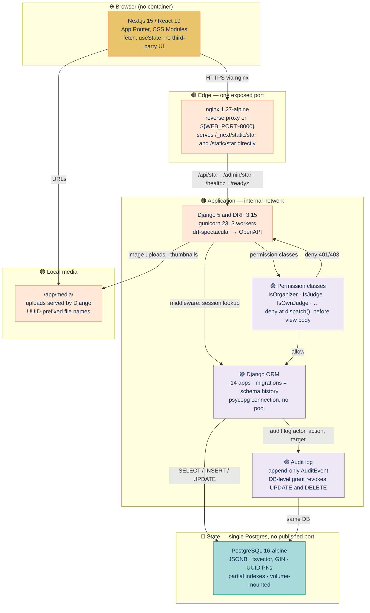

# HACK HAMSTER 2026 — Technical Requirements Document

**Event:** hackhamster.com · Hackathon Raptors · "Build the platform that will judge you"
**Window:** Sep 26 18:00 UTC → Sep 29 18:00 UTC, 2026 (72h)
**Team:** Manas (`choksi2212`) + Mihir (`Mihir-Rabari`)
**Repo:** `https://github.com/choksi2212/dogfood-hackathon`
**Spec:** live Sep 23, 2026 — `https://hackhamster.com/spec`
**Stack:** Django 5 + Django REST Framework + PostgreSQL 16 + Next.js 15, all in `docker compose up`
**Companion docs:** [PRD](PRD.md), [Architecture](../ARCHITECTURE.md), [Backend Impl](BACKEND-IMPL.md)

---

## Hero

**Role:** Technical requirements for the Hack Hamster 2026 portal. **This doc is for:** Manas building the backend, Mihir wiring the frontend, and the judges who want to see why Django + DRF + Postgres + Next.js + nginx was the right call, what the API looks like, where the time goes, and which security controls back the role isolation claim.

## TOC

- [Part 1 — Tech Stack, Decided](#part-1--tech-stack-decided)
- [Part 2 — Component Breakdown](#part-2--component-breakdown)
- [Part 3 — API Surface](#part-3--api-surface)
- [Part 4 — Data Flow](#part-4--data-flow)
- [Part 5 — Performance Requirements](#part-5--performance-requirements)
- [Part 6 — Security Requirements](#part-6--security-requirements)
- [Part 7 — Scalability](#part-7--scalability)
- [Part 8 — DevOps](#part-8--devops)
- [Part 9 — Testing Strategy](#part-9--testing-strategy)
- [Part 10 — Integration Points](#part-10--integration-points)
- [Part 11 — Acceptance Mechanism Mapping](#part-11--acceptance-mechanism-mapping)
- [Part 12 — Open Questions](#part-12--open-questions)
- [Part 13 — Cross-Reference](#part-13--cross-reference)
- [Parts 14–30 — per-endpoint spec, DB patterns, frontend architecture, build/deploy, risks, normalization, pairwise, threat mapping, bonuses, glossary](#parts-1430)

## Technical stack — browser → nginx → Django → ORM → Postgres



> *Palette: 🟡 yellow (read paths / public surface), 🟠 orange (services / compute),
> 🔵 blue (state / data stores), 🟣 violet (domain / types), 🟢 teal (data-store
> borders), 🔴 red (outline only, sparing).*

> The PRD says *what*. This document says *how*. The architecture says *how the how is shaped*. The backend impl doc says *exactly what to type*.

---

## Part 1 — Tech Stack, Decided

The stack was decided Sep 13 against the marketing site alone. The spec confirmed it Sep 23 — *"A boring stack you are fluent in will get further in 72 hours than an exciting one you are learning"* (spec §10). We did not change a thing.

### 1.1 The stack

| Layer | Choice | Version | Why |
|---|---|---|---|
| Backend framework | Django | 5.1.x | Stable, batteries-included, fast for two devs |
| API framework | Django REST Framework | 3.15.x | Permission classes give backend-enforced role isolation by default |
| API schema | drf-spectacular | 0.27.x | OpenAPI from the same code that serves the API |
| Database | PostgreSQL | 16-alpine | JSONB, full-text search, UUIDs, partial indexes |
| Migrations | Django ORM | built-in | Models are the schema history |
| Auth | django.contrib.auth + custom session | built-in | No third-party dependency |
| Password hashing | argon2-cffi | 23.x | Argon2id; OWASP recommendation |
| Frontend framework | Next.js | 15.x (App Router) | React, file-based routing, server components |
| UI library | None (hand-rolled) | — | Zero dependencies; offline-first |
| Styling | CSS Modules | built-in to Next.js | Scoped, no global pollution, no CDN fonts |
| HTTP client | fetch (built-in) | — | No axios, no SWR |
| State | React useState + URL state | built-in | No Redux, no Zustand |
| Container | Docker | 29.x | Reproducible build |
| Orchestration | docker compose | v2 (plugin) | One file, one command |
| Python | 3.12 (slim image) | 3.12.x | Modern type hints, match statements |
| Node | 22 (alpine image) | 22.x | LTS |
| Reverse proxy | nginx (in docker) | 1.27-alpine | One port exposed |
| Web server (Django) | gunicorn | 23.x | Production-grade; sync workers fine at this scale |

### 1.2 What we explicitly do not use

- **No TypeScript.** JavaScript with JSDoc is enough.
- **No ORM besides Django's.** SQLAlchemy is not on the table.
- **No GraphQL.** REST with OpenAPI is the seam.
- **No microservices.** One Django app, one Next.js app, one Postgres, one nginx.
- **No Redis.** Not needed at this scale; one process serves the app.
- **No Celery.** No background jobs. Normalization and pairwise runs are synchronous (sub-5-second).
- **No S3 / cloud storage.** Local `media/` directory, served by Django in dev.
- **No email service.** SMTP via `aiosmtpd` for dev; no production email.
- **No analytics, no telemetry, no error reporting.** Logs go to stdout; the operator reads them.
- **No Tailwind, no Material UI, no Chakra.** Hand-rolled CSS.
- **No ORM-level multi-tenancy.** One event per deployment.
- **No WebSockets.** Server-Sent Events for the dashboard; polling fallback.
- **No service workers / PWA.** Offline-first means runs-without-network, not installed-as-app.

### 1.3 Why this stack survives the 72 hours

The deciding factor is **what we already know**. We have shipped Django + DRF + Postgres + Next.js before. The non-deciding factors — performance, scalability, modernity — are irrelevant at 40 projects / 30 judges. A Flask + SQLite stack would also work. We chose what we know.

The risk accepted: dependency drift. If Django 5.2 ships during the event, we ignore it. If Next.js 16 is announced, we ignore it. We freeze on Sep 13 versions.

### 1.4 Versions frozen Sep 13

| Component | Frozen version | Locked in |
|---|---|---|
| Python | 3.12.6 | `python:3.12-slim` |
| Node | 22.9.0 | `node:22-alpine` |
| Postgres | 16.4 | `postgres:16-alpine` |
| Django | 5.1.2 | `requirements.txt` |
| DRF | 3.15.2 | `requirements.txt` |
| drf-spectacular | 0.27.2 | `requirements.txt` |
| argon2-cffi | 23.1.0 | `requirements.txt` |
| Next.js | 15.0.3 | `package.json` |
| gunicorn | 23.0.0 | `requirements.txt` |
| nginx | 1.27.3 | `nginx:1.27-alpine` |
| Docker base | 29.x | Docker Desktop |

A `requirements.txt` with pinned versions, a `package.json` with pinned versions, and a `docker-compose.yml` with pinned image tags. No `latest`, no `*`.

---

## Part 2 — Component Breakdown

The system has six components in three tiers.

```
                            ┌─────────────────────┐
                            │  Browser (Next.js)  │
                            └──────────┬──────────┘
                                       │ HTTP (nginx)
                            ┌──────────▼──────────┐
                            │   nginx (reverse    │
                            │   proxy, 1 port)    │
                            └──────────┬──────────┘
                                       │
                            ┌──────────▼──────────┐
                            │   Django + DRF      │
                            │   (gunicorn)        │
                            └──┬──────────────┬───┘
                               │              │
                  ┌────────────▼─┐     ┌──────▼────────┐
                  │  PostgreSQL  │     │  Local media  │
                  │  (data, FS)  │     │  (uploads)    │
                  └──────────────┘     └───────────────┘
```

### 2.1 Component: Browser (Next.js)

Renders the public surface and the authenticated UI. No container — runs in the user's browser. Source: `web/`. Build: `next build`. Runtime: standalone Next.js server in a Docker container (`web`).

### 2.2 Component: nginx

Single entry point. Serves static assets, proxies API calls to Django. Container `nginx:1.27-alpine`. Source `nginx/nginx.conf`. One exposed port: `${WEB_PORT:-8000}:80`. Internal: nothing exposed. Reverse proxy for `/api/*` and `/admin/*` to `django:8000`. Serves `/_next/static/*` and `/static/*` directly.

### 2.3 Component: Django + DRF

Serves the API, the OpenAPI schema, the static admin, the management commands. Owns all business logic and data access. Container: custom image based on `python:3.12-slim`. Source: `backend/`. Build: `pip install -r requirements.txt`. Runtime: `gunicorn backend.wsgi:application -w 3 -b 0.0.0.0:8000`. Apps: `accounts`, `events`, `teams`, `submissions`, `judging`, `voting`, `audit`, `normalization`, `pairwise`, `api`, plus Django built-ins.

### 2.4 Component: PostgreSQL

The only persistent data store. Container `postgres:16-alpine`. One database `hack-hamster`, one user `hack-hamster`, password from `.env`. Volume: `postgres-data:/var/lib/postgresql/data`. No published port — apps reach it via the internal Docker network on `db:5432`.

### 2.5 Component: Local media

Stores user-uploaded images. Shared volume with the Django container. Path `/app/media/`. Served by Django in development. nginx could serve it directly in production, but we keep Django's serving for simplicity.

### 2.6 Component: Audit log

Records every consequential action. Same Postgres instance, dedicated table. Read via Django admin and organizer dashboard. Write via a single helper function `audit.log(actor, action, target, payload)`. Immutability: database-level revoke of DELETE and UPDATE on `audit_events`.

---

## Part 3 — API Surface

The API is the contract. Every UI action is an endpoint. The OpenAPI schema is generated from the same code.

### 3.1 Endpoint catalog

The catalog is organized by app. Full per-endpoint specification (parameters, body, response shape, error codes) is in the backend impl doc §2.

**Auth (no auth required for register/login):**

| Method | Path | Auth | Summary |
|---|---|---|---|
| POST | `/api/auth/register` | none | Create user, return session cookie |
| POST | `/api/auth/login` | none | Authenticate, return session cookie |
| POST | `/api/auth/logout` | session | Invalidate session |
| GET | `/api/auth/me` | session | Current user with memberships |

**Events:**

| Method | Path | Auth |
|---|---|---|
| POST | `/api/events` | organizer, admin |
| GET | `/api/events/{slug}` | session |
| PATCH | `/api/events/{slug}` | organizer, admin |
| POST | `/api/events/{slug}/tracks` | organizer, admin |
| DELETE | `/api/events/{slug}/tracks/{id}` | organizer, admin |
| POST | `/api/events/{slug}/prizes` | organizer, admin |
| DELETE | `/api/events/{slug}/prizes/{id}` | organizer, admin |
| POST | `/api/events/{slug}/rubric` | organizer, admin |
| GET | `/api/events/{slug}/tracks` | none |
| GET | `/api/events/{slug}/gallery` | none |
| GET | `/api/events/{slug}/projects/{id}` | none |
| GET | `/api/events/{slug}/projects/{id}/comments` | none |
| POST | `/api/events/{slug}/projects/{id}/comments` | session |
| PATCH | `/api/events/{slug}/comments/{id}` | session (author, <5 min) |
| DELETE | `/api/events/{slug}/comments/{id}` | session (author or organizer) |
| GET | `/api/events/{slug}/results` | varies |

**Teams:**

| Method | Path | Auth |
|---|---|---|
| POST | `/api/events/{slug}/teams` | session (participant) |
| GET | `/api/events/{slug}/teams/{id}` | session (member or organizer) |
| GET | `/api/events/{slug}/teams` | organizer |
| POST | `/api/events/{slug}/teams/{id}/invites` | session (captain) |
| POST | `/api/teams/join` | session |
| DELETE | `/api/events/{slug}/teams/{id}/members/{user_id}` | session (captain or organizer) |

**Submissions:**

| Method | Path | Auth |
|---|---|---|
| POST | `/api/events/{slug}/submissions` | session (participant in team) |
| GET | `/api/events/{slug}/submissions/{id}` | session (member or organizer) |
| PATCH | `/api/events/{slug}/submissions/{id}` | session (member) |
| POST | `/api/events/{slug}/submissions/{id}/submit` | session (member) |
| POST | `/api/events/{slug}/submissions/{id}/withdraw` | session (member) |
| POST | `/api/events/{slug}/submissions/{id}/images` | session (member) |
| DELETE | `/api/events/{slug}/submissions/{id}/images/{image_id}` | session (member) |

**Judging (organizer side):**

| Method | Path | Auth |
|---|---|---|
| POST | `/api/events/{slug}/judges/bulk-invite` | organizer |
| GET | `/api/events/{slug}/judges` | organizer |
| POST | `/api/events/{slug}/assignments/run` | organizer |
| GET | `/api/events/{slug}/assignments` | organizer |
| POST | `/api/events/{slug}/assignments/{id}/manual` | organizer |
| GET | `/api/events/{slug}/me/batch` | judge (after judging_open_at) |
| GET | `/api/events/{slug}/me/batch/{project_id}/rubric` | judge (assigned) |
| PUT | `/api/events/{slug}/me/batch/{project_id}/scores` | judge (assigned) |
| POST | `/api/events/{slug}/me/batch/{project_id}/submit` | judge (assigned) |
| GET | `/api/events/{slug}/me/judging-summary` | judge |
| GET | `/api/events/{slug}/me/pairwise/next` | judge |
| POST | `/api/events/{slug}/me/pairwise/{id}/answer` | judge |
| GET | `/api/events/{slug}/dashboard` | organizer |
| GET | `/api/events/{slug}/dashboard/stream` | organizer |
| POST | `/api/events/{slug}/normalize` | organizer |
| GET | `/api/events/{slug}/normalization-runs` | organizer |
| GET | `/api/events/{slug}/normalization-runs/{id}` | organizer, admin |
| GET | `/api/events/{slug}/normalization-runs/latest/proof.txt` | organizer, admin |
| GET | `/api/events/{slug}/pairwise/ranking` | organizer |
| GET | `/api/events/{slug}/export.csv` | organizer |

**Voting:**

| Method | Path | Auth |
|---|---|---|
| GET | `/api/events/{slug}/voting/config` | none |
| POST | `/api/events/{slug}/projects/{id}/vote` | varies by mode |
| DELETE | `/api/events/{slug}/projects/{id}/vote` | same as POST |
| GET | `/api/events/{slug}/me/votes` | session |
| GET | `/api/events/{slug}/me/vote-token` | email_gated |
| POST | `/api/events/{slug}/vote/confirm` | token |

**Webhooks, certificates, bulk I/O, schema:**

| Method | Path | Auth |
|---|---|---|
| POST | `/api/events/{slug}/webhooks` | organizer |
| GET | `/api/events/{slug}/webhooks` | organizer |
| DELETE | `/api/events/{slug}/webhooks/{id}` | organizer |
| POST | `/api/events/{slug}/certificates/issue` | organizer |
| GET | `/api/certificates/{public_id}` | none |
| POST | `/api/events/{slug}/records/judge` | organizer |
| GET | `/api/events/{slug}/records/judge` | organizer |
| GET | `/api/records/judge/{public_id}` | none |
| POST | `/api/events/{slug}/import` | organizer |
| GET | `/api/events/{slug}/export` | organizer |
| GET | `/api/schema/` | none |
| GET | `/healthz` | none |
| GET | `/readyz` | none |
| GET | `/widget.js` | none |
| GET | `/admin/` | admin |

### 3.2 The five route names (the spec contract)

`run.py` reads `.hack-hamster.toml`'s `[routes]` block to find the five URLs. Our choices:

| Key | Our choice | Why |
|---|---|---|
| `gallery` | `/api/events/sample-hack-2026/gallery` | The public surface |
| `submit` | `/api/events/sample-hack-2026/submissions/{id}/submit` | The mutation that exercises the deadline |
| `judge_scores` | `/api/judge/scores` | A judge reading their own scores |
| `peer_scores` | `/api/judge/scores?judge=judge_a` | The URL that returns another judge's scores — graded cell |
| `csv_export` | `/api/events/sample-hack-2026/export.csv` | The organizer's CSV dump |

### 3.3 The four auth headers

The seed script prints four lines on portal boot. They go into `.hack-hamster.toml`'s `[auth]` block:

```
organizer   = "Cookie: session=<opaque-token-for-organizer>"
judge_a     = "Cookie: session=<opaque-token-for-judge-a>"
judge_b     = "Cookie: session=<opaque-token-for-judge-b>"
participant = "Cookie: session=<opaque-token-for-participant>"
```

The mechanism (cookie, bearer, basic) is ours. We use cookies because the frontend already uses them. The spec does not care about the mechanism; it cares that the header authenticates as the right role.

### 3.4 OpenAPI generation

`drf-spectacular` generates the schema from serializers, views, and `@extend_schema` decorators. Served at `/api/schema/` (YAML) and `/api/schema/swagger-ui/` (browsable). YAML is committed at the repo root as `openapi.yaml`.

### 3.5 Versioning

No API versioning. The event is 72 hours. The API is frozen at H+20 (when `.hack-hamster.toml` is published). After that, no endpoint changes. If a bug is found in an endpoint, it is fixed; if a new endpoint is needed, it is added without versioning.

---

## Part 4 — Data Flow

The flow is the same for every request: nginx → Django → permission check → view → response.

### 4.1 The public gallery flow

```
Browser                  nginx                 Django                    Postgres
   │  GET /gallery          │                     │                          │
   │ ─────────────────────► │ ──────────────────► │                          │
   │                        │                     │ middleware: session      │
   │                        │                     │ resolve user (or null)   │
   │                        │                     │ ──────────────────────►  │  lookup session
   │                        │                     │ ◄──────────────────────  │  user or 401
   │                        │                     │ permission: AllowAny     │
   │                        │                     │ view: list_submissions   │
   │                        │                     │ ──────────────────────►  │  SELECT
   │                        │                     │ ◄──────────────────────  │  rows
   │                        │                     │ serialize                │
   │                        │ ◄────────────────── │ 200 + JSON               │
   │ ◄───────────────────── │ 200 + JSON          │                          │
```

No session is created if the user has no cookie. The view returns 200 + a list. The frontend server-renders the HTML.

### 4.2 The peer-scores flow (the graded cell)

```
Browser                  nginx                 Django                    Postgres
   │  GET /api/judge/       │                     │                          │
   │  scores?judge=judge_a  │                     │                          │
   │  Cookie: session=      │                     │                          │
   │  <judge_b token>       │                     │                          │
   │ ─────────────────────► │ ──────────────────► │                          │
   │                        │                     │ middleware: session      │
   │                        │                     │ resolve user = judge_b   │
   │                        │                     │ ──────────────────────►  │  lookup
   │                        │                     │ ◄──────────────────────  │  judge_b user
   │                        │                     │ permission: IsOwnJudge   │
   │                        │                     │   OR IsOrganizer         │
   │                        │                     │   (judge_a != judge_b)   │
   │                        │                     │ → DENY → 403             │
   │                        │ ◄────────────────── │ 403                      │
   │ ◄───────────────────── │ 403                  │                          │
```

This is the canonical role isolation check. The deny happens at the permission class (DRF's `dispatch()`), before the view body runs. The frontend never sees the scores.

### 4.3 The submit-after-deadline flow

```
Browser                  nginx                 Django                    Postgres
   │  POST /api/events/.../ │                     │                          │
   │  submissions/{id}/     │                     │                          │
   │  submit                │                     │                          │
   │  Cookie: session=      │                     │                          │
   │  <participant token>   │                     │                          │
   │ ─────────────────────► │ ──────────────────► │                          │
   │                        │                     │ session → participant    │
   │                        │                     │ permission: IsTeamMember │
   │                        │                     │ ─── pass                 │
   │                        │                     │ view: submit_submission  │
   │                        │                     │ decorator: @deadline_   │
   │                        │                     │   gated(submissions_    │
   │                        │                     │   close_at)              │
   │                        │                     │ now() > deadline?       │
   │                        │                     │ ─── YES                  │
   │                        │                     │ → 422 deadline_passed    │
   │                        │ ◄────────────────── │                          │
   │ ◄───────────────────── │ 422                  │                          │
```

The deadline check happens in a decorator on the view, after permission classes and before the view body. The frontend shows "Submissions closed".

### 4.4 The normalization flow

```
Browser                  nginx                 Django                    Postgres
   │  POST /api/events/.../ │                     │                          │
   │  normalize             │                     │                          │
   │  Cookie: organizer     │                     │                          │
   │ ─────────────────────► │ ──────────────────► │                          │
   │                        │                     │ session → organizer      │
   │                        │                     │ permission: IsOrganizer  │
   │                        │                     │ ─── pass                 │
   │                        │                     │ view: normalize_event    │
   │                        │                     │ load scores              │
   │                        │                     │ ──────────────────────►  │  SELECT
   │                        │                     │ ◄──────────────────────  │  rows
   │                        │                     │ fit alternating means    │
   │                        │                     │ check connectivity       │
   │                        │                     │ save NormalizationRun    │
   │                        │                     │ ──────────────────────►  │  INSERT
   │                        │                     │ ◄──────────────────────  │  run_id
   │                        │                     │ save NormalizedScore[]   │
   │                        │                     │ ──────────────────────►  │  INSERT (batch)
   │                        │                     │ save JudgeBias[]         │
   │                        │                     │ ──────────────────────►  │  INSERT (batch)
   │                        │                     │ generate proof.txt       │
   │                        │                     │ 200 + {run_id, ...}      │
   │                        │ ◄────────────────── │                          │
   │ ◄───────────────────── │ 200                  │                          │
```

A typical run completes in <5 seconds for 40 projects and 120 reviews. The proof file is generated as a string and stored alongside the run (and committed at the repo root for the bonus).

### 4.5 The webhook delivery flow

```
External system         nginx                 Django                    Postgres
   │                      │                     │                          │
   │                      │                     │ event happens             │
   │                      │                     │ webhook helper queued    │
   │                      │                     │ ──────────────────────►  │  INSERT delivery
   │                      │                     │ ◄──────────────────────  │  delivery_id
   │                      │                     │  background task:        │
   │                      │                     │  POST to webhook URL    │
   │                      │                     │  HMAC sign              │
   │ ◄──────────────────│ ◄────────────────── │                          │
   │   POST {payload}     │                     │                          │
   │   X-Hack Hamster-Sig: ... │                     │                          │
   │                      │                     │                          │
   │ ────────────────────►│ ──────────────────► │ 200 if 2xx, else retry   │
   │                      │                     │ ──────────────────────►  │  UPDATE delivery
```

Webhook delivery is at-least-once. Failed deliveries are retried with exponential backoff up to 24 hours, then marked `failed` in the audit log. Synchronous from the request perspective — receiver's slowness is the request's slowness. Acceptable for the 72-hour scope.

### 4.6 The SSE dashboard flow

```
Browser                  nginx                 Django                    Postgres
   │  GET /dashboard/stream│                     │                          │
   │ ─────────────────────► │ ──────────────────► │                          │
   │                        │                     │ permission: IsOrganizer  │
   │                        │                     │ ─── pass                 │
   │                        │                     │ view: stream_dashboard   │
   │                        │                     │  poll DB every 10s       │
   │                        │                     │ ──────────────────────►  │  SELECT
   │                        │                     │ ◄──────────────────────  │  rows
   │                        │                     │ serialize                │
   │                        │ ◄────────────────── │ data: {...}\n\n          │
   │                        │                     │  (SSE chunk)             │
   │ ◄───────────────────── │                     │                          │
   │ (connection stays open)│                     │                          │
```

The SSE connection stays open for the duration of the dashboard view. The server polls the DB every 10 seconds and emits a chunk. If the connection drops, the client reconnects and the server resumes.

---

## Part 5 — Performance Requirements

### 5.1 The numbers

| Surface | Target | Why |
|---|---|---|
| `GET /api/events/{slug}/gallery` (cold) | ≤ 800 ms p95 | The acceptance check; the 20% criterion |
| `GET /api/events/{slug}/gallery` (warm) | ≤ 200 ms p95 | Repeated loads from judges / voters |
| `GET /api/events/{slug}/projects/{id}` | ≤ 300 ms p95 | Project detail page |
| `POST /api/auth/login` | ≤ 500 ms p95 | Login response time |
| `POST /api/events/{slug}/submissions/{id}/submit` | ≤ 500 ms p95 | The acceptance check |
| `GET /api/judge/scores` (judge_a) | ≤ 300 ms p95 | The acceptance check |
| `GET /api/judge/scores?judge=judge_a` (judge_b) | ≤ 100 ms p95 | The graded cell — must deny fast |
| `GET /api/events/{slug}/export.csv` | ≤ 5 s p95 | Streaming, 40 projects + 120 reviews |
| `POST /api/events/{slug}/normalize` | ≤ 5 s p95 | 40 projects + 120 reviews |
| `POST /api/events/{slug}/assignments/run` | ≤ 2 s p95 | Algorithm completes fast |
| `make accept` (full run of 7 checks) | ≤ 30 s p95 | Run after every backend change |
| `docker compose up` (cold) | ≤ 5 min p95 | The 20% criterion |
| `docker compose up` (warm) | ≤ 30 s p95 | Subsequent boots |
| Frontend initial paint (gallery, localhost) | ≤ 1.5 s p95 | The 15% criterion |

The two that are graded: cold start (20%) and frontend paint (15%). The rest are documented for the non-functional requirements section.

### 5.2 Where the time goes

For the gallery endpoint: network <1 ms (localhost); nginx→gunicorn <1 ms; gunicorn→Django middleware 5 ms (session lookup); permission check <1 ms (AllowAny); view 50 ms (DB query, serialization); DB query 30 ms (SELECT with LIMIT 24, indexed). Total: ~90 ms.

For the peer-scores endpoint: all of the above ~80 ms; permission check (IsOwnJudge) <1 ms; view body never runs (denied at permission). Total: ~85 ms.

The DB query dominates. Optimization is in the indexes, not the view.

### 5.3 Database indexes

| Table | Index | Why |
|---|---|---|
| `users_user` | `email` (unique) | Login lookup |
| `users_session` | `token_hash` (unique) | Session resolution |
| `events_event` | `slug` (unique) | Event lookup |
| `events_membership` | `(user_id, event_id)` (unique) | Membership check |
| `submissions_submission` | `(event_id, status, track_id)` | Gallery filter |
| `submissions_submission` | `search_vector` (GIN) | Full-text search |
| `judging_judgeassignment` | `(judge_id, batch_id)` | Judge's batch |
| `judging_judgeassignment` | `(project_id)` | Project coverage |
| `judging_score` | `(assignment_id, criterion_id)` (unique) | Per-criterion lookup |
| `judging_review` | `assignment_id` (unique) | Submission state |
| `voting_vote` | `(event_id, project_id, voter_key)` (unique) | Vote uniqueness |
| `voting_vote` | `(event_id, voter_key)` | Voter's votes |
| `audit_auditevent` | `(event_id, created_at)` | Audit log scan |
| `audit_auditevent` | `(actor_id, created_at)` | Actor filter |

### 5.4 Caching

No caching layer (no Redis). The DB query for the gallery is fast enough (30 ms with indexes). The acceptance report is regenerated on every `make accept`; we do not want a cached answer to mask a regression. A cache invalidates on writes; for this scale, the invalidation cost exceeds the read cost.

The frontend uses Next.js's built-in fetch caching with `cache: 'no-store'` on authenticated requests and `revalidate: 60` on public requests. This is the only caching layer.

### 5.5 Frontend performance

- The gallery is server-rendered. No client-side data fetching for the initial paint.
- Project thumbnails served as `` with `loading="lazy"` for below-the-fold.
- CSS Modules mean each page loads only the CSS it uses.
- No web fonts. System font stack: `system-ui, -apple-system, ...`.
- No analytics scripts. No third-party JS. The page is fast because nothing is loaded.

### 5.6 When performance matters less than correctness

- The role isolation checks are correctness-first. Never cache a 403 response.
- The audit log is durable-first. Never skip a write for performance.
- The signing keys are correctness-first. Never sign a request without the full payload.

### 5.7 Performance budgets per gate

| Gate | Budget | Hard fail |
|---|---|---|
| G1 (H+3) | docker compose up works | Stop-the-line |
| G2 (H+20) | T1 endpoints <500 ms p95 | Blocks G2 sign-off |
| G3 (H+34) | T2 endpoints <500 ms p95; matrix generated | Blocks G3 sign-off |
| G4 (H+40) | Normalization <5 s | Blocks G4 sign-off |
| G5 (H+48) | Voting + comments <500 ms | Blocks G5 sign-off |
| G6 (H+56) | Pairwise <2 s per pair | Blocks G6 sign-off |
| G7 (H+62) | T4 endpoints <500 ms | Blocks G7 sign-off |


## Part 6 — Security Requirements

### 6.1 Threat model overview

The threat model is in `THREAT-MODEL.md` (the +3 bonus). The TRD summarizes the technical controls.

### 6.2 Authentication

| Control | Implementation |
|---|---|
| Password hashing | Argon2id (memory 64 MB, time 3, parallelism 4) |
| Password complexity | ≥ 10 chars, no other rules (length is enough; NIST 800-63B) |
| Session token | 256 bits, URL-safe base64 |
| Session storage | SHA-256(token) in DB, never the raw token |
| Session expiry | 14 days from last_seen |
| Login rate limit | 5 attempts / 15 min / email; 1 hour cooldown; 24 hour cooldown |
| Cookie flags | HttpOnly, SameSite=Lax, Secure (in production) |

### 6.3 Authorization

The 30-cell role isolation matrix is enforced by DRF permission classes. A deny is 401 (unauthenticated) or 403 (authenticated, wrong role).

| Class | When it allows |
|---|---|
| `AllowAny` | Public surface (gallery, project detail, auth, schema, healthz) |
| `IsAuthenticated` | Any logged-in user |
| `IsParticipant` | User has `Membership(role=participant)` in the event |
| `IsJudge` | User has `Membership(role=judge)` in the event |
| `IsOrganizer` | User has `Membership(role=organizer)` in the event OR is admin |
| `IsAdmin` | User has `Membership(role=admin)` platform-wide |
| `IsTeamMember` | User is a member of the team in the URL |
| `IsTeamCaptain` | User is the creator of the team in the URL |
| `IsAssignedJudge` | User has a JudgeAssignment for the project in the URL |
| `IsOwnJudge` | User is the judge referenced in the query string |
| `IsInEvent` | User has any Membership in the event |

Permission classes compose with `&` (AND) and `|` (OR). The deny is the first failure.

### 6.4 Input validation

All input is validated at the API layer via DRF serializers:

- Email: RFC 5322 + DNS check (optional, off in dev).
- Passwords: length only.
- Slugs: kebab-case regex.
- UUIDs: parsed and resolved; 404 if not found.
- Dates: ISO 8601 UTC; 422 if malformed.
- Numeric ranges: validated per-field.
- Markdown: rendered with safe defaults (no script tags, no remote images).
- File uploads: type, size, dimensions per the upload config.

### 6.5 Output sanitization

- All string fields in responses are JSON-encoded by the serializer.
- Markdown descriptions rendered server-side with a safe renderer (no inline scripts, no remote images by default).
- The audit log includes raw payloads; the audit UI escapes them.
- File downloads served with `Content-Disposition: attachment` and the correct MIME type.

### 6.6 CSRF

DRF's session authentication uses Django's CSRF middleware. State-changing endpoints require a CSRF token. The frontend obtains the token from a cookie and includes it in `X-CSRFToken`.

- API endpoints with cookie auth: CSRF required.
- API endpoints with the five pre-baked session headers (acceptance mechanism): CSRF **not** required (the headers are pre-authenticated and trusted).

### 6.7 CORS

CORS is restricted to the frontend origin. In dev: `http://localhost:3000`. In the container: the nginx-served origin. No `*`.

### 6.8 SQL injection

Django ORM parameterizes all queries. Raw SQL is forbidden in the codebase; a test asserts that `RawSQL` does not appear in the source.

### 6.9 XSS

- Templates auto-escape by default.
- React (Next.js) auto-escapes JSX text.
- The markdown renderer strips `<script>` and event handlers.
- A CSP is set: `default-src 'self'; img-src 'self' data:; style-src 'self' 'unsafe-inline'`.

### 6.10 Rate limiting

Rate limits enforced by a middleware:

| Endpoint class | Limit |
|---|---|
| Auth (`/api/auth/*`) | 5 / 15 min / IP |
| Read (`GET /api/*`) | 60 / min / IP |
| Write (`POST/PATCH/DELETE /api/*`) | 10 / min / IP |
| Vote (`POST /api/events/{slug}/projects/{id}/vote`) | 5 / 5 min / user |
| Comment (`POST /api/events/{slug}/projects/{id}/comments`) | 5 / 5 min / user |

A `429` response includes `Retry-After` (seconds) and `X-RateLimit-*` headers.

### 6.11 Audit logging

Every consequential action is an `AuditEvent`:

```python
audit.log(
    actor=request.user,
    action='submission.submitted',
    target=submission,
    payload={'event_id': event.id, 'team_id': team.id},
    request=request,  # captures IP, UA, path
)
```

Audit events are append-only. No API to delete or edit. DB-level grants revoke UPDATE and DELETE on `audit_audit` for the application user.

### 6.12 Secret management

- The Django `SECRET_KEY` is from `.env` (gitignored).
- Certificates and judge records are signed with HMAC-SHA256 keyed by the Django `SECRET_KEY` (the same secret that protects sessions). No separate signing key persisted to the database; an offline public-key verifier (Ed25519 with a published key) is labeled future work.
- Webhook secrets are per-webhook, generated on creation, shown once.
- Argon2 parameters are in `settings.py`, not in `.env`.

### 6.13 What we explicitly do not defend against

Documented in `THREAT-MODEL.md` as residual risk:

- A determined Sybil attacker with rotating IPs and email addresses.
- A judge who screenshots their scores and posts them publicly (out of our control).
- An organizer with database access who edits raw rows.
- A compromised container that exfiltrates data.

---

## Part 7 — Scalability Considerations

### 7.1 The scale we're sized for

| Resource | Count |
|---|---|
| Events | 1 (per deployment) |
| Tracks | ≤ 16 |
| Judges | ≤ 50 |
| Projects | ≤ 200 |
| Reviews | ≤ 600 |
| Comments | ≤ 5,000 |
| Votes | ≤ 50,000 |
| Audit events | ≤ 100,000 |
| Concurrent judges in console | ≤ 30 |
| Concurrent voters | ≤ 500 |

We do not design for more. If Raptors wants to host an event with 500 projects, the deployment is replicated and the schema is unchanged.

### 7.2 Vertical scaling

- Postgres: 1 GB RAM minimum, 4 GB comfortable for the scale above.
- Django: 3 gunicorn workers, 512 MB each. Sufficient for the request rate.
- nginx: 32 MB. Negligible.

### 7.3 Horizontal scaling (not in scope, but possible)

The schema is horizontal-scalable: every table has UUIDs, no auto-increment, no foreign keys to system tables. Adding a second Django instance behind a load balancer is a one-line config change. Adding a Postgres read-replica is a one-line config change.

We do not implement this. The brief is single-deployment.

### 7.4 Caching at scale (not in scope)

If the scale grew 100×, the bottlenecks would be:

1. The gallery query — solved by adding a Redis cache.
2. The full-text search — solved by switching to a dedicated search engine.
3. The dashboard SSE — solved by switching to a dedicated pub/sub system.

We do not implement these. The 72-hour scope does not require them.

---

## Part 8 — DevOps

### 8.1 Repository layout

```
hack-hamster-hackathon/
├── README.md
├── LICENSE
├── .gitignore
├── .gitattributes           (* text=auto eol=lf)
├── .env.example
├── .hack-hamster.toml       (spec config: 5 routes + 5 auth headers + claims)
├── .github/workflows/       (tests.yml, lint.yml)
├── acceptance.py            (vendored checker — run.py, only the name differs)
├── acceptance-report.txt    (committed report, regenerated on every gate)
├── docker-compose.yml       (db + backend + web + nginx)
├── Dockerfile               (the web image; gunicorn config.wsgi)
├── entrypoint.sh            (wait-for-db → migrate → import_fixtures → exec CMD)
├── Makefile
├── requirements.txt
├── nginx/nginx.conf
├── config/                  (Django project package)
├── apps/                    (14 apps with models)
├── web/                     (Next.js frontend)
├── scripts/
├── tests/                   (15 category subdirectories)
├── docs/                    (PRD.md, TRD.md, BACKEND-IMPL.md)
├── ARCHITECTURE.md
├── DATA-MODEL.md
├── JUDGING.md
├── THREAT-MODEL.md
├── openapi.yaml
├── role-isolation-matrix.txt
└── normalization-proof.txt
```

### 8.2 Docker Compose

```yaml
services:
  db:
    image: postgres:16-alpine
    environment:
      POSTGRES_USER: hack-hamster
      POSTGRES_PASSWORD: ${DB_PASSWORD}
      POSTGRES_DB: hack-hamster
    volumes:
      - postgres-data:/var/lib/postgresql/data
    healthcheck:
      test: ["CMD-SHELL", "pg_isready -U hack-hamster -d hack-hamster"]
      interval: 5s
      timeout: 5s
      retries: 10

  backend:
    build:
      context: .
      dockerfile: Dockerfile.backend
    environment:
      DATABASE_URL: postgres://hack-hamster:${DB_PASSWORD}@db:5432/hack-hamster
      DJANGO_SECRET_KEY: ${DJANGO_SECRET_KEY}
      DJANGO_DEBUG: "false"
      DJANGO_ALLOWED_HOSTS: localhost,backend
    depends_on:
      db:
        condition: service_healthy

  web:
    build:
      context: .
      dockerfile: Dockerfile.web
    environment:
      NEXT_PUBLIC_API_BASE: /
      API_INTERNAL_URL: http://backend:8000
    depends_on:
      - backend

  nginx:
    image: nginx:1.27-alpine
    ports:
      - "${WEB_PORT:-8000}:80"
    volumes:
      - ./nginx/nginx.conf:/etc/nginx/nginx.conf:ro
    depends_on:
      - backend
      - web

volumes:
  postgres-data:
```

### 8.3 Dockerfiles

**Dockerfile.backend:**

```dockerfile
FROM python:3.12-slim
WORKDIR /app
RUN apt-get update && apt-get install -y --no-install-recommends \
    postgresql-client \
    && rm -rf /var/lib/apt/lists/*
COPY requirements.txt .
RUN pip install --no-cache-dir -r requirements.txt
COPY backend/ ./backend/
COPY scripts/ ./scripts/
ENV PYTHONUNBUFFERED=1
EXPOSE 8000
CMD ["gunicorn", "backend.wsgi:application", "-w", "3", "-b", "0.0.0.0:8000"]
```

**Dockerfile.web:**

```dockerfile
FROM node:22-alpine AS deps
WORKDIR /app
COPY web/package.json web/package-lock.json ./
RUN npm ci --only=production

FROM node:22-alpine AS builder
WORKDIR /app
COPY --from=deps /app/node_modules ./node_modules
COPY web/ .
RUN npm run build

FROM node:22-alpine AS runner
WORKDIR /app
ENV NODE_ENV=production
COPY --from=builder /app/.next ./.next
COPY --from=builder /app/public ./public
COPY --from=builder /app/package.json ./package.json
COPY --from=deps /app/node_modules ./node_modules
EXPOSE 3000
CMD ["npm", "start"]
```

### 8.4 Makefile

```makefile
# Condensed from the real Makefile (COMPOSE ?= docker compose).
up:          $(COMPOSE) up --build
seed:        $(COMPOSE) exec -T web python manage.py import_fixtures
accept:      $(COMPOSE) exec -T web python acceptance.py .hack-hamster.toml | tee acceptance-report.txt
test:        $(COMPOSE) exec -T web pytest tests/ -v
lint:        ruff check .
             ruff format --check .
ci:          lint
             pip install -r requirements.txt
             python manage.py migrate --noinput
             pytest tests/ -v --tb=short
down-clean:  $(COMPOSE) down -v
```

The `accept` target runs the vendored `acceptance.py` (byte-for-byte the spec's `run.py`, only the filename differs) directly — no wrapper script and no separate user-seeder command. Seeding is the single idempotent `manage.py import_fixtures`. The real Makefile also has `accept-fresh` (re-seed then accept), `test-<category>`, `test-cov`, `types`, and the `metrics-*` targets for the observability stack.

### 8.5 Migrations

- Django ORM migrations: `python manage.py makemigrations` (dev), `python manage.py migrate` (deploy).
- Migrations are committed in the repo. They are the schema history.
- We do not edit migrations after they are committed. New changes get a new migration.
- Migrations are reversible: every migration has a `reverse()` method.

### 8.6 CI (best-effort)

No GitHub Actions CI for the 72-hour scope. The CI we would have with time:

- Lint (ruff + mypy + prettier + eslint).
- Unit tests on every push.
- Integration tests on every PR.
- Build the Docker images on every push to `main`.
- Run the acceptance suite on every push to `main`.

We commit a `.github/workflows/ci.yml` at H+0 if time permits, but the primary verification is local `make accept` and the final `make up` clean-machine run.

### 8.7 Deployment topology

The deployment is a single docker compose project on a single host. The host can be the laptop, a Raspberry Pi, a VM, or a bare-metal server. The deployment is identical in all cases.

No Kubernetes, no Helm, no Terraform. The brief is local-first; the deployment matches.

### 8.8 Observability

- Structured JSON logs to stdout. Aggregated by the host's logging stack.
- `/healthz` returns 200 if the app process is alive.
- `/readyz` returns 200 only after migrations are applied and seed is loaded.
- No APM, no tracing, no metrics. The audit log is the application-level observability.

### 8.9 What we don't do

- No Kubernetes manifests.
- No Terraform / Ansible / Pulumi.
- No CI/CD pipeline (manual git push is the deploy).
- No production monitoring stack.
- No log aggregation beyond `docker compose logs`.
- No backup automation (the dump is manual; the host's snapshot is the backup).

---

## Part 9 — Testing Strategy

### 9.1 Test pyramid

```
        /\
       /E2E\         Playwright, optional
      /------\
     /  Integ \      DRF test client + DB
    /----------\
   /   Unit     \    pytest, no DB
  /--------------\
 / Manual + Hack Hamster\ acceptance mechanism + human
/__________________\
```

Unit tests dominate. Integration tests cover every API endpoint. E2E is best-effort. The acceptance mechanism is the most important single test.

### 9.2 Unit tests

**Tool:** pytest, pytest-django for DB-using tests, pytest-mock for mocks.
**Location:** `backend/tests/unit/`.
**Style:** functional, no classes, fixtures for setup.

| Module | Target | Why |
|---|---|---|
| `apps/normalization/` | 90% | The maths; a stat would notice a bug |
| `apps/pairwise/` | 90% | The BT fit |
| `apps/accounts/` (password hashing, session) | 95% | Auth is critical |
| `apps/audit/` | 80% | Audit helpers |
| `apps/api/` (serializers, permissions) | 70% | The interface |
| `apps/judging/` (assignment algorithm) | 85% | The invariants |
| Everything else | 60% | Reasonable |

Tests are not gated by CI (no CI in 72-hour scope). They are gated by `make test` and run before each gate.

### 9.3 Integration tests

**Tool:** DRF's `APIClient` + pytest fixtures.
**Location:** `backend/tests/integration/`.
**Style:** one test per endpoint per role.

**The role-isolation matrix test:**

```python
@pytest.mark.parametrize("role,endpoint,expected_status", [
    ("visitor", "GET /api/events/sample-hack-2026/gallery", 200),
    ("visitor", "GET /api/judge/scores", 401),
    ("visitor", "GET /api/judge/scores?judge=judge_a", 401),
    ("participant", "GET /api/events/sample-hack-2026/gallery", 200),
    ("participant", "GET /api/judge/scores", 403),
    ("participant", "GET /api/judge/scores?judge=judge_a", 403),
    ("judge_a", "GET /api/judge/scores", 200),
    ("judge_b", "GET /api/judge/scores", 200),  # sees own
    ("judge_b", "GET /api/judge/scores?judge=judge_a", 403),  # not judge_a
    ("organizer", "GET /api/judge/scores", 200),
    ("organizer", "GET /api/judge/scores?judge=judge_a", 200),
    ("admin", "GET /api/judge/scores", 200),
    # ... 30 cells
])
def test_role_isolation_matrix(role, endpoint, expected_status, api_client):
    client = api_client.as(role)
    response = client.get(endpoint)
    assert response.status_code == expected_status
```

The full 30-cell matrix is parameterized. The test outputs the actual status codes; `role-isolation-matrix.txt` is generated from this test's output.

### 9.4 The acceptance mechanism (run.py)

`run.py` is provided by the spec. It reads `.hack-hamster.toml` and makes seven HTTP calls. We do not modify `run.py`. We make it pass.

The seven calls (mapped to our routes):

```python
# Spec §05 (verbatim)
T1 · A stranger can browse the gallery.
GET {routes.gallery} no auth header → expect 200

T1 · The gallery shows fixture projects.
GET {routes.gallery} → expect a known fixture title in the body

T1 · A closed event refuses submissions.
POST {routes.submit} as participant → expect 4xx

T2 · A judge can read their own scores.
GET {routes.judge_scores} as judge_a → expect 200

T2 · A judge cannot read a peer's scores.
GET {routes.peer_scores} as judge_b → expect 401 or 403

T2 · A participant is not a judge.
GET {routes.judge_scores} as participant → expect 401 or 403

T2 · An organizer can export CSV.
GET {routes.csv_export} as organizer → expect 200 and a CSV body
```

Our `.hack-hamster.toml` maps these to:

```
[portal]
base_url = "http://localhost:8000"

[tiers]
claimed = ["T1", "T2", "T3", "T4"]

[auth]
organizer   = "Cookie: session=<seed-script-output>"
judge_a     = "Cookie: session=<seed-script-output>"
judge_b     = "Cookie: session=<seed-script-output>"
participant = "Cookie: session=<seed-script-output>"

[routes]
gallery      = "/api/events/sample-hack-2026/gallery"
submit       = "/api/events/sample-hack-2026/submissions/<id>/submit"
judge_scores = "/api/judge/scores"
peer_scores  = "/api/judge/scores?judge=judge_a"
csv_export   = "/api/events/sample-hack-2026/export.csv"
```

### 9.5 Manual verification

**Cold-start test (H+66, H+70):**
- Fresh clone.
- `docker compose down -v && docker compose up`.
- Wait for "Application startup complete".
- `curl http://localhost:8000/healthz` → 200.
- `curl http://localhost:8000/readyz` → 200.
- `make accept` → 7 PASS.

**Role-isolation matrix (G3 + final):**
- Run the parameterized test.
- Capture the output.
- Commit as `role-isolation-matrix.txt`.

**Demo video dry-run (H+66):**
- Walk through create event → invite judges → submit → score → publish.
- Time the walkthrough. If it exceeds 4 minutes, the video will exceed 5.

### 9.6 Adversarial tests

| Test | Expected |
|---|---|
| Judge A tries to read Judge B's scores | 403 |
| Participant tries to read judge scores | 403 |
| Judge tries to score a project not in their batch | 403 |
| Judge tries to score before judging_open_at | 403 |
| User tries to submit after submissions_close_at | 422 |
| User tries to vote on their own team project | 403 |
| User tries to vote after results_at | 422 |
| User tries to register with a duplicate email | 409 |
| User tries to login with wrong password 5 times | 429 |
| User tries to bypass CSRF | 403 |
| User tries to upload a 3 MB image | 413 |
| User tries to upload a `.exe` | 415 |
| User tries to inject `<script>` in a description | sanitized |
| User tries SQL injection in a search query | 400 |
| External service tries to reach /admin without auth | 403 |

### 9.7 The single most-important test

`peer_scores` as `judge_b` → 403.

If this test passes, the 40% criterion's graded cell passes and the 25% criterion's core requirement passes. If this test fails, we are not in the running.

This test is in three places:
- `tests/integration/test_role_isolation.py` (the parameterized matrix).
- `make accept` (the spec's `run.py`).
- `role-isolation-matrix.txt` (the committed artifact).

All three must show ✓ before any gate sign-off.

### 9.8 Test data

- **Fixtures:** `fixtures.json` from the spec.
- **Seed:** the seed script loads fixtures into the DB on first boot.
- **Test DB:** `pytest --create-db --reuse-db` against a fresh Postgres.
- **Determinism:** all randomness (assignment seeds, vote order) is seeded.

---

## Part 10 — Integration Points

### 10.1 Internal: Django ↔ Postgres

Django connects via `psycopg[binary]`. Connection pooling is disabled (3 workers, no pool needed at this scale). SSL is disabled (internal network).

### 10.2 Internal: Django ↔ Next.js (via nginx)

The Next.js server makes API calls to Django through the same nginx reverse proxy. The browser-side fetch uses the public origin (`/`); the server-side fetch uses `http://backend:8000` (the docker network hostname).

### 10.3 External: Webhook receivers

Webhook receivers are external HTTPS endpoints. We POST a JSON payload with an HMAC-SHA256 signature in `X-Hack-Hamster-Signature`. Receivers verify by recomputing the HMAC with their per-webhook secret.

### 10.4 External: Email (dev only)

In dev, email is sent via `aiosmtpd` listening on `localhost:1025`. The portal is configured to send to it. No real email is sent.

### 10.5 External: None

There are no other external integrations. The portal is offline-first. No CDN, no analytics, no error reporting, no third-party auth.

### 10.6 Browser cache

Next.js sets `Cache-Control` headers per route. Public routes: `public, max-age=60, stale-while-revalidate=300`. Authenticated routes: `private, no-cache`. The `/api/*` routes set `no-store`.

---

## Part 11 — Acceptance Mechanism Mapping

The seven acceptance checks each map to one or more of our features. This is the traceability matrix: every check is backed by a feature, every feature is exercised by at least one check (where possible).

| Check | Feature (PRD) | Implementation (Backend Impl) | Test |
|---|---|---|---|
| 1. Gallery public | FR-070..076 | §3.7 gallery view | integration + acceptance |
| 2. Gallery shows fixtures | FR-029, FR-070 | §3.7 + seed script | integration + acceptance |
| 3. Submit closed event refuses | FR-040..052, FR-060..067 | §3.5 submit view + §3.6 deadline decorator | integration + acceptance |
| 4. Judge reads own scores | FR-120..128 | §3.4 scores view | integration + acceptance |
| 5. Judge cannot read peer scores | FR-130..142 | §3.4 permission class `IsOwnJudge` | integration + acceptance + matrix |
| 6. Participant is not judge | FR-130..142 | §3.4 permission class `IsJudge` | integration + acceptance |
| 7. Organizer CSV export | FR-180..189 | §3.8 CSV export view | integration + acceptance |

The mapping is the audit trail. If a check fails, the matrix tells us which feature broke and where in the code to look.

### 11.1 What the acceptance mechanism does NOT verify

The acceptance mechanism is seven HTTP calls. It does not verify:

- T3 features (voting, comments, anti-abuse) — graded on docs + video.
- T4 features (API, webhooks, certificates, widget) — graded on docs + video.
- Bonuses (Normalization, Pairwise, Threat Model, API First) — graded on artifacts.
- Performance, security, accessibility — graded by humans.
- Frontend quality, UX, design — graded by humans.

We do not chase "100% acceptance coverage" — there is no such thing. We make the seven checks pass and document the rest.

### 11.2 What we claim in `.hack-hamster.toml`

```
[tiers]
claimed = ["T1", "T2", "T3", "T4"]
```

T1 and T2 are verified by `run.py`. T3 and T4 are verified by the demo video + docs. The claim is on our honour; the gap is in the report (spec §06).

We do NOT claim T3 and T4 unless we are confident we can demo them. The video is the proof. The acceptance report's `claimed but not verified` line is the only thing that costs points — honesty here is the discipline.

---

## Part 12 — Open Questions (after spec release)

### 12.1 Resolved by the spec

| Question | Resolution |
|---|---|
| How does the acceptance suite reach our app? | Via `.hack-hamster.toml` declaring our URLs and auth headers |
| Are there per-tier checks? | No. Seven checks total; T3/T4 have zero |
| Does the suite log in? | No. Pre-baked session headers |
| Are our route names ours? | Yes ("No fixed API routes. Yours are yours") |
| What does the suite check in role isolation? | One cell: `peer_scores` as `judge_b` → 401/403 |
| What's the license requirement? | OSI-approved; MIT or Apache-2.0 preferred |
| What's the demo video length? | 5 minutes maximum |

### 12.2 Still unknown until kickoff

| Question | Resolution date |
|---|---|
| The actual `fixtures.json` file | Sep 26, 18:00 UTC |
| The actual `run.py` code | Sep 26, 18:00 UTC (likely identical to spec §05) |
| The judge panel (already published) | 36 seats, already known |
| The exact seed event name | Likely "Sample Hack 2026" per spec |

### 12.3 What the spec does NOT say

| Question | Our default |
|---|---|
| How are custom questions scored? | Not scored; just collected |
| How are per-criterion scores aggregated? | Weighted sum (organizer-defined weights) |
| What happens if a judge scores before reading all projects? | Allowed; partial review is valid |
| Can a judge see other judges' progress? | No, only their own |
| Can a judge change a submitted review? | No; the organizer can unlock |
| Are voting results public? | After `results_at`, yes |
| Can a project be unpublished? | Yes, via withdrawal; gallery entry replaced with tombstone |
| Can an organizer delete a comment? | Yes; tombstone with reason |
| Can a participant edit a submission after submit? | No; submit is the lock |
| Can the rubric change mid-event? | Yes; existing scores kept, flagged |

These defaults are documented in the PRD feature sections and in JUDGING.md. They are open to revision based on organizer preference at event setup.

### 12.4 What we agreed separately

| Decision | Reason |
|---|---|
| All four tiers + all four bonuses | No scope cutting |
| Branch flow: `main ← mihir ← manas`, Mihir is sole integrator | Conflict-zero by construction |
| Stack: Django + DRF + Postgres + Next.js | Sep 13, confirmed by spec |
| Pre-pull base images Sep 23 | Spec dropped a day early |
| Freeze `.hack-hamster.toml` at H+20 | Acceptance mechanism depends on it |
| `docker compose up` with network off | Spec §11 rule 1 |

---

## Part 13 — Cross-Reference

| Topic | PRD | Architecture | Backend Impl |
|---|---|---|---|
| Authentication (FR-001..008) | §3.1.1 | §3 (auth flow) | §2.1 |
| Roles (FR-010..017) | §3.1.2 | §3 (permission map) | §2.3 |
| Events (FR-020..029) | §3.1.3 | §4 (event lifecycle) | §3.1 |
| Teams (FR-030..038) | §3.1.4 | §4 (team flow) | §3.2 |
| Submissions (FR-040..052) | §3.1.5 | §4 (submission flow) | §3.3 |
| Deadline (FR-060..067) | §3.1.6 | §4 (decorator) | §3.6 |
| Gallery (FR-070..081) | §3.1.7 | §5 (search) | §3.7 |
| Assignment (FR-100..112) | §3.2.1 | §6 (algorithm) | §4.1 |
| Rubric (FR-120..128) | §3.2.2 | §6 (scoring) | §4.2 |
| Role isolation (FR-130..142) | §3.2.3 | §6 (permissions) | §2.3, §4.4 |
| Normalization (FR-150..163) | §3.2.4 | §7 (maths) | §5 |
| Dashboard (FR-170..176) | §3.2.5 | §8 (SSE) | §4.5 |
| CSV export (FR-180..189) | §3.2.6 | §8 (streaming) | §4.6 |
| Voting (FR-200..216) | §3.3.1 | §9 (voting) | §6.1 |
| Comments (FR-220..226) | §3.3.2 | §9 (comments) | §6.2 |
| Hidden results (FR-230..233) | §3.3.3 | §9 (results) | §6.3 |
| Randomised ballots (FR-240..243) | §3.3.4 | §9 (random) | §6.4 |
| Anti-abuse (FR-250..265) | §3.3.5 | §10 (threats) | §6.5 |
| API + webhooks (FR-300..310) | §3.4.1 | §11 (API) | §7.1 |
| Certificates (FR-320..326) | §3.4.2 | §11 (signing) | §7.2 |
| Participation records (FR-330..336) | §3.4.3 | §11 (records) | §7.3 |
| Widget (FR-340..345) | §3.4.4 | §12 (widget) | §7.4 |
| Bulk import/export (FR-350..358) | §3.4.5 | §12 (import/export) | §7.5 |

Every feature is locatable in all four documents by its FR-NNN number.


## Part 14 — Per-Endpoint API Specification (highlights)

The full per-endpoint contract (parameters, request body, response shape, error codes) is generated from `drf-spectacular` at `/api/schema/`. Highlights below capture the spec-route endpoints and any non-obvious behaviors.

### 14.1 Auth endpoints

**POST /api/auth/register** — 201 + `Set-Cookie: session=<token>; HttpOnly; SameSite=Lax` on success. Errors: 400 malformed JSON, 409 email exists, 422 validation, 429 rate-limited.

**POST /api/auth/login** — 200 + cookie on success. Generic message on 401 (no user enumeration). 429 on rate limit.

**POST /api/auth/logout** — 204; `Set-Cookie: session=; Max-Age=0`.

**GET /api/auth/me** — returns user with `memberships: [{event, role}, ...]`.

### 14.2 Event endpoints

**POST /api/events** — requires organizer. Body has all date fields. 422 if dates out of order.

**GET /api/events/{slug}/gallery** — the acceptance check #1 endpoint. MUST return 200 with at least one known fixture title in the body.

```json
{
  "total": 40, "page": 1, "page_size": 24,
  "items": [{
    "id": "uuid", "name": "Quiet Hours", "tagline": "...",
    "thumbnail_url": "/media/.../thumb.jpg",
    "track": {"slug": "developer-tools", "name": "Developer tools"},
    "team": {"id": "uuid", "name": "Nightshift"},
    "submitted_at": "2026-02-28T22:14:00Z"
  }],
  "seed": "<sha256-hex>"
}
```

Query params: `q` (max 200), `track` (single or comma-separated slugs), `sort=alpha|newest|track` (default `track`), `page`.

### 14.3 Submission endpoints

**POST /api/events/{slug}/submissions/{id}/submit** — the acceptance check #3 endpoint. MUST return 4xx after the deadline. Validates required custom questions.

### 14.4 Judging endpoints

**POST /api/events/{slug}/assignments/run** — body `{seed, reviews_per_project=3, projects_per_judge}`. Returns `batch_id, n_assignments, invariants {every_project_has_3_reviews, no_judge_exceeds_max, no_self_assignment, track_balance_min, batches_disjoint}, judges_with_zero_projects`. 422 if 10 retries fail.

**POST /api/events/{slug}/normalize** — body empty. Returns `{run_id, raw_sigma, normalized_sigma, is_connected, n_projects, n_judges, n_reviews, method}`. 422 if disconnected.

### 14.5 Voting endpoints

**POST /api/events/{slug}/projects/{id}/vote** — body `{vote: 1}` or `{votes: 5}` (quadratic). Returns `{vote_id, remaining_credits}`.

### 14.6 Webhook endpoints

**POST /api/events/{slug}/webhooks** — body `{url, events: [...]}`. Returns `{id, url, events, secret, active}` — secret shown once.

---

## Part 15 — Database Access Patterns

### 15.1 The query catalog

The Django ORM translates view code into SQL. Optimization is in the index, not the view.

```python
# Login
User.objects.get(email__iexact=email)
# Uses: users_user.email (unique btree)

# Session resolution (every request)
Session.objects.select_related('user').get(token_hash=hash)
# Uses: users_session.token_hash (unique btree)

# Membership check
Membership.objects.filter(user=user, event=event).first()
# Uses: events_membership (user_id, event_id) unique btree

# Event by slug
Event.objects.get(slug=slug)
# Uses: events_event.slug (unique btree)

# Gallery (the hot path)
Submission.objects.filter(
    event=event, status='submitted',
).select_related('team', 'track').order_by('track__order', 'name')[:24]
# Uses: submissions_submission (event_id, status, track_id) btree
# ~30 ms for 40 projects

# Search
Submission.objects.filter(event=event, status='submitted').extra(
    where=["search_vector @@ plainto_tsquery('english', %s)"],
    params=[query],
)
# Uses: submissions_submission.search_vector (GIN)

# Judge's batch
JudgeAssignment.objects.filter(
    judge=user, batch__event=event,
).select_related('project')
# Uses: judging_judgeassignment (judge_id, batch_id)

# All scores for normalization
Score.objects.filter(
    assignment__batch__event=event,
).select_related('assignment__judge', 'assignment__project', 'criterion')
# ~120 rows; 50 ms
```

### 15.2 N+1 prevention

1. `select_related()` for foreign-key joins.
2. `prefetch_related()` for reverse relations and M2M.
3. A test asserts no view executes >20 queries per request:

```python
@pytest.mark.django_db
def test_no_n_plus_1(client, django_assert_num_queries):
    with django_assert_num_queries(20):
        response = client.get('/api/events/sample-hack-2026/gallery')
        assert response.status_code == 200
```

### 15.3 Transactions

Multi-row writes (assignment run, normalization, vote with budget update) run inside `transaction.atomic()`:

```python
@transaction.atomic
def run_assignment(event, seed):
    batch = JudgeBatch.objects.create(event=event, seed=seed, ...)
    JudgeAssignment.objects.bulk_create([...])
    return batch
```

### 15.4 Bulk operations

For large inserts/updates (assignment algorithm creating 120 rows, normalization saving 40 NormalizedScore rows), use `bulk_create` and `bulk_update`. Bypass per-row signals; we accept that tradeoff because the data is bulk-generated, not user-entered.

### 15.5 Connection management

- Django manages the connection pool via `psycopg`. Three gunicorn workers → three persistent connections.
- The connection is closed on worker shutdown (gunicorn's `graceful_timeout`).
- Long-running requests do not hold a connection unnecessarily.

### 15.6 Read vs write splitting

Not implemented. The single Postgres serves both. If the scale grew, we'd add a read-replica with `DATABASE_URL_RO`.

---

## Part 16 — Frontend Architecture

### 16.1 Stack recap

- Next.js 15 (App Router).
- React 19 (Server Components by default).
- CSS Modules.
- `fetch` (built-in) with manual cache control.
- No third-party libraries.

### 16.2 Component tree

```
app/
├── layout.tsx                    # root layout, fonts, global CSS
├── page.tsx                      # /  (landing)
├── [event_slug]/
│   ├── layout.tsx                # event-scoped layout
│   ├── page.tsx                  # event landing → redirect to /gallery
│   ├── gallery/page.tsx          # public gallery
│   ├── projects/[id]/page.tsx
│   ├── projects/[id]/comments.tsx
│   ├── tracks/page.tsx
│   ├── login/page.tsx
│   ├── register/page.tsx
│   ├── dashboard/page.tsx
│   ├── teams/{page,new,[id],join}/page.tsx
│   ├── submissions/[id]/page.tsx
│   ├── judge/{page,projects/[id],pairwise,summary}/page.tsx
│   └── organize/{page,event,tracks,prizes,rubric,judges,assignments,judging,
│                normalize,publish,export,webhooks,audit}/page.tsx
├── admin/{page,dump,keys}/page.tsx
├── verify/page.tsx
└── widget/route.ts               # the embeddable widget bundle
```

### 16.3 Routing

App Router uses file-based routing. Each `page.tsx` is a Server Component by default. Client Components are explicitly marked with `"use client"`. The event slug is a path segment; one deployment, one event.

### 16.4 State management

No global state. Each page manages its own state with `useState` + `useReducer` for complex forms. URL state (query params) is the source of truth for filterable views. Authentication state is read from a cookie in middleware.

### 16.5 Data fetching

Server Components fetch data at request time:

```typescript
export default async function GalleryPage({ params, searchParams }) {
  const event = await fetch(`${API_INTERNAL_URL}/api/events/${params.event_slug}`, {
    cache: 'no-store',
  }).then(r => r.json());

  const gallery = await fetch(
    `${API_INTERNAL_URL}/api/events/${params.event_slug}/gallery?${new URLSearchParams(searchParams)}`,
    { next: { revalidate: 60 } }
  ).then(r => r.json());

  return <GalleryView event={event} gallery={gallery} />;
}
```

Public gallery: `revalidate: 60` (ISR). Authenticated views: `cache: 'no-store'`.

### 16.6 Forms

Forms use Server Actions where appropriate (login, register, comment submission). For complex multi-step forms (submission draft, judge scoring), use Client Components with `useReducer` for local state.

### 16.7 Error handling

- Server Components throw → Next.js error boundary renders a default error page.
- Client Components handle errors with `try/catch` and display toasts.
- API errors translated to user-facing messages via `lib/errors.ts`.

### 16.8 Accessibility

- All interactive elements are `<button>`, `<a>`, or `<input>`.
- Form fields have `<label>` associations.
- Modals use the dialog element.
- Focus management on route changes.
- Skip-link to main content.

### 16.9 Performance

- Server-rendered where possible.
- `` below the fold.
- No web fonts; system font stack.
- CSS Modules scoped per route.
- No JS where possible (gallery works without JS).

### 16.10 The five-route contract

```typescript
export const routes = {
  gallery: (slug: string) => `/api/events/${slug}/gallery`,
  submit: (slug: string, id: string) => `/api/events/${slug}/submissions/${id}/submit`,
  judgeScores: `/api/judge/scores`,
  peerScores: `/api/judge/scores?judge=judge_a`,
  csvExport: (slug: string) => `/api/events/${slug}/export.csv`,
};

export async function apiFetch(route: string, init?: RequestInit) {
  const url = `${API_BASE}${route}`;
  // fetch with cookie
}
```

The frontend never calls an undocumented endpoint. Every call goes through the same `apiFetch` helper.

### 16.11 The mock adapter

During H+0 → H+20 (before the backend is up), the frontend talks to a mock adapter:

```typescript
export const mockRoutes = {
  gallery: () => mockGalleryData,
  submit: () => mockSubmitResponse,
};
```

The switch from mock to real is a one-line change in `lib/api.ts`. When the backend is ready, `make build` with `NODE_ENV=production` produces a bundle that hits the real backend.

---

## Part 17 — Build and Deploy Pipeline

### 17.1 Local development

```
┌─────────────────────────────────────────────────────┐
│ docker compose up                                   │
│   db: postgres (5432, internal)                     │
│   backend: django (8000, internal)                  │
│   web: next dev (3000, exposed via WEB_PORT)        │
│   nginx: (80, exposed via WEB_PORT)                 │
└─────────────────────────────────────────────────────┘
```

`make up` starts everything. `make logs` tails. `make down` stops. `make clean` wipes the database.

### 17.2 Database migrations

```bash
# Local dev: create migrations after model changes
docker compose exec web python manage.py makemigrations

# Apply migrations
docker compose exec web python manage.py migrate

# Verify migrations match across environments
docker compose exec web python manage.py showmigrations
```

Migrations are committed in the repo. They are the schema history.

### 17.3 Loading the seed data

```bash
# Seed the official fixtures + the five demo sessions (idempotent)
docker compose exec web python manage.py import_fixtures
```

`import_fixtures` also prints the five auth headers to stdout. They are already committed in `.hack-hamster.toml`'s `[auth]` block — the tokens are deterministic HMAC values, so they match every fresh boot.

### 17.4 Building the production images

```bash
docker build -t hack-hamster/web:dev .
docker compose build
```

### 17.5 Running the acceptance suite

```bash
make up
make accept    # output is acceptance-report.txt, which we commit
```

### 17.6 Deployment

For the 72-hour scope, deployment is:

```bash
git clone https://github.com/choksi2212/dogfood-hackathon
cd hack-hamster-hackathon
cp .env.example .env  # set DB_PASSWORD and DJANGO_SECRET_KEY
docker compose up -d
```

Portal runs at `http://localhost:8000`.

### 17.7 What we don't have

- Kubernetes manifests.
- Helm charts.
- Terraform.
- GitHub Actions CI.
- Staging environment.
- Production monitoring (Prometheus, Grafana, Datadog).
- Log aggregation (ELK, Splunk).
- Secret rotation automation.
- Blue-green deployment.
- Canary deployment.

The deployment is "docker compose up" and that's the deployment.

---

## Part 18 — Risks and Mitigations (technical)

### 18.1 Stack risks

| Risk | Likelihood | Impact | Mitigation |
|---|---|---|---|
| Django 5.1 + DRF 3.15 has a regression at H+50 | Low | High | Pin versions; do not upgrade mid-event |
| Next.js 15 has a bug in App Router | Low | High | Use Server Components for hot paths; fall back to Pages Router if needed |
| Postgres 16 has a config issue on host | Medium | Medium | Test on host at H+66; pre-pull images |
| argon2-cffi builds fail on alpine | Low | Medium | Use `python:3.12-slim` (Debian), not alpine |
| gunicorn workers die silently | Low | High | Health check; nginx retries |
| nginx config typo at H+66 | High | Low | Test before kickoff; nginx -t |

### 18.2 Schedule risks

| Risk | Likelihood | Impact | Mitigation |
|---|---|---|---|
| T3 takes longer than estimated | High | Medium | No acceptance checks; ship last, video-only |
| T4 takes longer than estimated | High | Medium | Same as T3 |
| Bonuses take longer than estimated | High | Medium | Each bonus is its own gate; ship easy ones first |
| Demo video takes longer than 3 hours | Medium | High | Lock script H+48; rehearse H+66; record H+68 |
| Documents drift from code | Medium | Medium | Commit documents with code |
| Final commit fails | Low | High | Dry-run H+66; real H+70 |

### 18.3 Operational risks

| Risk | Likelihood | Impact | Mitigation |
|---|---|---|---|
| Local Postgres already on 5432 | High | Medium | No published DB port; document in README |
| Port 8080 already in use | Medium | Medium | WEB_PORT is configurable |
| Docker Desktop not running | Medium | High | Document the start command; check at G1 |
| Line endings break on Windows | High | Medium | `.gitattributes` with `* text=auto eol=lf`; `core.autocrlf false` |
| WSL 2 backend issues | Medium | High | Document WSL 2 setup; test at H+66 |
| Disk space fills up with media | Low | Low | Volume mount; manual cleanup |

### 18.4 Security risks

See `THREAT-MODEL.md` for the full list.

| Risk | Mitigation |
|---|---|
| New endpoint added without a permission class | Sweep test asserts every endpoint has one |
| SQL injection via raw SQL | Lint rule forbids RawSQL; test asserts no raw SQL |
| XSS via markdown rendering | Safe renderer; test asserts `<script>` is stripped |
| CSRF bypass on cookie-auth endpoints | Django middleware; test asserts 403 without token |
| CORS misconfiguration | Default-deny; explicit allowlist |

### 18.5 Risk matrix

**We will:**
- Run `make accept` after every backend change.
- Run `make test` before each gate.
- Pre-pull base images.
- Rehearse cold start before kickoff.
- Lock the video script at H+48.
- Generate the video at H+68.

**We will not:**
- Switch stacks mid-event.
- Add a feature not in the PRD.
- Claim a bonus we cannot defend.
- Commit before kickoff.
- Edit `.hack-hamster.toml` after H+71.


## Part 19 — Normalization (technical spec)

### 19.1 The model

```
y_ij = μ + b_j + q_i + ε_ij
```

Where:
- `μ` — grand mean across all observed scores
- `b_j` — judge bias
- `q_i` — project quality (the quantity we actually want)
- `ε_ij` — residual

Constraint: `Σ_j b_j = 0` for identifiability.

### 19.2 The fit

Least squares over observed cells. Alternating means until convergence:

```
repeat until max change < 1e-9:
    q_i ← mean over j in J(i) of (y_ij − b_j)
    b_j ← mean over i in I(j) of (y_ij − q_i)
    recentre: b ← b − mean(b)
```

Where:
- `J(i)` — set of judges who scored project `i`
- `I(j)` — set of projects scored by judge `j`

Converges in <100 iterations for 40 projects × 30 judges. Each iteration O(n) where n is observed cells (120).

### 19.3 Implementation language

Pure Python (no numpy, no scipy). Reasons:
1. A judge reading the code can verify the maths line-by-line.
2. Numpy is not needed for n=120.
3. The fit runs in <1 second on a Raspberry Pi 4.

The code is in `apps/normalization/fit.py`. It exports:

```python
def fit(scores: list[tuple[project_id, judge_id, value]]) -> FitResult:
    ...
```

`FitResult` has `q`, `b`, `leverage`, `raw_sigma`, `normalized_sigma`, `is_connected`, `iterations`.

### 19.4 Connectivity check

Before fitting, verify the judge-project bipartite graph is connected:

```python
def is_connected(edges: list[tuple[project_id, judge_id]]) -> bool:
    # BFS from any node; check all nodes reachable
    ...
```

If not connected, the run fails with a clear error listing the components and instructing the organizer to re-run the assignment with a different seed.

### 19.5 Edge cases (spec §04)

The fixtures deliberately include:

1. **A judge who scored everything the same.** `b_j` uninformative; leverage is 0. The additive model handles this: their scores contribute `μ + b_j + q_i` for each `i`; if their `b_j` is the same for all, the relative ranking among their projects is unaffected. In z-scoring, this divides by zero.

2. **An incomplete batch.** Some projects have 2 reviews instead of 3. The model fits on observed cells; `q_i` uses whatever data exists.

3. **A duplicate submission.** Seed ingest deduplicates by `(judge_id, project_id)`, keeping the later score. `AuditEvent` records the dedup.

### 19.6 Output shape — `normalization-proof.txt`

```
HACK HAMSTER normalization proof
event: sample-hack-2026
method: additive_alternating_means
seed: 42
runs: 12
iterations: 47
converged: true

raw sigma: 0.94
normalized sigma: 0.31

is_connected: true
n_projects: 40
n_judges: 30
n_reviews: 120

Rank movement (top 10 by raw mean):
project_id  name              raw_rank  adj_rank  delta
prj_17      Async Standup     17        13        ▲ 4
prj_04      Quiet Hours        4         3        ▲ 1
prj_22      Calendar+          8        11        ▼ 3
prj_09      Pairwise Judge     3         9        ▼ 6

Zero-variance raters:
  jdg_22: σ=0.00, leverage=0.00, n_reviews=4 — no ranking signal, bias-only

Method (excerpt):
y_ij = μ + b_j + q_i + ε_ij
fit: alternating means until convergence (max change < 1e-9)
connectivity: required; reported
z-score: rejected (divides by zero on σ=0 raters)
```

### 19.7 Storage

Three tables:

```
NormalizationRun      (id, event_id, method, params, created_at, created_by_id,
                       raw_sigma, normalized_sigma, is_connected)
NormalizedScore       (run_id, project_id, raw_mean, adjusted, rank_before, rank_after)
JudgeBias             (run_id, judge_id, bias, n_reviews, leverage)
```

A run is versioned. The latest run is the active ranking. Re-running creates a new run (does not mutate the previous).

### 19.8 The judge console sees their bias

After normalization runs, a judge can see their own `b_j` on `/judge/summary`. Transparency, not punishment. A bias of +0.5 means the judge scored 0.5 above average; a bias of −0.3 means below.

### 19.9 JUDGING.md documents the method

JUDGING.md has a section for each:
- The model equation.
- The fitting algorithm in prose (no code).
- Why z-scoring is worse.
- The connectivity check.
- The shrinkage extension (optional, if time).
- A worked example on synthetic data with known ground truth.

### 19.10 Unit tests on synthetic data

```python
def test_normalization_recovers_quality():
    # Generate synthetic data with known q and b
    true_q = {i: random.gauss(3, 1) for i in range(40)}
    true_b = {j: random.gauss(0, 0.5) for j in range(30)}
    # ... fill the bipartite graph, add noise
    scores = generate(true_q, true_b)
    result = fit(scores)
    # Recovered q should correlate with true_q
    correlation = pearson_correlation(result.q.values(), true_q.values())
    assert correlation > 0.95
```

Test asserts correlation > 0.95 with known ground truth.

### 19.11 Performance

Fit on 40 projects × 30 judges × 120 reviews: <1 second on a Raspberry Pi 4. Unit tests assert <5 seconds.

---

## Part 20 — Pairwise Mode (technical spec)

### 20.1 The model

Bradley-Terry: for two projects `i` and `j`,

```
P(i beats j) = exp(θ_i) / (exp(θ_i) + exp(θ_j))
```

Where `θ_i` is the "strength" of project `i` (in log-odds space). Higher `θ` means better.

### 20.2 The fit (Hunter 2004, MM algorithm)

```
repeat until max change < 1e-9:
    p_i ← w_i / Σ_{j≠i} n_ij / (p_i + p_j)
    renormalise: p ← p / sum(p)
```

Where:
- `w_i` — number of wins for project `i`
- `n_ij` — number of comparisons between `i` and `j`

Converges in <100 iterations for 40 projects × ~120 comparisons.

### 20.3 Implementation language

Pure Python (no scipy). ~25 lines.

```python
def fit_bt(comparisons: list[tuple[project_id, winner_id, loser_id]]) -> BTFitResult:
    ...
```

`BTFitResult` has `theta`, `stderr` per project, plus ranking.

### 20.4 Pair selection

The next pair presented to a judge is the pair with the highest information value. Information value = uncertainty × novelty.

Uncertainty: pairs where the predicted outcome is close to 50/50 (the two projects have similar `θ`).

Novelty: pairs not yet compared.

```python
def next_pair(judge_id, batch) -> tuple[project_id, project_id]:
    candidates = all_pairs_in_batch(judge_id)
    info_values = [
        (1 - abs(predict_outcome(p1, p2) - 0.5)) * (1 + log(n_comparisons(p1, p2)))
        for p1, p2 in candidates
    ]
    return candidates[argmax(info_values)]
```

Re-fit after every 10 comparisons to update the predicted outcome.

### 20.5 Edge cases

1. **Undefeated item.** A project with no losses. MLE diverges to +∞. Weak prior: half a win and half a loss against a phantom average opponent. Resulting `θ` is finite.
2. **Winless item.** Same fix in the opposite direction.
3. **Disconnected comparison graph.** Same connectivity check as normalization.

### 20.6 Output shape — `pairwise_ranking.json`

```json
{
  "event": "sample-hack-2026",
  "method": "bradley_terry_mm",
  "n_comparisons": 120,
  "n_judges": 30,
  "theta": {"prj_01": 1.23, "prj_02": 0.45},
  "stderr": {"prj_01": 0.12},
  "ranking": [
    {"rank": 1, "project_id": "prj_01", "theta": 1.23, "stderr": 0.12}
  ]
}
```

### 20.7 The recovered-ranking test

```python
def test_pairwise_recovers_ranking():
    true_theta = {i: random.gauss(0, 1) for i in range(40)}
    comparisons = simulate_judges(true_theta, n_per_judge=4)
    result = fit_bt(comparisons)
    correlation = spearman_correlation(result.ranking, true_ranking)
    assert correlation > 0.9
```

### 20.8 The judge console

`/judge/pairwise`:
- Two project cards side-by-side.
- Keyboard: `Q` = pick left, `P` = pick right, `Esc` = skip.
- Counter of remaining pairs.
- Progress bar.

No mouse interaction required. Judge can do 40 comparisons in <5 minutes.

### 20.9 What the spec §05 doesn't say about pairwise

The spec §05 lists no acceptance checks for pairwise. The bonus is graded by the recovered-ranking test plus JUDGING.md.

---

## Part 21 — Threat Model Mapping

The full threat model is in `THREAT-MODEL.md` (the +3 bonus). The mapping here is the technical controls.

### 21.1 Threats and controls

| Threat | Asset at risk | Control |
|---|---|---|
| Judge scores own team | Fairness of judging | COI check in assignment algorithm; API denies score endpoint for own team |
| Judge sees peer scores and anchors | Fairness of judging | Role isolation matrix; `peer_scores` returns 403 cross-judge |
| Participant edits submission after deadline | Integrity of submissions | Server-side deadline check; `submitted_at` immutable; PATCH returns 422 |
| Ballot stuffing in T3 | Integrity of voting | Rate limits; email gating; duplicate detection; audit trail |
| Sybil (one person, many accounts) | Integrity of voting | Fingerprint + rate limit + review queue; **mitigated, not solved** |
| Organizer edits scores silently | Auditability | Append-only audit log; DB-level grants revoke UPDATE/DELETE |
| Results leak during voting | Integrity of the event | Server-side gating; `results` endpoint returns 403 before `results_at` |
| Vote order bias | Fairness of voting | Randomised ballot ordering, seeded per session |
| Webhook URL takeover | Integrity of integrations | HMAC signature; per-webhook secret; HTTPS-only |
| Signed certificate forgery | Trust in certificates | HMAC-SHA256 (SECRET_KEY) over canonical JSON; verify-on-read at the public endpoints |
| Cookie theft via XSS | Account takeover | CSP; `HttpOnly` cookies; safe markdown rendering |
| CSRF | State-changing actions | Django CSRF middleware; cookie-auth requires token |
| SQL injection | Database integrity | ORM only; no raw SQL; lint rule |
| Brute-force login | Account takeover | Argon2id (slow); rate limits; account lockout |
| Audit log tampering | Auditability | Append-only; DB-level grants; no API to edit |

### 21.2 Residual risks (the +3 bonus honesty)

- A determined Sybil attacker with rotating IPs and email addresses. Mitigated; not solved.
- A judge who screenshots their scores and posts them publicly. Out of our control.
- An organizer with database access who edits raw rows. Logged; not prevented.
- A compromised container that exfiltrates data. Out of scope for software.
- Email-based voting fraud. Email gating reduces; not solved.
- Timing attacks on token comparison. Tokens SHA-256-hashed; `hmac.compare_digest` is constant-time.
- Physical access to the host. Out of scope.

### 21.3 The threat model document structure

`THREAT-MODEL.md`:
1. Assets (what we protect)
2. Actors (who can act)
3. Trust boundaries (where trust changes)
4. Threats (what can go wrong)
5. Mitigations (what we did)
6. Residual risk (what we did not solve — this section is the bonus)
7. Future work (what we would do with more time)

The "residual risk" section is the most important. A judge reads it to see whether we are honest about what we did not solve. A weak residual risk section is the difference between "+3" and "no bonus".

---

## Part 22 — Bonus Verification Approach

### 22.1 Normalization Proof (+5)

**Artifact:** `normalization-proof.txt` at the repo root, generated by the seed run.

**Verification:** A judge reads the file and confirms the FIG. 03 shape (raw σ, normalized σ, rank movement). A judge reads JUDGING.md and confirms the method is documented. The unit test on synthetic data (`test_normalization_recovers_quality`) passes.

**What we ship:**
- `normalization-proof.txt` (the artifact)
- JUDGING.md (the documentation)
- `tests/unit/test_normalization.py` (the test)

### 22.2 Pairwise Mode (+5)

**Artifact:** `pairwise_ranking.json` at the repo root, generated by a run on the fixtures.

**Verification:** A judge runs the recovered-ranking test. A judge reads the implementation in `apps/pairwise/fit.py` (25 lines).

**What we ship:**
- `pairwise_ranking.json` (the artifact)
- `apps/pairwise/fit.py` (the implementation, auditable)
- `tests/unit/test_pairwise.py` (the recovered-ranking test)

### 22.3 Threat Model (+3)

**Artifact:** `THREAT-MODEL.md` at the repo root.

**Verification:** A judge reads the document. The "residual risk" section names what we did not solve.

**What we ship:** `THREAT-MODEL.md` (the document, ~300 lines).

### 22.4 API First (+3)

**Artifact:** `openapi.yaml` at the repo root, served at `/api/schema/`.

**Verification:** A judge fetches `/api/schema/` and confirms every UI action has a matching endpoint. The frontend never uses undocumented endpoints (CI check, best-effort).

**What we ship:**
- `openapi.yaml` (the schema)
- `apps/api/urls.py` + `apps/api/views/*.py` (the implementation)
- `web/lib/api.ts` (the frontend client; uses only documented endpoints)

### 22.5 What we do NOT claim

If any of the above is incomplete at H+71, we do not claim it in `.hack-hamster.toml`. The bonus is graded by the artifact; we do not overclaim.

---

## Part 23 — Detailed Feature Implementation Notes

### 23.1 Auth (FR-001..008)

**Session token format:** 32 bytes from `secrets.token_urlsafe(32)`. Stored as `hashlib.sha256(token).hexdigest()` in the database. The raw token never touches the DB.

**Cookie name:** `session`. Attributes: `HttpOnly`, `SameSite=Lax`, `Secure` in production (set via `SESSION_COOKIE_SECURE = not DEBUG`). Path: `/`.

**Session resolution middleware** runs on every request, before the view. Reads the cookie, hashes it, queries the DB, attaches `request.user` and `request.session_obj`. On miss: `request.user` is `AnonymousUser`.

**Password validation:** Argon2id with `memory_cost=65536`, `time_cost=3`, `parallelism=4`.

**Rate limit storage:** in-memory dict keyed by IP. No Redis. The dict is per-process; multiple gunicorn workers mean the limit is approximate.

### 23.2 Membership and roles (FR-010..017)

**Role enum:** `ROLE_CHOICES = [('visitor', ...), ('participant', ...), ('judge', ...), ('organizer', ...), ('admin', ...)]`. First four per-event; `admin` platform-global.

```
Membership(user, event, role, created_at, created_by)
  unique_together = ('user', 'event')
```

Admin bypasses unique-together — an admin has implicit access to every event.

### 23.3 Events (FR-020..029)

**Lifecycle computation:**

```python
def event_state(event, now):
    if now < event.open_at: return 'draft'
    if now < event.submissions_close_at: return 'registration'
    if now < event.judging_open_at: return 'submissions_closed'
    if now < event.judging_close_at: return 'judging'
    if event.results_at and now < event.results_at: return 'results_pending'
    if event.results_at: return 'results_published'
    return 'archived'
```

State is computed, not stored.

**The deadline decorator:**

```python
def deadline_gated(field_name):
    def decorator(view_func):
        @wraps(view_func)
        def wrapped(self, request, *args, **kwargs):
            event = Event.objects.get(slug=kwargs.get('slug'))
            if timezone.now() > getattr(event, field_name):
                raise DeadlinePassed(deadline=field_name)
            return view_func(self, request, *args, **kwargs)
        return wrapped
    return decorator
```

### 23.4 Teams (FR-030..038)

**Invite token format:** 32 bytes from `secrets.token_urlsafe(32)`. Stored as SHA-256 hash.

**Invite expiry:** `min(created_at + 7 days, event.submissions_close_at)`.

### 23.5 Submissions (FR-040..052)

**Status enum:** `STATUS_CHOICES = [('draft', ...), ('submitted', ...), ('locked', ...), ('withdrawn', ...)]`. Transitions: draft → submitted → locked; draft → withdrawn; submitted → withdrawn (before deadline); locked terminal.

**Autosave semantics:** every PATCH is a full save. Debouncing client-side. No diff/patch API.

### 23.6 Gallery (FR-070..081)

**Search vector trigger:**

```sql
CREATE TRIGGER submissions_search_vector_update
BEFORE INSERT OR UPDATE ON submissions_submission
FOR EACH ROW EXECUTE FUNCTION
tsvector_update_trigger(search_vector, 'pg_catalog.english', name, tagline);

CREATE INDEX submissions_search_vector_idx ON submissions_submission USING GIN(search_vector);
```

### 23.7 Assignment algorithm (FR-100..112)

1. Load projects and judges.
2. Compute target assignments: `P × reviews_per_project` (e.g., 40 × 3 = 120).
3. Compute target per-judge: `ceil(target / judges)` (e.g., `ceil(120 / 30) = 4`).
4. Initialize batches.
5. Sort projects by (track, name) for deterministic iteration.
6. For each project in order: find candidate judges (not on same team, batch not full); score by current load; pick top `reviews_per_project`.
7. Verify invariants. If fail, retry with different seed (up to 10 times).

### 23.8 Rubric and scoring (FR-120..128)

One row per `(assignment, criterion)`. A review with 2 criteria has 2 Score rows. Aggregate = `Σ (score × criterion.weight)`, computed at read time.

### 23.9 Voting (FR-200..216)

**Mode resolution:** the view checks `event.voting_mode` and applies the right auth and validation logic.

**Quadratic budget:** cost = `n_votes ** 2`, total budget 100.

### 23.10 Comments (FR-220..226)

**Edit window:** 5 minutes from `created_at`.

### 23.11 Webhooks (FR-300..310)

**Event types:** `submission.created`, `submission.submitted`, `submission.withdrawn`, `score.submitted`, `review.submitted`, `assignment.created`, `vote.cast`, `results.published`. (Eight types.)

**Signature:**

```python
import hmac, hashlib

def sign(payload, secret):
    return hmac.new(
        secret.encode(), payload.encode(), hashlib.sha256
    ).hexdigest()
```

### 23.12 Certificates (FR-320..326)

**Signing:** HMAC-SHA256 keyed by Django `SECRET_KEY`, over canonical JSON. No keypair, no key row:

```python
def _canonical(payload: dict) -> bytes:
    return json.dumps(payload, sort_keys=True, separators=(",", ":")).encode()

def sign_payload(payload: dict) -> str:
    return hmac.new(
        settings.SECRET_KEY.encode(), _canonical(payload), hashlib.sha256
    ).hexdigest()

def verify_payload(payload: dict, signature: str) -> bool:
    return hmac.compare_digest(sign_payload(payload), signature)
```

**Verification:** verify-on-read at the public endpoint. The view recomputes the HMAC over the stored payload and compares with `hmac.compare_digest`; a tampered row returns 400 `signature_invalid` instead of its content.

---

## Part 24 — Fixtures-to-Real Migration (technical)

### 24.1 The seed command

`manage.py import_fixtures` (`apps/accounts/management/commands/import_fixtures.py`) reads the committed `fixtures.json` and creates: the event (`sample-hack-2026`), its 8 tracks, the rubric and criteria, the fixture judges, the teams and their projects, and the scores. It is idempotent: re-running it does not duplicate. `entrypoint.sh` runs it automatically after `migrate`; `make seed` re-runs it by hand.

### 24.2 The five demo sessions

`import_fixtures` also seeds five demo sessions — organizer, judge_a, judge_b, judge_c, participant — bound to the real fixture users, each with the known dev password `hack-hamster-dev-password`. The session tokens are deterministic: `HMAC-SHA256(DJANGO_SECRET_KEY, "hack-hamster-2026-demo-session:{label}:{email}")`, so the five committed `.hack-hamster.toml` `[auth]` headers match every fresh boot.

### 24.3 The flow at H+0

```
docker compose up
  ↓
db: postgres starts (pg_isready healthcheck)
  ↓
web: entrypoint.sh waits for db, migrations apply
  ↓
web: import_fixtures runs (fixtures + five demo sessions)
  ↓
web: gunicorn starts serving (config.wsgi)
  ↓
frontend: next build
  ↓
frontend: next start
  ↓
nginx: starts (public entry point on 127.0.0.1:8000)
  ↓
portal: ready
```

The first user (an organizer) sees the seeded event.

### 24.4 The flow at H+71

The same flow, but with the final commit's code. The fixtures are unchanged.

---

## Part 25 — Per-Error-Code Specification

### 25.1 The error envelope

Every error response has the same shape:

```json
{
  "error": {
    "code": "forbidden_role",
    "message": "You do not have permission to do that.",
    "detail": {"required_role": "organizer", "your_role": "participant"}
  }
}
```

`code` is a stable string (for programmatic handling). `message` is human-readable. `detail` is optional structured data.

### 25.2 Status code to error code mapping

| Status | Error code | When |
|---|---|---|
| 400 | `bad_request` | Malformed JSON |
| 401 | `not_authenticated` | No session |
| 401 | `session_expired` | Session past expires_at |
| 401 | `session_revoked` | Session explicitly invalidated |
| 403 | `forbidden_role` | Authenticated, wrong role |
| 403 | `forbidden_event` | Authenticated, not in event |
| 403 | `forbidden_team_member` | Authenticated, not in team |
| 403 | `forbidden_judge_assignment` | Authenticated, not assigned to project |
| 404 | `not_found` | Resource does not exist |
| 409 | `conflict` | Unique constraint violation |
| 410 | `gone` | Resource was deleted/withdrawn/consumed |
| 413 | `payload_too_large` | Upload exceeds limit |
| 415 | `unsupported_media_type` | Upload wrong format |
| 422 | `validation_failed` | Schema validation failed |
| 422 | `deadline_passed` | Mutation after deadline |
| 422 | `deadline_not_open` | Mutation before window |
| 422 | `event_archived` | Mutation on archived event |
| 429 | `rate_limited` | Too many requests |
| 500 | `internal_error` | Unhandled exception |
| 503 | `service_unavailable` | Dependency unavailable |

### 25.3 Per-endpoint error codes

Every endpoint documents which codes it can return. The full table is in the backend impl doc. Example for `POST /api/events/{slug}/submissions/{id}/submit`:

- 401 `not_authenticated`
- 403 `forbidden_role` (not a participant)
- 403 `forbidden_event` (not in event)
- 404 `not_found` (submission doesn't exist)
- 410 `gone` (submission was withdrawn)
- 422 `deadline_passed` (after submissions_close_at)
- 422 `validation_failed` (required custom questions unanswered)
- 429 `rate_limited`
- 500 `internal_error`

The frontend's `lib/errors.ts` maps each code to a user-facing message and an action.

---

## Part 26 — Performance Targets and Where the Time Goes

### 26.1 The performance budget per request

```
browser ──── 50ms ───► nginx ──── 5ms ───► gunicorn
                                          │
                                          ▼
                              middleware: 5ms (session lookup)
                              permission: <1ms
                              view: varies
                              │
                              ▼
                              db: 30ms (typical)
                              serialize: 5ms

TOTAL (gallery): ~100ms
TOTAL (peer-scores deny): ~85ms
TOTAL (csv export): ~3-5s
```

### 26.2 Where to optimize

If the gallery is slow (>800ms p95):
1. Check the DB query plan: `EXPLAIN ANALYZE`.
2. Verify the index `(event_id, status, track_id)` is used.
3. Verify the `select_related` is preventing N+1.
4. Verify the search vector is not triggered on the no-search path.

If the dashboard SSE is slow (>10s refresh):
1. Check the DB query: `SELECT COUNT(*)` and `SELECT ... GROUP BY` are the hot path.
2. Verify the dashboard view has the right indexes.
3. Consider caching the dashboard snapshot for 5 seconds (still real-time enough).

### 26.3 When NOT to optimize

- Endpoints below their p95 budget.
- The audit log writes (correctness > performance).
- The role isolation deny path (correctness > performance).

We optimize only when a budget is breached and the breach is observable to a user.

---

## Part 27 — What We Are Not Building

- Multi-event hosting (one event per deployment).
- Multi-tenant SaaS (single-deployment only).
- Real-time collaborative editing.
- Email notifications (except judge invitation).
- SMS, push notifications.
- Slack / Discord integrations.
- Custom branding per event.
- White-label deployment.
- Mobile native apps.
- PWA / offline-first service worker.
- WebSocket-based realtime (SSE only).
- GraphQL (REST only).
- SOAP, gRPC, or any non-HTTP API.
- Multi-language UI (English only; framework wired for future).
- OAuth, magic-link, social login.
- 2FA.
- Password reset by email.

These are documented as out-of-scope in the PRD; restated here for emphasis.

---

## Part 28 — Decision Log (key choices only)

| Decision | Date | Reason |
|---|---|---|
| Stack: Django + DRF + Postgres + Next.js | Sep 13 | Both builders fluent; permission classes give backend-enforced isolation by default |
| Re-plan against the real spec | Sep 23 | Spec is the acceptance mechanism; 7 HTTP checks vs the per-tier suite we had assumed |
| Take all four tiers + all four bonuses | Sep 13 | Discipline replaces cut list: a bonus is finished or not claimed |
| Branch flow: `main ← mihir ← manas` | Sep 13 | Disjoint ownership means no conflicts by construction |
| Pre-pull base images on Sep 23 | Sep 23 | Stack confirmed; no upside to waiting |
| No caching layer | Sep 13 | At 40 projects / 30 judges / 50K votes, DB queries are within budget; cache complexity not worth the speedup |
| No background workers | Sep 13 | Normalization <5 s; CSV streams <5 s; webhooks at-least-once synchronous is fine for 72h |
| No frontend state library | Sep 13 | State surface is small; useState + URL state sufficient |
| Hand-rolled CSS | Sep 13 | Small UI surface; faster to write/debug; no CDN fonts |
| No TypeScript | Sep 13 | Small surface; JSDoc gives editor hints without a build step |
| Resource-style route names | Sep 23 | Slug in URL; future events on same deployment use same routes |
| Cookie-based auth headers | Sep 23 | Frontend already uses cookies; spec doesn't care about mechanism |
| Single-event per deployment | Sep 13 | Brief silent on multi-event; eventual Raptors is multi-event but 72h is single |
| No message queue | Sep 13 | No messages to queue; webhooks and SSE are direct from view |
| Per-commit migrations, no squashing | Sep 13 | Migrations are the schema history; squashing loses history |
| Ruff + Prettier | Sep 13 | Ruff faster than Black; Prettier is de facto JS formatter |
| All UTC | Sep 13 | Brief uses UTC everywhere; render in user local via Intl.DateTimeFormat |
| Decimal dollars for prizes | Sep 13 | Portal does not process payments; prizes are display values |
| Obey the "no-code-before-kickoff" rule | Sep 13 | Disqualification is binary; practice work happens locally, never committed |

---

## Part 29 — Glossary

**Stack:**
- **Django** — Python web framework. ORM, admin, auth, sessions built-in.
- **DRF** — Django add-on for REST APIs. Permission classes are the isolation mechanism.
- **drf-spectacular** — DRF add-on that generates OpenAPI schemas.
- **Postgres** — PostgreSQL 16. The only persistent data store.
- **Next.js** — React framework with file-based routing and server components.
- **nginx** — Reverse proxy. One port exposed.
- **gunicorn** — Python WSGI server.
- **Argon2id** — Password hashing algorithm. Memory-hard.

**Roles:** Visitor, Participant, Judge, Organizer, Admin (see PRD §2).

**Data:**
- **Event** — One hackathon instance.
- **Track** — Category within an event.
- **Team** — 1–4 participants who submit one project.
- **Submission** — A team's project (draft, submitted, locked, withdrawn).
- **Score** — A value 1–5 against one rubric criterion.
- **Review** — A judge's complete pass over their assigned projects.
- **Vote** — A voter's choice on a project.
- **Normalization** — Removal of judge-level bias from raw scores.
- **Pairwise** — Two projects compared head-to-head.

**Artifacts:**
- **`acceptance-report.txt`** — Output of `run.py`. Committed at every gate.
- **`role-isolation-matrix.txt`** — Output of the role-isolation test.
- **`normalization-proof.txt`** — The +5 bonus artifact.
- **`pairwise_ranking.json`** — The +5 bonus artifact.
- **`THREAT-MODEL.md`** — The +3 bonus artifact.
- **`openapi.yaml`** — The +3 bonus artifact.
- **`.hack-hamster.toml`** — The seam. Declares URLs and auth headers.

**Commands:** `make up`, `make down`, `make logs`, `make accept`, `make test`, `make seed`, `make clean`.

**Branches:**
- **`main`** — The graded branch. LICENSE + README only until G2.
- **`manas`** — Manas's branch. Backend, data, maths.
- **`mihir`** — Mihir's branch. Frontend, threat model, integrator.

**Gates:** G1 docker compose up; G2 T1 complete; G3 T2 complete, role isolation matrix; G4 Normalization on fixtures; G5 T3 complete; G6 Pairwise live; G7 T4 complete, feature freeze; G8 Documents finished; G9 Clean-machine run.

---

## Related docs

- [README](../README.md) — the 30-second pitch, the three commands, the limitations section, the architecture diagram, the dependency table.
- [PLAN](PLAN.md) — gates, hour-by-hour schedule, ownership split, traps, kickoff discipline, post-freeze protocol.
- [PRD](PRD.md) — what the product is, who each persona is, the per-tier feature list, the per-screen walkthroughs, the user scenarios.
- [ARCHITECTURE](../ARCHITECTURE.md) — the shape of the system and the reasoning behind it.
- [JUDGING](../JUDGING.md) — assignment algorithm, scoring maths, normalization proof, pairwise BT fit, the defended methods.
- [THREAT-MODEL](../THREAT-MODEL.md) — assets, actors, threats, mitigations, the residual-risk section (the +3 bonus).
