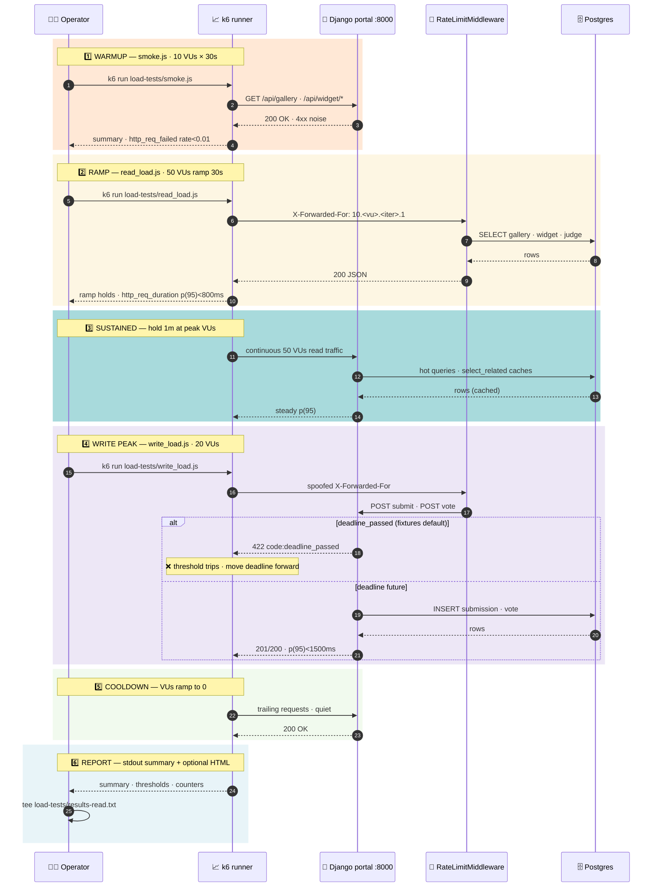

# Load tests

> 📈 **Role:** k6 load tests for the HACK HAMSTER 2026 hackathon portal. **What this doc is for:** to prove the platform holds up at ~10x the expected demo-day traffic so the submission window doesn't fall over when a few hundred participants land on the gallery at once.

## Contents

- [Load-test runner](#load-test-runner)
- [Files](#files)
- [Install k6](#install-k6)
- [Run](#run)
- [Env vars](#env-vars)
- [Thresholds](#thresholds)
- [Rate-limit caveat](#rate-limit-caveat)
- [Deadline caveat (write_load.js only)](#deadline-caveat-write_loadjs-only)
- [Output](#output)
- [Adding a script](#adding-a-script)
- [Why no auth.csv_export script](#why-no-authcsv_export-script)
- [Parent doc](#parent-doc)

## Load-test runner



The runner moves through five phases — warmup (cheap canary), ramp (linear growth), sustained (peak hold), write peak, cooldown — and emits a report on stdout. Write peak requires the submission deadline to be in the future; see "Deadline caveat" below.

## Files

| File              | Purpose                                                    |
| ----------------- | ---------------------------------------------------------- |
| `smoke.js`        | 10 VUs × 30s, public endpoints. Cheap canary.              |
| `read_load.js`    | 50 VUs (ramp 30s + hold 1m), gallery + widget + judge.      |
| `write_load.js`   | 20 VUs (ramp 30s + hold 1m), submit + vote.                 |
| `csv_export.js`   | 5 VUs × 30s, organizer CSV stream.                         |
| `seed.js`         | One-shot helper that registers a test user.                |
| `lib/toml.js`     | Tiny TOML parser for `../.hack-hamster.toml`.              |
| `lib/ip.js`       | Per-VU synthetic `X-Forwarded-For` to dodge the rate limit.|

## Install k6

k6 is a single static binary. No Node.js, no npm install. Pick one:

- macOS — `brew install k6`
- Windows — `winget install k6 --source winget` or download from <https://github.com/grafana/k6/releases>
- Linux — `sudo apt-key adv --keyserver hkp://keyserver.ubuntu.com:80 --recv-keys C5AD17C747E3415A3642D57D77C6C491D6AC1D69 && echo "deb https://dl.k6.io/deb stable main" | sudo tee /etc/apt/sources.list.d/k6.list && sudo apt-get update && sudo apt-get install k6`

We require k6 ≥ 0.49 (the build that ships stable `ramping-vus` and ESM local-imports). Verify with `k6 version`.

## Run

From the repo root (`N:\dogfood-hackathon`), with the portal live on `http://localhost:8000` and the demo event seeded:

```bash
# cheapest canary first — public endpoints, 30s
k6 run load-tests/smoke.js

# read paths under load
k6 run load-tests/read_load.js

# write paths under load (see "Deadline caveat" below)
k6 run load-tests/write_load.js

# streaming CSV export
k6 run load-tests/csv_export.js

# one-shot: register a fresh user via /api/register
k6 run load-tests/seed.js
```

Or from inside `load-tests/` if you prefer:

```bash
cd load-tests
k6 run smoke.js
```

Both layouts work — `lib/toml.js` tries `../.hack-hamster.toml` first then `./.hack-hamster.toml`.

## Env vars

| Var               | Default                  | Effect                                     |
| ----------------- | ------------------------ | ------------------------------------------ |
| `BASE_URL`        | `http://localhost:8000`  | Where to send requests                     |
| `EVENT_SLUG`      | `sample-hack-2026`       | Event slug for gallery/widget/csv routes   |
| `K6_NO_IP_SPOOF`  | unset                    | Set to `1` to disable per-VU IP spoofing   |

`read_load.js`, `write_load.js`, and `csv_export.js` all read their session cookies from `[auth]` in `../.hack-hamster.toml` at init. Run `make seed` if the `[auth]` block is missing or stale.

## Thresholds

Each script sets its own thresholds (see the script header). Summary:

| Script          | `http_req_failed`    | `http_req_duration`   |
| --------------- | -------------------- | --------------------- |
| `smoke.js`      | `rate<0.01`          | `p(95)<500ms`         |
| `read_load.js`  | `rate<0.05`          | `p(95)<800ms`         |
| `write_load.js` | `rate<0.10`          | `p(95)<1500ms`        |
| `csv_export.js` | (no failure threshold) | `p(95)<2000ms`       |

## Rate-limit caveat

The portal ships with `apps.accounts.middleware.RateLimitMiddleware`, which caps reads at 60/min/IP and writes at 10/min/IP. k6 VUs share the host's IP, so a naive run trips the limiter inside the first second and the failure thresholds blow up.

Every script in this directory spoofs `X-Forwarded-For` per VU×ITER via `lib/ip.js`, giving each request a synthetic `10.<vu>.<iter>.1` address. The middleware honours that header (no trusted-proxy check in the shipped code), so the spoofed IP gets its own bucket.

To disable spoofing — e.g. when running against a deployment that DOES validate the remote IP — set `K6_NO_IP_SPOOF=1`. In that case either run with the rate limiter disabled, or accept that the thresholds will fail.

## Deadline caveat (write_load.js only)

`manage.py seed_fixtures` puts `submissions_close_at` one hour in the PAST — that is intentional, for the T1 acceptance check 3 ("post-deadline submit returns 422"). While that past deadline stands, BOTH `submit` and `vote` in `write_load.js` will return 422 with `code: deadline_passed` immediately after auth + event lookup.

In that state, the platform is still being load-tested — auth, session lookup, event lookup, and the decorator stack all run per request. The strict `http_req_failed rate<0.10` threshold WILL trip because k6 counts 4xx as failures.

To exercise the real write paths and pass thresholds, push the deadline into the future (Django shell inside the running container):

```python
docker compose exec web python manage.py shell -c "
from apps.events.models import Event
from django.utils import timezone
from datetime import timedelta
e = Event.objects.get(slug='sample-hack-2026')
e.submissions_close_at = timezone.now() + timedelta(hours=2)
e.save()
print('deadline now', e.submissions_close_at)
"
```

Revert when done if you want the T1 acceptance check to keep firing its post-deadline path.

## Output

k6 writes its summary to stdout. To capture for the team record:

```bash
k6 run load-tests/read_load.js | tee load-tests/results-read.txt
```

For an HTML report:

```bash
K6_WEB_DASHBOARD=true k6 run load-tests/read_load.js
```

(Note: the dashboard exports to k6 Cloud, not local. For a local HTML report use `k6 run --out json=results.json load-tests/read_load.js` then `k6 report results.json` if the dashboard binary is installed.)

## Adding a script

Keep the rules:

- Read cookies from `../.hack-hamster.toml` via `lib/toml.js`. Don't hardcode tokens.
- Use `lib/ip.js` so the rate limiter doesn't bite.
- One file, one scenario. Don't combine smoke + load in one script.
- No npm dependencies. k6 is the only runtime.

## Why no auth.csv_export script

The four scripts above already cover the five spec routes:

- `gallery`         — `smoke.js`, `read_load.js`
- `widget/gallery`  — `smoke.js`, `read_load.js`
- `submit`          — `write_load.js`
- `judge/scores`    — `read_load.js`
- `csv_export`      — `csv_export.js`

`peer_scores` is the graded cell — it always returns 403 by design. Load-testing a 403 endpoint at scale exercises the auth path, not the spec's intent, so it's omitted.

## Parent doc

- [`../README.md`](../README.md) — Hack Hamster 2026 repo overview, where load tests fit in the test pyramid.
- [`../docs/TESTING-PERFORMANCE.md`](../docs/TESTING-PERFORMANCE.md) — the broader performance-testing methodology.
