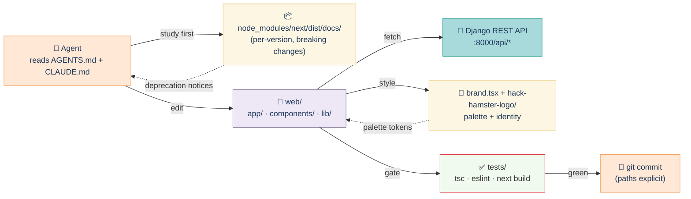

# Web app agent notes

> 🧭 **Role:** Working agreement for any AI agent (Claude Code, Cursor, etc.) touching `web/`. **What this doc is for:** to keep the agent's edits aligned with the Next.js conventions, the single-container backend, and the brand surface used by the judging portal.

## Contents

- [Context flow](#context-flow)
- [The Next.js fork warning](#the-nextjs-fork-warning)
- [Where the agent lives in the stack](#where-the-agent-lives-in-the-stack)
- [Edit rules](#edit-rules)
- [Verification before you commit](#verification-before-you-commit)
- [Parent docs](#parent-docs)

## Context flow



The agent studies the per-version Next.js docs that ship inside `node_modules/`, edits only inside `web/`, fetches from the Django REST API at `:8000`, picks up brand tokens from `components/brand.tsx` and `public/hack-hamster-logo/`, gates every change behind `tsc` + `eslint` + `next build`, and commits with explicit paths.

## The Next.js fork warning

<!-- BEGIN:nextjs-agent-rules -->

# This is NOT the Next.js you know

This version has breaking changes — APIs, conventions, and file structure may all differ from your training data. Read the relevant guide in `node_modules/next/dist/docs/` (resolved from this file's directory; in monorepos the `next` package may not be visible from the repo root) before writing any code. Heed deprecation notices.

This block is written and re-added by `next dev` — verify at `node_modules/next/dist/server/lib/generate-agent-files.js`. Removing it from a diff only re-creates the uncommitted change; committing it with your work keeps the tree clean.

<!-- END:nextjs-agent-rules -->

The bracketed block is regenerated by `next dev`. Treat it as load-bearing noise: do not delete it in a diff because the next dev run will re-create it and dirty the tree.

## Where the agent lives in the stack

The `web/` app is one of three Next.js fronts in the project, and the only one intended to ship in the default single-container build:

| Surface | Path | Mount | Backend |
|---|---|---|---|
| Public judging portal | `web/` | `/` (nginx) | Django at `:8000/api/*` |
| Embeddable widget | `web/embed/` | served via widget.js bundle | Django same-origin |
| Read-only proof viewer | `web/proof/` | static export | n/a (signatures only) |

When in doubt, the agent edits `web/` only. Other surfaces live in sibling trees.

## Edit rules

- **Read the relevant `node_modules/next/dist/docs/` page first** for every new API. Training data is stale.
- **Server vs client components.** Anything that touches `cookies()`, `headers()`, `request`, or browser-only state lives in a `*.client.tsx` file or starts with `"use client"`. Default to RSC.
- **Fetch only from `/api/*`** on `:8000`. Never hit Postgres directly. Never assume a service mesh.
- **Brand tokens, not raw hex.** Import from `components/brand.tsx`. The Hack Hamster palette is documented there; do not inline `#F4A261` in a component.
- **No mocks.** If the API is down, fix the API. Test against the running portal at `http://localhost:8000`.
- **One change, one commit.** Explicit `git add <path>` — never `git add .` (the harness rule).
- **No scope cuts.** If a tier or bonus is in flight, finish it. Don't write a "TODO: skip for v2" comment.

## Verification before you commit

Run from `web/`:

```bash
# type check
npx tsc --noEmit

# lint
npm run lint

# production build (catches RSC/client mistakes)
npm run build

# smoke against the running portal
npm run dev   # in one shell
curl -fsS http://localhost:3000 | head -50
```

If any of these fails, the change is not done. The acceptance suite (`make accept` at the repo root) covers T1+T2 of the portal contract — keep that green.

## Parent docs

- [`../README.md`](../README.md) — repo-level overview, the Hack Hamster 2026 pitch.
- [`../docs/PRD.md`](../docs/PRD.md) — product requirements, tier definitions.
- [`./README.md`](./README.md) — web-app quickstart and dev loop.
- [`./public/hack-hamster-logo/USAGE.md`](./public/hack-hamster-logo/USAGE.md) — when to use which logo variant.
