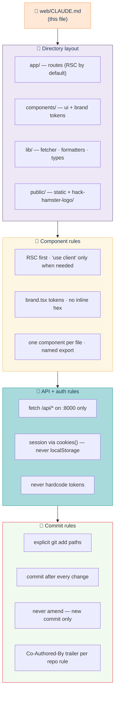

# Web app Claude conventions

> 📐 **Role:** Conventions tree for Claude Code when editing `web/`. **What this doc is for:** to keep Claude's edits consistent with the directory layout, component rules, and commit cadence the team agreed on for the Hack Hamster 2026 portal.

This file is **imported** by `AGENTS.md` (Claude Code auto-loads any sibling `CLAUDE.md`). Keep the two in sync.

## Contents

- [Conventions tree](#conventions-tree)
- [Directory layout](#directory-layout)
- [Component rules](#component-rules)
- [API + auth rules](#api--auth-rules)
- [Style + brand rules](#style--brand-rules)
- [Commit rules](#commit-rules)
- [Parent doc](#parent-doc)

## Conventions tree



The four layers are enforced in order: layout decides where a file goes, components decide how it's written, API rules decide what it talks to, commit rules decide how it lands. Skip a layer and the diff is wrong.

## Directory layout

```
web/
├── app/                 # Next.js App Router — RSC by default
│   ├── layout.tsx       # root layout (theme, fonts, brand provider)
│   ├── page.tsx         # public gallery
│   ├── events/[slug]/   # event-scoped pages (RSC, fetches from Django)
│   ├── judge/           # judge surface (gated server-side)
│   ├── organizer/       # organizer surface (gated server-side)
│   └── api/             # route handlers — proxy edge cases only
├── components/
│   ├── ui/              # primitives (button, card, table)
│   ├── brand.tsx        # palette + type tokens (single source)
│   └── ...              # feature components per route
├── lib/
│   ├── api.ts           # typed fetch wrapper around /api/*
│   ├── auth.ts          # session helpers
│   └── format.ts        # dates, scores, plural rules
└── public/
    └── hack-hamster-logo/  # brand assets — see public/hack-hamster-logo/README.md
```

Every file lives under one of these five roots. No `utils/`, no `helpers/`, no `misc/`. If the file doesn't fit, the layout is wrong — restructure first.

## Component rules

- **Default to RSC.** Add `"use client"` only when the component owns state, effects, or browser-only APIs.
- **One component per file.** Named export. The file name is `kebab-case.tsx`, the export is `PascalCase`.
- **Props are typed.** Use `type XProps = { ... }`, not inline interfaces. No `any`.
- **Brand tokens, not raw hex.** Import from `components/brand.tsx`. The Hack Hamster palette is the single source.
- **No hidden side-effects in render.** Use `useEffect` or server actions, not render-time mutations.
- **Forms use server actions** where possible; client `onSubmit` only when progressive enhancement isn't worth it.

## API + auth rules

- **Single fetcher.** All HTTP goes through `lib/api.ts`. Do not import `fetch` directly in a component.
- **Same-origin only.** `BASE_URL` defaults to the same origin; the Django side lives behind nginx at `:8000`. The fetcher strips the host and calls `/api/...`.
- **Session is a cookie.** Set/read via `cookies()` from `next/headers` (RSC) or `document.cookie` (client). Never localStorage.
- **No tokens in env.** The portal uses session cookies; there are no bearer tokens to leak. If you find yourself adding one, stop and re-read the auth doc.
- **Failure is a typed error.** `lib/api.ts` returns `{ ok: true, data } | { ok: false, code, message }`. Components render the message; they don't `try/catch` `fetch`.

## Style + brand rules

- **Tailwind is fine, brand tokens are mandatory.** Use `bg-brand-orange` (not `bg-[#F4A261]`). The map lives in `tailwind.config.ts` and reads from `components/brand.tsx`.
- **Fonts:** Geist Sans via `next/font`. No other families. The logo wordmark uses outlined Geist paths (see `public/hack-hamster-logo/`).
- **No emoji inside component chrome.** Emoji belongs in docs and diagrams. A button label is text.
- **Accessibility baseline:** every interactive element has a label. Color is never the only signal.

## Commit rules

Per the repo's standing rules (see `../README.md` §"Working agreement"):

- **Explicit paths.** `git add web/components/brand.tsx web/app/page.tsx` — never `git add .`.
- **One logical change per commit.** A new component + its test = one commit. A typo fix in a sibling file = a separate commit.
- **Never amend.** A pre-commit hook failed? Fix the cause and add a new commit. `--amend` rewrites history the team already pulled.
- **No AI attribution in commits.** Repo memory rule overrides the harness default — no `Co-Authored-By: Claude` trailer anywhere in this repo's history.
- **Commit message shape:**
  ```
  <area>(<scope>): <imperative summary>

  <why, not what>

  Refs: <issue or doc anchor>
  ```

## Parent doc

- [`./AGENTS.md`](./AGENTS.md) — agent-facing notes (this file inherits from it).
- [`../README.md`](../README.md) — repo-level overview, working agreement.
- [`./public/hack-hamster-logo/README.md`](./public/hack-hamster-logo/README.md) — brand assets inventory.
