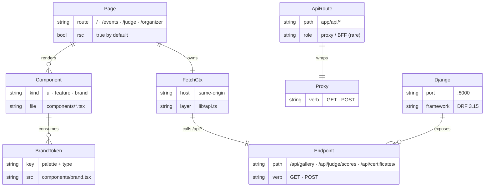

# Hack Hamster — Web app

> ⚛️ **Role:** The Next.js 15 front-end for the Hack Hamster 2026 judging portal. **What this doc is for:** to orient a new contributor to the app's architecture, the dev loop, and where this fits in the single-container build.

This is a [Next.js](https://nextjs.org) project bootstrapped with [`create-next-app`](https://nextjs.org/docs/app/api-reference/cli/create-next-app) and customised for the Hack Hamster brand.

## Contents

- [Web architecture](#web-architecture)
- [Getting started](#getting-started)
- [App structure](#app-structure)
- [Learn more](#learn-more)
- [Deploy](#deploy)
- [Parent docs](#parent-docs)

## Web architecture



Pages render on the server, fetch from Django over `/api/*`, and style themselves through `components/brand.tsx`. There is no separate backend-for-frontend in this app — Django already exposes a stable JSON surface, so the Next.js layer is mostly composition + brand.

## Getting started

The web app is designed to run inside the single-container build (Postgres + Django + Next.js + nginx under `supervisord`). To run it standalone during development:

```bash
# from the repo root
docker compose up --build -d

# the portal is on http://localhost:8000
# the Next.js dev server is also reachable directly on :3000 if needed
```

Or, if you only want the Next.js side:

```bash
cd web
npm run dev
# or
yarn dev
# or
pnpm dev
# or
bun dev
```

Open [http://localhost:3000](http://localhost:3000) with your browser to see the result. To see the full portal (with seeded demo data), open [http://localhost:8000](http://localhost:8000) — nginx routes `/` to Next.js and `/api/*` to Django.

You can start editing the page by modifying `app/page.tsx`. The page auto-updates as you edit the file.

This project uses [`next/font`](https://nextjs.org/docs/app/building-your-application/optimizing/fonts) to automatically optimize and load [Geist](https://vercel.com/font), a new font family for Vercel. The logo wordmarks in `public/hack-hamster-logo/` use the same Geist family, outlined to paths.

## App structure

```
web/
├── app/                  # App Router — RSC by default
│   ├── layout.tsx        # root layout (theme + brand provider)
│   ├── page.tsx          # public gallery
│   ├── events/[slug]/    # event-scoped pages
│   ├── judge/            # judge surface (server-gated)
│   ├── organizer/        # organizer surface (server-gated)
│   └── api/              # route handlers (rare; Django handles most)
├── components/
│   ├── ui/               # primitives — button, card, table
│   ├── brand.tsx         # palette + type tokens (single source)
│   └── *.tsx             # feature components
├── lib/
│   ├── api.ts            # typed fetch wrapper around /api/*
│   ├── auth.ts           # session helpers
│   └── format.ts         # dates, scores, plural rules
└── public/
    └── hack-hamster-logo/  # brand assets — 10 variants + usage rules
```

For agent-facing conventions, see [`./AGENTS.md`](./AGENTS.md) and [`./CLAUDE.md`](./CLAUDE.md).

## Learn more

To learn more about Next.js, take a look at the following resources:

- [Next.js Documentation](https://nextjs.org/docs) — learn about Next.js features and API.
- [Learn Next.js](https://nextjs.org/learn) — an interactive Next.js tutorial.

You can check out [the Next.js GitHub repository](https://github.com/vercel/next.js) — your feedback and contributions are welcome!

## Deploy

The default deployment is the single-container build at the repo root:

```bash
docker compose up --build -d
```

This brings up Postgres, Django, Next.js (production build via `next start`), and nginx under `supervisord` in one image. nginx serves `:8000` and routes `/api/*` to Django, `/` to Next.js.

The easiest way to deploy the Next.js app on its own is the [Vercel Platform](https://vercel.com/new?utm_medium=default-template&filter=next.js&utm_source=create-next-app&utm_campaign=create-next-app-readme) from the creators of Next.js.

Check out our [Next.js deployment documentation](https://nextjs.org/docs/app/building-your-application/deploying) for more details. For Hack Hamster specifically, the production deployment is the single container — see [`../README.md`](../README.md) §"Run it in three commands".

## Parent docs

- [`../README.md`](../README.md) — Hack Hamster 2026 overview, single-container story.
- [`../docs/PRD.md`](../docs/PRD.md) — product requirements and tier definitions.
- [`./AGENTS.md`](./AGENTS.md) — agent conventions for editing this app.
- [`./CLAUDE.md`](./CLAUDE.md) — Claude-Code-specific conventions tree.
- [`./public/hack-hamster-logo/README.md`](./public/hack-hamster-logo/README.md) — brand assets inventory.
