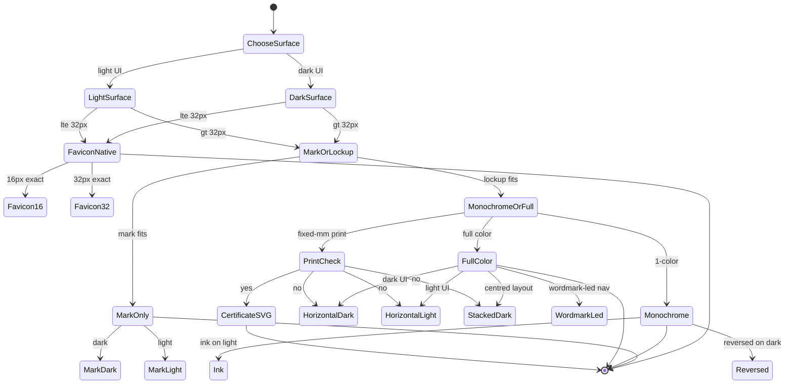

# Hack Hamster logo — usage rules

> 🎨 **Role:** The decision tree for placing the `hack-hamster.` identity. **What this doc is for:** to tell a designer or engineer exactly which variant to drop on which surface, with rules that hold across light/dark, mark/lockup, full-color/monochrome.

Review package for the `hack-hamster.` identity. Every variant derives from the variant 1 master; this package does not imply design approval. Each asset has a separate SVG and PNG. SVGs contain outlined artwork and render without installed fonts. Raster dimensions below come from `manifest.json`. SVGs scale through their viewBox; only the certificate export fixes its root dimensions for print.

## Contents

- [Usage decision tree](#usage-decision-tree)
- [The rules in one pass](#the-rules-in-one-pass)
- [Ten variants, in order](#ten-variants-in-order)
- [Palette and construction](#palette-and-construction)
- [Production files](#production-files)
- [Pre-flight checklist](#pre-flight-checklist)
- [Typeface license](#typeface-license)
- [Parent doc](#parent-doc)

## Usage decision tree

The state machine answers five questions in order: surface → size → mark vs lockup → single-color vs full → print. Each path lands on one variant. There is no ambiguity by design.

## The rules in one pass

1. **Default to the horizontal lockup** (`01` on dark, `02` on light). It carries the full identity.
2. **Use the mark (`04`, `05`) when the lockup won't fit.** App tiles, social avatars, repeated patterns.
3. **Use the wordmark alone (`06`, `07`) when the mark is already nearby** — e.g. the favicon mark sits next to a navigation wordmark.
4. **Use monochrome (`08`, `09`) for print, embroidery, single-channel contexts.** Never recolor the full-color lockup by hand.
5. **Use the favicons (`10`) at native size only.** 16px and 32px are pixel-aligned; do not rescale.
6. **Certificate uses the dedicated `certificate-header.svg`.** It has fixed print dimensions — preserve them.
7. **Never modify the construction.** Mark height, x-height, word space, and corner radius are measured, not decorative.

## Ten variants, in order

| # | File stem | PNG size | Intended use |
| --- | --- | --- | --- |
| 1 | `01-horizontal-dark` | 4096 × 1024 | Primary horizontal lockup on the dark background. |
| 2 | `02-horizontal-light` | 4096 × 1024 | Primary horizontal lockup on the light background. |
| 3 | `03-stacked-dark` | 2048 × 2560 | Centered stacked lockup on the dark background. |
| 4 | `04-mark-dark` | 2048 × 2048 | Transparent teal mark for dark surfaces. |
| 5 | `05-mark-light` | 2048 × 2048 | Transparent deep teal mark for light surfaces. |
| 6 | `06-wordmark-dark` | 4096 × 1024 | Wordmark alone on the dark background. |
| 7 | `07-wordmark-light` | 4096 × 1024 | Wordmark alone on the light background. |
| 8 | `08-monochrome-ink` | 4096 × 1024 | Transparent, single-color ink horizontal lockup. |
| 9 | `09-monochrome-reversed` | 4096 × 1024 | Transparent, single-color reversed horizontal lockup. |
| 10 | `10-favicon-16`, `10-favicon-32` | 16 × 16; 32 × 32 | Transparent, pixel-aligned teal favicons. |

Variants 4, 5, 8, and 9 include separate `-preview` files with presentation backgrounds. Place the transparent source files into a layout; use preview files to inspect contrast. Variants 1, 2, 3, 6, and 7 intentionally include their backgrounds. `logo` is a transparent horizontal export, and `logo-icon` is the transparent mark export.

## Palette and construction

| Role | Dark context | Light context |
| --- | --- | --- |
| Background | `#080F13` | `#EEF4F6` |
| Mark | `#53D8CF` | `#0B6E78` |
| Wordmark | `#EEF4F6` | `#061012` |

The letters use actual Geist Sans Medium, weight 500, converted to paths with −0.02em tracking. The period is a mathematically circular shape: its diameter equals one measured x-height, and its bottom aligns with the baseline. Measured x-height is 0.532em; cap height is 0.71em.

Canonical horizontal lockups set mark height to 2.4 × wordmark x-height. The canonical stacked lockup sets mark width to 0.9 × wordmark width. Preserve these proportions and scale the artwork uniformly.

The literal 4 × 3 upper / 6 × 5 lower construction read too blocky at 16px. Following the brief's instruction to regenerate when the small-size check fails, the refined master uses a 3 × 5 upper and 6 × 3 lower. It preserves the 6 × 8 artwork grid, touching bars, 1 × 1 notch, and 0.5-unit corner radius. The standalone symbol viewBox includes surrounding space; the visible mark remains 6 × 8 units.

Leave at least one wordmark cap height of clear space around general-purpose lockups. Compact favicons, widget headers, and application icons use the explicit production sizing below.

## Production files

- **Favicons:** `10-favicon-16` and `10-favicon-32` are exact 16px and 32px exports of the same outline, vertically cropped to the mark bounds and pixel-aligned. `favicon-light-16` and `favicon-light-32` provide the deep teal equivalents. Use the matching native size. `favicon.ico` includes the separate, exact 16px and 32px PNG masters.
- **App icon:** `app-icon`, 1024 × 1024. Reversed white (`#EEF4F6`) mark on deep teal (`#0B6E78`), chosen for stronger contrast, with a 225.28px corner radius: 22% of the canvas width. Pixels outside the rounded square are transparent.
- **Widget:** `widget-header-dark` and `widget-header-light`, 112 × 24. The visible mark is 24px high and the outlined wordmark uses Geist 500 at 14px. This compact production exception intentionally differs from the canonical 2.4 × ratio. `widget-header-dark-4x` is 448 × 96 for rendering at 112 × 24.
- **Certificate:** `certificate-header.svg` fixes `width="240pt"` and `height="280pt"`, with viewBox `0 0 240 280`. Preserve its intrinsic **240pt wide × 280pt high** print size to obtain a **40mm mark width** and **24pt wordmark**. The 2400 × 2800 PNG carries 720dpi metadata for the same physical dimensions. This fixed-size production exception intentionally differs from the canonical stacked width ratio. Use the SVG for print.
- **Social card:** `github-social-card`, 1280 × 640, with the dark background.
- **Review sheets:** `hack-hamster-family`, 1920 × 3100; `construction`, 1920 × 1760; `production-formats`, 1920 × 1600. These are proof sheets, not replacement logo assets.

## Pre-flight checklist

Before any logo lands in a layout, verify:

- [ ] Native 16px favicon renders cleanly (eyes + teeth readable)
- [ ] Native 32px favicon renders cleanly
- [ ] Dark-context variant on a true-dark surface (`#080F13` or darker) — contrast holds
- [ ] Light-context variant on a true-light surface (`#EEF4F6` or lighter) — contrast holds
- [ ] Transparent edges — no halos on charcoal or offwhite
- [ ] Certificate at its intrinsic print size — mark width = 40mm, wordmark = 24pt
- [ ] Clear space ≥ 1 × wordmark cap height (lockups)
- [ ] No recoloring of the full-color lockup — use monochrome variants instead

`manifest.json` records the export dimensions, palette, and construction measurements.

## Typeface license

Geist is distributed under the [SIL Open Font License 1.1](https://raw.githubusercontent.com/vercel/geist-font/main/OFL.txt). No font binaries are bundled in this logo package; the SVGs use outlines. Obtain the original font and retain its license if rebuilding or distributing font files.

## Parent doc

- [`./README.md`](./README.md) — the logo family overview, construction, and production exports.
- [`../../README.md`](../../README.md) — Hack Hamster 2026 repo overview.
